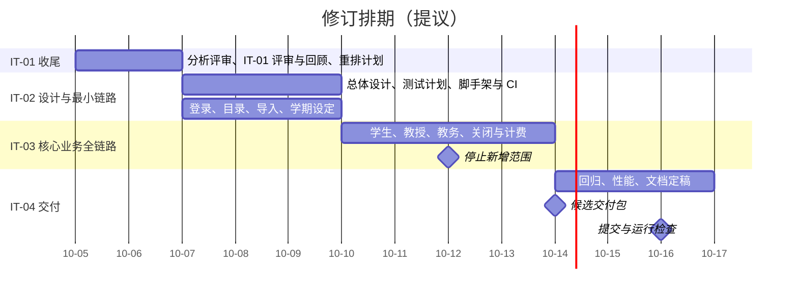

# 项目北极星：开发流程与完整时间轴

- 版本：v0.1，2026-10-05；关联需求：US-025；迭代：IT-01。
- 用途：把课程流程、已做的事和剩下的事放在一条时间轴上，逐项打勾。每次打勾附上证据链接；没有证据的不勾。
- 状态：第 1—2 节是已发生事实；第 3 节起的修订排期是**提议**，须在 IT-01 评审时由团队确认，确认前原计划仍是 [开发计划 v0.3](PROJECT_DEVELOPMENT_PLAN.md) 第 4 节。

## 1. 我们采用的流程

整体模型在 2026-09-09 确定为**迭代增量 + 敏捷实践 + 持续交付**，对应课件第 2.2 节增量模型与第 2.4 节敏捷过程（Scrum 的产品待办、迭代计划、评审与回顾）。2026-09-22 对照课件后修正了一处顺序：需求明确之后，先做需求规约与面向对象分析，再进入总体设计（第 4.1 节第 22 页；第 10 章 OOA 第 34—36 页）。

阶段按课件章节推进，每个阶段的产物在迭代中交付，不是一次性瀑布：

| 阶段 | 课件依据 | 本项目产物 | 状态 |
| --- | --- | --- | --- |
| 软件过程选择 | 第 2 章 | [迭代流程](ITERATION_GUIDE.md)、[Git 工作流](GIT_WORKFLOW.md)、[完成定义](../CONTRIBUTING.md) | 已建立 |
| 可行性研究 | 第 3 章 | 未单独开展；课程提交清单未要求，题目已给定，技术可行性由 ADR-001 覆盖 | 不单独交付 |
| 需求定义 | 第 4 章 | [需求分析](REQUIREMENTS_ANALYSIS.md) v0.6：用例、业务规则、验收条件 | 初稿，待评审 |
| 需求规约与 OOA | 第 10 章 | [面向对象分析](design-docs/object-oriented-analysis.md) 与 StarUML 用例模型、分析模型 | 初稿，待评审 |
| 总体设计 | 第 5 章 | 总体设计说明书：分层、模块、数据归属、权限、外部系统边界 | 未开始 |
| 详细设计 | 第 6 章 | 每个功能实现前补表结构、接口、设计类与顺序图 | 未开始 |
| 编码与测试 | 第 7 章 | 代码、单元／集成／确认测试，测试计划与测试报告 | 未开始 |
| 项目管理 | 第 9 章 | [开发计划](PROJECT_DEVELOPMENT_PLAN.md)、本时间轴、风险与配置管理 | 进行中 |

每轮迭代固定走四步，见 [迭代流程](ITERATION_GUIDE.md)：计划（从 backlog 选故事、拆 1—2 天任务）→ 日常推进（一任务一分支一 PR）→ 评审（逐条对 AC，打 `v*` tag）→ 回顾（结论改进 `docs/`）。

## 2. 已经发生的事（2026-09-08 至 2026-10-05）

勾选表示产出已形成；“团队评审并合入”单独列项，未勾即未完成完成定义。

- [x] 09-08 课程开始，题目为 Wylie College 学生选课系统。
- [x] 09-09 确定迭代增量 + 敏捷 + 持续交付，补齐模板流程（提交 `8141cf4`）。
- [x] 09-19 开发计划 v0.1、需求分析初稿、IT-01 迭代文件。
- [x] 09-22 技术栈记入 [ADR-001](design-docs/adr/ADR-001-technology-stack.md)；导入 58 份课件文字；对照课件确认“需求规约 + OOA → 总体设计”的顺序；项目基线提交 `6bf579f`。
- [x] 10-03—10-04 需求澄清 Q-01 至 Q-15，写入需求分析 v0.4（提交 `218af5a`）。
- [x] 10-04—10-05 面向对象分析 v0.1 与 9 张 StarUML 图（未提交）。
- [x] 10-05 需求分析 v0.6 决定 R-01 至 R-04；用例模型移入仓库；分工拆为 [团队分工](TEAM_ROLES.md)（未提交）。
- [ ] IT-01 原定 09-25 评审与回顾：**未举行**。原计划 IT-01 交付的“可启动系统，演示登录与课程浏览”未完成，业务代码尚未开始。

截至 10-05，实际进度比原计划晚约 10 天：按原计划此时应在 IT-03 中段。

## 3. 修订排期（提议，待团队确认）

剩余 12 天（10-05 至 10-16）。按开发计划“未通过的需求退回待办，不用延长迭代掩盖延期”的原则，先如实评审 IT-01，再把剩余工作压进三轮短迭代。迭代长度从一周改为 3—4 天是对 [迭代流程](ITERATION_GUIDE.md) 默认周期的调整，团队确认后同步修改该文档及开发计划 v0.4。

### 3.1 IT-01 收尾：10-05（周一）至 10-06（周二）

- [ ] 各领域负责人与冯海伦走查 [面向对象分析](design-docs/object-oriented-analysis.md)，记录评审意见；R-01 至 R-04 已在需求分析 v0.6 决定。
- [ ] 团队评审 US-002、US-003、US-019、US-020、US-024，记录修改意见，并逐个提 PR 合入 `main`。
- [ ] 举行 IT-01 评审与回顾：如实记录未交付的运行增量、退回的需求和延期原因，写入 [IT-01](iterations/IT-01-project-startup.md)。
- [ ] 全员确认 [团队分工](TEAM_ROLES.md)，登记各人提交用姓名与邮箱。
- [ ] 团队确认本节修订排期；开发计划升为 v0.4，[迭代总览](iterations/README.md) 登记 IT-02 至 IT-04。
- [ ] 确认六人组队口径、模拟外部系统是否被课程教师接受，保留确认记录。
- [ ] 建好团队远程仓库、成员权限、真实 CODEOWNERS，并按第 5 节约定提交。

### 3.2 IT-02 设计基线与最小链路：10-07（周三）至 10-09（周五）

迭代目标：形成设计基线，交付可启动系统，演示登录和浏览课程目录。

- [ ] 总体设计说明书：分层、模块职责、运行拓扑、数据归属、认证权限、外部系统边界；StarUML 设计类图与部署图（倪成锦）。
- [ ] 测试计划初稿：分层、环境与数据、AC 到用例、权限与并发场景、准入退出条件（冯海伦）。
- [ ] 脚手架：React + Vite + TanStack Router、Hono、Prisma、PostgreSQL 能本地启动；`scripts/ci.sh` 接入类型检查与测试（倪成锦、范昭）。
- [ ] US-004 登录、US-017 角色与所有权检查框架（倪成锦）。
- [ ] US-005 课程目录浏览，课程目录模拟系统（浩宇、范昭）。
- [ ] US-023 导入人员、历史成绩与授课资格；US-021 学期阶段设定（冯海洋、范昭）。
- [ ] 各模块负责人完成本模块详细设计初稿，为 IT-03 准备接口契约。
- [ ] IT-02 评审、回顾，打 tag `v0.2.0`。

### 3.3 IT-03 核心业务全链路：10-10（周六）至 10-13（周二）

迭代目标：从学生选课到关闭计费、成绩录入查询全链路可演示。10-12 起停止新增范围。

- [ ] US-006、US-007、US-008 保存、提交、更新、删除课表，容量／先修／冲突校验与并发名额（浩宇、倪成锦）。
- [ ] US-009、US-010、US-011 授课选择、名册、成绩录入（马喆）。
- [ ] US-012 学生成绩单（浩宇）。
- [ ] US-013、US-014 教授与学生资料维护（冯海洋）。
- [ ] US-015 关闭选课、调剂与取消；US-016 计费模拟与重试（倪成锦、范昭）。
- [ ] 冯海伦边开发边做集成与越权、外部故障用例，缺陷当天登记。
- [ ] 范围取舍：US-022 关闭后补选（P1）在 10-12 仍未开始则退回待办，记录原因。
- [ ] IT-03 评审、回顾，打 tag `v0.3.0`。

### 3.4 IT-04 交付：10-14（周三）至 10-16（周五）

- [ ] 全量回归；关闭数据损坏、越权、核心流程无法完成类缺陷。
- [ ] US-018 并发、性能与可靠性验证：按测试计划写明的环境和规模实测，如实记录与题目指标的差距。
- [ ] 10-14 候选交付包：程序、启动说明、演示数据，在另一台环境复现启动。
- [ ] 10-15 答辩演练与缓冲，文档按课程封面模板定稿。
- [ ] 10-16 提交并接受程序运行检查，打 tag `v1.0.0`。

## 4. 课程提交物清单

依据 [课程要求](lecture-requirements/2026年软件工程课程设计要求.md)。全部勾完才算交付完整。

- [ ] 开发计划（人员安排、进度计划、迭代计划）：倪成锦，10-06 v0.4，10-15 定稿。
- [ ] 需求分析文档：倪成锦统筹，10-06 评审基线，10-15 定稿。
- [ ] 设计文档（总体设计 + 详细设计 + UML 模型）：倪成锦与各模块负责人，10-09 总体设计，10-13 详细设计。
- [ ] 测试计划：冯海伦，10-09 初稿，10-13 补齐。
- [ ] 测试报告：冯海伦汇总，每轮积累，10-15 定稿。
- [ ] 软件配置管理计划与最终配置库（可选，本组提供）：范昭，10-15。
- [ ] 个人工作总结（六份）与组长汇总、贡献百分比：每人，10-15。
- [ ] 可运行程序与演示：倪成锦集成，范昭准备环境，冯海伦复核，10-16。

## 5. 提交与贡献记录约定

每项需求的负责人、评审人、计划完成日期，以及一台电脑集中提交时的作者与时间规则，见 [团队分工](TEAM_ROLES.md)。提交格式按 [Git 工作流](GIT_WORKFLOW.md)；课程对提交记录另有格式要求时，把原文补进该文档再执行。

## 6. 维护方式

- 每完成一项就打勾，并在行尾或对应迭代文件里附 PR、提交、测试记录等证据。
- 排期再次调整时，不删除旧日期：在第 7 节写明日期、原因和影响，再更新第 3 节。
- 本文只管“做到哪了”；具体规则以各专门文档为准，内容冲突时改本文。

## 7. 变更记录

| 日期 | 版本 | 内容 |
| --- | --- | --- |
| 2026-10-05 | v0.1 | 整理课程流程、已发生事实和提交物清单；如实记录 IT-01 延期，提出 10-05 至 10-16 修订排期（待团队确认）；写入共用电脑的提交与贡献记录约定 |
| 2026-10-05 | v0.2 | 同步需求分析 v0.5 与用例模型入库；IT-01 收尾改为只决定 R-01；第 5 节改为指向团队分工文档 |
