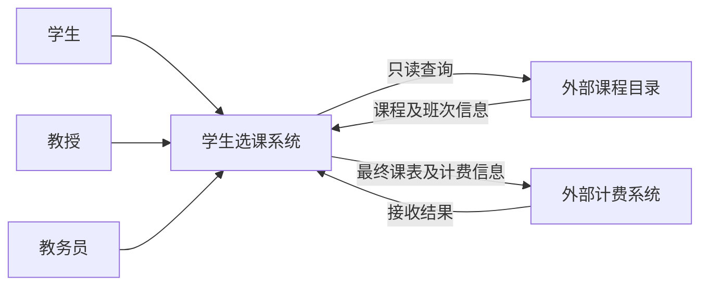

# 学生选课系统需求分析文档

- 文档版本：v0.3，2026-09-22。
- 状态：初稿，待团队评审；尚未形成经确认的需求基线。
- 文档任务：US-003；所属迭代：IT-01。
- 需求统筹：倪成锦；学生业务：浩宇；教授业务：马喆；教务业务：冯海洋；测试审查：冯海伦；外部接口与材料整理：范昭。职责沿用开发计划，评审尚未执行。
- 关联：[项目开发计划](PROJECT_DEVELOPMENT_PLAN.md)、[产品待办](product-specs/backlog.md)、[需求追溯矩阵](product-specs/traceability.md)。

## 1. 编写目的与依据

本文规定系统需要满足的用户行为、业务规则、数据边界、外部接口和验收条件，为总体设计、开发拆分及测试计划提供共同依据。技术框架、数据库、部署拓扑和具体接口协议由后续设计与 ADR 决定。

| 来源编号 | 资料 | 用途 |
| --- | --- | --- |
| SRC-01 | [课程要求文字版](lecture-requirements/2026年软件工程课程设计要求.md) | 交付材料、运行检查与技术选型范围 |
| SRC-02 | [题目英文整理](lecture-requirements/2026年软件工程课程设计题目.md) | Problem Statement、Glossary、Supplementary Specification 及八个原始用例 |
| SRC-03 | [题目中文整理](lecture-requirements/2026年软件工程课程设计题目-中文.md) | 中文术语与用例阅读辅助 |
| SRC-04 | [项目开发计划](PROJECT_DEVELOPMENT_PLAN.md) | 六人分工、四周迭代和交付安排 |

原始课件与题目保存在 `docs/lecture-requirements/original-files/`。本文依据现有文字整理编写；若转写与原件冲突，应回查原件并记录修订。

本文区分三类内容：**题目要求**为 SRC-02 明确规定的内容；**项目补充**为使需求可实现、可测试而提出的要求，仍待团队评审；**待确认**为来源冲突或信息缺失，使用 Q 编号追踪。所有验收条目目前均为设计中的验收条件，不是已执行的测试结果。

## 2. 项目概述与系统边界

### 2.1 目标与用户

为 Wylie College 建立学生选课系统，使学生完成选课和查成绩，教授完成授课选择、名册查看和成绩录入，教务员完成师生信息维护及选课关闭。系统保留旧课程目录的数据来源，并将最终选课信息交给外部计费系统。

| 参与者 | 目标 | 主要权限边界 |
| --- | --- | --- |
| 学生 | 编排本人课表、完成注册、查看成绩单 | 只能操作本人课表和查看本人成绩 |
| 教授 | 选择有资格教授的班次、查看名册并提交成绩 | 不得修改其他教授已被指派的班次；成绩限本人负责班次的学生 |
| 教务员 | 维护学生与教授资料、关闭选课 | 人员维护不自动包含代选课或修改成绩权限 |
| 课程目录系统 | 提供课程及学期开课信息 | 外部权威来源，本系统只读 |
| 计费系统 | 接收计费信息并向学生出账 | 实际出账、寄送账单及收款由外部系统处理 |

课程教师是需求口径与课设验收的确认方；六人团队是实现和维护方，不是系统中的新增业务角色。

### 2.2 功能范围

范围内：登录、课程目录查询、课表草稿与提交、加退选与删除课表、授课选择、名册、成绩录入与查询、师生信息维护、关闭选课、备选调剂、课程取消和计费通知。

范围外：维护旧目录中的课程基础信息、银行支付、实际收费、外部账单寄送、关闭选课后更换授课教授，以及未经评审新增的自助注册、密码找回、全历史成绩导出等功能。账户初始化方式仍须解决，见 Q-09。

图中为业务交互边界，不指定进程拆分或通信协议；计费接收结果是用于判断重试的项目补充。

### 2.3 环境与约束

- 题目场景为校园 LAN 内的客户端—服务器系统，旧目录运行于 DEC VAX／Ingres，可经 Unix 服务器的 SQL 接口读取。
- 题目要求 Windows 桌面界面及 Windows 95/98 风格兼容；课程要求同时允许 Web 技术。最终客户端形式及旧平台适配范围见 Q-01、Q-02。
- 项目技术栈已在 [ADR-001](design-docs/adr/ADR-001-technology-stack.md) 确定：React + TypeScript + Vite + TanStack Router 单页应用、Hono、Prisma、PostgreSQL，使用 StarUML 建模，不采用 Next.js，当前不采用 TanStack Start。选型记录不等于课程已认可旧桌面要求的适配，也不代表外部系统模拟方案已确认。
- 课程交付截至 2026-10-16。人员安排和课程文档清单以开发计划为准，不重复作为软件功能。

## 3. 术语与领域概念

| 术语 | 本文含义 |
| --- | --- |
| Course／课程 | 学院开设的课程定义，例如课程名称、院系和先修要求 |
| Course Offering／开课班次 | 一门课程在指定学期的一次开课，含上课日期与时段；同一课程可有多个班次 |
| Course Catalog／课程目录 | 外部系统提供的课程和开课信息 |
| Schedule／课表 | 某学生某学期的主选、备选及其注册结果 |
| Primary／主选 | 学生希望优先注册的班次，题目要求选择 4 个 |
| Alternate／备选 | 主选无法分配时使用的班次，题目要求选择 2 个，并优先使用最先可用项 |
| Selected／已选择 | 已保存在课表中、尚未标为已注册的条目 |
| Enrolled／已注册 | 学生已加入该班次名册；不同于仅保存选择 |
| Committed／已确认 | 关闭选课时确认保留的班次结果，不等同于技术上的数据库提交 |
| Roster／名册 | 某个班次的已注册学生清单 |
| Report Card／成绩单 | 学生某一学期的课程成绩；原始用例范围为上一已完成学期 |
| Transcript／成绩档案 | 原词汇表描述全部历史成绩并提及计费，与计费用例的数据范围有歧义，见 Q-07 |
| 学期／选课窗口 | 课程所属教学周期及可进行选课、加退选的时间范围；当前、即将开始、上一学期的对应关系见 Q-03 |

## 4. 需求索引与优先级

下表各项均为 P0 必需范围。迭代先后表示开发顺序，不降低题目要求；具体排期在迭代计划中确认。FR、BR、SEC、NFR、AC 和 Q 是本文内的分类编号，仓库任务与 PR 仍使用 US／BUG 编号。

| 功能编号 | 用户故事 | 功能 | 来源 | 详细规格 |
| --- | --- | --- | --- | --- |
| FR-01 | US-004 | 三类用户登录 | Login | [UC-01](#uc-01) |
| FR-02 | US-005 | 查询课程目录与班次 | Problem Statement、Register for Courses | [UC-02](#uc-02) |
| FR-03 | US-006、US-007、US-008 | 草稿、提交、加退选和删除课表 | Register for Courses | [UC-03](#uc-03) |
| FR-04 | US-009 | 选择与取消授课 | Select Courses to Teach | [UC-04](#uc-04) |
| FR-05 | US-010 | 查看本人班次名册 | Problem Statement、Submit Grades | [UC-05](#uc-05) |
| FR-06 | US-011 | 录入和修改成绩 | Submit Grades | [UC-06](#uc-06) |
| FR-07 | US-012 | 查看本人成绩单 | View Report Card | [UC-07](#uc-07) |
| FR-08 | US-013 | 维护教授资料 | Maintain Professor Information | [UC-08](#uc-08) |
| FR-09 | US-014 | 维护学生资料 | Maintain Student Information | [UC-09](#uc-09) |
| FR-10 | US-015 | 关闭选课、调剂与取消班次 | Close Registration | [UC-10](#uc-10) |
| FR-11 | US-016 | 发送计费信息与故障重试 | Close Registration | [UC-11](#uc-11) |
| SEC | US-017 | 数据访问与操作权限 | Supplementary Specification、项目补充 | [权限要求](#security) |
| NFR | US-018 | 并发、性能、可靠性及交付可验证性 | Supplementary Specification、课程要求、项目补充 | [非功能需求](#nfr) |

US-003 的交付物是本文；US-004 至 US-018 才是待实现和验证的系统需求。US-001 为模板注册示例，不属于本项目。

## 5. 业务规则

| 编号 | 规则 | 依据／边界 |
| --- | --- | --- |
| BR-01 | 初始选择包含 4 个主选、2 个备选；调剂最多补到 4 个主选，没有可用备选时允许最终不足 4 个 | 题目；未选齐能否提交、备选是否占位见 Q-04 |
| BR-02 | 班次已注册人数不得超过 10；调剂后仍不足 3 人的班次取消，无授课教授的班次取消 | 题目；不能在调剂前一律取消所有不足 3 人的班次 |
| BR-03 | 正式注册必须检查先修条件、班次开放状态、剩余容量及时间冲突 | 题目；先修通过标准见 Q-10 |
| BR-04 | 保存时，尚未注册的条目标记为 selected，既有 enrolled 条目不得因保存变为 selected | 题目；修改已注册课表时草稿与退课如何协同见 Q-05 |
| BR-05 | 选课／加退选只在允许窗口内进行；关闭后学生不得继续注册，教授不得修改授课选择 | 题目；原文“registration in progress”的具体条件见 Q-03 |
| BR-06 | 成功删除课表时，必须同时从其中已注册的班次移除该学生 | 题目；取消删除保持原状 |
| BR-07 | 教授只选择有授课资格的班次；所选班次与保留班次不能发生时间冲突 | 题目；资格来源和同时争选见 Q-11 |
| BR-08 | 成绩为 A、B、C、D、F、I；允许未录入，允许教授后续修改 | 题目；I 是实际成绩值，不等同于未录入 |
| BR-09 | 按备选清单次序选择最先可用项，无可用项则不替换 | 题目；跨学生分配顺序、可用性判定及二次调剂见 Q-06 |
| BR-10 | 计费以最终保留的课表为依据，不对已取消班次计费；对每名学生发送相应交易 | Close Registration；金额来源、触发时机和零课程情况见 Q-07 |
| BR-11 | 外部课程目录只读；本地选课、教授分配与目录信息的责任边界必须明确 | 题目；可变班次信息如何保存见 Q-02 |
| BR-12 | 用例失败时系统状态保持不变；单纯查询不改变业务数据 | 原始用例后置条件；关闭选课与外部计费跨系统失败的边界见 Q-08 |
| BR-13 | 对同一学生、同一班次的重复提交不得重复增加注册人数；重复关闭或计费重试不得形成重复收费 | 项目补充，待评审；具体一致性机制由设计决定 |

## 6. 功能需求与用例

每个用例中的“成功”均指持久化结果与用户可见结果一致。除登录外，所有用例要求已认证且有相应权限。以下 AC 是验收标准编号，可供后续测试直接引用；涉及待确认问题的标准在确认后补齐，不视为已有唯一答案。

### UC-01：登录（FR-01／US-004）

- 参与者：学生、教授、教务员。前置：系统显示登录界面。
- 基本流程：用户输入姓名和密码；系统验证；验证成功进入与身份相符的功能范围。
- 异常流程：姓名或密码无效时显示错误，可重新输入或取消；取消与认证失败均不产生登录身份。
- 后置：成功后建立身份上下文；失败不改变业务数据。
- 账户标识、重名处理及初始凭据的获取见 Q-09，不把“姓名登录”擅自改成学号自助注册。

| 验收编号 | Given／When／Then |
| --- | --- |
| AC-01 | Given 三类有效测试账户，When 分别使用正确凭据登录，Then 各自进入授权范围，不能因此取得其他角色权限。 |
| AC-02 | Given 无效姓名或错误密码，When 提交或取消登录，Then 显示失败提示或退出登录流程，受保护功能仍不可访问。 |

### UC-02：查询课程目录（FR-02／US-005）

- 参与者：学生；教授在授课选择中使用同一数据来源。前置：已登录，目标学期已确定。
- 基本流程：从外部目录读取目标学期开课清单；显示课程、班次、教授、院系、先修条件及上课时间。教授端进一步按授课资格筛选。
- 异常流程：目录无法访问时给出明确错误并结束依赖该目录的用例；空清单与访问失败分别提示。
- 后置：不修改外部目录。若拟以缓存降级替代报错，须在 Q-02 确认后调整规格。

| 验收编号 | Given／When／Then |
| --- | --- |
| AC-03 | Given 同一课程在目标学期有两个班次，When 查询目录，Then 能区分班次和时段，并看到院系、先修条件及授课信息，不混入其他学期班次。 |
| AC-04 | Given 目录不可用或目标学期无班次，When 查询，Then 分别显示访问失败或空清单，不伪造查询成功，也不向目录写入数据。 |

### UC-03：管理学生课表（FR-03／US-006、US-007、US-008）

- 参与者：学生。前置：已登录，处于允许选课或加退选的时间范围。
- 建立：选择建立课表，查询可用班次，选择主选和备选，随后保存或提交。
- 保存：记录选择，未注册条目标记 selected；已有 enrolled 条目保留注册状态。
- 提交：校验待注册班次的先修、开放状态、容量和冲突；校验通过后加入班次并标记 enrolled，保存课表。主选和备选的注册对象歧义由 Q-04 解决。
- 更新：读取本人当前课表与可用班次，增加或删除选择，然后保存或提交；已注册课程何时正式退出及操作的原子性见 Q-05。
- 删除：展示本人课表，取得确认后删除，并从已注册班次移除该学生；取消确认不变更任何记录。
- 异常：先修未满足、额满或冲突时说明具体原因，可改选、按现状保存或取消；没有课表时提示后返回起点；目录不可用结束用例；选课已关闭则拒绝办理。
- 额满通知：学生编排期间若班次额满，应在提交处理前告知变化；提交时仍须重新检查容量。通知方式与最大延迟见 Q-13。
- 后置：成功形成一致的课表与班次名册；失败保持已持久化状态，不能留下已报告失败但仍占位的结果。

| 验收编号 | Given／When／Then |
| --- | --- |
| AC-05 | Given 本人选择中包含未注册条目，When 保存，Then 再次读取能恢复选择，新增条目为 selected，原 enrolled 条目不被降级；草稿容量效果待 Q-04。 |
| AC-06 | Given 主选和备选数量满足确认规则且注册校验全部通过，When 提交，Then 课表及对应名册一致，实际注册对象按 Q-04 的最终结论验证。 |
| AC-07 | Given 任一班次先修不满足、已关闭、已额满或有时间冲突，When 提交，Then 提示具体原因，不产生该次失败提交带来的持久化副作用；可改选、保存或取消。 |
| AC-08 | Given 班次已有 9 名已注册学生，When 两名不同学生同时争取最后一个名额，Then 最多一人新增注册成功，最终人数不超过 10。 |
| AC-09 | Given 学生编辑时班次由可选变为额满，When 学生仍在编排并准备提交，Then 提交处理前收到额满变化提示；精确触发与延迟待 Q-13。 |
| AC-10 | Given 已有本人课表且在加退选期内，When 更新并成功提交，Then 新课表、增加班次名册及退出班次名册一致；保存草稿不提交的影响待 Q-05。 |
| AC-11 | Given 已有包含 enrolled 条目的本人课表，When 确认删除，Then 课表删除、对应名册移除本人且容量释放；取消删除则全部保持原状。 |
| AC-12 | Given 没有课表或选课已经关闭，When 请求更新、删除或办理选课，Then 分别提示不存在或已关闭；错误请求不修改数据。 |
| AC-13 | Given 本人已注册某班次，When 重复提交同一有效选择，Then 名册只保留一次注册、人数不重复增长（项目补充）。 |

### UC-04：选择授课班次（FR-04／US-009）

- 参与者：教授。前置：已登录，目标学期允许授课选择。
- 基本流程：显示有资格教授的班次及此前选择；教授勾选或取消勾选；检查新选和保留班次的时间冲突；成功后更新授课安排。
- 异常：无有资格班次时提示并结束；冲突时指出冲突班次，可调整或取消；目录不可用时向教授提示并结束；选课关闭后拒绝修改。
- 后置：成功后授课安排一致；冲突、失败或取消时保持原安排，包括原先拟取消的班次。原文先移除再校验的步骤不能导致失败后留下部分修改。
- 原文此处目录失败向 Student 提示与参与者不符，本文按教授用例处理，该转写解释列入 Q-14。

| 验收编号 | Given／When／Then |
| --- | --- |
| AC-14 | Given 教授有资格且班次时间不冲突，When 确认授课选择，Then 新增与取消选择均正确反映在授课安排中。 |
| AC-15 | Given 新选择与保留班次冲突，When 确认后取消本次操作，Then 显示冲突班次并保留此前全部授课安排。 |
| AC-16 | Given 无有资格班次、目录不可用或选课已关闭，When 办理授课选择，Then 给出对应提示且不修改安排；选择其他教授已被指派的班次应被拒绝。 |

### UC-05：查看学生名册（FR-05／US-010）

- 参与者：教授。基本流程：选择自己负责的班次，查看已注册学生；名册至少能区分学生身份，不列入仅作草稿选择的学生。
- 异常：无授课班次或空名册分别提示；访问其他教授的班次拒绝。
- 后置：仅查询，不改变课表、名册或成绩。显示字段最小集属项目补充，最终字段由设计评审确认。

| 验收编号 | Given／When／Then |
| --- | --- |
| AC-17 | Given 本人班次有已注册、仅草稿选择及已退选学生，When 查名册，Then 仅已注册学生出现，退选或删除课表后刷新能看到变化。 |
| AC-18 | Given 班次不属于当前教授，When 直接请求该班次名册，Then 拒绝并不泄露学生清单。 |

### UC-06：录入和修改成绩（FR-06／US-011）

- 参与者：教授。前置：已登录，操作本人上一学期已经完成的班次。
- 基本流程：选择授课班次，读取注册学生及已有成绩；输入 A、B、C、D、F 或 I；可跳过未填写学生，稍后补录，也可修改已有成绩。
- 异常：上一学期无授课班次时提示；非法成绩值、非本班学生或越权班次拒绝处理。
- 后置：被成功修改的成绩可重新查询，跳过的学生不受影响；“把已有成绩清空”是否等同跳过见 Q-12。

| 验收编号 | Given／When／Then |
| --- | --- |
| AC-19 | Given 本人上一已完成学期班次中的注册学生，When 分别录入六种合法成绩并修改已有成绩，Then 重新读取得到对应结果，I 与未录入能区分。 |
| AC-20 | Given 部分学生未录入、另一些已有成绩，When 只更新选定学生，Then 其他学生成绩保持原状；非法值和非本班学生更新被拒绝。 |
| AC-21 | Given 教授上一学期无授课班次，When 进入成绩录入，Then 显示无可用班次，不显示其他教授的学生。 |

### UC-07：查看成绩单（FR-07／US-012）

- 参与者：学生。前置：已登录。
- 基本流程：读取本人上一已完成学期各班次的成绩并展示，学生结束查看。
- 异常：无该学期成绩信息时提示；他人成绩拒绝访问。
- 后置：不更改业务数据。不将原文 Transcript 的全历史范围自动扩展到此用例。

| 验收编号 | Given／When／Then |
| --- | --- |
| AC-22 | Given 本人上一已完成学期有成绩，When 查看成绩单，Then 课程班次和成绩对应正确且没有其他学生的数据。 |
| AC-23 | Given 无该学期成绩信息，When 查看，Then 显示无成绩信息而不是虚构成绩或系统故障；不改变任何记录。 |

### UC-08：维护教授信息（FR-08／US-013）

- 参与者：教务员。新增时输入姓名、出生日期、社会安全号码、状态、院系，系统生成并显示唯一教授编号。
- 更新时按编号查找并显示教授资料，允许修改上述信息；删除时按编号查找、展示并确认后删除。
- 异常：编号不存在时提示，可换编号或取消；取消删除保持原状。日期、状态和标识字段格式待 Q-09 定义；已有授课或成绩关联时的删除规则见 Q-12。
- 后置：成功后人员记录与操作一致；失败不留下部分修改。

| 验收编号 | Given／When／Then |
| --- | --- |
| AC-24 | Given 两份有效教授资料，When 分别新增并按返回编号查询，Then 编号唯一、数据一致；更新后编号保持不变，字段正确保存。 |
| AC-25 | Given 不存在的教授或一名可删除教授，When 分别查询、取消删除、确认删除，Then 分别提示不存在、保持原状、成功删除；有关联数据的预期结果待 Q-12。 |

### UC-09：维护学生信息（FR-09／US-014）

- 参与者：教务员。新增时输入姓名、出生日期、社会安全号码、状态、毕业日期，系统生成并显示唯一学生编号。
- 更新、删除流程与教授维护一致，但操作学生资料；系统学生编号与本课设成员的真实学号没有自动对应关系。
- 异常：找不到学生、取消删除时保持原状；已有课表或成绩的学生如何删除见 Q-12。
- 后置：仅教务员能维护学生基础资料；这不影响学生按照 UC-03 管理本人课表。

| 验收编号 | Given／When／Then |
| --- | --- |
| AC-26 | Given 有效学生资料，When 新增、按编号读取并更新，Then 编号唯一且稳定，基础资料与操作一致。 |
| AC-27 | Given 不存在的学生或一名可删除学生，When 分别查询、取消删除、确认删除，Then 分别提示不存在、保持原状、成功删除；有关联数据的预期结果待 Q-12。 |

### UC-10：关闭选课（FR-10／US-015）

- 参与者：教务员。前置：已登录；题目规定选课进行中时不能执行关闭处理，具体状态及触发方式见 Q-03。
- 主流程严格保留题目顺序：
  1. 检查是否仍在进行选课；若是，提示并结束。
  2. 检查各班次：有教授且至少 3 名学生已注册的班次，确认其在各学生课表中的结果。没有教授的班次取消并更新相关课表。
  3. 逐份课表进行调剂：主选未达上限时按备选顺序选择最先可用项，没有可用项则保留缺额。
  4. 关闭班次，再检查人数；调剂后仍不足 3 人的班次取消，并同步到所有相关课表。
  5. 按学生最终课表计算学费，调用 UC-11 发送计费信息。
- 异常：关闭条件不满足则不执行；内部处理失败的后置条件为状态不变；外部计费不可用进入重试要求。两者如何协调见 Q-08，当前不能把计费失败直接写成“全流程已成功”。
- 题目未充分定义暂不满足人数的班次如何参与调剂、学生之间争抢备选的顺序，以及最后取消后是否再次调剂，详见 Q-06。

| 验收编号 | Given／When／Then |
| --- | --- |
| AC-28 | Given 处于原文所指选课进行中状态，When 教务员请求关闭，Then 拒绝关闭、说明原因并保持原状；状态定义待 Q-03。 |
| AC-29 | Given 关闭条件满足，When 完成调剂及最终人数检查，Then 有教授且人数 3—10 的班次保留、人数 0—2 的班次取消；无教授班次取消，相关课表同步更新。 |
| AC-30 | Given 主选出现空缺且有按顺序排列的可用备选，When 调剂，Then 优先使用最先可用项并且不超过 4 门主选；无可用项则不强行补课。 |
| AC-31 | Given 有教授且暂为 2 人的班次在调剂中新增 1 人，When 最终检查人数，Then 不因调剂前不足 3 人而被提前取消；适用调剂资格待 Q-06。 |
| AC-32 | Given 两名学生争取同一备选的最后名额，When 调剂，Then 不超额且结果符合确认的分配顺序；顺序及二次调剂待 Q-06。 |
| AC-33 | Given 关闭已完成或处理中，When 再次提交关闭请求，Then 不重复调剂、不新增重复收费；关闭、恢复和计费状态的具体结果待 Q-08（项目补充）。 |

### UC-11：发送计费信息（FR-11／US-016）

- 发起者：选课关闭流程；协作方：外部计费系统。
- 基本流程：对每位学生计算当前学期最终课表的应付学费，将计费交易发送给外部系统，由外部系统生成包含最终课表副本的账单。
- 异常：不能通信时，在指定时间后重新发送，持续尝试直到外部系统恢复可用。重试间隔尚未给定，待 Q-08 确定。
- 项目补充：请求有稳定的业务标识；超时后重试同一交易不能导致重复收费；待重试信息不能因应用重启静默丢失。接收确认协议、持久化方案由设计决定，外部系统是否支持去重须在 Q-08 确认。
- 金额计算依据、零课程账单及计费数据范围见 Q-07；不自行把全部历史成绩发送出去。

| 验收编号 | Given／When／Then |
| --- | --- |
| AC-34 | Given 已确认的收费规则和最终课表，When 生成计费交易，Then 学生、学期、最终班次与金额对应正确，不含已取消班次；金额与零课程规则待 Q-07。 |
| AC-35 | Given 计费系统不可用后恢复，When 到达确认的重试时点，Then 继续发送同一业务交易直至成功，不静默丢失；重试间隔与恢复行为待 Q-08。 |
| AC-36 | Given 外部系统已接收但响应丢失，When 本系统重试或重启后恢复发送，Then 只有一次业务计费效果；需要 Q-08 确认的接收方协作（项目补充）。 |

## 7. 权限与安全需求（US-017）

“允许”仍受学期、所有权和业务状态限制。“未授予”表示本需求未定义该能力，不能凭管理员身份自动获得。授权必须在可信业务执行端生效，不能仅通过隐藏按钮实现（项目补充）。

| 操作 | 学生 | 教授 | 教务员 |
| --- | --- | --- | --- |
| 登录 | 允许 | 允许 | 允许 |
| 浏览目录 | 目标学期 | 有资格授课的范围 | 未定义独立目录浏览用例 |
| 保存、提交、更新、删除课表 | 本人且在允许窗口 | 不允许 | 未授予代操作权限 |
| 选择或取消授课 | 不允许 | 本人、有资格、未关闭 | 未授予代操作权限 |
| 查看班次名册 | 不允许查看他人名单 | 本人负责班次 | 未授予批量查阅权限 |
| 录入与修改成绩 | 不允许 | 本人上一已完成学期班次 | 不允许 |
| 查看成绩单 | 本人 | 通过本人班次录入流程查看对应成绩 | 未授予 |
| 维护学生、教授基础资料 | 不允许 | 不允许 | 允许 |
| 关闭选课 | 不允许 | 不允许 | 允许 |
| 更新外部课程目录 | 不允许 | 不允许 | 不在本系统内提供 |

| 编号 | 要求 | 依据与验证 |
| --- | --- | --- |
| SEC-01 | 未认证者不能读写受保护业务数据 | 题目各用例前置条件；AC-37 |
| SEC-02 | 学生只能改本人课表、查看本人成绩 | 题目 Security 与成绩敏感性说明；AC-38 |
| SEC-03 | 教授不得修改其他教授班次，只能读取本人名册和更新本人班次学生成绩 | 题目及所有权细化；AC-18、AC-39 |
| SEC-04 | 只有教务员能维护人员基础资料，只有教授能录入成绩 | 题目；AC-40 |
| SEC-05 | 从已认证身份判断角色和数据所有权；拒绝客户端篡改用户、角色或班次标识造成的越权 | 项目补充；AC-38 至 AC-40 |
| SEC-06 | 密码不以明文存储或回传，不出现在日志、错误信息和交付样例中；成绩和个人标识只对必要角色展示 | 项目补充；AC-41；具体认证、传输保护方案由设计确定 |
| SEC-07 | 记录成绩修改、人员维护、选课关闭、计费发送的操作者或发起过程、时间、对象及结果，避免日志收集完整凭据和无关敏感字段 | 项目补充；AC-42；保留期限待设计评审 |

| 验收编号 | Given／When／Then |
| --- | --- |
| AC-37 | Given 未认证请求，When 直接访问课表、人员、成绩或关闭选课接口，Then 被拒绝且无数据泄露或写入。 |
| AC-38 | Given 学生 A 已登录，When 将目标学生或课表标识改成 B，Then 不能读取 B 的成绩或修改 B 的课表，B 的数据不变。 |
| AC-39 | Given 教授 A 已登录，When 操作教授 B 的班次，或向 A 的班次提交不在名册中的学生成绩，Then 请求被拒绝且数据不变。 |
| AC-40 | Given 不同角色的账户，When 越权维护人员、录入成绩或关闭选课，Then 所有未授权组合均被拒绝；有效角色的合法操作仍可用。 |
| AC-41 | Given 已建立的测试账户及登录失败场景，When 检查持久化凭据、响应和日志，Then 无明文密码泄露，不向无权限用户暴露成绩或社会安全号码（项目补充）。 |
| AC-42 | Given 成绩修改、人员变更、关闭或计费请求，When 操作成功或失败，Then 能追查对象、发起者、时间与结果，记录不含完整密码等无关敏感数据（项目补充）。 |

## 8. 数据需求与一致性

### 8.1 概念数据字典

此处描述业务数据含义，不规定表名、主键类型、ORM 或存储技术。

| 实体 | 主要业务字段 | 来源与约束 |
| --- | --- | --- |
| 账户 | 登录标识、凭据、角色、关联人员标识 | 系统需识别身份；账户与人员的一对一或多角色关系待 Q-09 |
| 学生 | 唯一编号、姓名、出生日期、社会安全号码、状态、毕业日期 | 题目明确字段；由教务员维护；字段本地化及枚举待 Q-09 |
| 教授 | 唯一编号、姓名、出生日期、社会安全号码、状态、院系 | 题目明确字段；由教务员维护 |
| 学期 | 学期标识、所属时间、选课与加退选窗口、关闭结果 | 业务所需概念；具体时间与状态管理责任待 Q-03 |
| 课程 | 课程标识、名称、院系、先修课程条件 | 外部目录权威提供，系统不得改写 |
| 开课班次 | 班次标识、课程、学期、日期时段、授课教授、容量及开放／取消结果 | 目录提供基础信息；授课分配和本地注册数据的写入边界待 Q-02 |
| 课表与条目 | 学生、学期、主选／备选、备选顺序、班次、selected／enrolled 等结果 | 不把草稿选择等同实际占位；主选与备选可重复与否待 Q-04 |
| 注册关系 | 学生、班次、有效注册状态 | 名册和人数必须能由同一事实解释；重复请求不能制造重复注册 |
| 授课资格 | 教授、允许教授的课程或班次 | 题目要求资格过滤，但来源和维护者待 Q-11 |
| 成绩 | 学生、班次、成绩值或未录入状态 | 仅对有效名册学生，由相应教授维护；成绩 I 与空值不同 |
| 计费交易 | 学生、学期、最终班次与费用、总额、业务标识、发送结果 | 金额与币种来源待 Q-07；标识及重试状态为项目补充，协议待 Q-08 |

人员字段保留题目用语，不擅自以中国身份证号替换社会安全号码，也不把本课设六名成员的信息作为系统学生样本。演示和测试使用虚构数据。

### 8.2 状态语义

| 对象 | 需要区分的语义 | 状态变化要求 |
| --- | --- | --- |
| 课表条目 | 已选择、已注册、关闭时确认、被取消或退选 | 保存不能自动升级注册；正式注册、退选与名册一致；取消班次影响所有包含它的课表 |
| 开课班次 | 可报名、额满、已关闭、已取消 | “额满”是容量条件，不等于“已取消”；学生退选可改变容量，但不能擅自重新开启关闭的班次 |
| 学期选课 | 允许办理、不能再办理但尚待关闭处理、关闭处理完成 | 这些是分析所需区分，不代表已批准三个技术枚举；触发者和关闭前置条件待 Q-03 |
| 计费 | 尚未发送、等待结果、需重试、已确认接收 | 项目补充；不能把“发送过”视为“已接收”；与选课关闭是否独立完成待 Q-08 |

### 8.3 必须保持的一致性

- 学生可见的已注册结果、班次名册和容量统计相互一致；并发选课不能超出人数上限。
- 删除课表、退选和班次取消必须同步影响相应注册关系；未成功操作不得留下隐藏占位。
- 所有权、窗口、先修、冲突和容量检查在实际写入时仍然成立，不能只依靠先前展示的数据。
- 外部课程编号与本地注册关系可关联；本地业务变更不得反向写入只读课程目录。
- 已有成绩或计费记录关联的人员删除不能造成无解释的数据丢失；具体删除策略待 Q-12。
- 事务边界、并发控制、重试与恢复机制由总体设计提出；本文未选定锁、消息队列或数据库产品。

## 9. 外部接口需求

| 接口 | 输入与输出 | 失败要求 | 待设计内容 |
| --- | --- | --- | --- |
| IF-01 课程目录 | 按目标学期获取课程、班次、教授、院系、先修与时段信息 | 访问延迟满足 NFR-02；不可用时提示错误；不能把访问失败解释成零课程 | 实际 SQL 接入或模拟、字段映射、数据新鲜度、缓存与班次可变数据边界（Q-02） |
| IF-02 计费系统 | 每学生／学期的最终课表与应付费用；接收结果 | 不能通信时持续重试；重复请求避免重复业务收费 | 金额规则、交易粒度、幂等协作、超时、重试间隔、重启恢复（Q-07、Q-08） |

以上为逻辑接口，不要求采用 HTTP 或新增独立服务。若采用模拟系统，必须标注模拟边界，并能构造正常响应、不可用、超时及恢复场景；模拟验证不能声称已完成真实旧系统集成。

## 10. 非功能需求与验收口径（US-018）

| 编号 | 需求 | 来源 | 验证方法与仍需明确的口径 |
| --- | --- | --- | --- |
| NFR-01 | 支持多个用户同时工作；中央数据库最多 2000 同时用户、本地服务器最多 500 同时用户 | Supplementary Specification | 负载测试记录用户数、业务组合、环境和持续时间；用户数不能直接替换成 QPS 或数据库连接数；两层映射待 Q-15 |
| NFR-02 | 访问旧课程目录的延迟不超过 10 秒 | Supplementary Specification | 对目录正常访问测量请求至可用结果的耗时，包含约定的数据处理路径；超时边界及冷热数据场景待 Q-02、Q-15；本地快速报错不算成功读取 |
| NFR-03 | 至少 80% 的交易在 2 分钟内完成 | Supplementary Specification | 在确认的负载模型下，统计 120 秒内完成的有效交易数与发起总数；另列错误和超时，不能将快速失败计为成功；交易类型与观察窗口待 Q-15 |
| NFR-04 | 每周 7 天、每天 24 小时可用，停机不超过 10% | Supplementary Specification | 在约定窗口内测量不可用时长／应服务时长不超过 10%；窗口、探测方式及计划停机口径待 Q-15；短时演示不构成长周期可用性证明 |
| NFR-05 | Windows 桌面界面及 Windows 95/98 兼容要求 | Supplementary Specification | 按 Q-01 确认的客户端形式、平台与兼容含义验收；未确认前保留原要求，不能直接宣称 Web 已满足 |
| NFR-06 | 失败操作不留下部分业务修改，查询不改变业务状态 | 原用例后置条件 | 在选课、授课调整、人员维护中注入失败，比较前后业务数据；关闭／计费跨系统情形需先解决 Q-08 |
| NFR-07 | 用户能区分保存、提交、删除、错误、空结果和关闭状态 | 原用例及项目补充 | 用端到端或记录在案的手工验收检查提示与实际状态一致；删除需确认，错误说明可操作的原因，不暴露内部敏感信息 |
| NFR-08 | 配置、启动、初始化与验证步骤可复现，文档和实现一致 | 课程运行检查、仓库规范 | 在独立环境按版本化说明完成启动并演示主流程；环境与依赖由技术选型后补齐，不使用个人机器隐式配置作为前提 |
| NFR-09 | 每条验收条件有自动化测试或明确的手工记录，结果可追溯 | 项目补充、仓库完成定义 | 冯海伦核对需求、用例、测试结果与版本的对应关系；不以文档检查或脚本语法通过代替业务测试 |

当前没有性能、可靠性或业务测试执行结果。具体测量脚本、测试数据规模、故障注入方式和环境在测试计划中定义；若课程允许调整指标，应记录原指标、调整依据及确认人。

## 11. 待确认问题与建议解释

所有条目状态均为**待确认**。下列建议供评审使用，不构成已批准的设计或验收口径。涉及课程硬性要求由倪成锦联系课程教师确认；业务解释由倪成锦组织相关成员评审，冯海伦检查可测试性。IT-01 优先处理，不因等待部分问题而阻止无关文档和模块的准备工作。

| 编号 | 问题与影响 | 建议解释／需要的结论 | 跟进人 |
| --- | --- | --- | --- |
| Q-01 | 课件允许 Web，题目限定 Windows 桌面及 95/98；影响交付平台与验收 | 2026-09-22 项目已选择 React + Vite Web 单页应用，见 ADR-001；仍需确认课程对旧平台要求的解释，不将项目选择视为教师已批准 | 倪成锦 |
| Q-02 | 是否能访问真实旧目录和计费系统；目录只读但授课分配需要更新班次 | 建议目录基础信息只读，本地保存授课／注册状态；确认模拟许可、字段权威、缓存新鲜度与目录故障语义 | 倪成锦、范昭 |
| Q-03 | “当前／即将到来／上一学期”混用，且关闭前不得“选课进行中”；谁结束窗口未定义 | 建议显式指定目标学期和选课窗口，窗口结束后由教务员处理关闭；确认是否还需等待在途请求及谁配置窗口，避免无法关闭 | 倪成锦、冯海洋 |
| Q-04 | 4 主选与 2 备选是必填还是上限；原提交步骤又写所有 selected 班次都加入名册 | 建议主选才占名额、备选仅供后续调剂，草稿可不完整；确认正式提交数量、备选顺序、重复班次及同课程不同班次的限制 | 倪成锦、浩宇 |
| Q-05 | 修改已注册课表后点保存是否立即退课；一次提交某项失败是否影响其他项 | 建议草稿编辑不改变有效注册，成功提交才整体更新，失败保留原注册；确认并发编辑冲突如何提示 | 倪成锦、浩宇 |
| Q-06 | 调剂时不足 3 人班次如何处理、多学生争抢顺序及最终取消后是否再次调剂均不充分 | 建议保留题目先调剂后最终人数检查的顺序；明确主选空缺算法、可用备选的资格／容量／冲突检查、分配顺序及是否迭代重算，不擅自指定公平策略 | 倪成锦、冯海伦 |
| Q-07 | 概述写学生注册完成即计费，用例写关闭后计费；缺少价格，Transcript 又提历史成绩 | 建议以关闭后的最终课表为计费依据；确认单价、币种、零课程交易、每学生交易粒度，以及是否确有发送历史成绩的要求 | 倪成锦、范昭 |
| Q-08 | 关闭失败应不变，但计费不可用要持续重试；重复与重启恢复未定义 | 建议将选课关闭结果与计费送达状态区分，明确何时能报告关闭成功；确认是否接受该细化、重试间隔和外部去重协议 | 倪成锦、范昭、冯海伦 |
| Q-09 | 姓名登录可能重名；账户创建、角色来源、SSN／状态字段约束未定义 | 确认唯一登录标识、初始凭据与教务员账户建立方式、人员与账户关系；保留题目字段至本地化获确认，测试用虚构值 | 倪成锦、冯海洋 |
| Q-10 | 先修如何认定已通过，历史成绩从何而来，I／空成绩如何处理 | 确认通过等级、先修组合逻辑及成绩数据来源；准备可验证的既往成绩样例，不自行规定 D 是否通过 | 倪成锦、马喆、冯海伦 |
| Q-11 | 教授授课资格来源不明；是否单班单教授、同时争选如何裁决 | 建议提供明确资格数据并防止覆盖他人分配；确认资格管理边界和并发冲突处理 | 马喆、倪成锦 |
| Q-12 | 删除已有课表、授课、成绩关联的人员，以及清空已有成绩的语义未规定 | 明确拒绝删除、停用或保留历史引用的策略；明确成绩留空是跳过还是清除，不自行采用级联删除 | 冯海洋、马喆、冯海伦 |
| Q-13 | 编排期间额满必须提示，但未规定刷新方式和通知延迟 | 确认可观察的最大提示延迟和测试步骤；实现可另选推送或刷新，提交时再次校验不能代替提前提示 | 浩宇、倪成锦、冯海伦 |
| Q-14 | 授课用例目录错误分支写 Student，登录前置条件容易被误读为已登录 | 建议分别解释为向教授提示、系统处于登录界面待输入；评审时记录对原文歧义的处理 | 倪成锦、马喆 |
| Q-15 | 2000／500 并发用户的架构映射、交易口径及可用性观察窗口未给定 | 确认测试硬件、业务混合、并发活动模型、持续时间、延迟计时边界与停机统计；保留原目标，不能用较小压测直接判定达标 | 冯海伦、倪成锦 |

六人组队与课件五人要求的差异属于项目管理事项，继续由开发计划跟进，不作为新增软件功能。

## 12. 验收组织与追溯

### 12.1 用例覆盖

| 原题用例／来源 | 本文覆盖 | 验收条件 |
| --- | --- | --- |
| Login | FR-01／UC-01 | AC-01、AC-02 |
| Register for Courses | FR-02、FR-03／UC-02、UC-03 | AC-03 至 AC-13 |
| Select Courses to Teach | FR-04／UC-04 | AC-14 至 AC-16 |
| Problem Statement 名册 | FR-05／UC-05 | AC-17、AC-18 |
| Submit Grades | FR-06／UC-06 | AC-19 至 AC-21 |
| View Report Card | FR-07／UC-07 | AC-22、AC-23 |
| Maintain Professor Information | FR-08／UC-08 | AC-24、AC-25 |
| Maintain Student Information | FR-09／UC-09 | AC-26、AC-27 |
| Close Registration | FR-10、FR-11／UC-10、UC-11 | AC-28 至 AC-36 |
| Supplementary Specification 安全 | SEC-01 至 SEC-07 | AC-18、AC-37 至 AC-42 |
| Supplementary Specification 非功能及项目补充 | NFR-01 至 NFR-09 | 第 10 节逐项验证方法 |

### 12.2 测试准备与验收链路

冯海伦据此编写测试计划；各模块负责人提供单元与集成验证。测试数据至少包含三类角色、两个不同学生和教授、多学期、满足／不满足先修的学生、冲突时段、人数为 0／2／3／9／10 的班次、无教授班次、可用与不可用备选、六种合法成绩及未录入成绩。

整体演示应覆盖：教务员建立师生资料；教授选择授课；学生浏览目录、保存和提交课表并加退选；教务员关闭选课、调剂、取消和计费；在已完成学期由教授录入成绩、学生查询。测试环境须提供明确的学期时间推进或准备方式，不能只靠修改显示文案跨过状态前置条件。

每条 AC 和 NFR 的测试记录应包含数据前置、步骤、预期与实际结果、版本、执行者、时间及证据位置。涉及 Q 的条件确认后补足测试预期；在此之前可做探索验证，不能标记正式验收通过。将测试文件或手工记录加入追溯矩阵，PR、发布和执行结果未知时保留待补，不写示例成果。

### 12.3 本文的评审与完成条件（US-003）

1. 原题八个用例、补充规格及名册需求均能映射到本文。
2. 术语、角色权限、数据边界与用例一致，原始要求与项目补充可区分。
3. 功能有可观察的验收条件，非功能指标保留数值并说明测量口径缺口。
4. 待确认问题有负责人；影响某模块实现或验收的问题须在该模块基线确认前解决。
5. 团队完成评审、记录修订结论，并按仓库完成定义维护 PR、history 和追溯；文档初稿交付不代表系统需求已实现。

## 13. 变更记录

| 日期 | 版本 | 变更 | 状态 |
| --- | --- | --- | --- |
| 2026-09-19 | v0.1 | 基于课程题目形成需求分析初稿，定义用例、规则、权限、数据与接口、验收条件和待确认问题 | 待团队评审 |
| 2026-09-22 | v0.2 | 引用 ADR-001 已定技术栈，更新 Q-01 的项目方向；业务规则及验收条件未改变 | 待团队评审 |
| 2026-09-22 | v0.3 | 同步 TanStack Router 与当前不采用 Start 的决定；业务规则及验收条件未改变 | 待团队评审 |
