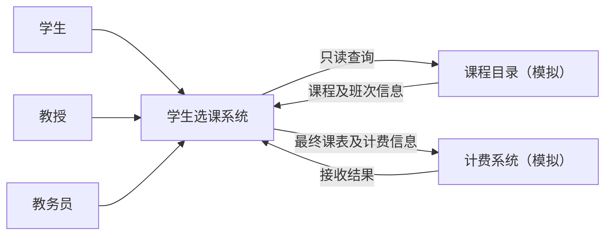

# 学生选课系统需求分析文档

- 文档版本：v0.4，2026-10-04。
- 状态：已写入 2026-10-04 需求澄清结论，Q-01 至 Q-15 均有结论；待团队评审，评审通过前不作为正式需求基线。
- 文档任务：US-003；所属迭代：IT-01。
- 需求统筹：倪成锦；学生业务：浩宇；教授业务：马喆；教务业务：冯海洋；测试审查：冯海伦；外部接口与材料整理：范昭。职责沿用开发计划，评审尚未执行。
- 关联：[项目开发计划](PROJECT_DEVELOPMENT_PLAN.md)、[产品待办](product-specs/backlog.md)、[需求追溯矩阵](product-specs/traceability.md)。

## 1. 编写目的与依据

本文规定系统需要满足的用户行为、业务规则、数据边界、外部接口和验收条件，为总体设计、开发拆分及测试计划提供共同依据。技术框架、数据库、部署拓扑和具体接口协议由后续设计与 ADR 决定。

| 来源编号 | 资料 | 用途 |
| --- | --- | --- |
| SRC-01 | [课程要求文字版](lecture-requirements/2026年软件工程课程设计要求.md) | 交付材料、运行检查与技术选型范围 |
| SRC-02 | [题目英文整理](lecture-requirements/2026年软件工程课程设计题目.md) | Problem Statement、Glossary、Supplementary Specification 及八个原始用例 |
| SRC-03 | [题目中文整理](lecture-requirements/2026年软件工程课程设计题目-中文.md) | 中文术语与用例阅读辅助；2026-10-04 已与英文版对照，相关段落含义一致 |
| SRC-04 | [项目开发计划](PROJECT_DEVELOPMENT_PLAN.md) | 六人分工、四周迭代和交付安排 |
| SRC-05 | 2026-10-04 两轮需求澄清问卷结论 | Q-01 至 Q-15 的决定；原始回答不入库，结论以第 11 节为准 |

原始课件与题目保存在 `docs/lecture-requirements/original-files/`。本文依据现有文字整理编写；若转写与原件冲突，应回查原件并记录修订。

本文用四种标记区分内容来源：

- **题目要求**：SRC-02 明确规定的内容。
- **项目解释**：题目没有写清、由小组决定的规则。2026-10-04 约定这类规则由小组决定，并在文中注明。
- **项目补充**：题目没有、为可实现、可测试或按小组决定新增的要求。
- **对原文的修改**：与题目原文不同的改动，集中列在 [2.4 节](#changes)。

所有验收条目目前均为设计中的验收条件，不是已执行的测试结果。

## 2. 项目概述与系统边界

### 2.1 目标与用户

为 Wylie College 建立学生选课系统，使学生完成选课和查成绩，教授完成授课选择、名册查看和成绩录入，教务员完成师生信息维护、学期时间设定及选课关闭。课程与班次信息来自课程目录，最终选课信息交给计费系统；两个外部系统由本组编写模拟系统代替。

| 参与者 | 目标 | 主要权限边界 |
| --- | --- | --- |
| 学生 | 编排本人课表、完成注册、查看成绩单 | 只能操作本人课表和查看本人成绩；非“在读”状态只能查看成绩 |
| 教授 | 选择有资格教授的班次、查看名册并提交成绩 | 不得修改其他教授已选择的班次；成绩限本人负责班次的学生；“离职”后不能登录 |
| 教务员 | 维护和导入人员资料、导入历史成绩和授课资格、设定学期时间、关闭选课、关闭后补选 | 关闭前不代学生选课；不能修改系统上线以后学期的成绩 |
| 课程目录系统（模拟） | 提供课程、班次、上课时间、学分及先修信息 | 外部权威来源，本系统只读 |
| 计费系统（模拟） | 接收计费信息并向学生出账 | 实际出账、寄送账单及收款由外部系统处理 |

课程教师是需求口径与课设验收的确认方；六人团队是实现和维护方，不是系统中的新增业务角色。

### 2.2 功能范围

范围内：登录与首次登录改密、课程目录查询、保存与正式提交课表、加退选与删除课表、授课选择、名册、成绩录入与查询、师生信息维护与状态管理、人员／历史成绩／授课资格导入、学期阶段时间设定、关闭选课、备选调剂、课程取消、计费通知与重试、关闭后补选、课程目录变更后的复查与通知。

范围外：维护课程目录中的课程基础信息、银行支付、实际收费、外部账单寄送、关闭选课后更换授课教授、重新开放已关闭的选课、关闭后退课、清除已录入的成绩、撤销已导入的授课资格、在界面中新增教务员账户，以及未经评审新增的自助注册、密码找回、全历史成绩导出等功能。

图中为业务交互边界，不指定进程拆分或通信协议；计费接收结果是用于判断重试的项目补充。

### 2.3 环境与约束

- 题目场景为校园 LAN 内的客户端—服务器系统，旧目录运行于 DEC VAX／Ingres，可经 Unix 服务器的 SQL 接口读取。本项目不接入真实旧系统，以模拟系统代替，见第 9 节。
- 交付形式为 Web 单页应用，替代题目的 Windows 桌面界面，见 CHG-01。
- 项目技术栈已在 [ADR-001](design-docs/adr/ADR-001-technology-stack.md) 确定：React + TypeScript + Vite + TanStack Router 单页应用、Hono、Prisma、PostgreSQL，使用 StarUML 建模，不采用 Next.js，当前不采用 TanStack Start。
- 课程交付截至 2026-10-16。人员安排和课程文档清单以开发计划为准，不重复作为软件功能。

### 2.4 对原文的修改

| 编号 | 题目原文 | 本项目做法 | 依据 |
| --- | --- | --- | --- |
| CHG-01 | 客户端为 Windows 桌面界面，兼容 Windows 95/98 | Web 单页应用，在浏览器中使用 | 用户 2026-10-04 告知课程教师已同意 |
| CHG-02 | 用户输入姓名和密码登录 | 使用系统生成的唯一账号（学号、教授编号或教务员账号）登录，姓名只用于显示 | 姓名可能重名；2026-10-04 决定 |
| CHG-03 | 关闭选课后学生不得再注册，原文没有补选功能 | 学生仍不能注册；教务员可在关闭后为学生补选，见 UC-13 | 新增功能；2026-10-04 决定 |
| CHG-04 | 只有教授可以为学生录入成绩 | 教务员可以导入系统上线以前学期的历史成绩，不覆盖已有成绩；系统上线以后的成绩仍只能由教授录入 | 先修检查需要历史成绩；2026-10-04 决定，限定范围以免与原文冲突 |

交付说明中应列出以上改动，便于课程教师核对。

## 3. 术语与领域概念

| 术语 | 本文含义 |
| --- | --- |
| Course／课程 | 学院开设的课程定义，例如课程名称、院系、学分和先修要求 |
| Course Offering／开课班次 | 一门课程在指定学期的一次开课，含上课日期与时段；同一课程可有多个班次 |
| Course Catalog／课程目录 | 外部系统提供的课程和开课信息，是课程、班次、上课时间、学分和先修的唯一权威来源 |
| Schedule／课表 | 某学生某学期的主选、备选及其注册结果 |
| Primary／主选 | 学生要注册的班次。第一次正式提交须刚好 4 个，之后可为 1—4 个；只有主选占名额 |
| Alternate／备选 | 主选出现空缺时在调剂中使用的班次。第一次正式提交须刚好 2 个，之后可为 0—2 个；有先后顺序，不占名额 |
| 保存课表（Save a Schedule） | 只记录学生的选择，不注册也不退课。v0.3 及以前称“草稿”，现改用题目原文说法 |
| 正式提交（Submit Schedule） | 系统检查整份课表，全部通过后整份生效；只有正式提交成功才真正注册新班次、退出被移除的班次 |
| 首次提交时间 | 学生在该学期第一次正式提交成功的时间，用于调剂时的先后顺序；之后修改课表不改变它 |
| Selected／已选择 | 已保存在课表中、尚未注册的条目 |
| Enrolled／已注册 | 学生已加入该班次名册；不同于仅保存选择 |
| Committed／已确认 | 关闭选课时确认保留的班次结果，不等同于技术上的数据库提交 |
| Leveling／调剂 | 关闭选课时用备选补上主选空缺的处理，见 BR-09 |
| 学期阶段 | 教授选择授课、学生初选、加退选、关闭选课，见 BR-05；学生初选和加退选都在原文的选课期间内 |
| 加退选期（add/drop period） | 题目原文“学期初的加退选期间”，学生可在已注册的课表上增加或退掉班次 |
| Roster／名册 | 某个班次的已注册学生清单 |
| Report Card／成绩单 | 学生某一学期的课程成绩；原始用例范围为上一已完成学期 |
| Transcript／成绩档案 | 学生全部历史成绩。原词汇表提到发给财务系统；本项目不向计费系统发送成绩，见 Q-07 |
| 系统上线学期 | 第一个由本系统办理选课的学期。更早学期的成绩只能导入，不能由教授在本系统录入 |
| 账户停用 | 账户不能登录，全部记录保留；用于代替删除有记录的人员 |

## 4. 需求索引与优先级

下表各项均为 P0 必需范围。迭代先后表示开发顺序，不降低题目要求；具体排期在迭代计划中确认。FR、BR、CHG、SEC、NFR、AC 和 Q 是本文内的分类编号，仓库任务与 PR 仍使用 US／BUG 编号。

| 功能编号 | 用户故事 | 功能 | 来源 | 详细规格 |
| --- | --- | --- | --- | --- |
| FR-01 | US-004 | 三类用户登录与首次改密 | Login、CHG-02 | [UC-01](#uc-01) |
| FR-02 | US-005 | 查询课程目录与班次，跟随目录变更 | Problem Statement、Register for Courses | [UC-02](#uc-02) |
| FR-03 | US-006、US-007、US-008 | 保存、正式提交、加退选和删除课表 | Register for Courses | [UC-03](#uc-03) |
| FR-04 | US-009 | 选择与取消授课 | Select Courses to Teach | [UC-04](#uc-04) |
| FR-05 | US-010 | 查看本人班次名册 | Problem Statement、Submit Grades | [UC-05](#uc-05) |
| FR-06 | US-011 | 录入和修改成绩 | Submit Grades | [UC-06](#uc-06) |
| FR-07 | US-012 | 查看本人成绩单 | View Report Card | [UC-07](#uc-07) |
| FR-08 | US-013 | 维护教授资料与状态 | Maintain Professor Information | [UC-08](#uc-08) |
| FR-09 | US-014 | 维护学生资料与状态 | Maintain Student Information | [UC-09](#uc-09) |
| FR-10 | US-015 | 关闭选课、调剂与取消班次 | Close Registration | [UC-10](#uc-10) |
| FR-11 | US-016 | 发送计费信息与故障重试 | Close Registration | [UC-11](#uc-11) |
| FR-12 | US-021 | 设定学期各阶段时间 | 项目补充 | [UC-12](#uc-12) |
| FR-13 | US-022 | 关闭选课后为学生补选 | 项目补充、CHG-03 | [UC-13](#uc-13) |
| FR-14 | US-023 | 导入人员、历史成绩与授课资格 | 项目补充、CHG-04 | [UC-14](#uc-14) |
| SEC | US-017 | 数据访问与操作权限 | Supplementary Specification、项目补充 | [权限要求](#security) |
| NFR | US-018 | 并发、性能、可靠性及交付可验证性 | Supplementary Specification、课程要求、项目补充 | [非功能需求](#nfr) |

US-003 的交付物是本文；US-004 至 US-018 及 US-021 至 US-023 才是待实现和验证的系统需求。US-001 为模板注册示例，不属于本项目。

## 5. 业务规则

| 编号 | 规则 | 依据／边界 |
| --- | --- | --- |
| BR-01 | 学生第一次正式提交须刚好 4 个主选、2 个备选；之后的正式提交主选 1—4 个、备选 0—2 个；要退掉全部课程时使用删除课表。保存不受下限约束，但不超过 4 个主选、2 个备选。调剂最多补到 4 个主选，没有可用备选时最终可不足 4 个 | 4+2 为题目要求；之后放宽数量为项目解释 |
| BR-02 | 只有已注册的主选占名额，班次已注册人数不得超过 10；关闭时没有授课教授的班次取消，调剂后仍不足 3 人的班次取消 | 题目；备选不占名额为项目解释 |
| BR-03 | 正式提交时，主选检查先修、班次开放、剩余名额、时间冲突，且主选中不能有同一课程的两个班次；备选只检查先修和班次开放，可以已满、可以与主选时间冲突，也可以与某个主选是同一课程的不同班次。先修须全部及格，A—D 为及格，F、I 和没有成绩不及格 | 检查项为题目要求；备选检查范围、及格线和先修组合为项目解释 |
| BR-04 | 保存只记录选择，不注册也不退课；新条目标记 selected，已有 enrolled 条目保持注册。正式提交整份生效或整份不生效：任一主选检查不通过时，整份不生效，原注册保持，例如换班失败时学生仍留在原班次。关闭选课时以最后一次正式提交成功的课表为准，只保存的修改作废；从未正式提交的学生本学期没有课程 | 保存语义为题目要求；原子提交与关闭时的取舍为项目解释 |
| BR-05 | 学期阶段依次为教授选择授课、学生初选、加退选、关闭选课，起止时间由教务员设定（UC-12）。教授选择授课在学生初选开始前开放，持续到关闭选课；学生初选开始时还没有教授的班次显示“暂无授课教授”。学生只在初选期和加退选期保存和提交。提交是否算数以系统完成确认的时间为准：只有在截止时刻（加退选期结束，或教务员按下关闭选课，取较早者）之前完成确认的提交才算数。关闭后学生不得注册，教授不得修改授课，选课不能重新开放 | 关闭后的限制为题目要求；阶段顺序、设定方式和截止判定为项目解释 |
| BR-06 | 成功删除课表时，必须同时从其中已注册的班次移除该学生 | 题目；取消删除保持原状 |
| BR-07 | 教授只选择有授课资格的班次；所选班次与保留班次不能发生时间冲突。一个班次只有一位教授；两位教授争选同一班次时，先完成确认的教授得到，另一位收到“这个班次已被其他教授选择”。授课资格由教务员导入（UC-14） | 资格与冲突为题目要求；单教授、争选和资格来源为项目解释 |
| BR-08 | 成绩为 A、B、C、D、F、I；允许未录入，允许教授后续修改；I 是实际成绩值，不等同于未录入。录入时留空表示这次不修改，本期不提供清除成绩。一次保存多名学生时，合法的格子保存，非法的格子（例如“Z”）不保存并逐格指出。系统上线学期及以后的成绩只能由负责教授录入；更早学期的成绩只能由教务员导入，导入不覆盖已有成绩 | 成绩值为题目要求；其余为项目解释 |
| BR-09 | 调剂只进行一轮，在关闭流程第 2 步之后、第 4 步之前。学生按首次提交时间先后处理，时间相同时学号小的先处理。学生主选不足 4 门时，按备选顺序逐个尝试，直到主选达 4 门或备选用完。可用备选须同时满足：班次未取消且有授课教授、已注册人数少于 10、与该生保留的主选没有时间冲突、先修满足、与保留的主选不是同一课程。有教授但暂不足 3 人的班次也可以补入。第 4 步取消班次后不再调剂 | 选择最先可用备选为题目要求；顺序、可用条件和一轮为项目解释 |
| BR-10 | 学费＝最终保留班次的学分合计 × 固定每学分价格，单位为元，学分取自课程目录。关闭选课后每名学生每学期发送一笔计费资料，内容为学生身份、学期、最终课表和金额；最终没有课程的学生也发送一笔 0 元。不发送成绩。关闭后补选会重新发送该生更正后的计费资料，计费只按最新一笔计算 | 按每名学生发送为题目要求；按学分计价、零元和更正为项目解释 |
| BR-11 | 课程名称、班次、上课时间、学分、先修课以课程目录为准，本系统只读；授课教授只记录在本系统，不使用课程目录中的教授信息；课表、注册、成绩、账户和人员资料由本系统保存 | 目录只读为题目要求；字段权威划分为项目解释 |
| BR-12 | 用例失败时系统状态保持不变；单纯查询不改变业务数据。例外：批量保存成绩按格子分别处理（BR-08）；选课关闭成功与计费送达分开判断（UC-10、UC-11） | 原始用例后置条件；例外为项目解释 |
| BR-13 | 对同一学生、同一班次的重复提交不得重复增加注册人数；重复关闭或计费重试不得形成重复收费 | 项目补充；具体一致性机制由设计决定 |
| BR-14 | 选课期间课程目录修改上课时间、先修或删除班次时，本系统跟随目录并复查已注册的学生。出现新的时间冲突或先修不满足时，两门课都保留并通知学生，学生下次正式提交时必须先解决；关闭时仍未解决的，在关闭结果中列出，由教务员在系统外处理。目录删除的班次按取消处理，从相关课表移除并通知学生 | 项目解释 |
| BR-15 | 同一学生在多个页面打开课表时，一个页面提交成功后，其他在线页面自动刷新；基于旧版本课表的提交被拒绝，并提示重新加载，不覆盖已生效的结果。两名学生争抢最后一个名额时，先处理完的学生报上，另一名学生收到“已满”提示，系统不自动改报备选 | 项目解释 |
| BR-16 | 账号为系统生成的学号、教授编号或教务员账号，一个账号只对应一种身份；首个教务员账户在系统初始化时预置。新账户使用初始密码，第一次登录必须修改。学生状态为在读、休学、毕业：在读可使用全部学生功能；休学、毕业可登录和查看成绩，不能选课。教授状态为在职、离职：离职不能登录，也不能选择授课。有选课、授课、成绩或计费记录的人员不能删除，改为停用账户或修改状态，记录全部保留 | 项目解释；登录方式见 CHG-02 |
| BR-17 | 关闭选课后，教务员可为在读学生补选班次：班次须未取消、有授课教授、已注册人数少于 10，同样检查先修、时间冲突和同课程限制；补选成功后重新发送该生的计费资料。不提供重新开放选课和关闭后退课 | 项目补充；见 CHG-03 |

## 6. 功能需求与用例

每个用例中的“成功”均指持久化结果与用户可见结果一致。除登录外，所有用例要求已认证且有相应权限。以下 AC 是验收标准编号，可供后续测试直接引用；v0.4 新增的 AC 从 AC-43 起编号，已有编号不重排。

### UC-01：登录（FR-01／US-004）

- 参与者：学生、教授、教务员。前置：系统显示登录界面（题目前置条件按此理解，见 Q-14）。
- 基本流程：用户输入账号（学号、教授编号或教务员账号）和密码；系统验证；验证成功进入与身份相符的功能范围。账户仍使用初始密码时，系统要求先修改密码，修改成功前不能使用其他功能。
- 异常流程：账号或密码无效时显示错误，可重新输入或取消；账户停用或教授离职时拒绝登录；取消与认证失败均不产生登录身份。
- 后置：成功后建立身份上下文；失败不改变业务数据。
- 用账号代替姓名登录是对原文的修改，见 CHG-02。

| 验收编号 | Given／When／Then |
| --- | --- |
| AC-01 | Given 三类有效测试账户，When 分别使用正确账号和密码登录，Then 各自进入授权范围，不能因此取得其他角色权限。 |
| AC-02 | Given 无效账号或错误密码，When 提交或取消登录，Then 显示失败提示或退出登录流程，受保护功能仍不可访问。 |
| AC-43 | Given 一个刚导入、仍使用初始密码的学生账户，When 第一次登录，Then 系统要求修改密码；修改前访问其他功能被拒绝，修改后旧的初始密码不能再登录。 |
| AC-44 | Given 离职教授、已停用账户、休学学生和毕业学生，When 分别登录，Then 离职教授与停用账户被拒绝；休学和毕业学生能登录并查看成绩单，但不能保存或提交课表。 |

### UC-02：查询课程目录（FR-02／US-005）

- 参与者：学生；教授在授课选择中使用同一数据来源。前置：已登录，目标学期已确定。
- 基本流程：从课程目录读取目标学期开课清单；显示课程、班次、学分、院系、先修条件、上课时间，以及本系统记录的授课教授，没有教授时显示“暂无授课教授”。教授端进一步按授课资格筛选。
- 目录变更：课程目录修改上课时间、先修或删除班次后，本系统显示新的信息，并按 BR-14 复查和通知。
- 异常流程：目录无法访问时给出明确错误并结束依赖该目录的用例；空清单与访问失败分别提示。
- 后置：不修改课程目录。

| 验收编号 | Given／When／Then |
| --- | --- |
| AC-03 | Given 同一课程在目标学期有两个班次，When 查询目录，Then 能区分班次和时段，并看到院系、学分、先修条件及授课教授（或“暂无授课教授”），不混入其他学期班次，不显示课程目录中的教授信息。 |
| AC-04 | Given 目录不可用或目标学期无班次，When 查询，Then 分别显示访问失败或空清单，不伪造查询成功，也不向目录写入数据。 |
| AC-45 | Given 学生甲已注册“数据结构 1 班”和“化学 1 班（周二）”，When 课程目录把“数据结构 1 班”改到周二同一时段，或给它新增一门学生甲没有及格的先修课，Then 两门课都保留，学生甲收到通知；学生甲下次正式提交若仍未解决，提交被拒绝并指出该问题。 |
| AC-46 | Given 学生甲已注册某班次，When 课程目录删除该班次，Then 本系统将其按取消处理，从学生甲课表和名册中移除，并通知学生甲。 |

### UC-03：管理学生课表（FR-03／US-006、US-007、US-008）

- 参与者：学生。前置：已登录，学生状态为在读，处于学生初选期或加退选期，且教务员尚未按下关闭选课。
- 建立与编辑：查询可用班次，选择主选和备选，调整备选的先后顺序，随后保存或正式提交。
- 保存：按 BR-04 记录选择，未注册条目标记 selected；已有 enrolled 条目保留注册状态；任何班次人数都不变。
- 正式提交：检查数量（BR-01），主选和备选分别按 BR-03 检查；全部通过后整份生效：新的主选加入名册并标记 enrolled，被移除的已注册班次退出名册，备选按顺序记录；第一次成功时记录首次提交时间。任一检查不通过时整份不生效，系统逐项说明原因，原注册保持。
- 更新（加退选）：读取本人当前课表与可用班次，增加或删除选择，然后保存或正式提交；只有正式提交成功才真正退课和加课。
- 删除：展示本人课表，取得确认后删除，并从已注册班次移除该学生；取消确认不变更任何记录。
- 多页面与争抢名额：按 BR-15 处理。
- 额满通知：学生页面在线时，班次额满须在 5 秒内显示；正式提交时仍须重新检查容量。
- 异常：先修未满足、额满、冲突或同课程重复时说明具体原因，可改选、按现状保存或取消；没有课表时提示后返回起点；目录不可用结束用例；不在选课阶段、正在关闭或已关闭则拒绝办理。
- 后置：成功形成一致的课表与班次名册；失败保持已持久化状态，不能留下已报告失败但仍占位的结果。

| 验收编号 | Given／When／Then |
| --- | --- |
| AC-05 | Given 本人课表中有未注册条目，且主选少于 4 个，When 保存，Then 再次读取能恢复选择及备选顺序，新增条目为 selected，原 enrolled 条目不被降级，所有班次人数不变。 |
| AC-06 | Given 第一次正式提交刚好 4 个主选、2 个备选且检查全部通过，When 提交，Then 4 个主选班次的名册加入该生、人数各加 1，备选班次人数不变，系统记录首次提交时间。 |
| AC-07 | Given 任一主选先修不满足、已关闭、已额满、有时间冲突或与另一主选同课程，When 提交，Then 整份课表不生效，逐项指出原因，原注册与名册不变；可改选、保存或取消。 |
| AC-08 | Given 班次已有 9 名已注册学生，When 两名不同学生同时争取最后一个名额，Then 最多一人新增注册成功，最终人数不超过 10；另一人收到“已满”提示，系统不自动改报其备选。 |
| AC-09 | Given 学生页面在线且正在编排，When 某个班次额满，Then 5 秒内页面显示额满；学生随后提交时系统仍重新检查容量。 |
| AC-10 | Given 学生甲已注册“物理 1 班”且在加退选期内，When 把它换成“美术 2 班”并只保存，Then 学生甲仍在“物理 1 班”名册中，“美术 2 班”人数不变；When 正式提交成功，Then 学生甲退出“物理 1 班”、加入“美术 2 班”；若“美术 2 班”已满，则提交失败，学生甲仍在“物理 1 班”。 |
| AC-11 | Given 已有包含 enrolled 条目的本人课表，When 确认删除，Then 课表删除、对应名册移除本人且容量释放；取消删除则全部保持原状。 |
| AC-12 | Given 没有课表、不在选课阶段、选课正在关闭或已经关闭、或学生不是在读状态，When 请求保存、提交、更新或删除，Then 分别提示原因；错误请求不修改数据。 |
| AC-13 | Given 本人已注册某班次，When 重复提交同一有效选择，Then 名册只保留一次注册、人数不重复增长（项目补充）。 |
| AC-47 | Given 学生第一次正式提交 3 个主选、2 个备选，When 提交，Then 被拒绝并说明须刚好 4+2；Given 学生之前已成功提交，When 提交 3 个主选、0 个备选，Then 接受；When 提交 0 个主选，Then 被拒绝并提示使用删除课表。 |
| AC-48 | Given 一个已满的备选、一个与主选时间冲突的备选、一个与主选同课程不同班次的备选，When 提交，Then 都被接受；Given 一个先修不满足或已取消的备选，When 提交，Then 整份被拒绝并指出该备选。 |
| AC-49 | Given 学生甲在页面 A 和页面 B 同时打开课表，When 在页面 A 提交成功，Then 页面 B 在线时 5 秒内刷新为新课表；When 页面 B 仍以旧版本提交，Then 被拒绝并提示重新加载，页面 A 的结果不被覆盖。 |
| AC-50 | Given 加退选期 18:00 结束，When 一次提交在 18:00 之前完成确认，Then 生效；When 一次提交在 17:59:59 发出但 18:00 之后才完成确认，Then 被拒绝且不改变数据。测试使用可控的系统时间。 |

### UC-04：选择授课班次（FR-04／US-009）

- 参与者：教授。前置：已登录，状态为在职，教授选择授课已开始且选课未关闭。
- 基本流程：显示有资格教授的班次、此前选择，以及已被其他教授选择的班次（不可选）；教授勾选或取消勾选；检查新选和保留班次的时间冲突；成功后更新授课安排。
- 异常：无有资格班次时提示并结束；冲突时指出冲突班次，可调整或取消；班次已被其他教授先选时提示“这个班次已被其他教授选择”；目录不可用时向教授提示并结束；选课关闭后拒绝修改。
- 后置：成功后授课安排一致；冲突、失败或取消时保持原安排，包括原先拟取消的班次。原文先移除再校验的步骤不能导致失败后留下部分修改。
- 原文此处目录失败分支写的是向 Student 提示，本文按向教授提示处理，见 Q-14。

| 验收编号 | Given／When／Then |
| --- | --- |
| AC-14 | Given 教授有资格且班次时间不冲突，When 确认授课选择，Then 新增与取消选择均正确反映在授课安排中，学生目录中的授课教授随之更新。 |
| AC-15 | Given 新选择与保留班次冲突，When 确认后取消本次操作，Then 显示冲突班次并保留此前全部授课安排。 |
| AC-16 | Given 无有资格班次、目录不可用或选课已关闭，When 办理授课选择，Then 给出对应提示且不修改安排；选择其他教授已选择的班次应被拒绝。 |
| AC-51 | Given 教授甲和教授乙都有资格教“高等数学 1 班”，When 两人同时确认选择，Then 只有先完成确认的教授得到该班次，另一位收到“这个班次已被其他教授选择”，班次始终只有一位教授。 |

### UC-05：查看学生名册（FR-05／US-010）

- 参与者：教授。基本流程：选择自己负责的班次，查看已注册学生；名册至少能区分学生身份，不列入只保存未提交、或仅列为备选的学生。
- 异常：无授课班次或空名册分别提示；访问其他教授的班次拒绝。
- 后置：仅查询，不改变课表、名册或成绩。显示字段最小集属项目补充，最终字段由设计评审确认。

| 验收编号 | Given／When／Then |
| --- | --- |
| AC-17 | Given 本人班次有已注册、只保存未提交、仅列为备选及已退选的学生，When 查名册，Then 仅已注册学生出现，退选或删除课表后刷新能看到变化。 |
| AC-18 | Given 班次不属于当前教授，When 直接请求该班次名册，Then 拒绝并不泄露学生清单。 |

### UC-06：录入和修改成绩（FR-06／US-011）

- 参与者：教授。前置：已登录，状态为在职，操作本人上一学期已经完成的班次，且该学期不早于系统上线学期。
- 基本流程：选择授课班次，读取注册学生及已有成绩；输入 A、B、C、D、F 或 I；可跳过未填写学生，稍后补录，也可修改已有成绩。留空的格子表示这次不修改。
- 异常：上一学期无授课班次时提示；非本班学生或越权班次拒绝处理；一次保存中的非法成绩值只拒绝对应格子，并逐格指出。
- 后置：合法格子的成绩可重新查询；留空和非法的格子保持原成绩。本期不提供清除成绩，见 BR-08。

| 验收编号 | Given／When／Then |
| --- | --- |
| AC-19 | Given 本人上一已完成学期班次中的注册学生，When 分别录入六种合法成绩并修改已有成绩，Then 重新读取得到对应结果，I 与未录入能区分。 |
| AC-20 | Given 学生甲已有成绩 B，When 教授一次保存 10 名学生，其中学生甲留空、另一格填“Z”，Then 学生甲仍为 B，“Z”所在格子不保存并被指出，其余 8 格保存成功；非本班学生的更新被拒绝。 |
| AC-21 | Given 教授上一学期无授课班次，When 进入成绩录入，Then 显示无可用班次，不显示其他教授的学生。 |

### UC-07：查看成绩单（FR-07／US-012）

- 参与者：学生，包括休学和毕业状态的学生。前置：已登录。
- 基本流程：读取本人上一已完成学期各班次的成绩并展示，学生结束查看。
- 异常：无该学期成绩信息时提示；他人成绩拒绝访问。
- 后置：不更改业务数据。不将原文 Transcript 的全历史范围自动扩展到此用例。

| 验收编号 | Given／When／Then |
| --- | --- |
| AC-22 | Given 本人上一已完成学期有成绩，When 查看成绩单，Then 课程班次和成绩对应正确且没有其他学生的数据。 |
| AC-23 | Given 无该学期成绩信息，When 查看，Then 显示无成绩信息而不是虚构成绩或系统故障；不改变任何记录。 |

### UC-08：维护教授信息（FR-08／US-013）

- 参与者：教务员。新增时输入姓名、出生日期、社会安全号码、状态（在职或离职）、院系，系统生成并显示唯一教授编号，该编号即登录账号，同时生成初始密码。批量新增见 UC-14。
- 更新时按编号查找并显示教授资料，允许修改上述信息；删除时按编号查找、展示并确认后删除。
- 状态改为离职：教授不能再登录；系统取消其在未关闭学期的授课选择，相关班次变为“暂无授课教授”；已关闭学期的记录保留。修改前系统列出受影响的班次并要求确认。
- 异常：编号不存在时提示，可换编号或取消；取消删除保持原状；有授课或成绩记录的教授不能删除，系统说明原因并提示改为离职或停用账户。
- 后置：成功后人员记录与操作一致；失败不留下部分修改。

| 验收编号 | Given／When／Then |
| --- | --- |
| AC-24 | Given 两份有效教授资料，When 分别新增并按返回编号查询，Then 编号唯一、数据一致；更新后编号保持不变，字段正确保存。 |
| AC-25 | Given 不存在的教授、没有任何记录的教授和有授课记录的教授，When 分别查询、取消删除、确认删除，Then 分别提示不存在、保持原状、成功删除；有授课记录的教授删除被拒绝并说明原因，数据不变。 |
| AC-52 | Given 教授甲在未关闭学期教“高等数学 1 班”，When 教务员确认把教授甲改为离职，Then 教授甲不能登录，“高等数学 1 班”显示“暂无授课教授”，教授甲已关闭学期的授课和成绩记录仍可查询。 |

### UC-09：维护学生信息（FR-09／US-014）

- 参与者：教务员。新增时输入姓名、出生日期、社会安全号码、状态（在读、休学或毕业）、毕业日期，系统生成并显示唯一学号，该学号即登录账号，同时生成初始密码。批量新增见 UC-14。
- 更新、删除流程与教授维护一致，但操作学生资料；系统学号与本课设成员的真实学号没有自动对应关系。
- 状态由在读改为休学或毕业：系统列出该生在未关闭学期的课表，教务员确认后按删除课表处理（BR-06）；已关闭学期的记录保留。
- 异常：找不到学生、取消删除时保持原状；有选课、成绩或计费记录的学生不能删除，系统说明“这名学生还有选课、成绩或计费记录”，并提示修改状态或停用账户。
- 后置：仅教务员能维护学生基础资料；这不影响学生按照 UC-03 管理本人课表。

| 验收编号 | Given／When／Then |
| --- | --- |
| AC-26 | Given 有效学生资料，When 新增、按编号读取并更新，Then 编号唯一且稳定，基础资料与操作一致。 |
| AC-27 | Given 不存在的学生、没有任何记录的学生和有选课记录的学生，When 分别查询、取消删除、确认删除，Then 分别提示不存在、保持原状、成功删除；有记录的学生删除被拒绝并说明原因，数据不变。 |
| AC-53 | Given 在读学生甲在未关闭学期已注册 4 个班次，When 教务员确认把学生甲改为休学，Then 学生甲退出这 4 个班次的名册、名额释放，学生甲仍能登录查看成绩单但不能选课。 |

### UC-10：关闭选课（FR-10／US-015）

- 参与者：教务员。前置：已登录；该学期选课尚未关闭。教务员可以在加退选期结束前提前关闭。
- 关闭范围为整个学期的全部班次；关闭后不能重新开放。
- 主流程保留题目顺序：
  1. 教务员按下关闭选课：系统立即停止接受该学期新的保存和提交，学期进入“正在关闭”；等待正在处理的提交完成后继续。题目“选课进行中不得关闭”解释为仍有提交正在处理（项目解释）。
  2. 检查各班次：有教授且至少 3 名学生已注册的班次，确认其在各学生课表中的结果。没有教授的班次取消并更新相关课表。有教授但暂不足 3 人的班次暂不处理。
  3. 按 BR-09 调剂一轮。
  4. 关闭全部班次，再检查人数；仍不足 3 人的班次取消，并同步到所有相关课表；之后不再调剂。
  5. 按 BR-10 计算学费，调用 UC-11 发送计费信息。
- 关闭结果向教务员列出：取消的班次、调剂结果、按 BR-14 仍有未解决冲突或先修问题的学生，以及计费发送状态。
- 异常：第 1—4 步作为一个整体，内部处理失败时恢复到按下关闭前的状态，教务员可以重试。计费系统不可用不影响关闭成功，系统显示“选课已关闭，计费资料等待发送”，由 UC-11 继续重试。

| 验收编号 | Given／When／Then |
| --- | --- |
| AC-28 | Given 加退选期尚未结束且有一次学生提交正在处理，When 教务员按下关闭选课，Then 之后的新提交被拒绝并提示正在关闭；正在处理的提交完成后才开始关闭处理，其结果计入关闭。 |
| AC-29 | Given 关闭条件满足，When 完成调剂及最终人数检查，Then 有教授且人数 3—10 的班次保留、人数 0—2 的班次取消；无教授班次取消，相关课表同步更新。 |
| AC-30 | Given 主选出现空缺且有按顺序排列的备选，When 调剂，Then 跳过已取消、无教授、已满 10 人、与保留主选时间冲突、先修不满足或与保留主选同课程的备选，使用最先可用项，主选不超过 4 门；无可用项则不强行补课。 |
| AC-31 | Given 有教授且暂为 2 人的班次在调剂中新增 1 人，When 最终检查人数，Then 不因调剂前不足 3 人而被提前取消。 |
| AC-32 | Given 学生甲首次提交时间早于学生乙，两人都需要用同一备选的最后一个名额，When 调剂，Then 学生甲得到名额；首次提交时间相同时学号小的学生得到；第 4 步取消班次后不进行第二轮调剂。 |
| AC-33 | Given 选课正在关闭或已关闭，When 再次提交关闭请求，Then 被拒绝并说明当前状态，不重复调剂、不新增重复收费。 |
| AC-54 | Given 学生甲成功提交后又只保存了修改，学生乙只保存过、从未正式提交，When 关闭选课，Then 学生甲按最后一次成功提交的课表处理，学生乙没有任何课程，并收到一笔 0 元计费。 |
| AC-55 | Given 关闭处理在第 3 步注入内部故障，When 处理失败，Then 学期恢复到按下关闭前的状态，所有课表和名册不变，教务员重试后能正常完成。 |

### UC-11：发送计费信息（FR-11／US-016）

- 发起者：选课关闭流程或关闭后补选（UC-13）；协作方：计费系统（模拟）。
- 基本流程：对每名学生按 BR-10 计算本学期最终课表的学费，生成一笔计费资料（学生身份、学期、最终课表及各班次学分、金额），发送给计费系统，由计费系统生成包含最终课表副本的账单。
- 异常：不能通信时每 60 秒重新发送一次，直到计费系统恢复可用并确认接收；本系统重新启动后继续发送，待发送资料不能丢失。
- 防止重复收费：每笔资料有稳定的业务标识（学生、学期和版本）。同一笔资料重复发送，计费系统只计算一次；补选产生新版本，计费系统用新版本取代旧版本。

| 验收编号 | Given／When／Then |
| --- | --- |
| AC-34 | Given 每学分价格和最终课表，When 生成计费资料，Then 学生、学期、最终班次、学分合计与金额对应正确，不含已取消班次，也不含成绩；没有课程的学生金额为 0。 |
| AC-35 | Given 计费系统不可用，When 关闭选课，Then 关闭显示成功并标明“计费资料等待发送”；系统每 60 秒重发一次，重启后继续，计费系统恢复后资料送达且不丢失。 |
| AC-36 | Given 计费系统已接收但响应丢失，When 本系统重试或重启后恢复发送，Then 计费系统对同一业务标识只计费一次。 |

### UC-12：设定学期阶段时间（FR-12／US-021）

- 参与者：教务员。前置：已登录，目标学期尚未关闭。
- 基本流程：教务员为学期设定教授选择授课开始时间、学生初选期起止、加退选期起止并保存。时间须满足：教授选择授课开始不晚于初选开始，初选开始早于初选结束，初选结束不晚于加退选开始，加退选开始早于加退选结束。
- 生效：各阶段按设定的时间自动开始和结束；加退选期结束后学生不能再提交，学期等待教务员关闭选课，系统不自动关闭。
- 异常：时间顺序不合法时拒绝保存并指出原因；已关闭的学期不能修改。

| 验收编号 | Given／When／Then |
| --- | --- |
| AC-56 | Given 教务员设定的初选开始时间早于教授选择授课开始时间，When 保存，Then 被拒绝并指出原因；Given 合法的时间设定，When 系统时间分别处于初选前、初选期、加退选期和加退选结束后，Then 学生分别不能提交、能提交、能提交、不能提交，教授在关闭前都能选择授课。 |

### UC-13：关闭后补选（FR-13／US-022）

- 参与者：教务员。前置：已登录，目标学期已关闭选课。
- 基本流程：教务员选择一名在读学生和一个班次；系统按 BR-17 检查；通过后学生加入该班次名册并更新课表；系统按 BR-10 生成该生更正后的计费资料并调用 UC-11 发送。
- 异常：班次已取消、没有授课教授、已满 10 人，或先修、时间冲突、同课程检查不通过时拒绝并说明原因，数据不变。
- 本用例是对原文的修改，见 CHG-03；不提供重新开放选课和关闭后退课。

| 验收编号 | Given／When／Then |
| --- | --- |
| AC-57 | Given 已关闭学期中一个有教授、已有 9 人的班次，When 教务员为在读学生甲补选，Then 名册变为 10 人，学生甲课表更新，计费系统收到学生甲的新版本资料，并只按新版本计费；When 再为学生乙补选同一班次，Then 因已满被拒绝。 |
| AC-58 | Given 已关闭学期中的已取消班次或无教授班次，When 教务员补选，Then 被拒绝且数据不变；Given 选课已关闭，When 学生自己提交课表，Then 仍被拒绝。 |

### UC-14：导入人员、历史成绩与授课资格（FR-14／US-023）

- 参与者：教务员。前置：已登录。三种导入都可以随时、多次进行。
- 人员名单：上传 Excel 文件导入学生或教授。系统为每人生成学号或教授编号作为账号，并生成初始密码。按社会安全号码识别已存在的人员，已存在的跳过并在结果中列出。
- 历史成绩：上传 Excel 文件导入学生、课程、学期和成绩。只接受早于系统上线学期的成绩；学生须已存在，成绩值须为 A、B、C、D、F 或 I；系统里已有的成绩不被覆盖，在结果中列出。
- 授课资格：上传 Excel 文件导入“教授编号＋课程”对应关系；重复记录忽略。撤销资格不在本期范围。
- 结果：逐行校验，合法行导入，不合法行指出行号和原因，不影响其他行。导入结果中不显示完整社会安全号码。

| 验收编号 | Given／When／Then |
| --- | --- |
| AC-59 | Given 一份包含 3 名新学生、1 名已存在学生和 1 行缺少姓名的名单，When 导入，Then 3 名新学生获得唯一学号和初始密码，已存在学生被跳过，缺少姓名的行被指出，其他行不受影响。 |
| AC-60 | Given 学生甲已有某门课的成绩，When 导入一份包含该成绩不同值、另一门上线前学期成绩和一行系统上线学期成绩的文件，Then 学生甲原成绩不变并被列出，上线前学期成绩导入成功，上线学期那一行被拒绝。 |
| AC-61 | Given 教授甲原来没有“线性代数”的授课资格，When 导入“教授甲＋线性代数”，Then 教授甲在授课选择中能看到“线性代数”的班次；再次导入同一行不产生重复记录。 |

## 7. 权限与安全需求（US-017）

“允许”仍受学期、所有权和业务状态限制。“未授予”表示本需求未定义该能力，不能凭管理员身份自动获得。授权必须在可信业务执行端生效，不能仅通过隐藏按钮实现（项目补充）。

| 操作 | 学生 | 教授 | 教务员 |
| --- | --- | --- | --- |
| 登录 | 允许；非在读只能查看成绩单 | 在职允许，离职拒绝 | 允许 |
| 浏览目录 | 目标学期 | 有资格授课的范围 | 未定义独立目录浏览用例 |
| 保存、提交、更新、删除课表 | 本人、在读、在选课阶段 | 不允许 | 关闭前未授予代操作；关闭后只能补选（UC-13） |
| 选择或取消授课 | 不允许 | 本人、在职、有资格、未关闭 | 未授予代操作权限 |
| 查看班次名册 | 不允许查看他人名单 | 本人负责班次 | 未授予批量查阅权限 |
| 录入与修改成绩 | 不允许 | 本人上一已完成学期班次，且不早于系统上线学期 | 只能导入系统上线以前学期的成绩，不覆盖已有成绩 |
| 查看成绩单 | 本人 | 通过本人班次录入流程查看对应成绩 | 未授予 |
| 维护、导入学生和教授资料与状态 | 不允许 | 不允许 | 允许 |
| 导入授课资格 | 不允许 | 不允许 | 允许 |
| 设定学期阶段时间、关闭选课 | 不允许 | 不允许 | 允许 |
| 更新外部课程目录 | 不允许 | 不允许 | 不在本系统内提供 |

| 编号 | 要求 | 依据与验证 |
| --- | --- | --- |
| SEC-01 | 未认证者不能读写受保护业务数据 | 题目各用例前置条件；AC-37 |
| SEC-02 | 学生只能改本人课表、查看本人成绩 | 题目 Security 与成绩敏感性说明；AC-38 |
| SEC-03 | 教授不得修改其他教授班次，只能读取本人名册和更新本人班次学生成绩 | 题目及所有权细化；AC-18、AC-39 |
| SEC-04 | 只有教务员能维护和导入人员资料；系统上线学期及以后的成绩只有教授能录入，教务员导入只限更早学期且不覆盖已有成绩 | 题目；导入例外见 CHG-04；AC-40、AC-60 |
| SEC-05 | 从已认证身份判断角色和数据所有权；拒绝客户端篡改用户、角色或班次标识造成的越权 | 项目补充；AC-38 至 AC-40 |
| SEC-06 | 密码不以明文存储或回传，不出现在日志、错误信息和交付样例中；初始密码不能所有人相同，第一次登录必须修改；成绩和社会安全号码只对必要角色展示 | 项目补充；AC-41、AC-43；具体认证、传输保护方案由设计确定 |
| SEC-07 | 记录成绩修改与导入、人员维护与导入、状态变更、学期时间设定、选课关闭、补选、计费发送的操作者或发起过程、时间、对象及结果，避免日志收集完整凭据和无关敏感字段 | 项目补充；AC-42；保留期限待设计评审 |

| 验收编号 | Given／When／Then |
| --- | --- |
| AC-37 | Given 未认证请求，When 直接访问课表、人员、成绩或关闭选课接口，Then 被拒绝且无数据泄露或写入。 |
| AC-38 | Given 学生 A 已登录，When 将目标学生或课表标识改成 B，Then 不能读取 B 的成绩或修改 B 的课表，B 的数据不变。 |
| AC-39 | Given 教授 A 已登录，When 操作教授 B 的班次，或向 A 的班次提交不在名册中的学生成绩，Then 请求被拒绝且数据不变。 |
| AC-40 | Given 不同角色的账户，When 越权维护人员、导入资料、录入成绩、设定学期时间、关闭选课或补选，Then 所有未授权组合均被拒绝；有效角色的合法操作仍可用。 |
| AC-41 | Given 已建立的测试账户及登录失败场景，When 检查持久化凭据、响应和日志，Then 无明文密码泄露，不向无权限用户暴露成绩或社会安全号码（项目补充）。 |
| AC-42 | Given 成绩修改或导入、人员变更、关闭、补选或计费请求，When 操作成功或失败，Then 能追查对象、发起者、时间与结果，记录不含完整密码等无关敏感数据（项目补充）。 |

## 8. 数据需求与一致性

### 8.1 概念数据字典

此处描述业务数据含义，不规定表名、主键类型、ORM 或存储技术。

| 实体 | 主要业务字段 | 来源与约束 |
| --- | --- | --- |
| 账户 | 登录账号、凭据、角色、关联人员、是否需修改初始密码、启用／停用 | 一个账号只对应一种身份；学生、教授账号即学号、教授编号；首个教务员账户初始化时预置 |
| 学生 | 学号、姓名、出生日期、社会安全号码、状态（在读、休学、毕业）、毕业日期 | 题目明确字段；由教务员维护或导入；测试使用虚构资料 |
| 教授 | 教授编号、姓名、出生日期、社会安全号码、状态（在职、离职）、院系 | 题目明确字段；由教务员维护或导入 |
| 学期 | 学期标识、教授选择授课开始、初选期起止、加退选期起止、关闭状态、关闭结果 | 时间由教务员设定（UC-12）；系统记录哪个学期为系统上线学期 |
| 课程 | 课程标识、名称、院系、学分、先修课程 | 课程目录权威提供，系统不得改写 |
| 开课班次 | 班次标识、课程、学期、日期时段、授课教授、已注册人数、开放／关闭／取消结果 | 时段等基础信息来自目录；授课教授、人数和取消结果只在本系统 |
| 课表与条目 | 学生、学期、版本、首次提交时间、主选、按顺序排列的备选、selected／enrolled 等结果 | 保存不改变注册；版本用于拒绝基于旧课表的提交 |
| 注册关系 | 学生、班次、有效注册状态、来源（提交、调剂或补选） | 名册和人数必须能由同一事实解释；重复请求不能制造重复注册 |
| 授课资格 | 教授、可教授的课程 | 由教务员导入（UC-14） |
| 成绩 | 学生、班次或历史课程学期、成绩值或未录入状态、来源（教授录入或导入） | 成绩 I 与空值不同；导入只限系统上线学期以前 |
| 目录变更通知 | 学生、班次、问题类型（时间冲突、先修不满足、班次删除）、是否已解决 | 由目录变更复查产生（BR-14） |
| 计费交易 | 学生、学期、版本、最终班次与学分、每学分价格、金额（元）、业务标识、发送状态、重试记录 | 每学分价格为系统配置；业务标识用于防止重复收费 |

人员字段保留题目用语，保留社会安全号码，不以中国身份证号替换；课程教师另行要求时再修改。不把本课设六名成员的信息作为系统学生样本，演示和测试使用虚构数据。

### 8.2 状态语义

| 对象 | 需要区分的语义 | 状态变化要求 |
| --- | --- | --- |
| 课表条目 | 已选择、已注册、关闭时确认、被取消或退选 | 保存不能自动升级注册；正式提交、退选与名册一致；取消班次影响所有包含它的课表 |
| 课表 | 只保存过、已正式提交 | 只有已正式提交的课表参与关闭；首次提交时间写入后不变 |
| 开课班次 | 可报名、额满、已关闭、已取消 | “额满”是容量条件，不等于“已取消”；学生退选可改变容量，但不能擅自重新开启关闭的班次 |
| 学期选课 | 阶段由设定的时间决定；关闭状态分为未关闭、正在关闭、已关闭 | 正在关闭时拒绝新的保存和提交；已关闭后不能回到未关闭；内部失败时从正在关闭恢复为未关闭 |
| 计费 | 等待发送、已发送待确认、需重试、已确认接收、被新版本取代 | 不能把“发送过”视为“已接收”；计费状态不影响选课关闭是否成功 |
| 账户与人员 | 账户启用／停用、需改初始密码；学生在读／休学／毕业；教授在职／离职 | 状态变化不删除历史记录；影响见 BR-16、UC-08、UC-09 |

### 8.3 必须保持的一致性

- 学生可见的已注册结果、班次名册和容量统计相互一致；并发选课不能超出人数上限。
- 删除课表、退选、班次取消、学生状态变更和目录删除班次必须同步影响相应注册关系；未成功操作不得留下隐藏占位。
- 所有权、窗口、先修、冲突和容量检查在实际写入时仍然成立，不能只依靠先前展示的数据。
- 外部课程编号与本地注册关系可关联；本地业务变更不得反向写入只读课程目录。
- 有选课、授课、成绩或计费记录的人员不能删除，只能停用或修改状态。
- 事务边界、并发控制、重试与恢复机制由总体设计提出；本文未选定锁、消息队列或数据库产品。

## 9. 外部接口需求

两个外部系统均由本组编写模拟系统代替（2026-10-04 决定），模拟系统须能构造正常运行、故障、故障后恢复三种情况。模拟验证不能声称已完成真实旧系统集成。

| 接口 | 输入与输出 | 失败要求 | 待设计内容 |
| --- | --- | --- | --- |
| IF-01 课程目录 | 按目标学期获取课程、班次、院系、学分、先修与时段信息；目录中的教授信息不使用 | 访问延迟满足 NFR-02；不可用时提示错误；不能把访问失败解释成零课程。模拟系统须能修改上课时间、增加先修、删除班次，用于验证 BR-14 | 字段映射、本系统获知目录变更的方式与频率、缓存 |
| IF-02 计费系统 | 每学生、每学期一笔：学生身份、学期、最终课表、金额、业务标识与版本；返回接收结果 | 不能通信时每 60 秒重试，重启后继续；同一业务标识只计费一次，新版本取代旧版本。模拟系统须能构造不可用、超时、响应丢失和恢复 | 超时时长、确认协议、待发送资料的持久化方式 |

以上为逻辑接口，不要求采用 HTTP 或新增独立服务。

## 10. 非功能需求与验收口径（US-018）

性能指标 NFR-01 至 NFR-04 保留题目原数字作为需求。测试用的硬件、模拟用户数、业务组合与持续时间由小组在测试计划中自行规定并记录；测试报告如实写出实际测到的结果，没有达到或没有测到原数字的部分不声称达标。

| 编号 | 需求 | 来源 | 验证方法与口径 |
| --- | --- | --- | --- |
| NFR-01 | 支持多个用户同时工作；中央数据库最多 2000 同时用户、本地服务器最多 500 同时用户 | Supplementary Specification | 负载测试记录用户数、业务组合、环境和持续时间；用户数不能直接替换成 QPS 或数据库连接数 |
| NFR-02 | 访问课程目录的延迟不超过 10 秒 | Supplementary Specification | 对目录正常访问测量请求至可用结果的耗时；本地快速报错不算成功读取 |
| NFR-03 | 至少 80% 的交易在 2 分钟内完成 | Supplementary Specification | 在测试计划规定的负载下，统计 120 秒内完成的有效交易数与发起总数；另列错误和超时，不能将快速失败计为成功 |
| NFR-04 | 每周 7 天、每天 24 小时可用，停机不超过 10% | Supplementary Specification | 在测试计划规定的观察窗口内测量不可用时长／应服务时长；短时演示不构成长周期可用性证明，报告中注明观察时长 |
| NFR-05 | 以 Web 单页应用交付，在 Windows 上的当前版本 Chrome 和 Edge 中完成全部用例；不再要求 Windows 95/98 兼容 | CHG-01 | 在上述浏览器中执行端到端或记录在案的手工验收，记录浏览器版本 |
| NFR-06 | 失败操作不留下部分业务修改，查询不改变业务状态；例外见 BR-12 | 原用例后置条件 | 在选课、授课调整、人员维护、关闭选课中注入失败，比较前后业务数据 |
| NFR-07 | 用户能区分保存、正式提交、删除、错误、空结果、正在关闭和已关闭状态 | 原用例及项目补充 | 用端到端或记录在案的手工验收检查提示与实际状态一致；删除需确认，错误说明可操作的原因，不暴露内部敏感信息 |
| NFR-08 | 配置、启动、初始化与验证步骤可复现，文档和实现一致 | 课程运行检查、仓库规范 | 在独立环境按版本化说明完成启动并演示主流程；不使用个人机器隐式配置作为前提 |
| NFR-09 | 每条验收条件有自动化测试或明确的手工记录，结果可追溯 | 项目补充、仓库完成定义 | 冯海伦核对需求、用例、测试结果与版本的对应关系；不以文档检查或脚本语法通过代替业务测试 |
| NFR-10 | 页面在线时，班次额满、课表在其他页面提交、目录变更通知在 5 秒内显示 | 题目额满通知要求；5 秒为项目解释 | 两个浏览器会话中触发变化，测量另一会话显示的时间；断网时不要求，但提交时仍须重新检查 |

当前没有性能、可靠性或业务测试执行结果。具体测量脚本、测试数据规模、故障注入方式和环境在测试计划中定义。

## 11. 需求澄清结论

Q-01 至 Q-15 已于 2026-10-04 通过两轮需求澄清问卷得出结论，并写入上文；类型列说明结论属于哪一种来源标记。团队评审时可提出修改，修改记入第 13 节。

| 编号 | 原问题 | 结论 | 类型 | 写入位置 |
| --- | --- | --- | --- | --- |
| Q-01 | 题目要求 Windows 桌面，课件允许 Web | 做 Web 单页应用；用户 2026-10-04 告知课程教师已同意 | 对原文的修改 | CHG-01、NFR-05 |
| Q-02 | 能否访问真实外部系统；目录与本地数据谁为准 | 两个外部系统都自建模拟；课程、班次、时间、学分、先修以目录为准，授课教授只在本系统；目录变更时跟随并复查学生 | 项目解释 | BR-11、BR-14、第 9 节 |
| Q-03 | 学期阶段、窗口由谁设定、“选课进行中”的含义 | 四个阶段依次进行，教授在学生初选前开始选择；教务员在页面设定时间；可提前关闭，按下后停止接受新提交、等正在处理的提交完成；截止前完成确认才算数；整学期一次关闭，不能重开 | 项目解释 | BR-05、UC-10、UC-12 |
| Q-04 | 4+2 是必填还是上限；备选是否占位 | 第一次正式提交刚好 4+2，之后主选 1—4、备选 0—2；保存可不足；只有主选占名额；备选有顺序；主选不能同课程，备选可以；备选提交时只查先修和开放 | 项目解释 | BR-01 至 BR-03 |
| Q-05 | 保存是否退课；部分失败如何处理 | 保存不退课不加课；正式提交整份生效或整份不生效；换班失败留在原班；多页面以服务器版本为准 | 项目解释 | BR-04、BR-15 |
| Q-06 | 调剂顺序、不足 3 人班次、是否再次调剂 | 不足 3 人的班次调剂后再决定；首次提交早的先、同时则学号小的先；只调剂一轮 | 项目解释 | BR-09、UC-10 |
| Q-07 | 计费时机、金额、零课程、是否发历史成绩 | 关闭后每名学生每学期一笔；学分 × 固定每学分价格；零课程发 0 元；不发成绩 | 项目解释 | BR-10、UC-11 |
| Q-08 | 关闭失败与计费重试的关系 | 计费不可用时关闭仍算成功，显示等待发送；每 60 秒重试，重启后继续；同一笔只计一次 | 项目解释 | UC-10、UC-11 |
| Q-09 | 姓名登录重名；账户如何建立；字段约束 | 改用唯一账号登录；Excel 导入人员，系统生成学号或教授编号与初始密码，首次登录改密；一个账号一种身份；保留社会安全号码，测试用虚构资料；学生在读、休学、毕业，教授在职、离职 | 对原文的修改（登录）及项目解释 | CHG-02、BR-16、UC-14 |
| Q-10 | 先修如何认定及格；历史成绩来源 | A—D 及格，F、I、无成绩不及格；所有先修都须及格；历史成绩由教务员导入，只限上线前学期，不覆盖已有成绩 | 项目解释 | BR-03、BR-08、CHG-04 |
| Q-11 | 授课资格来源；单班单教授；争选 | 资格由教务员随时导入；一班一位教授；先完成确认者得到 | 项目解释 | BR-07、UC-04、UC-14 |
| Q-12 | 删除有记录的人员；成绩清空 | 有记录的人员不能删除，改为停用或修改状态；成绩留空表示不修改，不提供清除；批量保存合法格子保存、非法格子拒绝 | 项目解释 | BR-08、BR-16、UC-06、UC-08、UC-09 |
| Q-13 | 额满通知方式与延迟 | 页面在线时 5 秒内显示，提交时再检查 | 项目解释 | UC-03、NFR-10 |
| Q-14 | 原文授课用例目录失败写 Student；登录前置条件易误读 | 授课用例目录失败按向教授提示；登录前置为系统显示登录界面 | 项目解释 | UC-01、UC-04 |
| Q-15 | 性能指标如何测量 | 保留原数字；测试条件由小组规定并记录；如实报告实测结果 | 项目解释 | 第 10 节 |

仍需向课程教师确认：外部课程目录和计费系统以模拟系统代替是否可以接受。由倪成锦在交付前确认并记入本文变更记录；在确认前按模拟方案推进。

六人组队与课件五人要求的差异属于项目管理事项，继续由开发计划跟进，不作为新增软件功能。

## 12. 验收组织与追溯

### 12.1 用例覆盖

| 原题用例／来源 | 本文覆盖 | 验收条件 |
| --- | --- | --- |
| Login | FR-01／UC-01 | AC-01、AC-02、AC-43、AC-44 |
| Register for Courses | FR-02、FR-03／UC-02、UC-03 | AC-03 至 AC-13、AC-45 至 AC-50 |
| Select Courses to Teach | FR-04／UC-04 | AC-14 至 AC-16、AC-51 |
| Problem Statement 名册 | FR-05／UC-05 | AC-17、AC-18 |
| Submit Grades | FR-06／UC-06 | AC-19 至 AC-21 |
| View Report Card | FR-07／UC-07 | AC-22、AC-23 |
| Maintain Professor Information | FR-08／UC-08 | AC-24、AC-25、AC-52 |
| Maintain Student Information | FR-09／UC-09 | AC-26、AC-27、AC-53 |
| Close Registration | FR-10、FR-11／UC-10、UC-11 | AC-28 至 AC-36、AC-54、AC-55 |
| 项目补充：学期时间、补选、导入 | FR-12 至 FR-14／UC-12 至 UC-14 | AC-56 至 AC-61 |
| Supplementary Specification 安全 | SEC-01 至 SEC-07 | AC-18、AC-37 至 AC-42 |
| Supplementary Specification 非功能及项目补充 | NFR-01 至 NFR-10 | 第 10 节逐项验证方法 |

### 12.2 测试准备与验收链路

冯海伦据此编写测试计划；各模块负责人提供单元与集成验证。测试数据至少包含三类角色、不同状态的学生和教授、多学期（含系统上线学期以前的导入成绩）、满足／不满足先修的学生、冲突时段、人数为 0／2／3／9／10 的班次、无教授班次、可用与不可用备选、首次提交时间相同的学生、六种合法成绩及未录入成绩，以及用于导入的 Excel 样例文件。

整体演示应覆盖：教务员导入师生资料与授课资格、设定学期时间；教授选择授课；学生浏览目录、保存和正式提交课表并加退选；目录变更后的通知；教务员关闭选课、调剂、取消和计费，以及计费故障后恢复；关闭后补选；在已完成学期由教授录入成绩、学生查询。测试环境须提供可控的系统时间或学期准备方式，不能只靠修改显示文案跨过状态前置条件。

每条 AC 和 NFR 的测试记录应包含数据前置、步骤、预期与实际结果、版本、执行者、时间及证据位置。将测试文件或手工记录加入追溯矩阵，PR、发布和执行结果未知时保留待补，不写示例成果。

### 12.3 本文的评审与完成条件（US-003）

1. 原题八个用例、补充规格及名册需求均能映射到本文。
2. 术语、角色权限、数据边界与用例一致，题目要求、项目解释、项目补充和对原文的修改可区分。
3. 功能有可观察的验收条件，非功能指标保留数值并说明测量口径。
4. 待确认问题已有结论并写入对应章节；仍需课程教师确认的事项有负责人。
5. 团队完成评审、记录修订结论，并按仓库完成定义维护 PR、history 和追溯；文档交付不代表系统需求已实现。

## 13. 变更记录

| 日期 | 版本 | 变更 | 状态 |
| --- | --- | --- | --- |
| 2026-09-19 | v0.1 | 基于课程题目形成需求分析初稿，定义用例、规则、权限、数据与接口、验收条件和待确认问题 | 待团队评审 |
| 2026-09-22 | v0.2 | 引用 ADR-001 已定技术栈，更新 Q-01 的项目方向；业务规则及验收条件未改变 | 待团队评审 |
| 2026-09-22 | v0.3 | 同步 TanStack Router 与当前不采用 Start 的决定；业务规则及验收条件未改变 | 待团队评审 |
| 2026-10-04 | v0.4 | 写入两轮需求澄清结论，Q-01 至 Q-15 改为已有结论；新增 2.4 节对原文的修改（CHG-01 至 CHG-04）、BR-14 至 BR-17、UC-12 至 UC-14、AC-43 至 AC-61、NFR-10；修订 BR-01 至 BR-13、各用例、权限、数据字典、状态语义、外部接口与 NFR；“草稿”改称“保存课表” | 待团队评审 |
