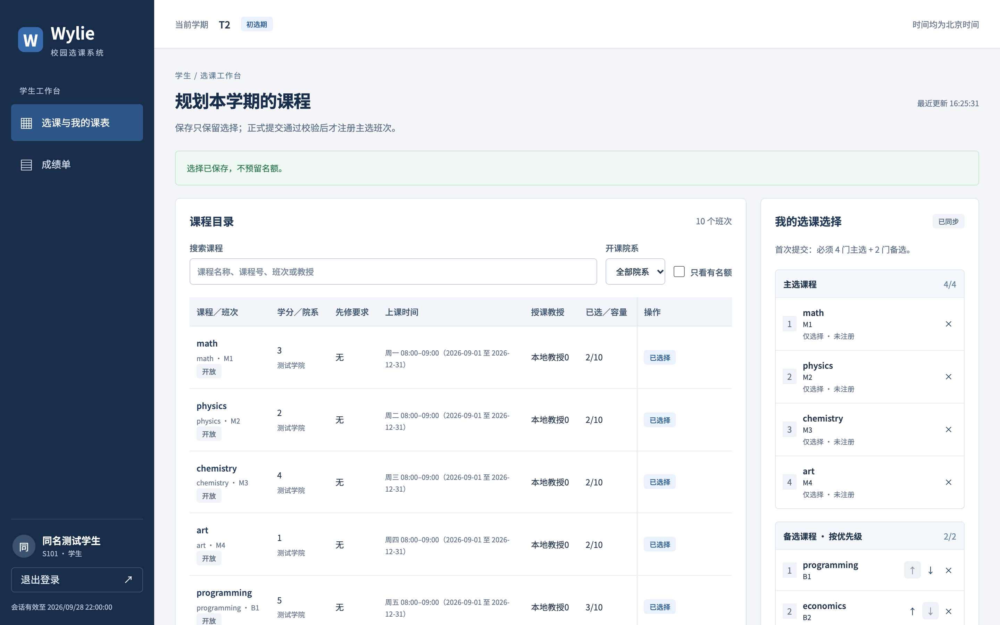
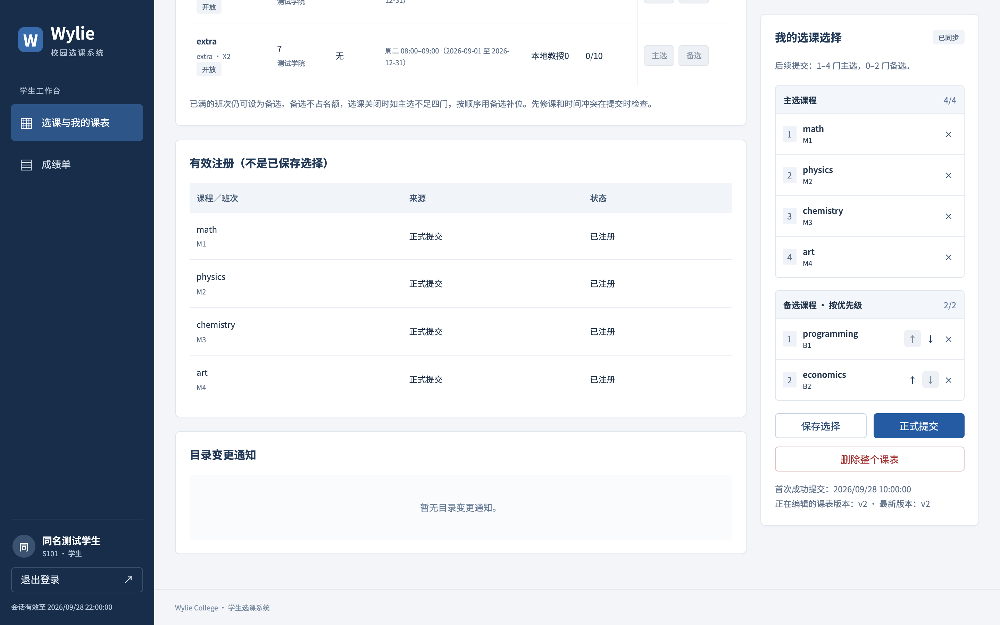
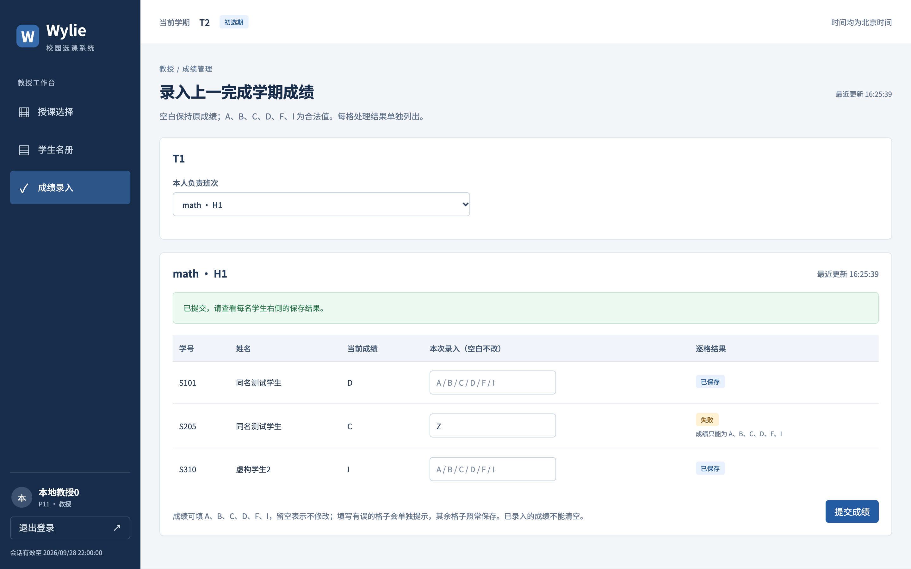
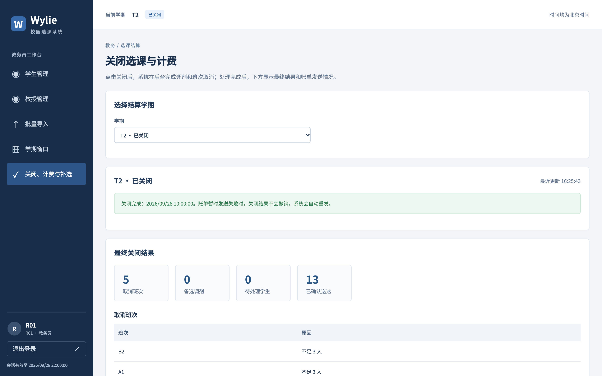

# Wylie 学生选课系统用户操作手册

- 版本：v0.1，2026-10-09；US-030／IT-04；用于本组电脑演示和操作查阅。
- 适用角色：学生、教授、教务员。入口由演示人员提供；本机默认是 `http://localhost:5173`。
- 本文图片来自实际页面及隔离的虚构数据，2026-10-09 在 macOS Chrome 采集。T1／T2、账号和课程是测试示例；页面业务时钟固定在 09-28，页面时间不代表拍摄日期。实际演示以自己的学期和账号为准。

## 1. 登录与通用操作

1. 打开入口，在登录页输入分配的账号和密码。
2. 首次登录若要求修改密码，按页面提示输入旧密码、新密码及确认密码；成功后继续。
3. 左侧导航只显示本角色能使用的功能。页面顶部显示当前学期和阶段，时间按北京时间显示。
4. 操作后的提示和表格结果一起核对。出现“服务器版本已变化”时，先比较本地编辑与服务器数据，再采用服务器版本或重新编辑。
5. 演示完点击左下角“退出登录”。切换角色时使用另一账号重新登录。

初始密码由环境负责人私下提供。正式演示前完成首次改密，不把密码放进讲稿或截图。

## 2. 学生：选课与成绩查询

### 2.1 保存选择

1. 打开“选课与我的课表”，确认处于初选期或加退选期。
2. 在课程目录查看班次、上课时间、先修要求、教授及人数，点击“主选”或“备选”。
3. 在本地选择区调整和移除班次，备选顺序决定关闭时尝试补位的先后。
4. 点击“保存选择”，看到“选择已保存，不预留名额”。下方“有效注册”不会因保存而增加。



图 1：选择已保存；保存便于之后继续编辑，名额要等正式提交成功才取得。

### 2.2 正式提交、加退选与删除

1. 首次正式提交准备 **4 个主选＋2 个备选**；后续更新允许 **1—4 个主选＋0—2 个备选**。
2. 点击“正式提交”，核对确认框后点击“确认”。
3. 成功后在“有效注册”查看实际取得的班次。备选不占名额，额满班次仍可作为备选。
4. 加退选时编辑整份选择后再次正式提交。任一规则失败时，原注册保持不变；根据“额满”“先修未满足”“时间冲突”等提示修改后重试。
5. 需要清空整份课表时使用“删除整个课表”并确认；此操作也移除有效注册。之后重新提交按首次 4＋2 要求处理。



图 2：正式提交后的四个有效注册。核对注册区即可判断是否真正选课成功。

关闭选课后，学生不能再修改；主选不足四门时系统按已提交的备选顺序尝试调剂。无教授班次和最终不足三人的班次会取消；最后一次人数取消后不再调剂。仍需补选时联系教务员。

### 2.3 查询成绩

点击“成绩单”，查看最近一个已完成学期的课程与成绩；需要重新读取时点击“刷新成绩”。本页只显示本人数据。空成绩表示尚未录入，I 表示未完成，不作为先修及格成绩。

## 3. 教授：授课、名册与成绩

### 3.1 选择授课班次

1. 打开“授课选择”，在允许修改的阶段查看可授课目录。
2. 点击“选择授课”，加入本地安排；用“取消选择”移除不再负责的班次。
3. 点击“保存授课安排”并确认，系统检查授课资格、班次归属及完整安排的时间冲突。
4. 成功后核对保存结果。取消已经保存的班次会释放授课归属。

### 3.2 查看学生名册

打开“学生名册”，选择本人负责的班次。名册列出有效注册学生；学生仅保存选择或列作备选时不会进入名册。

### 3.3 录入与修改成绩

1. 打开“成绩录入”，选择上一已完成学期的本人班次。
2. 按学生填写 A、B、C、D、F 或 I。留空表示保留原成绩；已录入成绩不能用空白清除。
3. 点击“提交成绩”并确认。
4. 查看每个学生右侧“逐格结果”。合法格可以保存，非法格显示失败并保留输入；修正失败格后重新提交。



图 3：D 和 I 保存成功；Z 被拒绝，该学生原有 C 保留。顶部成功提示表示请求已处理，最终结果要逐格查看。

## 4. 教务：人员、窗口、关闭与补选

### 4.1 维护人员

1. 在“学生管理”或“教授管理”搜索人员，使用“新增学生／教授”或列表中的编辑入口。
2. 按表单填写资料。修改状态时先检查影响预览，再确认；出现过期提示时重新读取并预览。
3. 停用账号会撤销会话，人员状态变化可能清理相关开放学期记录，两项操作的影响以确认框为准。
4. 新建成功后私下交付一次性初始凭据，再点击“已安全交付，关闭显示”。

### 4.2 批量导入

1. 打开“批量导入”，选择学生、教授、历史成绩或授课资格类型。
2. 按页面对应模板准备 xlsx：首个工作表首行是字段名；日期使用 YYYY-MM-DD，编号和 SSN 使用文本保留前导零。
3. 选择文件，点击“检查并导入”并确认。
4. 核对成功、跳过、拒绝的数量及逐行原因。修正失败行后重试，已存在的数据不会因此被覆盖。
5. 新建人员的初始密码交付后点击“已交付，隐藏全部初始密码”，再进行演示截图。


图 4：一行成功、一行因已存在跳过、一行因字段无效拒绝；截图前已隐藏密码。

### 4.3 设置学期窗口

1. 打开“学期窗口”并选择学期。
2. 输入授课选择开始、初选起止、加退选起止等时间，按页面提示保持先后顺序。
3. 保存并确认，核对顶部阶段与窗口结果。时间区间包含开始时刻、不包含结束时刻。

已关闭的学期不能通过修改窗口重新开放。演示窗口已过期时，先由教务检查是否仍可合法调整；不要修改电脑时钟。

### 4.4 关闭选课并查看计费

1. 打开“关闭、计费与补选”，核对“选择结算学期”。
2. 点击“关闭选课”并确认。进入关闭中后等待页面刷新，查看最终关闭结果。
3. 核对取消班次、调剂和待处理学生。关闭会生成每名学生的完整账单，没有课程的学生为零元。
4. 向下查看计费发送列表，用学号／姓名辨认学生，并核对金额与发送状态。
5. 计费服务暂不可用时，关闭结果保留，失败账单每 60 秒重试。恢复后确认“已确认送达”；这里是课程模拟计费，无真实扣款。



图 5：关闭完成及账单确认数量。本图场景没有触发调剂，数字随演示数据变化。

### 4.5 关闭后补选

在同页“关闭后教务补选”中输入学生编号或姓名并“查找”，选中学生后核对当前注册；为仍在读、主选不足四门的学生点击“补选此班次”并确认。系统继续检查教授、容量、先修、时间和同课程限制。成功后核对注册和新账单版本，金额以最新完整账单为准。

## 5. 常见问题

| 提示或现象 | 处理 |
| --- | --- |
| 保存了但名册中没有本人 | 到“有效注册”核对，完成正式提交 |
| 班次额满、时间冲突或先修不满足 | 按问题提示调整完整主选；失败不会替换原注册 |
| 本地与服务器版本不同 | 核对变更后采用服务器版本，再重新编辑；不要连续点击旧确认框 |
| 阶段不允许写入 | 检查顶部阶段和北京时间窗口，必要时联系教务 |
| 目录暂不可用 | 稍后刷新；页面已有列表不代表外部目录已恢复 |
| 导入有成功也有失败 | 根据逐行结果修正；不需要重复新建已经成功的人员 |
| 成绩提交后部分失败 | 看逐格结果，合法格已保存；改正非法格再提交 |
| 账单处于重试 | 等待自动重发并检查模拟计费服务，无需再次关闭学期 |
| 密码失效或账号被停用 | 联系教务／环境负责人；重跑初始化不会重置密码 |

## 附录 A. 演示环境准备

准备 Node.js 22.12+、npm 10.9.9、Docker Engine／Compose。下列命令在项目根目录执行；详细配置、无 Docker 的 orb 路径和持久化说明见 [开发运行指南](DEVELOPMENT.md)。

```sh
npm ci
npm run env:local
docker compose up -d --wait postgres
docker compose exec postgres createdb -U wylie wylie_test
npm run db:generate
npm run db:migrate
npm run db:migrate:test
npm run db:seed
npm run dev
```

`createdb` 仅首次需要；数据库已存在时跳过，保留原数据。开发入口默认 `http://localhost:5173`；`.local/demo-credentials.json` 保存本机随机初始凭据，由环境负责人读取并分配。seed 只对全新演示库写数据，已有账号或学期时跳过。演示前检查学期窗口及三角色账号，不能靠反复 seed 回到初始状态。

演示结束在开发终端按 Ctrl+C 停止应用；数据库持久化，关闭 Compose 时保留 volume。独立机器与 Windows 浏览器复现仍按测试计划执行。

## 附录 B. 截图与验证范围

截图脚本为 [capture-manual.ts](../scripts/capture-manual.ts)，使用生产构建、独立虚构夹具和临时 HTTP 服务，结束时关闭浏览器／服务并清理夹具。复现命令：

```sh
npm run build
node --env-file-if-exists=.env node_modules/tsx/dist/cli.mjs scripts/capture-manual.ts
```

需本机 Chrome、`agent-browser` CLI 和已迁移的独立测试库；输出在 ignored 的 `tmp/manual-screenshots/`，只将审阅后的 PNG 复制到本文图片目录。脚本断言保存无注册、提交生成四门、冲突保持原状、合法／非法成绩分别处理以及账单全部确认。本轮截图操作和浏览器回归由 Agent 执行；成员真人 Alpha 试用使用 [记录模板](testing/alpha-session-template.md) 另行组织。
