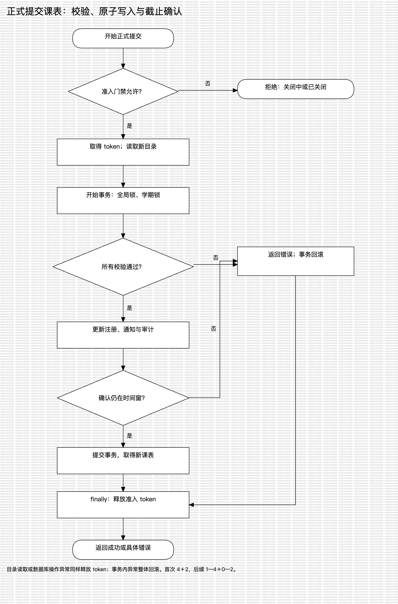
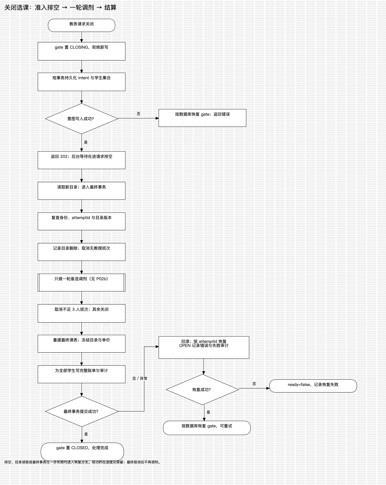
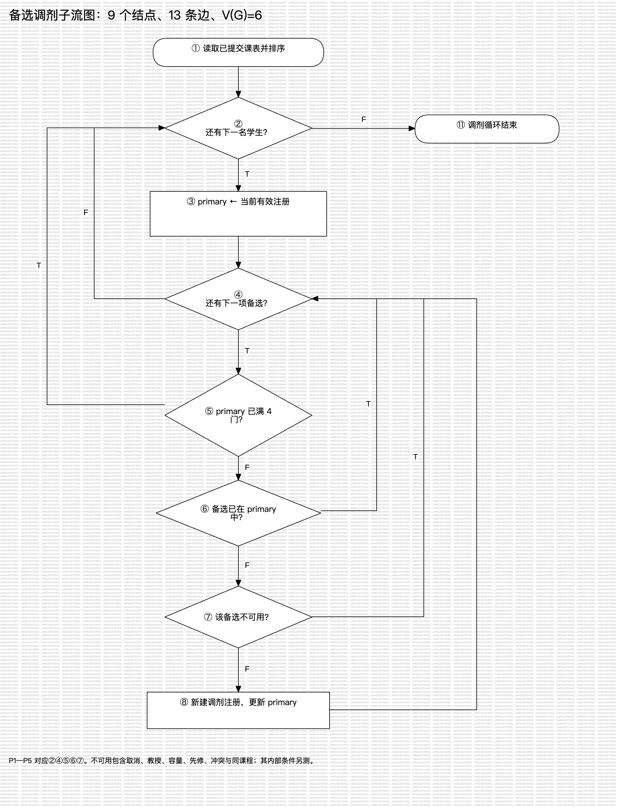
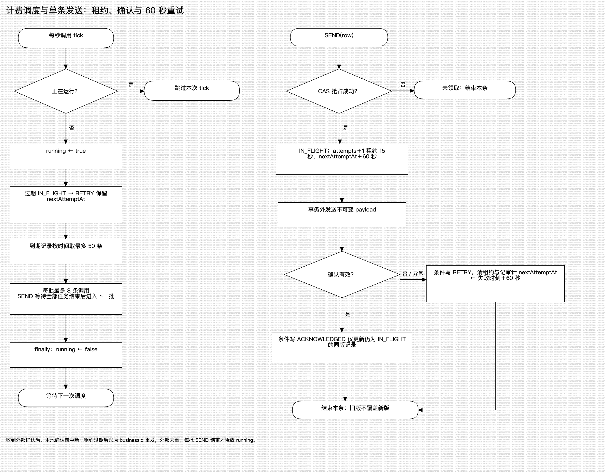

# 核心算法的过程设计

- 版本：v0.1，2026-10-09；关联 US-030／IT-04。
- 依据：课件 6.2 过程设计工具、6.4 程序复杂度；按当前实现整理。
- 图形入口：[StarUML 原生模型](models/course-methods.mdj)。采用原生 Flowchart 的处理框、判定框与带条件的控制流表示程序流程；事务失败边界另在伪代码中展开。PNG 保留本机 StarUML 试用版导出的水印。

## 1. 正式提交课表

输入：已认证学生、学期、期望版本、完整主选与备选数组。输出：成功后的课表；失败时返回具体规则问题，原有注册保持不变。前置规则为首次 4＋2，后续 1—4 主选／0—2 备选，容量上限 10。



源代码：[ScheduleService.write](../../apps/api/src/modules/schedules/service.ts)。下列 PDL 只展开 `mode=SUBMIT`，保存和删除仍共用源码中的事务入口。

```text
PROCEDURE SUBMIT(actor, termId, expectedVersion, choices)
    token ← 准入门禁.admit(termId)                 // 新请求遇关闭即拒绝
    TRY
        snapshot ← 读取并应用新目录(token)          // 此时不持有业务写事务锁
        BEGIN TRANSACTION（全局锁、学期锁）
            重新验证学生身份与状态
            读取学期；若 CLOSED 或当前不在可写时间窗则失败
            existing ← 读取本学生本学期课表
            若 existing.version（不存在则为 0）≠ expectedVersion 则失败
            验证 snapshot.revision 仍是当前镜像版本
            验证数量、重复班次
            验证主选：存在、开放、先修、时间、同课程、容量
            验证备选：存在、开放、先修；不因额满或时段冲突拒绝
            若问题含 OFFERING_FULL 则返回额满错误；其余问题返回规则错误
            若课表不存在则创建
            把不再选择的有效注册标记 REMOVED；为新增主选写注册
            保留原有有效注册；解决适用的目录变更通知；写审计
            confirmationAt ← 数据库真实时钟（测试使用注入时钟）
            条件更新课表：保存本次完整选择，版本＋1
                首次提交时间仅在尚未提交时写入
                WHERE confirmationAt 位于初选或加退选的左闭右开区间
            若没有行被更新则抛出 PHASE_FORBIDDEN
            读取更新后的课表
        COMMIT                                 // 错误使本事务全部回滚
        RETURN 课表
    FINALLY
        token.release()
END PROCEDURE
```

两次时间检查有不同职责：前一次尽早拒绝，最后一次决定能否提交。通过准入后发生提前关闭，已在途请求可以继续；自然截止仍以最后的条件更新为准。`studentWindow()` 只判断时间，关闭门禁由调用链负责。满班计数排除本人，因此保留已注册的满班不会被误拒绝。

验证对应：数量与时间见 [黑盒设计](../testing/test-design-methods.md)；AC-08 验证最后名额竞争，AC-10 验证失败原子性，AC-47／64 验证版本冲突，AC-50 验证确认点跨截止，BV-C3 验证满班中的本人重新提交。

## 2. 关闭选课与一轮调剂

输入：教务身份、学期。立即输出“正在关闭”；最终输出取消班次、调剂结果、未解决问题及账单发送状态。关闭处理中的课表、注册、学期结果和待发送账单必须一起提交。



源代码：[CloseService.request／finish](../../apps/api/src/modules/terms/close.ts)。

```text
PROCEDURE REQUEST_CLOSE(actor, termId)
    验证教务身份；同步把 gate 置为 CLOSING，拒绝新写
    attemptId ← 新标识
    BEGIN SHORT TRANSACTION                    // 不等待普通全局写锁
        重新验证身份
        CAS：仅把 OPEN 改为 CLOSING，保存 attemptId、版本＋1
        写关闭请求审计；读取本次需要出账的全部学生 id
    COMMIT
    若失败则按数据库状态恢复 gate，并返回错误
    启动 FINISH_CLOSE 后台任务；RETURN 202 / CLOSING
END PROCEDURE

PROCEDURE FINISH_CLOSE(actor, termId, attemptId, students)
    TRY
        等待所有已准入请求释放 token             // 不持有业务写事务锁
        snapshot ← 获取新目录
        BEGIN TRANSACTION（全局锁、学期锁）
            验证身份、CLOSING、attemptId、目录版本
            对目录已删除班次记录取消原因
            取消无教授班次并移除其有效注册
            schedules ← 已提交课表，按首次提交时间、学号升序
            FOR EACH schedule IN schedules
                primary ← 当前有效注册
                FOR EACH alternate IN 已提交的有序备选
                    IF primary 数量 ≥ 4 THEN BREAK
                    IF alternate 已在 primary THEN CONTINUE
                    验证加入 alternate 后的容量、教授、开放、先修、时间与同课程规则
                    IF alternate 有问题 THEN CONTINUE
                    新建 LEVELING 注册；更新 primary；记录备选位置
                END FOR
            END FOR
            对仍有教授且未被目录删除的每个班次重新计数
                IF 人数 < 3 THEN 取消班次并移除注册
                ELSE 班次置为 CLOSED
            不再开始第二轮调剂
            剩余 ENROLLED 注册置为 COMMITTED
            用最终有效注册更新课表；丢弃未提交编辑；收集未解决问题
            学期置为 CLOSED；冻结目录、单价和关闭结果
            FOR EACH student IN students
                按最终有效课程生成完整账单（包括零元），写入 outbox
            END FOR
            写完成审计
        COMMIT
        gate ← CLOSED
    CATCH error
        最终业务事务回滚
        另起恢复事务：仅匹配本次 attemptId 的 CLOSING 改回 OPEN
        保存关闭错误与失败审计；按数据库状态恢复 gate
        若恢复事务也失败：ready ← false，保留脱敏错误日志
END PROCEDURE
```

先调剂、后取消不足三人的班次，是算法的关键顺序。原有两人的班次可能因调剂达到三人；若在调剂前取消，会改变需求。关闭失败只撤销本次最终事务，已经成功的在途提交保留。`result.leveled` 记录调剂动作，最终名册还需经过人数取消步骤。



调剂子图沿用 [测试设计第 4.2 节](../testing/test-design-methods.md#42-基本路径测试关闭选课的备选调剂循环) 的 ①—⑧、⑪：9 个结点、13 条边、5 个判定，V(G)=13−9＋2=5＋1=6；五个封闭区域加外部区域也是 6。只把“该备选不可用”视为一个判定，其内部各规则通过黑盒与集成测试另验。整个关闭事务比这个子图复杂，不可用六条路径宣称覆盖全部关闭逻辑。

验证对应：AC-28 在途排空、AC-29 人数边界、AC-30—32 备选规则与排序、AC-33／55 回滚、AC-34 零元和完整金额；新增六项基本路径测试逐条对应子图。路径 4 通过直接构造异常数据触发防御分支，正常用户提交无法产生该状态。

## 3. 计费发送与重试

输入：已提交的完整账单版本。输出：已送达、待重试或已被新版替代。系统发送账单给外部计费系统；“已送达”不表示学生已付款。



源代码：[BillingService.tick／send](../../apps/api/src/modules/billing/service.ts)、[后台调度与启动恢复](../../apps/api/src/runtime/start.ts)、[外部确认校验](../../apps/api/src/runtime/external.ts)。

```text
PROCEDURE TICK（后台每秒尝试调度）
    IF running THEN RETURN
    running ← true
    TRY
        now ← 当前业务时间
        将租约已过期的 IN_FLIGHT 改为 RETRY，保留原 nextAttemptAt
        due ← PENDING／RETRY 且 nextAttemptAt ≤ now，按时间最多取 50 条
        以每批最多 8 条并发调用 SEND
        每批等待全部已启动任务结束；任一任务异常再向外报告
    FINALLY
        running ← false
END PROCEDURE

PROCEDURE SEND(row)
    claimedAt ← 当前时间
    CAS 抢占 row：仅 PENDING／RETRY 可改为 IN_FLIGHT
        attempts＋1；leaseUntil ← claimedAt＋15 秒
        nextAttemptAt ← claimedAt＋60 秒
    IF 抢占失败 THEN RETURN
    TRY
        在数据库事务外发送不可变 payload
        验证外部确认的 businessId、version、latestVersion 与语义
    CATCH 外部失败
        BEGIN TRANSACTION
            仅当仍为 IN_FLIGHT：改为 RETRY，清租约
            nextAttemptAt ← 失败时刻＋60 秒；记录错误及审计
        COMMIT
        RETURN
    在短事务内：仅匹配 id、version 且仍为 IN_FLIGHT 时写 ACKNOWLEDGED
    清租约与错误，保存确认时间和审计
END PROCEDURE
```

收到外部确认后、本地写确认前进程中断，会在租约到期后用同一 `businessId` 重发，外部负责去重。补选生成完整新版本，并将旧版标记 `SUPERSEDED`；迟到的旧确认不覆盖新版。60 秒是允许重试的最早时间，实际执行还受一秒轮询、队列和网络耗时影响。

验证对应：AC-35／36 包含真实等待与进程重启；AC-54／57／62 验证完整新版本、零元及乱序；后端批次屏障验证计费堵塞不阻塞目录同步。

## 4. 复杂度与测试对策

运行 `node scripts/complexity-report.mjs --min=1`。计数口径见脚本及 [测试设计](../testing/test-design-methods.md#5-环形复杂度度量)：嵌套回调独立统计，SQL 内部条件未展开，不能把外层包装函数的低分当作整个算法简单。

| 对象 | 判定数 | V(G) | 解释与测试重点 |
| --- | --- | --- | --- |
| `ScheduleService.write` 外层 | 1 | 2 | DELETE／读取目录选择；核心在事务回调 |
| 同函数的事务回调 | 22 | 23 | SAVE／SUBMIT／DELETE 共用；按操作模式、时间、版本和容量分组测试 |
| `CloseService.request`／`finish` 外层 | 1／3 | 2／4 | intent 失败、恢复失败；核心调剂在事务回调 |
| `finish` 的最终事务回调 | 18 | 19 | 取消、调剂、重建、出账；故障注入验证整体回滚 |
| 调剂子流图 | 5 | 6 | 三种算法一致，六条独立路径见图与测试 |
| `BillingService.tick`／`send` | 3／2 | 4／3 | 低复杂度仍有时间、并发与恢复风险，需集成测试 |
| `choiceIssues` | 9 | 10 | 复合短路条件多，以数量等价类和重复值覆盖 |

图形按业务步骤分组表达，计数按源码或明确抽取的子流图进行；两种抽象层次分别注明。SQL、外部系统时序和异常传播不靠单一复杂度数字衡量。

## 5. 模型维护与导出

用 StarUML 7.1.1 打开 `models/course-methods.mdj` 可编辑各动作、判定和控制流。四张过程图及一张顶层数据流图共用这个模型。导出示例：

```sh
/Applications/StarUML.app/Contents/MacOS/StarUML image \
  docs/design-docs/models/course-methods.mdj -f png \
  -o 'docs/design-docs/images/<%=filenamify(element.name)%>.png'
```

导出保留软件试用水印；PNG 合成白底便于印刷，内容修改应回到模型。图中普通动作的数据库错误均进入对应伪代码的异常路径，箭头未枚举每一次数据库调用可能抛错。
