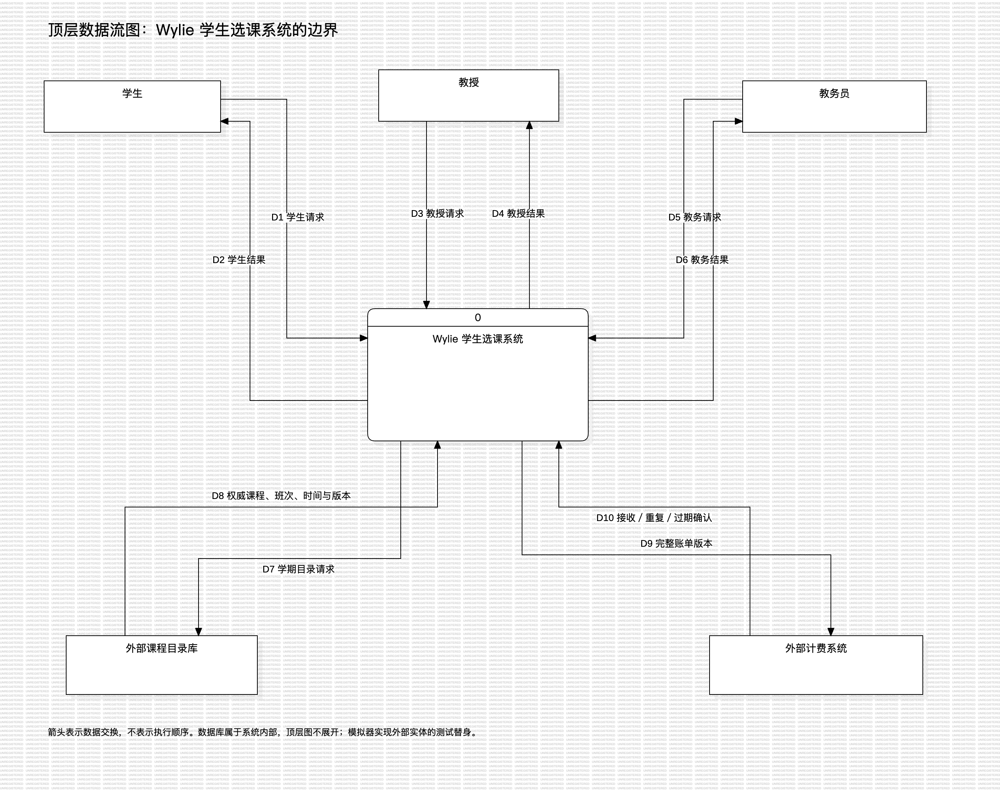

# 数据字典与顶层数据流图

- 版本：v0.1，2026-10-09；关联 US-030／IT-04，为需求分析的附录入口。
- 依据：课件 4.7；[Prisma schema](../../packages/db/prisma/schema.prisma)、[SQL 约束](../../packages/db/prisma/migrations/202610050002_constraints/migration.sql)、[共享契约](../../packages/contracts/src/index.ts)、[API 契约](api-contract.md)。
- 需求层说明含义与约束；第 5 节补充当前存储字段以便逐表核对，关系导航属性不当作额外数据库列。

## 1. 记法

| 符号 | 含义 | 示例 |
| --- | --- | --- |
| `=` | 定义为 | 课表选择＝主选集合＋备选序列 |
| `+` | 由各部分组成 | 登录请求＝账号＋密码 |
| `[ A \| B ]` | 从备选项中选择一项 | 成绩＝[ A \| B \| C \| D \| F \| I ] |
| `m{ X }n` | X 重复 m 至 n 次 | 后续主选＝1{班次编号}4 |
| `( X )` | 可选部分 | 失败结果＝错误码＋提示＋(当前版本) |
| `* ... *` | 注释或约束 | *主选与备选中同班次不重复* |

API 中“字段缺失”和“字段为 null”并不总是等价；下面的可选记法表达业务上可无此值，传输细节仍以严格 Zod 契约为准。数组数量约束在业务校验中实施，结构解析成功不代表满足 4＋2 等规则。

## 2. 主要数据项

| 数据项 | 表示／取值 | 约束与解释 |
| --- | --- | --- |
| 本地实体编号 | UUID 字符串 | 学生、教授、学期、课表、账单等内部主键；不替代学号／工号 |
| 外部课程／班次编号 | 长度 1—200 的字符串 | 不含空白和冒号；由目录权威分配；不强制 UUID |
| 学号／工号 | 文本，默认 S／P＋序列编号 | 唯一且作为账号；新建由数据库序列分配；不可通过修改资料更换账号 |
| 姓名／系别 | 非空文本 | 写入前去首尾空格；同名允许，展示时结合学号／工号 |
| 社会安全号码 ssn | API 长度 1—64 的文本 | Student 与 Professor 各表唯一，PersonIdentity 再保证跨角色唯一；页面返回脱敏值 |
| 出生／毕业日期 | `YYYY-MM-DD`／SQL DATE | 出生日期必填，毕业日期可空；日期必须真实存在 |
| 时间戳 | ISO 时间串／TIMESTAMPTZ(3) | 精确到毫秒；业务显示按 Asia/Shanghai，比较使用同一时刻尺度 |
| 星期 | 整数 1—7 | 周一至周日；UTC 日期计算中的 0 换算为 7 |
| 当天时段 | 开始 0—1439、结束 1—1440 分钟 | 开始＜结束；相邻端点不冲突；日期区间包含两端 |
| 学分 | API 非负十进制文本，最多 3 位整数与 2 位小数 | 存储 Decimal(5,2)；不使用二进制浮点累计 |
| 金额／单价 | API 非负十进制文本，最多 10 位整数与 2 位小数 | 存储 Decimal(12,2)；总学分乘单价后只舍入一次，half-up |
| 期望版本 | API 非负安全整数 | 与当前实体版本相等才可写；数据库 Int 存储，实体版本通常从 1 开始，课表／授课版本从 0 开始 |
| 成绩 | A、B、C、D、F、I 或未录入 | A—D 满足先修；F 不及格；I 未完成；null 为尚无成绩，录入空值不覆盖旧值 |
| 关闭状态 | OPEN、CLOSING、CLOSED | 选课关闭不代表学期已完成 |
| 注册状态 | ENROLLED、COMMITTED、REMOVED | 前两种是有效注册；REMOVED 留历史，不计名额 |
| 账单状态 | PENDING、IN_FLIGHT、RETRY、ACKNOWLEDGED、SUPERSEDED | 待发、在途、重试、已送达、已替代；不记录学生实际支付状态 |

## 3. 数据结构定义

```text
学生资料 = 学生编号 + 学号 + 姓名 + 出生日期 + ssn + 学生状态 + (毕业日期) + 版本
学生状态 = [ ACTIVE | SUSPENDED | GRADUATED ]
教授资料 = 教授编号 + 工号 + 姓名 + 出生日期 + ssn + 教授状态 + 系别 + 版本
教授状态 = [ ACTIVE | DEPARTED ]
学期阶段 = 授课开始 + 初选开始 + 初选结束 + 加退选开始 + 加退选结束
*授课开始 ≤ 初选开始 < 初选结束 ≤ 加退选开始 < 加退选结束；可写窗口左闭右开*

时段 = 星期 + 开始分钟 + 结束分钟 + 开始日期 + 结束日期
课程 = 课程编号 + 名称 + 系别 + 学分 + 0{先修课程编号}n
班次 = 班次编号 + 学期编号 + 课程编号 + 0{时段}n + (教授) + 开放状态
目录快照 = 学期编号 + revision + 0{课程}n + 0{外部班次}n
*外部班次只含目录权威字段；本地教授、人数、取消状态由 API 投影合成*

课表选择 = 主选集合 + 有序备选
保存选择 = 0{主选班次编号}4 + 0{备选班次编号}2
首次提交选择 = 4{主选班次编号}4 + 2{备选班次编号}2
后续提交选择 = 1{主选班次编号}4 + 0{备选班次编号}2
*整份选择无重复班次；主选不能重复课程；备选先后次序参与调剂*
课表 = 学生编号 + 学期编号 + 版本 + exists + (首次提交时间)
     + 最近保存选择 + (最后提交选择) + 0{有效注册}4
有效注册 = 班次编号 + 来源 + [ ENROLLED | COMMITTED ]
来源 = [ SUBMIT | LEVELING | SUPPLEMENT ]

账单课程 = 班次编号 + 课程编号 + 课程名称快照 + 学分
完整账单 = businessId + 学生编号 + 学号 + 学生姓名 + 学期编号 + 版本
         + 关闭时间 + 0{账单课程}4 + 每学分单价 + 总学分 + 总金额
*businessId = 学期编号:学生编号:版本；每个新版都包含完整课程与金额*
计费确认 = businessId + 版本 + latestVersion + [ APPLIED | DUPLICATE | STALE ]

问题 = 错误码 + 提示 + (字段) + (班次编号) + (学生编号) + (行号)
失败结果 = requestId + 错误码 + 提示 + 0{问题}n + (当前版本) + retryable
成功结果 = requestId + serverTime + 业务数据
```

首次 4＋2 等式约束的是提交输入；关闭取消后有效课程可能不足四门甚至为零，不能把输入数量约束硬套到关闭后的结果。历史成绩允许没有本系统班次编号，`GradeRecord.offeringId` 可空。

## 4. 顶层数据流与建模取舍

项目主线采用面向对象分析：用例图描述角色目标，类图描述领域关系，顺序图和状态图描述协作与状态变化。补充顶层环境图便于检查外部边界；不再为同一业务重复展开一整套分层 DFD，避免两套详细模型各自变化。



[可编辑 StarUML 模型](models/course-methods.mdj) 中为原生 DFDDiagram。顶层只有一个加工“0 Wylie 学生选课系统”；内部数据库不画作外部实体。目录和计费模拟是外部实体的测试替身，其故障控制接口不属于用户业务数据流。

| 编号 | 起点 → 终点 | 数据流定义／主要约束 |
| --- | --- | --- |
| D1 | 学生 → 系统 | [登录请求 \| 保存选择＋期望版本 \| 提交选择＋期望版本 \| 删除确认＋期望版本 \| 本人成绩查询] |
| D2 | 系统 → 学生 | [认证结果 \| 目录投影 \| 本人课表 \| 目录通知 \| 上一已完成学期成绩单 \| 失败结果] |
| D3 | 教授 → 系统 | [登录请求 \| 授课班次集合＋期望版本 \| 本人班次名册查询 \| 0{学生编号＋成绩输入}n] |
| D4 | 系统 → 教授 | [认证结果 \| 可授课目录 \| 授课结果 \| 有效名册 \| 逐格成绩结果 \| 失败结果] |
| D5 | 教务 → 系统 | [登录请求 \| 人员资料／修改／删除请求 \| XLSX 文件 \| 学期阶段＋期望版本 \| 关闭确认 \| 学生＋班次＋期望版本的补选请求] |
| D6 | 系统 → 教务 | [认证结果 \| 人员及影响预览 \| 一次性初始凭据 \| 逐行导入结果 \| 学期／关闭结果 \| 账单送达状态 \| 失败结果] |
| D7 | 系统 → 目录库 | 学期编号；经授权查询只读快照 |
| D8 | 目录库 → 系统 | 完整目录快照；有效空快照与访问失败严格区分 |
| D9 | 系统 → 计费系统 | 完整账单；同一 businessId 重试不变，补选产生新版本 |
| D10 | 计费系统 → 系统 | 计费确认；校验 businessId、version 与 latestVersion；通信失败进入重试处理 |

所有角色的登录／改密／退出共享认证接口，图中按角色归并；不因重复显示而多计系统功能。SSN、密码和认证 token 不进入教学截图与日志证据。

## 5. 数据存储字典

以下按当前 schema 逐表列出全部存储列（18 表、11 枚举）。`?` 表示 SQL 可空；关联对象／数组是 Prisma 导航属性，不重复列入。统一规则：UUID 主键由应用／ORM 默认生成；`createdAt` 默认当前时间，`updatedAt` 由 ORM 维护；JSON 的业务结构见第 3 节及 contracts。表内列级约束之外，还有本节末尾列出的跨行／跨表约束。

### 5.1 Account

账户与单角色身份；保存口令散列，不能返回明文原密码。

| 存储列 | 类型 | schema 列级定义 |
| --- | --- | --- |
| `id` | `String` | `@id @default(uuid()) @db.Uuid` |
| `account` | `String` | `@unique` |
| `passwordHash` | `String` | — |
| `role` | `Role` | — |
| `enabled` | `Boolean` | `@default(true)` |
| `mustChangePassword` | `Boolean` | `@default(true)` |
| `studentId` | `String?` | `@unique @db.Uuid` |
| `professorId` | `String?` | `@unique @db.Uuid` |
| `createdAt` | `DateTime` | `@default(now()) @db.Timestamptz(3)` |
| `updatedAt` | `DateTime` | `@updatedAt @db.Timestamptz(3)` |

### 5.2 Session

持久化会话；只保存 token 摘要，支持撤销与到期。

| 存储列 | 类型 | schema 列级定义 |
| --- | --- | --- |
| `id` | `String` | `@id @default(uuid()) @db.Uuid` |
| `tokenHash` | `String` | `@unique` |
| `csrfHash` | `String` | — |
| `accountId` | `String` | `@db.Uuid` |
| `expiresAt` | `DateTime` | `@db.Timestamptz(3)` |
| `createdAt` | `DateTime` | `@default(now()) @db.Timestamptz(3)` |

组合键／索引：`@@index([accountId])`；`@@index([expiresAt])`。

### 5.3 Student

学生资料与学号；状态变化影响未关闭学期。

| 存储列 | 类型 | schema 列级定义 |
| --- | --- | --- |
| `id` | `String` | `@id @default(uuid()) @db.Uuid` |
| `studentNumber` | `String` | `@unique；数据库序列生成 S／P 编号` |
| `name` | `String` | — |
| `birthDate` | `DateTime` | `@db.Date` |
| `ssn` | `String` | `@unique` |
| `status` | `StudentStatus` | `@default(ACTIVE)` |
| `graduationDate` | `DateTime?` | `@db.Date` |
| `version` | `Int` | `@default(1)` |
| `createdAt` | `DateTime` | `@default(now()) @db.Timestamptz(3)` |
| `updatedAt` | `DateTime` | `@updatedAt @db.Timestamptz(3)` |

### 5.4 Professor

教授资料与工号；资格和授课关联另存。

| 存储列 | 类型 | schema 列级定义 |
| --- | --- | --- |
| `id` | `String` | `@id @default(uuid()) @db.Uuid` |
| `professorNumber` | `String` | `@unique；数据库序列生成 S／P 编号` |
| `name` | `String` | — |
| `birthDate` | `DateTime` | `@db.Date` |
| `ssn` | `String` | `@unique` |
| `status` | `ProfessorStatus` | `@default(ACTIVE)` |
| `department` | `String` | — |
| `version` | `Int` | `@default(1)` |
| `createdAt` | `DateTime` | `@default(now()) @db.Timestamptz(3)` |
| `updatedAt` | `DateTime` | `@updatedAt @db.Timestamptz(3)` |

### 5.5 PersonIdentity

全角色社会安全号码登记；一行必须且只能关联一类人员。

| 存储列 | 类型 | schema 列级定义 |
| --- | --- | --- |
| `ssn` | `String` | `@id` |
| `studentId` | `String?` | `@unique @db.Uuid` |
| `professorId` | `String?` | `@unique @db.Uuid` |

### 5.6 Term

学期日期、选课阶段、关闭意图、结算快照与版本。

| 存储列 | 类型 | schema 列级定义 |
| --- | --- | --- |
| `id` | `String` | `@id @default(uuid()) @db.Uuid` |
| `name` | `String` | — |
| `ordinal` | `Int` | `@unique` |
| `startsAt` | `DateTime` | `@db.Timestamptz(3)` |
| `endsAt` | `DateTime` | `@db.Timestamptz(3)` |
| `isLaunchTerm` | `Boolean` | `@default(false)` |
| `teachingStartsAt` | `DateTime` | `@db.Timestamptz(3)` |
| `initialStartsAt` | `DateTime` | `@db.Timestamptz(3)` |
| `initialEndsAt` | `DateTime` | `@db.Timestamptz(3)` |
| `addDropStartsAt` | `DateTime` | `@db.Timestamptz(3)` |
| `addDropEndsAt` | `DateTime` | `@db.Timestamptz(3)` |
| `closeState` | `CloseState` | `@default(OPEN)` |
| `version` | `Int` | `@default(1)` |
| `closedAt` | `DateTime?` | `@db.Timestamptz(3)` |
| `closeAttemptId` | `String?` | `@db.Uuid` |
| `lastCloseError` | `Json?` | — |
| `closeResult` | `Json?` | — |
| `closedCatalogSnapshot` | `Json?` | — |
| `pricePerCreditYuan` | `Decimal?` | `@db.Decimal(12, 2)` |
| `createdAt` | `DateTime` | `@default(now()) @db.Timestamptz(3)` |
| `updatedAt` | `DateTime` | `@updatedAt @db.Timestamptz(3)` |

### 5.7 CatalogSnapshot

每学期一份目录镜像及版本；外部目录仍是权威。

| 存储列 | 类型 | schema 列级定义 |
| --- | --- | --- |
| `termId` | `String` | `@id @db.Uuid` |
| `revision` | `String` | — |
| `payload` | `Json` | — |
| `observedAt` | `DateTime` | `@db.Timestamptz(3)` |

### 5.8 CourseMirror

课程字段的本地镜像；学分与先修取外部快照。

| 存储列 | 类型 | schema 列级定义 |
| --- | --- | --- |
| `externalCourseId` | `String` | `@id` |
| `name` | `String` | — |
| `department` | `String` | — |
| `credits` | `Decimal` | `@db.Decimal(5, 2)` |
| `prerequisiteIds` | `Json` | — |
| `revision` | `String` | — |

### 5.9 Offering

外部班次的本地生命周期、教授归属与删除墓碑；时段存于目录快照。

| 存储列 | 类型 | schema 列级定义 |
| --- | --- | --- |
| `externalOfferingId` | `String` | `@id` |
| `termId` | `String` | `@db.Uuid` |
| `courseId` | `String` | — |
| `status` | `OfferingStatus` | `@default(OPEN)` |
| `cancelReason` | `String?` | — |
| `professorId` | `String?` | `@db.Uuid` |
| `catalogDeleted` | `Boolean` | `@default(false)` |
| `createdAt` | `DateTime` | `@default(now()) @db.Timestamptz(3)` |
| `updatedAt` | `DateTime` | `@updatedAt @db.Timestamptz(3)` |

组合键／索引：`@@index([termId, status])`；`@@index([professorId])`。

### 5.10 TeachingVersion

每教授每学期的授课编辑版本，拒绝迟到的旧请求。

| 存储列 | 类型 | schema 列级定义 |
| --- | --- | --- |
| `professorId` | `String` | `@db.Uuid` |
| `termId` | `String` | `@db.Uuid` |
| `version` | `Int` | `@default(0)` |

组合键／索引：`@@id([professorId, termId])`。

### 5.11 Schedule

最近保存与最后提交分离，删除后保留版本墓碑。

| 存储列 | 类型 | schema 列级定义 |
| --- | --- | --- |
| `id` | `String` | `@id @default(uuid()) @db.Uuid` |
| `studentId` | `String` | `@db.Uuid` |
| `termId` | `String` | `@db.Uuid` |
| `version` | `Int` | `@default(0)` |
| `exists` | `Boolean` | `@default(false)` |
| `firstSubmittedAt` | `DateTime?` | `@db.Timestamptz(3)` |
| `savedChoices` | `Json` | `@default("{\"primaryOfferingIds\":[],\"alternateOfferingIds\":[]}")` |
| `submittedChoices` | `Json?` | — |
| `createdAt` | `DateTime` | `@default(now()) @db.Timestamptz(3)` |
| `updatedAt` | `DateTime` | `@updatedAt @db.Timestamptz(3)` |

组合键／索引：`@@unique([studentId, termId])`。

### 5.12 Registration

有效注册与撤销历史；只有 ENROLLED／COMMITTED 占名额。

| 存储列 | 类型 | schema 列级定义 |
| --- | --- | --- |
| `id` | `String` | `@id @default(uuid()) @db.Uuid` |
| `studentId` | `String` | `@db.Uuid` |
| `offeringId` | `String` | — |
| `source` | `RegistrationSource` | — |
| `state` | `RegistrationState` | `@default(ENROLLED)` |
| `removedReason` | `String?` | — |
| `createdAt` | `DateTime` | `@default(now()) @db.Timestamptz(3)` |

组合键／索引：`@@index([offeringId, state])`；`@@index([studentId, state])`。

### 5.13 TeachingHistory

当前及已结束授课分配；历史不随取消而删除。

| 存储列 | 类型 | schema 列级定义 |
| --- | --- | --- |
| `id` | `String` | `@id @default(uuid()) @db.Uuid` |
| `professorId` | `String` | `@db.Uuid` |
| `offeringId` | `String` | — |
| `createdAt` | `DateTime` | `@default(now()) @db.Timestamptz(3)` |
| `endedAt` | `DateTime?` | `@db.Timestamptz(3)` |

组合键／索引：`@@index([professorId])`；`@@index([offeringId])`。

### 5.14 Qualification

教授可授课程；课程编号来自外部权威。

| 存储列 | 类型 | schema 列级定义 |
| --- | --- | --- |
| `professorId` | `String` | `@db.Uuid` |
| `courseId` | `String` | — |

组合键／索引：`@@id([professorId, courseId])`。

### 5.15 GradeRecord

每学生每课程每学期一项成绩；导入历史可无班次。

| 存储列 | 类型 | schema 列级定义 |
| --- | --- | --- |
| `id` | `String` | `@id @default(uuid()) @db.Uuid` |
| `studentId` | `String` | `@db.Uuid` |
| `termId` | `String` | `@db.Uuid` |
| `courseId` | `String` | — |
| `offeringId` | `String?` | — |
| `value` | `Grade?` | — |
| `source` | `GradeSource` | — |
| `courseNameSnapshot` | `String` | — |
| `updatedByAccountId` | `String?` | `@db.Uuid` |
| `updatedAt` | `DateTime` | `@updatedAt @db.Timestamptz(3)` |

组合键／索引：`@@unique([studentId, courseId, termId])`；`@@index([offeringId])`。

### 5.16 CatalogNotice

目录变化给学生的具体问题通知，可标记已解决。

| 存储列 | 类型 | schema 列级定义 |
| --- | --- | --- |
| `id` | `String` | `@id @default(uuid()) @db.Uuid` |
| `studentId` | `String` | `@db.Uuid` |
| `termId` | `String` | `@db.Uuid` |
| `offeringId` | `String` | — |
| `relatedOfferingId` | `String?` | — |
| `kind` | `NoticeKind` | — |
| `message` | `String` | — |
| `resolved` | `Boolean` | `@default(false)` |
| `revision` | `String` | — |
| `createdAt` | `DateTime` | `@default(now()) @db.Timestamptz(3)` |

组合键／索引：`@@index([studentId, termId, resolved])`。

### 5.17 BillingOutbox

不可变完整账单版本与可变发送状态，支持租约与重试。

| 存储列 | 类型 | schema 列级定义 |
| --- | --- | --- |
| `id` | `String` | `@id @default(uuid()) @db.Uuid` |
| `studentId` | `String` | `@db.Uuid` |
| `termId` | `String` | `@db.Uuid` |
| `version` | `Int` | — |
| `businessId` | `String` | `@unique` |
| `payload` | `Json` | — |
| `amountYuan` | `Decimal` | `@db.Decimal(12, 2)` |
| `status` | `BillingStatus` | `@default(PENDING)` |
| `attempts` | `Int` | `@default(0)` |
| `nextAttemptAt` | `DateTime` | `@default(now()) @db.Timestamptz(3)` |
| `leaseUntil` | `DateTime?` | `@db.Timestamptz(3)` |
| `lastErrorCode` | `String?` | — |
| `acknowledgedAt` | `DateTime?` | `@db.Timestamptz(3)` |
| `createdAt` | `DateTime` | `@default(now()) @db.Timestamptz(3)` |

组合键／索引：`@@unique([studentId, termId, version])`；`@@index([status, nextAttemptAt])`。

### 5.18 AuditEvent

请求或后台业务的最小脱敏审计；账户删除时保留事件。

| 存储列 | 类型 | schema 列级定义 |
| --- | --- | --- |
| `id` | `String` | `@id @default(uuid()) @db.Uuid` |
| `requestId` | `String` | — |
| `actorAccountId` | `String?` | `@db.Uuid` |
| `processName` | `String?` | — |
| `action` | `String` | — |
| `objectType` | `String` | — |
| `objectId` | `String` | — |
| `at` | `DateTime` | `@default(now()) @db.Timestamptz(3)` |
| `result` | `String` | — |
| `errorCode` | `String?` | — |
| `minimalDetails` | `Json` | — |

组合键／索引：`@@index([requestId])`；`@@index([at])`。

### 5.19 枚举全集

| 枚举 | 全部取值 |
| --- | --- |
| Role | STUDENT、PROFESSOR、REGISTRAR |
| StudentStatus | ACTIVE、SUSPENDED、GRADUATED |
| ProfessorStatus | ACTIVE、DEPARTED |
| CloseState | OPEN、CLOSING、CLOSED |
| OfferingStatus | OPEN、CLOSED、CANCELLED |
| RegistrationSource | SUBMIT、LEVELING、SUPPLEMENT |
| RegistrationState | ENROLLED、COMMITTED、REMOVED |
| Grade | A、B、C、D、F、I |
| GradeSource | PROFESSOR、IMPORT |
| NoticeKind | TIME_CONFLICT、PREREQUISITE、OFFERING_DELETED |
| BillingStatus | PENDING、IN_FLIGHT、RETRY、ACKNOWLEDGED、SUPERSEDED |

### 5.20 关系与组合约束

- `Account.studentId`／`professorId` 分别引用人员，角色与人员关联满足 XOR；教务账户不关联这两类人员。Session、GradeRecord 的更新者引用 Account，AuditEvent 的操作者可在账户删除后置空，其余这里列出的外键使用限制删除。
- Schedule、Registration、GradeRecord、CatalogNotice、BillingOutbox 指向对应学生；Schedule、Offering、TeachingVersion、GradeRecord、CatalogNotice、BillingOutbox 指向对应学期；CatalogSnapshot 以学期为一对一主键。
- Offering 的教授、Qualification、TeachingVersion、TeachingHistory 指向教授；Registration、TeachingHistory、GradeRecord 和 CatalogNotice 的班次指向 Offering。课程编号与目录课程镜像间不设强外键，完整性由外部目录校验维护。
- 一个学期最多标记为上线学期；一名学生在一个班次最多有一条有效注册；一个班次最多有一条未结束授课历史。后两项通过带 WHERE 的部分唯一索引实施。
- `CatalogNotice` 的问题键包含可空 `relatedOfferingId`，SQL 使用 `NULLS NOT DISTINCT` 防止空值重复通知。
- `Schedule` 的选择 JSON 只含主备选两个数组，分别最多 4／2 个且整份无重复。`exists=false` 时选择必须为空，提交内容与首次时间必须为空。
- `PersonIdentity` 延迟约束保证 ssn 与真实人员一致；`Account.account` 不可修改；账单 businessId、学生／学期／版本、payload 与金额等业务字段由触发器保护为不可变。
- 容量 10、关闭最少 3 人、先修与冲突不是单列 CHECK 约束，须由业务事务在锁内验证。表结构通过检查不能代替这些业务规则通过。

## 6. 更新规则

字段变更时同时更新 schema、迁移、contracts、本字典与相关 AC；外部目录字段以外部契约为依据。新账单需要新版本，不能为修改显示而重写旧 payload。字典定义与源码发生冲突时，先确认是否有需求变更，再一起修正文档或实现。
