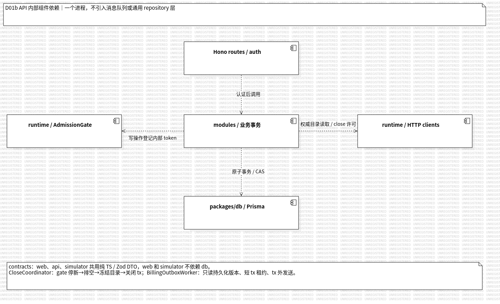
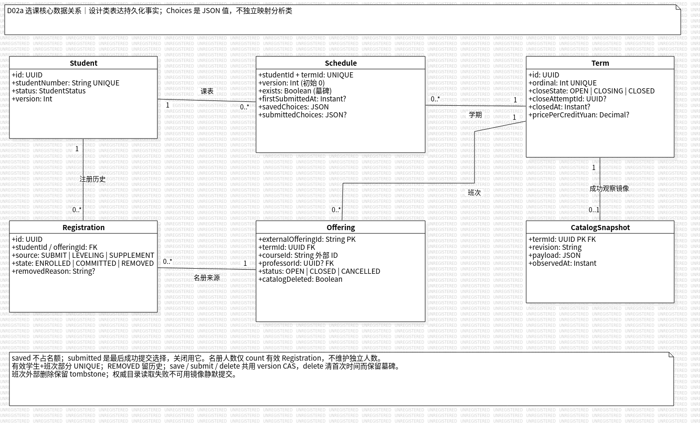
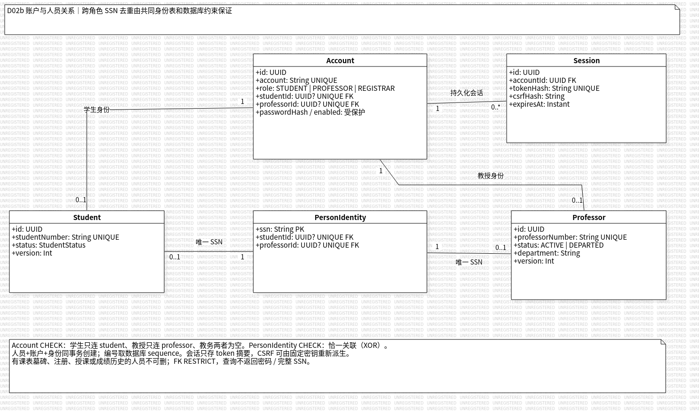
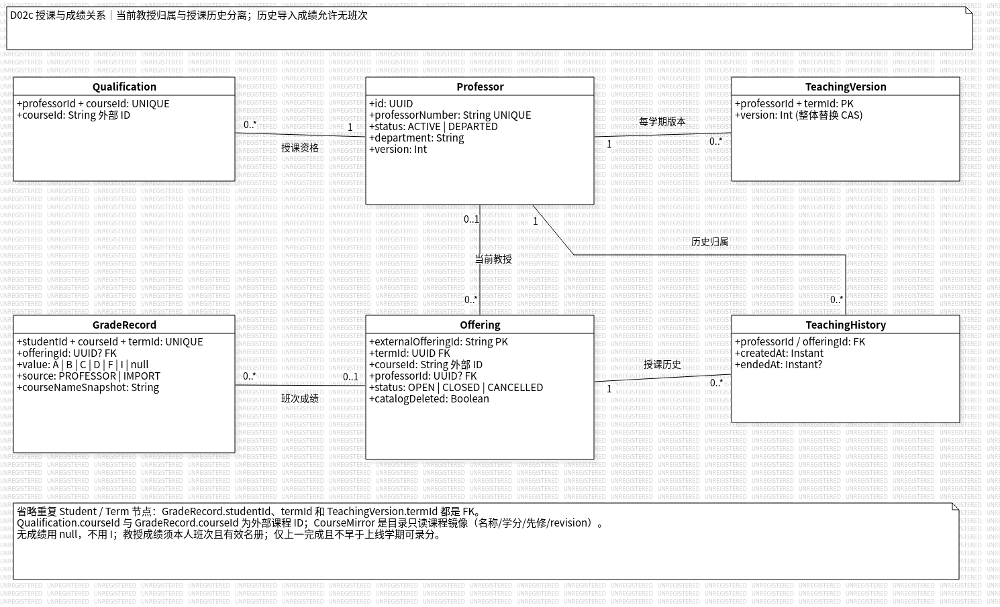
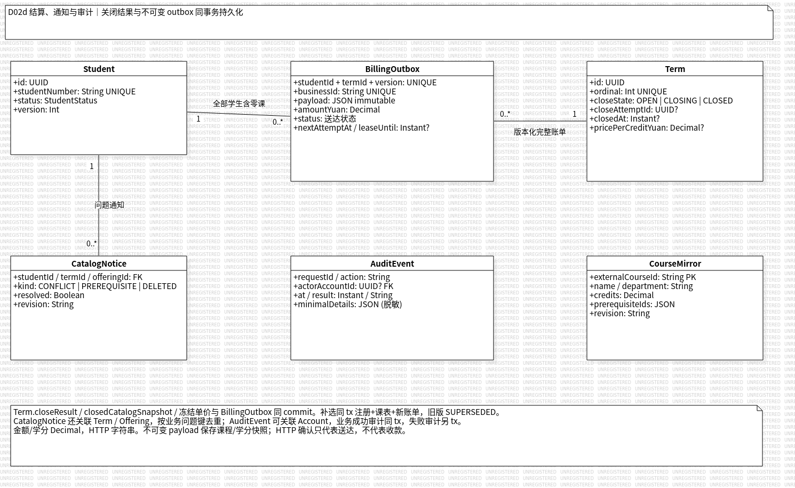
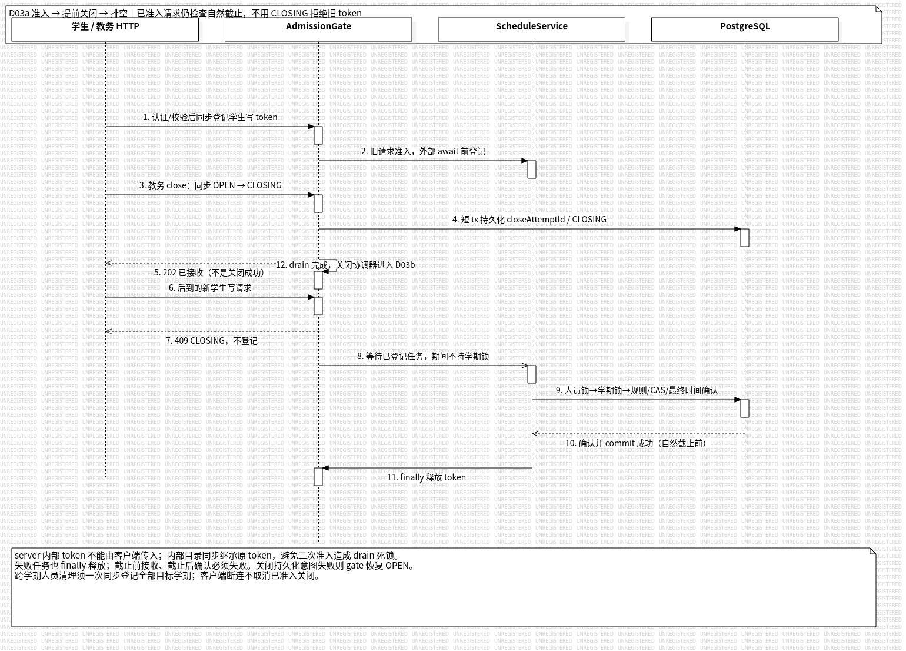
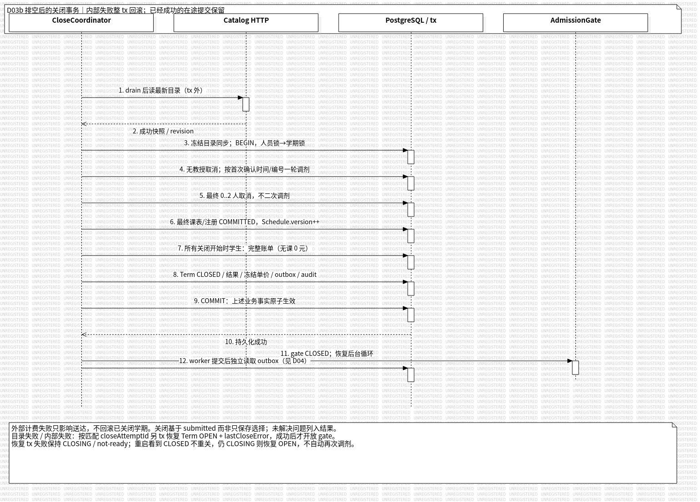

# 总体设计 UML 模型

- 版本：v0.1，2026-10-05；关联需求：US-026；迭代：IT-02。
- 输入：[总体设计](system-design.md)、[API 契约](api-contract.md)、[OOA v0.3](object-oriented-analysis.md)。这是设计基线图，不是由已验证业务代码逆向生成的实现图。
- 正式维护入口：[原生 StarUML 源模型](models/system-design.mdj)。PNG 从源模型导出，不是嵌入 `.mdj` 的替代图片。
- 状态：Linux StarUML 7.1.1 CLI 导出、GUI 加载／保存重载和逐图视觉检查已执行；团队设计评审、业务测试与实现一致性复核仍待执行。

## 1. 图的职责与阅读顺序

| 图 | 原生 UML 类型 | 职责与约束 |
| --- | --- | --- |
| [D01 组件部署](images/D01-component-deployment.png) | Deployment Diagram | 浏览器、单实例 Node Hono API、PostgreSQL、独立 HTTP 模拟；节点内真实组件、节点间通信路径；开发端口 web 5173／API 3000／模拟 3001／DB 5432 |
| [D01b API 组件](images/D01b-api-components.png) | Component Diagram | 身份／解析入口、业务事务、gate、HTTP 客户端、Prisma 的依赖；组件是职责边界，不强制为每个组件造一个 TS class |
| [D02a 选课数据](images/D02a-registration-data.png) | Class Diagram | Student、Term、Schedule、Registration、Offering、CatalogSnapshot；保存选择不占名额，提交事实和版本墓碑独立 |
| [D02b 身份数据](images/D02b-identity-data.png) | Class Diagram | Account、Session、Student、Professor、PersonIdentity；账户单角色与身份 XOR、跨角色 SSN 唯一、持久化会话 |
| [D02c 授课成绩](images/D02c-teaching-grades.png) | Class Diagram | Professor、Qualification、TeachingVersion、TeachingHistory、Offering、GradeRecord；当前归属与历史分离，导入成绩可无班次 |
| [D02d 结算数据](images/D02d-settlement-data.png) | Class Diagram | Student、Term、BillingOutbox、CatalogNotice、AuditEvent、CourseMirror；完整账单版本、脱敏审计、目录镜像非权威 |
| [D03a 准入排空](images/D03a-admission-drain.png) | Sequence Diagram | 同步准入 token、CLOSING 持久化、新写拒绝、旧请求最终规则／时间确认、finally 释放、无学期锁等待 drain |
| [D03b 关闭原子事务](images/D03b-close-atomic-outbox.png) | Sequence Diagram | drain 后目录 HTTP、人员→学期锁、一轮调剂、最终取消、最终课表／关闭结果／全部学生账单／审计同 commit；失败恢复边界 |
| [D04 计费版本恢复](images/D04-billing-version-recovery.png) | Sequence Diagram | 短事务租约、事务外 HTTP、固定 60 秒重试、补选完整新版本、旧请求迟到不覆盖新版本、重启 lease 恢复 |

D02 分成四图并复用同一类对象，避免把所有外键都塞入一张图。图只列与约束有关的关键字段；组合唯一键及同类字段使用摘要表示，完整字段／SQL 约束以总体设计第 3 节及后续 Prisma schema 为准。不同图重复出现的 Student、Term、Offering、Professor 都引用同一个原生类，而非复制独立模型。

D02c 省略重复 Student／Term 节点，GradeRecord.studentId／termId、TeachingVersion.termId 的 FK 在图注说明；D02d 省略 CatalogNotice 到 Term／Offering 及 AuditEvent 到 Account 的跨图连线，也明确写在图注。CourseMirror 是目录课程只读镜像；外部 courseId 不凭空画成本地强外键。多重性是关联端点约束，不能替代部分 UNIQUE／CHECK 或业务容量 10 的事务验证。

D03a 把学生与教务入口合在一条 HTTP 生命线以显示不同请求交错；gate 生命线包含关闭协调器调用 gate 的动作，不表示 gate 独立持有数据库职责。第 10 条是数据库向业务服务的成功回复，业务确认时间须严格早于自然窗口右端；commit 成功才对外成功，不以请求接收时间代替确认时间。D03b 的失败与重启分支列在图注，不宣称主成功轨迹已执行。

D04 把 worker 与补选协调的动作合在服务侧生命线。v1 重试已在被取代前发出，随后 v2 到达；SUPERSEDED 行不会再次被 worker 领取。示例完整金额 1200／1500 是说明数据，最终外部账单仍 1500，不能相加成 2700。ACK／DUPLICATE／STALE 仅代表送达／版本处理，不代表实际收款。

部署图、总体设计正文和运行配置统一使用模拟端口 **3001**。图形任务不包含运行 API／模拟器；实际集成结果由统筹单独登记。

## 2. 原生模型与导出方法

复用 [OOA 生成记录](../histories/2026-10/20261005-0108-oo-analysis.md) 的方法：参照既有 OOA 模型及 [官方 UMLExample.mdj](https://github.com/staruml/staruml-samples/blob/master/UMLExample.mdj) 的模型对象和完整 view 子树，用一次性 Node.js 生成原生 JSON。生成后删除临时脚本；以后在 StarUML 中编辑源模型，重新导出，不独立修改 PNG 内容。

源文件包含真实 `UMLClass`／`UMLAttribute`／`UMLAssociation`、`UMLNode`／`UMLComponent`／`UMLCommunicationPath`、`UMLInteraction`／`UMLLifeline`／`UMLMessage`，以及相应 diagram、compartment、label、line part、message view；通过 `$ref` 引用模型／端点／父对象。部署组件在源模型及视图中均归属对应节点；不使用 `ImageView` 或图片数据充当 UML。

本轮从 [StarUML 官方下载页](https://staruml.io/download) 安装 Linux `StarUML_7.1.1_amd64.deb`，运行环境为 Debian 12 x64，使用 Xvfb 虚拟显示和 Noto Sans CJK SC 中文字体。以普通用户从仓库根目录执行：

```sh
xvfb-run -a staruml image docs/design-docs/models/system-design.mdj -f png \
  -o 'docs/design-docs/images/<%=filenamify(element.name)%>.png'

for image in docs/design-docs/images/D*.png; do
  magick "$image" -background white -alpha remove -alpha off "$image"
done
```

`staruml image` 是实测的 CLI 子命令，不能省略 `image`。无显示环境必须使用 Xvfb；安装时还需要 StarUML 的 Linux 依赖和中文字体。ImageMagick 仅合成白底，未裁图、覆盖或移除 `UNREGISTERED` 试用水印。字体替换、StarUML 版本变化或 GUI 编辑后，都要重新逐图检查文字／箭头／多重性，不能只检查退出码。

GUI 验证使用监督服务运行 StarUML＋Xvfb，通过 Electron 调试接口调用 `app.project.load()` 加载该源文件，逐张 `app.diagrams.setCurrentDiagram()`／`repaint()`，检查部署、数据和关闭顺序图画布；再由 GUI 的 `app.project.save()` 保存临时副本并重载。没有以浏览器打开 PNG 冒充 GUI 模型验证。试用模式只点 Continue，没有激活许可证；导出仍保留水印。临时服务、检查副本和生成脚本不是项目运行依赖，不进入交付。

## 3. 本轮实测证据与边界

| 检查 | 已执行结果 |
| --- | --- |
| StarUML CLI 加载与导出 | 最终退出码 0；输出 `[StarUML] Total 9 diagrams were exported`；9 个图名与本页 PNG 一一对应 |
| 源模型结构 | 1,340 个对象 ID 无重复；3,653 个 `$ref` 均解析；嵌套对象 `_parent` 与归属一致 |
| 原生语义对象 | 18 个数据类、81 个属性、20 条类关联、4 个部署节点、14 个组件、3 条通信路径、4 条组件依赖、11 条生命线、37 条消息；9 张图都有 views |
| GUI 加载／绘制 | 模型树显示 `Wylie 总体设计 UML v0.1 — US-026`；9 张图均打开并 repaint；代表性的 D01、D02a、D03b GUI 画布已截图检查，无加载／绘制错误 |
| GUI 保存重载 | 临时副本重载后仍为 9 图／18 类／37 消息；ID、引用与原生对象类型计数保持一致；D03b 仍显示四生命线与事务消息 |
| 逐张视觉检查 | 9 张白底 PNG 都经 `view_media` 检查；修正 D01 通信线和开发代理说明、D02a 学期连线拥挤、D03a 回复语义、D04 旧版在途时序后复验；中文、端点／箭头、图注完整，保留试用水印 |

首次 GUI 命令把 Electron 参数放在文件名前，StarUML 将参数误识别为待打开路径；后续通过明确的模型路径加载成功，不把首次错误忽略为“已验证”。启动日志还出现无桌面环境的 D-Bus／GPU 告警和 StarUML 默认内部 API 端口占用；它们未阻止 CLI 导出、GUI 模型加载或保存重载，本轮不修改宿主服务或占用者。

这些检查证明原生模型能加载、编辑保存并导出，且图形可读；**不证明业务事务、权限、容量竞争、60 秒计费重试、性能或系统已实现**。本轮没有运行业务 API、PostgreSQL 集成或前端浏览器验收。后续实现若改变字段、运行拓扑或事务策略，父任务须同步源模型、重新导出并补实现一致性证据；团队评审与合入状态另行登记。

## 4. 图形预览

















