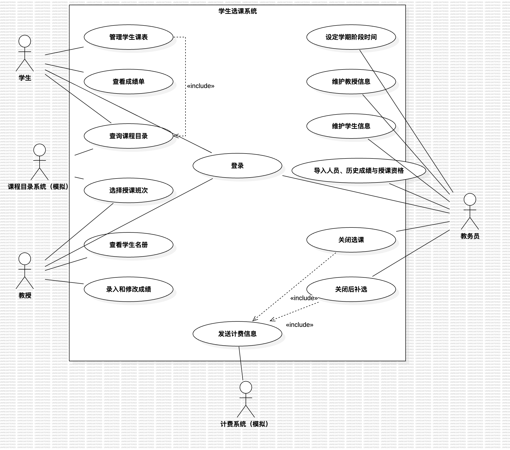
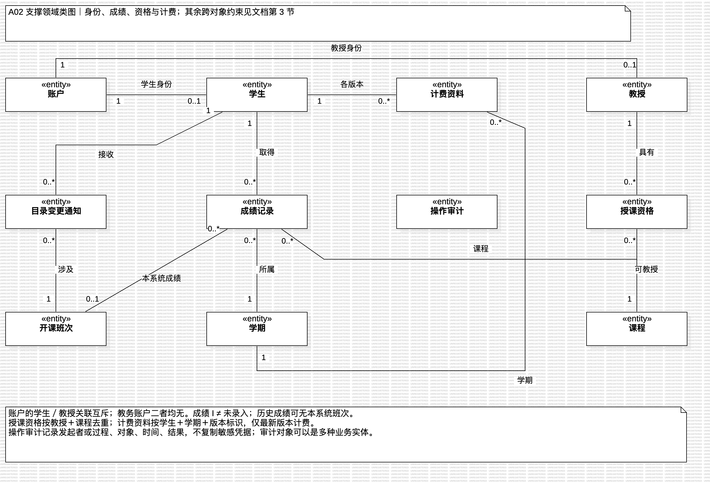
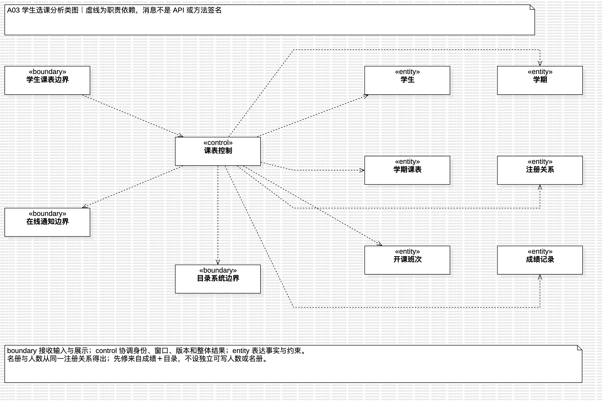
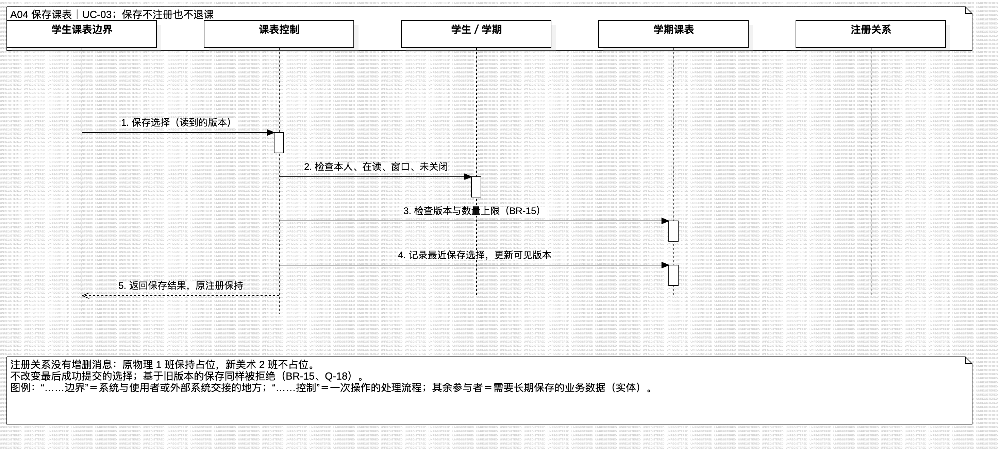
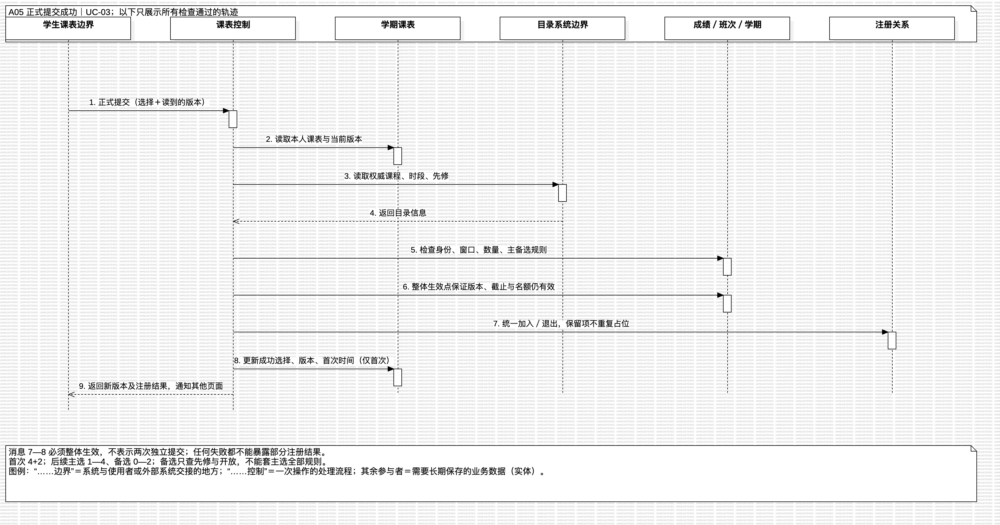
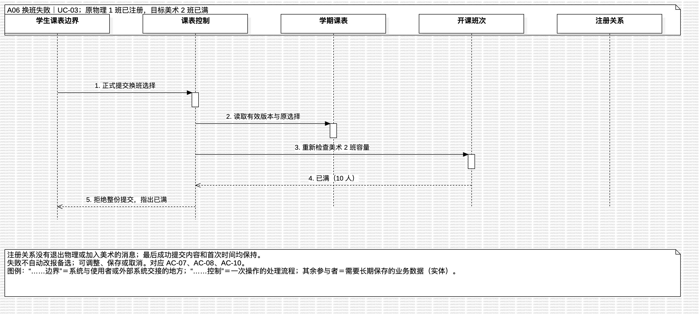
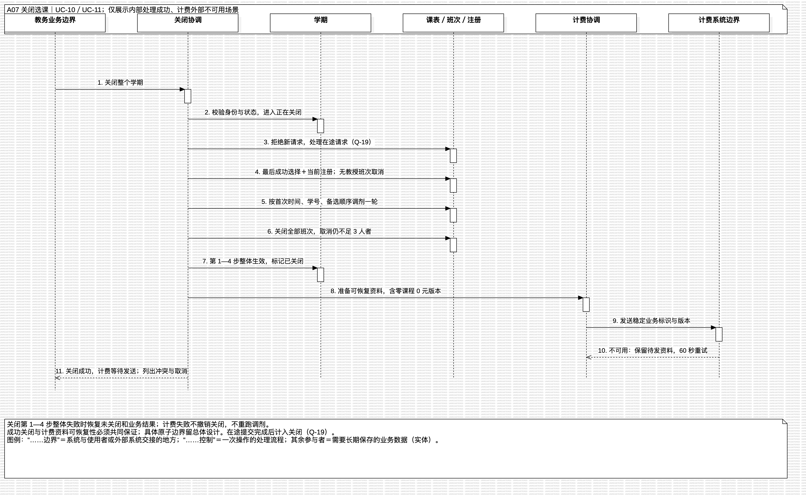
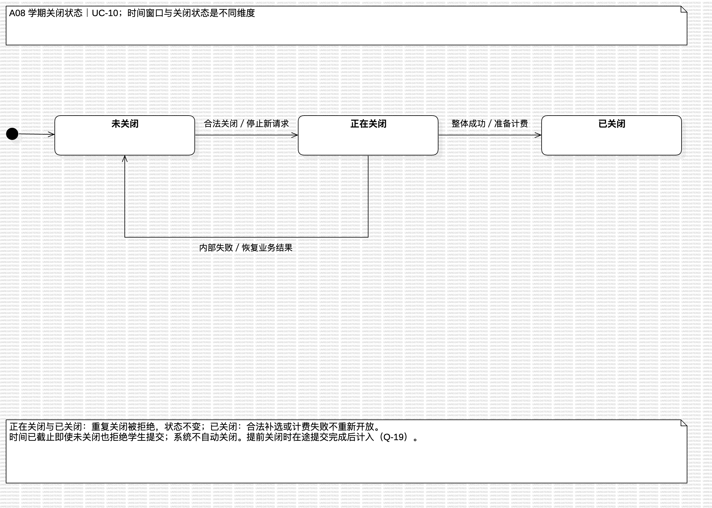
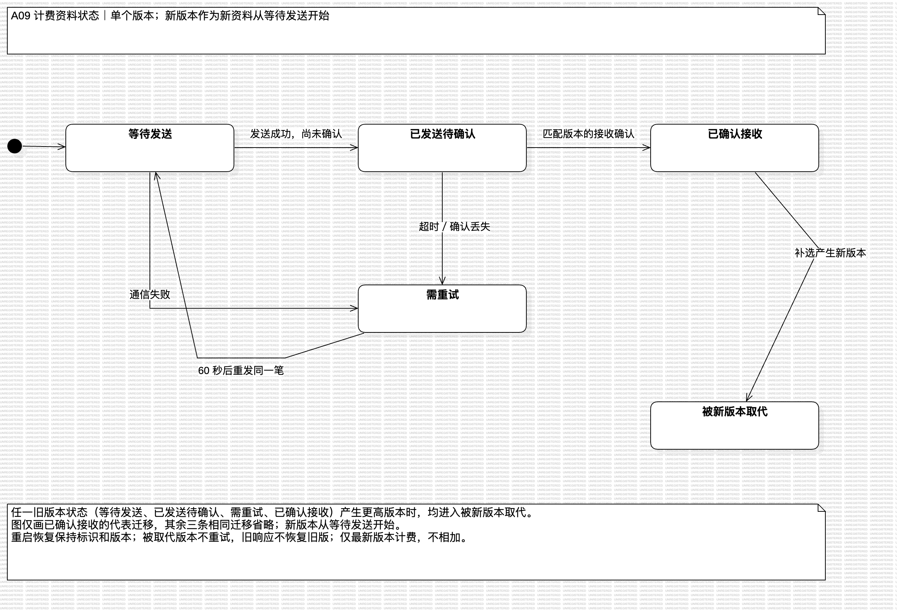

# 学生选课系统面向对象分析

- 版本：v0.4，2026-10-08；状态：分析初稿，待团队评审，不是已确认的设计基线。
- 任务：US-024；迭代：IT-01；主责：倪成锦，各业务负责人及冯海伦评审。
- 输入：[需求分析 v0.6](../REQUIREMENTS_ANALYSIS.md)，不在本文新增或修改业务规则。
- 方法依据：[面向对象课件](../lecture-notes/text/10面向对象-需求建模+OOA.txt) 第 34—37 页：用例模型、对象模型、动态模型；分析类分实体、边界、控制三类，保持概念层，不添加技术细节。
- 可编辑源模型：[object-oriented-analysis.mdj](models/object-oriented-analysis.mdj)；用例模型另存为 [use-case-model.mdj](models/use-case-model.mdj)。图中的职责和消息是分析语言，不是程序方法签名。

## 1. 分析范围与模型阅读方式

对 UC-01 至 UC-14 建立职责映射；重点细化 UC-03 学生课表、UC-10 关闭选课及 UC-11 计费的协作和状态。其他用例在本文给出分析类及场景约束，尚未逐个展开顺序图。本文不决定数据库表、外键、HTTP 接口、锁、消息队列、React 组件或 Hono 模块；这些属于后续总体设计和详细设计。

用例模型已移入仓库，见 U01 系统用例图；其中三处 include 关系尚待团队核对，本文不把它当作已评审的功能模型。特别是 UC-10／UC-13 调用 UC-11，不代表选课结果必须等计费确认才成功；UC-03 的保存和删除也不一定每次重新执行目录浏览，不应只凭“有关联”就认定为必然的 include 关系。



模型按图拆分，避免一张图承担全部语义：

| 图名 | 作用 | 对应章节 |
| --- | --- | --- |
| U01 系统用例图 | 参与者、系统边界与 UC-01 至 UC-14；源模型为 `use-case-model.mdj` | 第 1 节 |
| A01 核心领域类图 | 学生、学期、选择版本、条目、班次、有效注册及授课 | 第 2—3 节 |
| A02 支撑领域类图 | 账户、资格、成绩、通知、计费与审计 | 第 2—3 节 |
| A03 学生选课分析类图 | boundary → control → entity 的职责依赖 | 第 4 节 |
| A04 保存课表顺序图 | 保存选择而不改变注册 | 第 5.1 节 |
| A05 正式提交成功顺序图 | 完整检查与整体生效 | 第 5.2 节 |
| A06 换班失败顺序图 | 目标班次已满，原注册保持 | 第 5.3 节 |
| A07 关闭选课顺序图 | 关闭、调剂、整体成功后生成计费资料 | 第 6 节 |
| A08 学期关闭状态图 | 未关闭、正在关闭、已关闭与失败恢复 | 第 7.1 节 |
| A09 计费状态图 | 发送、确认、重试与版本替换 | 第 7.2 节 |

## 2. 分析类及职责

`entity` 表达业务事实与约束，`boundary` 表达人与外部系统的交互边界，`control` 协调一个业务过程。控制类不等同于后端控制器；边界类不等同于具体页面组件。一项职责可在实现时合并或拆分，不要求每个分析类都对应一份代码文件。

### 2.1 实体类

下表的编号用于追溯；图中的同名类引用同一个模型对象。

| 编号／类 | 核心信息与职责 | 来源 |
| --- | --- | --- |
| E01 账户 | 唯一账号、单一角色、启停、初始密码需修改；凭据是受保护信息，图和样例不放明文值 | UC-01、BR-16、SEC-06 |
| E02 学生 | 学号、基础资料、在读／休学／毕业；支持按学生身份关联课表与成绩 | UC-09、BR-16 |
| E03 教授 | 编号、基础资料、在职／离职；保留已关闭学期的授课历史 | UC-08、BR-16 |
| E04 学期 | 时间窗口、关闭状态、关闭结果、是否上线学期；“学期已完成”用于成绩范围，不等同于“选课已关闭” | UC-06、UC-07、UC-10、UC-12 |
| E05 课程 | 标识、名称、院系、学分及先修集合；只读目录事实 | BR-03、BR-11 |
| E06 开课班次 | 所属课程、学期、时段，及本地关闭／取消结果；人数由有效注册导出，教授由授课安排确定 | BR-02、BR-07、BR-11 |
| E07 学期课表 | 学生与学期的业务归属、当前版本、首次成功提交时间（删除课表时清除）；区分最近保存选择与最后成功提交选择 | UC-03、BR-04、BR-09、BR-15 |
| E08 选择版本 | 一次保存或成功提交所表达的主选、备选集合；保存后的内容可以不同于当前有效注册 | BR-04、AC-10、AC-54 |
| E09 选择条目 | 指向班次、主选／备选、备选顺序；selected 不产生占位，显示 enrolled 要依据有效注册判断 | BR-01 至 BR-04 |
| E10 注册关系 | 学生与班次间的有效占位，来源为正式提交／调剂／补选，关闭确认结果；名册与人数来自同一事实 | BR-02、BR-06、BR-13、第 8.3 节 |
| E11 授课安排 | 教授与班次间的授课事实；每班次至多一位教授，失败调整保留原安排 | UC-04、BR-07 |
| E12 授课资格 | 教授可教授的课程集合；按教授＋课程去重，只有导入没有撤销 | UC-14、AC-61 |
| E13 成绩记录 | 学生、课程、学期、可选班次、成绩及来源；支持没有本系统班次的历史成绩 | BR-08、CHG-04、AC-60 |
| E14 目录变更通知 | 受影响学生、班次、问题类型与解决状态；问题不自动等于退课 | BR-14、AC-45、AC-46 |
| E15 计费资料 | 学生、学期、版本、最终班次与学分、价格、金额、稳定业务标识及送达状态 | BR-10、BR-13、UC-11 |
| E16 操作审计 | 发起者或过程、对象、时间、结果；不复制密码、完整社会安全号码或不必要成绩 | SEC-07、AC-42 |

E08 是为表达 BR-04 提出的分析概念，不要求数据库保留全部编辑历史；至少能分别解释“最近保存的选择”和“最后成功提交的选择”。E09 与 E10 分开，是因为保存新选择不能释放原名额；关闭时也不能拿最近保存内容冒充已生效结果。

名册、已注册人数、成绩单、先修是否满足、是否额满都是从实体事实得出的视图或判断，不额外建可独立修改的实体。教务员是业务参与者，现有需求没有要求维护其人员档案；由账户的教务角色表达，不杜撰教务员资料用例。不为学生、教授提取没有实际职责的“通用人员”父类。

### 2.2 边界与控制类

| 边界类 | 协作控制类 | 职责边界 |
| --- | --- | --- |
| B01 登录边界 | C01 身份控制 | 验证账户与人员状态；初始密码修改成功前不授予其他业务能力 |
| B02 课程浏览边界、B03 目录系统边界 | C02 目录协调 | 读取目录并组合本地教授、人数；区分空清单与失败；获知变更后协调复查 |
| B04 学生课表边界 | C03 课表控制 | 校验本人、在读、窗口、版本，协调保存／提交／删除及一致结果 |
| B05 教授业务边界 | C04 授课控制、C05 成绩控制 | 授课检查资格和冲突；名册／成绩限本人班次，成绩按格子保存 |
| B06 成绩单边界 | C05 成绩控制 | 仅展示本人的上一已完成学期成绩，包括休学和毕业学生 |
| B07 教务业务边界 | C06 人员控制、C07 学期控制、C08 关闭协调、C09 导入控制 | 人员变更与关联清理，时间顺序校验，关闭及逐行导入；不自动授予全部数据查询权 |
| B07 教务业务边界 | C03 课表控制 | UC-13 单独检查教务身份、已关闭学期和补选条件，不复用学生窗口作为补选许可 |
| B08 计费系统边界 | C10 计费协调 | 发送稳定版本、识别确认、每 60 秒重试、重启恢复；不重新运行调剂 |
| B09 在线通知边界 | C02 目录协调、C03 课表控制 | 在线页面的容量、其他页面提交、目录问题通知；提交时仍查真实状态 |

先修、时段冲突和容量判断归相关实体的业务约束，由控制类协调调用；不先抽一个包办全部规则的“万能校验器”。所有控制类从可信身份上下文检查角色和所有权，不相信页面传来的角色或学生编号。审计是跨场景协作责任，不把它建成新的用户用例。

## 3. 对象关系、数量与不变量


| 关系 | 多重性与约束 |
| --- | --- |
| 学生／教授—账户 | 每个学生或教授恰有一个对应账户；账户分别关联 0..1 学生、0..1 教授，且二者互斥；教务账户不关联这两类人员 |
| 学生—学期课表—学期 | 每个课表对应一个学生、一个学期；同一学生学期至多一个当前课表；其他学期的历史记录不被删除本期课表波及 |
| 课表—选择版本—条目 | 课表最近保存、最后成功提交分别引用 0..1 选择版本，可以相同；版本组成 0..6 条目，主选至多 4、备选至多 2；首次正式提交须 4+2，后续提交主选 1—4 |
| 条目—班次—课程 | 每条目指向一个班次；每班次属于一门课程及一个学期；主选课程不能重复，备选按独立规则检查 |
| 学生—注册关系—班次 | 每有效注册对应一个学生和班次；同学生同班次至多一个有效注册；一个班次有效注册 0—10 人，整个学生学期主选不超过 4，补选同样受此约束（Q-16） |
| 教授—授课安排—班次 | 每安排对应一位教授及一个班次；每班次当前安排 0..1，取消授课不删除已关闭学期历史 |
| 教授—授课资格—课程 | 每资格对应一位教授及一门课程，组合不重复；有资格不等于已选择授课 |
| 课程—先修课程 | 两端都是课程，均可为 0..*；所有先修的成绩都须为 A—D，不在分析阶段假定只需满足一门 |
| 学生／课程／学期—成绩记录 | 每成绩对应一个学生、课程、学期；关联班次为 0..1，教授录入时必须关联本人班次；导入的历史成绩可不关联本系统班次 |
| 学生／学期—计费资料 | 每学生学期可有多版本，但计费系统只按最新版本计算；零课程也有一笔 0 元资料 |



所有关联默认表示业务联系，不表示数据库外键或生命周期级联。仅选择版本与条目用组合表示条目依附于选择内容，不能据此推导删除学生时级联删除历史。A01 为可读性省略了注册—课表的导航；注册归属于学生及班次，由班次所属学期确定该生课表。

必须保持的业务不变量：

1. **选择、注册、关闭确认分离**：保存不改变任何名册；只有成功提交、调剂、补选改变有效注册；关闭以最后成功提交为输入，目录删除等已经生效的取消仍须反映在结果中。
2. **整体变更**：正式提交、授课调整、人员状态变更、关闭第 1—4 步不能留下部分修改；成绩逐格、导入逐行是明确例外。
3. **写入时仍有效**：所有权、窗口、版本、先修、冲突与容量不能只检查展示时的数据。保留原班次不额外占一个名额，重复选择不重复注册。
4. **关闭与送达分离**：关闭成功必须有可恢复的计费待发送事实；外部失败不撤销关闭。具体持久化与原子边界留给总体设计。
5. **本地与目录权威分离**：课程、时段、学分、先修只来自目录，教授及人数来自本地。目录修改冲突时先保留注册并通知；删除班次才移除注册。
6. **审计不替代业务结果**：审计能追查失败，但失败记录不能被当成业务成功；敏感信息不进入图、日志或演示数据。

## 4. 从用例提取协作责任



A03 的虚线表示职责依赖，不是领域关联。边界接收操作和展示结果，控制协调判断与整体变更，实体维护业务事实。顺序图中的消息是职责说明，尚未决定技术调用的粒度和签名。顺序图中以“／”并列的生命线是多个相关实体的阅读缩写，不表示另建“成绩／班次／学期”或“课表／班次／注册”类；单独命名的生命线对应第 2 节的分析类。

| 用例 | 控制／主要实体 | 关键协作与异常约束 | 验收追溯 |
| --- | --- | --- | --- |
| UC-01 登录 | C01；E01、E02、E03 | 状态与凭据一起判断，初始密码只进入改密流程；失败不建立身份 | AC-01、AC-02、AC-43、AC-44 |
| UC-02 查询目录 | C02；E05、E06、E11、E14 | 只读目录，教授字段取本地；变更复查保留冲突，删除取消；访问失败不冒充空结果 | AC-03、AC-04、AC-45、AC-46 |
| UC-03 管理课表 | C03；E02、E04、E07—E10、E13 | 保存与注册分离，主备选校验不同，提交整体生效、删除需确认，版本与名额竞争在确认时判定 | AC-05 至 AC-13、AC-47 至 AC-50、AC-63、AC-64 |
| UC-04 选择授课 | C04；E03、E04、E06、E11、E12 | 新增与取消统一判断，争选只一位成功，失败保留全部原安排 | AC-14 至 AC-16、AC-51 |
| UC-05 名册 | C04；E06、E10、E11 | 先核对本人授课，再从有效注册构造名册，不读取 selected 或备选当作学生名册 | AC-17、AC-18 |
| UC-06 成绩录入 | C05；E04、E10、E11、E13 | 限本人上一已完成学期且不早于上线学期；空格不改，I 是成绩值，非法格子不阻止其他合法格子 | AC-19 至 AC-21 |
| UC-07 成绩单 | C05；E02、E04、E13 | 本人上一已完成学期，不扩大全历史，不从休学／毕业推导禁止查看 | AC-22、AC-23、AC-44 |
| UC-08 教授维护 | C06；E01、E03、E04、E11 | 离职需确认受影响班次，清理未关闭学期授课，保留已关闭历史；有记录不删除 | AC-24、AC-25、AC-52 |
| UC-09 学生维护 | C06；E01、E02、E04、E07、E10 | 休学／毕业需确认，清理未关闭学期课表和注册，释放名额；历史保留 | AC-26、AC-27、AC-53 |
| UC-10 关闭选课 | C08；E04、E06—E11、E14 | 顺序为无教授取消 → 一轮调剂 → 最终不足 3 人取消，不二次调剂；失败整体恢复 | AC-28 至 AC-33、AC-54、AC-55 |
| UC-11 计费 | C10；E02、E04、E15 | 稳定版本重复发送，确认丢失也不重复收费；计费失败不回滚关闭，重启后继续 | AC-34 至 AC-36 |
| UC-12 阶段时间 | C07；E04 | 校验起止顺序；加退选截止只禁学生提交，不自动运行关闭 | AC-56 |
| UC-13 补选 | C03、C10；E02、E04、E06、E07、E10、E15 | 只限教务员、在读、已关闭未取消班次；成功增加注册和计费新版本，失败保持原状 | AC-57、AC-58、AC-62 |
| UC-14 导入 | C09；E01—E05、E12、E13 | 按行校验；人员按社会安全号码去重但结果脱敏；历史只限上线前且不覆盖；资格重复忽略 | AC-59 至 AC-61 |

全部控制还须覆盖 AC-37 至 AC-42 的可信身份、权限、所有权与审计要求。NFR-01 至 NFR-10 是后续设计与测试约束，本分析模型不声称满足并发、性能或可靠性指标。

## 5. UC-03 场景实现：业务层的消息与结果

### 5.1 保存课表



前置：可信身份为本人在读学生，初选或加退选窗口内，学期未关闭。学生调整主选与有序备选；C03 检查身份、窗口、数量上限以及不会覆盖其他页面结果的版本条件，E07 记录最近保存的 E08，更新可见版本。E10 不接收增删注册消息；原 enrolled 仍占原班名额。在线页面收到新结果，容量等变化在 5 秒内显示，但不得把这项通知作为提交许可。保存同样校验版本，基于旧版本的保存被拒绝（BR-15、Q-18、AC-64）。

例：原有效注册为物理 1 班，保存改选美术 2 班后，选择内容是美术，但有效注册仍是物理；最近保存引用与最后成功提交引用可以不同。关闭时不能按美术计费。

### 5.2 正式提交成功



1. B04 传入选择内容与读到的版本，C03 从身份上下文确定学生，不采用请求中的角色作为权限依据。
2. 读取当前课表、人员状态和学期窗口；版本过期直接拒绝，不继续覆盖。
3. B03 取得权威课程信息；目录不可用结束用例，不把空数据当成先修满足。
4. 区分首次与后续提交数量；主选查先修、开放、容量、时间冲突和同课程；备选只查先修和开放。不因备选已满或与主选冲突而拒绝。
5. 在整体生效点重新保证版本、窗口、名额及全部业务约束仍成立；将新主选的注册加入、移除主选的注册退出、保留注册不重复增加、备选顺序和最后成功选择一起生效。首次成功时间只在第一次成功时写入。
6. 返回新版本与注册结果，再向其他在线页面提示刷新；失败提示不能与实际已生效状态相矛盾。原子性如何实现不由这张图指定。

A05 展示检查全部通过的一条成功轨迹；不表示先改 E10 再独立保存 E07。图中两条变更消息共同受“整体生效”约束，中间不能对外暴露部分结果。

### 5.3 换班失败、旧版本与截止边界



加退选时从物理 1 班换到已满的美术 2 班：C03 得到容量失败，向 B04 返回“已满”，不调用 E10 退出物理，也不更新最后成功提交内容。可保留编辑内容供调整或保存，但不能假装已注册美术，更不能自动改报备选（AC-07、AC-08、AC-10）。

- 旧版本：A 页面提交成功，B 页面基于旧版本再提交，被拒绝且提示加载新结果；仅发刷新通知不够，业务确认处仍须校验（AC-49）。
- 截止：17:59:59 发出但 18:00 之后完成确认的提交不生效；“已接收”不等于“确认完成”（AC-50）。教务员提前按下关闭时，已在处理的提交完成后计入关闭（BR-05、Q-19）。
- 删除：先展示本人课表、取得确认，再整体移除本期课表及有效注册；取消确认不变更。不可借删除清空其他学期成绩或已关闭记录（AC-11、AC-12）。删除同时清除首次提交时间，重建课表按第一次提交处理（BR-06、Q-17、AC-63）。

## 6. UC-10／UC-11：关闭、调剂与计费



1. C08 检查教务身份与学期未关闭，进入正在关闭并拒绝新保存／提交；处理在途请求后才继续。在途提交完成后计入关闭（Q-19、AC-28）。
2. 从最后成功提交及当前有效注册确定输入，只保存的修改不参与。无教授班次取消并移除注册；有教授且至少 3 人的班次确认保留；有教授但不足 3 人先保留供调剂。
3. 学生按首次成功提交时间升序、相同时间按学号升序；每生按备选顺序尝试，最多补到 4 门。每次检查未取消、有教授、人数小于 10、先修、时间冲突、同课程；候选成功后立即影响后续学生可用容量。这是单轮过程，不是同时独立挑选再汇总。
4. 关闭全部班次，调剂后仍不足 3 人的班次取消并更新所有相关注册和课表；不进行第二轮调剂。目录变更留下的冲突／先修问题列在结果中供教务员系统外处理，不偷偷取消这两门课。
5. 第 1—4 步作为整体生效，学期进入已关闭；按最终结果准备每学生学期的计费资料，零课程也准备 0 元。不把成绩塞进计费内容。总体设计必须保证成功关闭后资料可恢复，不存在“已关闭但待发资料永久丢失”的结果。
6. C10 通过 B08 发送；外部不可用时资料待发送，关闭仍成功。定时重试或重启恢复只发送既有版本，不再调剂。响应丢失按同一业务标识重发，由外部按版本去重。

内部第 1—4 步失败：从正在关闭恢复未关闭，恢复该操作前的课表和名册，返回失败并允许重试；恢复不能抹掉在途提交独立合法生效的结果（Q-19、AC-55）。重复关闭请求被拒绝，不重复收费。

UC-13 复用课表的补选约束，但不复用学生的窗口许可：教务员补选成功后，已关闭状态保持；有效注册与该生最终课表一致，生成更高版本计费资料，旧版本不再作为当前应计金额。旧版本晚到或确认晚到不能覆盖新版本，确认须匹配业务标识与版本。

## 7. 状态分析：避免把独立维度压成一个枚举

### 7.1 学期关闭状态



| 原状态 | 事件／条件 | 新状态与动作 |
| --- | --- | --- |
| 未关闭 | 教务员关闭，身份合法 | 正在关闭；拒绝新保存／提交，等在途请求完成后计入（Q-19） |
| 正在关闭 | 第 1—4 步整体成功 | 已关闭；最终课表和班次结果一致，准备计费 |
| 正在关闭 | 第 1—4 步内部失败 | 未关闭；恢复操作前业务结果，不恢复被时间截止禁止的学生权限 |
| 正在关闭／已关闭 | 重复关闭 | 原状态；拒绝，不重复调剂 |
| 已关闭 | 教务员合法补选或计费失败 | 仍已关闭；补选改变注册与计费版本，计费失败只改变送达状态 |

教授授课开始、学生初选、加退选、窗口间空档、截止后等待关闭由时间决定，和这三个关闭状态分开。截止不自动变成已关闭；内部失败恢复未关闭后，如果时间已经截止，学生仍不能提交。已关闭没有重新开放的迁移。

班次的容量也是独立条件：可报名时可以从 9 人变 10 人而额满，退选可变回 9 人；已关闭不因人数降到 9 而重新开放。关闭后的教务补选许可与学生报名许可不同。取消班次不可补选。

课表同时具有最近保存内容与有效注册结果，不给整张课表强行套“selected → enrolled”线性状态机。关闭确认也不等于任何数据库 commit。条目被目录删除、退选、取消后，注册与所有相关显示须同步。

### 7.2 计费资料状态



| 状态／事件 | 处理 |
| --- | --- |
| 等待发送 | 包含稳定业务标识及最终内容，允许首次发送或重启恢复 |
| 已发送待确认 | 不能因为写出请求就视为送达成功；收到匹配标识及版本的接收确认才完成 |
| 需重试 | 不可用、超时或确认丢失，按每 60 秒重发同一笔；重启不改业务版本 |
| 已确认接收 | 同版本重复响应不再新增收费；不是不可被更正的终态 |
| 被新版本取代 | 补选产生更高版本，旧版本不再重试；晚到旧响应不得把旧版本恢复成最新 |

状态图对应单个计费版本；新版本是另一份计费资料，初始状态为等待发送。最新版本与旧版本分别有送达状态；金额替换不等于把两笔相加。补选结果与新版本资料的可恢复性同样需要总体设计保障。为避免连线拥挤，A09 只画出从已确认接收到被取代的代表迁移；等待发送、已发送待确认、需重试的相同迁移在图中省略，源模型中仍保留全部迁移。

## 8. 评审走查样例（不是已执行的业务测试）

以下输入独立于模型构造，用来识别容易画错的业务语义；预期来自需求 AC，而不是脚本计算。模型结构检查、图像导出均不能替代这些业务验收。

| 场景 | 非对称输入与预期 | 关联 |
| --- | --- | --- |
| 保存不退课 | 已注册物理，保存改选美术；物理人数不减，美术人数不增；关闭仍按有效物理结果 | AC-10、AC-54 |
| 首次／后续数量 | 首次 3+2 拒绝；已经成功提交后 3+0 接受；0 主选提示删除而非接受提交 | AC-47 |
| 主选／备选差异 | 主选已满拒绝；备选已满或与主选冲突可提交；备选先修不满足则整份拒绝 | AC-07、AC-48 |
| 最后一个名额 | 9 人班次，两生争抢；仅一人成功，失败者原班次保留且不自动使用备选 | AC-08、AC-10 |
| 小班调剂 | 有教授班次 2 人，调剂补入 1 人后保留；无教授班次即使 10 人也取消 | AC-29、AC-31 |
| 仅一轮与顺序 | 甲早于乙首次提交，争同一备选最后名额，甲得到；最后取消小班后不再拿其他备选补课 | AC-32 |
| 关闭失败 | 调剂中内部失败，课表名册恢复；若已经越过截止时刻，未关闭也不等于学生可提交 | AC-50、AC-55、BR-05 |
| 零元及计费丢响应 | 从未提交者无课程但有 0 元资料；外部已接收而响应丢失，原版本重发不重复收费 | AC-34 至 AC-36、AC-54 |
| 更正版本晚到 | 旧版金额 12 学分 × 100 元＝1200 元，补选 3 学分后新版 1500 元；旧版后到不覆盖新版，也不叠加为 2700 元 | AC-57、BR-10 |
| 历史成绩与空格 | 上线前成绩不要求本系统班次；已有 B 的格子留空仍为 B，另格 I 合法、Z 拒绝 | AC-20、AC-60 |
| 目录冲突与删除 | 改时段造成冲突先保留两课并通知；删除班次才移除课表和名册 | AC-45、AC-46 |

## 9. 尚待评审的需求边界与后续设计输入

以下是分析中发现的差异或未明确边界。R-01 至 R-04 均已于 2026-10-05 由用户采纳建议，写入需求分析的 Q-16 至 Q-19，并同步模型。

| 编号 | 观察与影响 | 当前模型处理／确认责任 |
| --- | --- | --- |
| R-01 关闭截止与在途请求 | BR-05／Q-03 以按下关闭为截止且须此前完成确认；AC-28 则要求按下时正在处理的提交完成后，其结果计入关闭。两种规则对同一在途请求可能给出相反结果；AC-55 的恢复基准也受影响 | 已决定：提前关闭只阻止新请求，在途提交完成后计入关闭；失败恢复基准为开始关闭处理时，见 BR-05、Q-19、AC-28、AC-55 |
| R-02 补选数量 | BR-01／BR-09 给出主选最多 4 门，UC-13／BR-17 未明确学生已有 4 门时还能否补选 | 已决定：补选同样不超过 4 门主选，见 BR-17、Q-16、AC-62 |
| R-03 删除后再次首次提交 | 首次成功提交时间要求后续修改不变；删除课表后是否仍保留该学期首次提交标记未明确 | 已决定：删除时清除首次提交时间，重建须 4+2，调剂按新时间排序，见 BR-06、Q-17、AC-63；不要求保留永久编辑历史 |
| R-04 保存与多页面版本 | BR-15／AC-49 明确正式提交旧版本被拒绝，未明确两个保存竞争或保存后再从另一页提交的版本范围 | 已决定：保存和提交都校验版本，基于旧版本的请求被拒绝，见 BR-15、Q-18、AC-64 |

总体设计接收的约束：整体生效与容量竞争、可信身份和所有权、目录权威及变更发现、在线 5 秒通知、关闭故障恢复、计费资料持久化与版本替换、逐格／逐行部分成功和审计。具体技术选型继续沿用 ADR-001，但本文不预选并发算法、通信协议、缓存或数据库模式。

US-024 的文档验收：UC-01 至 UC-14 有职责和 AC 映射；图文类名、关系和场景一致；StarUML 模型能加载并导出全部图；团队走查第 8 节并处理第 9 节，不将分析初稿当作需求已评审或业务已实现。

## 10. 模型维护与验证边界

源模型是正式维护入口：在 StarUML 中打开 `models/object-oriented-analysis.mdj` 编辑后，重新导出并同步本文。PNG 不是另一套独立模型。使用 StarUML 7.1.1 的命令行从仓库根目录导出：

```sh
for model in object-oriented-analysis use-case-model; do
  staruml image "docs/design-docs/models/${model}.mdj" -f png \
    -o 'docs/design-docs/images/<%=filenamify(element.name)%>.png'
done
```

`staruml` 指安装后的 StarUML 可执行文件；不要求启动 Web 开发服务器。导出前检查类名和消息，导出后人工检查文字、箭头、多重性及重叠；修改图名时同时改图片链接。当前产物用原生 StarUML 对象和视图生成，不是把 PNG 塞进 `.mdj`。本轮对导出的透明 PNG 用 ImageMagick 合成白底，未移除水印；需要相同显示效果时，在导出后执行：

```sh
for image in docs/design-docs/images/[AU]*.png; do
  magick "$image" -background white -alpha remove -alpha off "$image"
done
```

本轮验证记录见 [history](../histories/2026-10/20261005-0108-oo-analysis.md)。检查只证明文档、引用和模型结构及导出可用；团队评审、业务测试、性能测试、PR 合入和发布尚未完成。

## 11. 变更记录

| 日期 | 版本 | 内容 |
| --- | --- | --- |
| 2026-10-05 | v0.1 | 建立分析类、职责映射、9 张图及 StarUML 源模型；记录 R-01 至 R-04 |
| 2026-10-05 | v0.2 | 按需求分析 v0.5 关闭 R-02 至 R-04，同步 A01、A04 图注；移入用例模型并新增 U01 系统用例图 |
| 2026-10-05 | v0.3 | 按需求分析 v0.6 关闭 R-01，同步 A07、A08 图注 |
| 2026-10-08 | v0.4 | 倪成锦审阅时反馈 A04 中“学生课表边界”等分析类名称看不懂；A04—A07 顺序图底部注释各加一行图例，说明边界、控制、实体的含义，模型其余对象与图注不变；StarUML CLI 重新导出并合成白底 |
