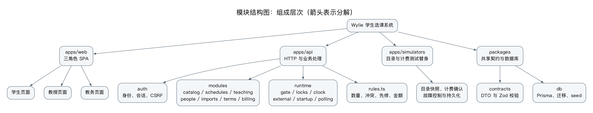
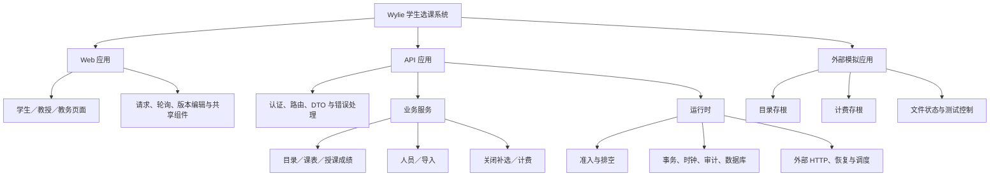

# 学生选课系统总体设计说明书

- 版本：v0.1，2026-10-05；US-026／IT-02；用户授权下供实现使用，团队评审未执行。
- 需求输入：[需求分析 v0.6](../REQUIREMENTS_ANALYSIS.md)、[OOA v0.3](object-oriented-analysis.md)。不更改 UC-01—14、BR-01—17 或性能指标；P1 补选也进入本次实现。
- HTTP、DTO、错误码与 xlsx 列规范的唯一入口：[API 契约](api-contract.md)。具体 Prisma schema／迁移由 US-027 worker 实现，须遵守本文字段和约束，不按分析类一比一建表。

## 1. 运行拓扑与适用边界

采用 Node.js 22 LTS、npm workspaces、React／TypeScript／Vite／TanStack Router SPA、Hono Node adapter、Prisma 6／PostgreSQL 15。US-027 已锁定 npm 依赖并实现迁移／seed／检查入口，见 [开发运行指南](../DEVELOPMENT.md)。Vitest 用于单元／HTTP 集成，真实 PostgreSQL 用于锁与迁移测试；orb 浏览器检查使用 agent-browser。已接入 `npm run test:e2e` 的独立浏览器检查；默认 `make ci` 不执行浏览器脚本，实际结果见测试报告。

```diagram
┌──────────────────────┐      ┌───────────────────────────┐
│ 浏览器 React SPA     │─────▶│ 一个 Node Hono API 进程   │
│ Vite 开发时 /api 代理│      │ session / 业务 / admission│
└──────────────────────┘      │ 目录轮询 / outbox worker  │
                              └────┬─────────────┬────────┘
                                   │             │ 私有 HTTP
                          ┌────────▼───────┐  ┌──▼────────────────┐
                          │ PostgreSQL 15  │  │ 独立模拟服务 Node │
                          │ 本地业务事实   │  │ 目录 / 计费 / 故障│
                          └────────────────┘  │ 独立持久化状态文件│
                                              └───────────────────┘
```

交付 Hono 提供 `/api` 和已构建 SPA，路由 fallback 只作用于非 `/api` 请求。开发前端 5173、API 3000、模拟服务 3001、Postgres 5432，对外只暴露 SPA 同源入口。生产 TLS 由入口代理提供；开发 loopback cookie 可非 Secure，portal HTTPS 运行需正确配置公开 Origin／代理，不能放宽 CSRF 到任意 origin。

**只支持一个 API 实例，禁止 Node cluster／PM2 多 worker／横向副本。** 单进程内的 gate 定义关闭瞬间的准入顺序；数据库事务锁防止异步事务竞争，但不能替代跨实例 admission 共识。部署加 PostgreSQL session-level advisory leader lock（专用连接），第二实例无法取锁则不 ready／退出；连接失去 leader lock 时立刻停止准入并退出，不继续以失锁身份处理业务。US-027 必须测试第二实例拒绝启动。若以后多实例需新 ADR 和分布式准入设计，不默默增加 Redis。当前串行学期写锁偏向正确性，原题 2000／500 同时用户、120 秒交易指标及全天可用全部待测，不能据技术栈推断达标。

## 2. 目录组织与依赖

| 实际路径 | 职责／拥有者 |
| --- | --- |
| `apps/api/src/app.ts`、`server.ts` | Hono app 可注入测试依赖，监听与启动恢复分离；后端 worker |
| `apps/api/src/auth/` | session、密码、可信身份、CSRF；后端 worker |
| `apps/api/src/modules/{catalog,schedules,teaching,people,terms,imports,billing}/` | 路由解析与业务事务；成绩写入归 teaching，成绩单读取在 app；不额外造通用 repository 层；后端 worker |
| `apps/api/src/runtime/` | gate、Clock、external clients、后台循环、启动恢复；底座／后端协调 |
| `apps/web/src/{routes,components,lib}/` | 三类角色页面、fetch 包装、轮询与本地编辑；前端 worker |
| `apps/simulators/src/` | 独立 HTTP 目录和计费，原子文件持久化、测试控制；外部 worker |
| `packages/contracts/src/` | 本文 DTO、枚举、运行时校验（Zod）；只依赖纯 TS／校验库；底座先建立 |
| `packages/db/prisma/{schema.prisma,migrations,seed.ts}`、`packages/db/src/` | 本地库事实、SQL CHECK／唯一约束、虚构数据与 Prisma client 导出；底座 worker |
| `apps/{api,simulators}/test/`、`apps/web/src/lib/*.test.ts`、`packages/db/src/*.integration.test.ts` | 真实 DB／模拟故障及模块测试；独立验收另见 TEST_PLAN |
| `compose.yaml`、`.amp/services.yaml` | PostgreSQL／本地服务和 orb supervised 服务声明；底座 worker |

web 和 simulators 不依赖 db 或 API 私有模块；API→contracts／db→Prisma；路由→模块业务函数→Prisma transaction；涉及多人多班次的函数必须接收同一个 tx，不能内部悄悄开另一个事务。小型规则函数（时间重叠、先修、主备选数量、计费）可在模块中独立测试，只有真正重复的纯规则才提共享函数。不为每个 OOA 边界／控制类制造 TS class、文件或表。

workspace 包名固定 `@wylie/api`、`@wylie/web`、`@wylie/simulators`、`@wylie/db`、`@wylie/contracts`，不另用单数 simulator／根目录 prisma。数据库运行用 DATABASE_URL，测试用独立 TEST_DATABASE_URL，测试初始化只指向可丢弃测试库。

实际命令为 `npm run dev`、`npm run build`、`npm run typecheck`、`npm run test:unit`、`npm run test:integration`、`npm run db:migrate`、`npm run db:seed`。`make ci` 保留仓库门禁并接入生成 client、测试库迁移、typecheck／全量 tests／build；CI 使用 disposable PostgreSQL，不以 mock Prisma 替代容量竞争测试。`npm run test:e2e` 独立运行浏览器检查。seed 不自动清空非测试库，reset 仅允许明确标记的可丢弃测试 DATABASE_URL。

配置含 `DATABASE_URL`、`TEST_DATABASE_URL`、`PUBLIC_ORIGIN`、`API_PORT`、`SIM_PORT`、`CATALOG_BASE_URL`、`BILLING_BASE_URL`、`EXTERNAL_SERVICE_TOKEN`、`IMPACT_SIGNING_KEY`、`CSRF_SIGNING_KEY`、`PRICE_PER_CREDIT_YUAN`、`SIM_STATE_PATH`、`SIM_CONTROL_ENABLED`、`SIM_CONTROL_TOKEN`；完整示例见根 `.env.example`，不含真实凭据。当前学期按 startsAt／endsAt 与 ordinal 推导，不使用原计划的 CURRENT_TERM_ID，也不新增用户任意标完成接口。首次教务密码随机生成到私密本地文件，不提交到 seed 文本。演示学期、目录、人员、历史成绩与资格均虚构。

## 3. 数据模型与数据库约束

公共本地主键 UUID，外部 ID 不改写；createdAt／updatedAt timestamptz，version 正整数／课表初始 0。金额 Numeric(12,2)、学分 Numeric(5,2)，API 字符串；名册人数只 count 有效 Registration，不设置可独立修改的 enrolledCount。表名可由 Prisma worker 规范化，但字段语义不得丢失。

| 实体 | 必需字段与约束 |
| --- | --- |
| Account | id、account UNIQUE、passwordHash（含盐参数）、role、enabled、mustChangePassword、studentId UNIQUE nullable、professorId UNIQUE nullable；CHECK 学生只关联 student、教授只关联 professor、教务两者都空；账号不可改 |
| Session | id、tokenHash UNIQUE、csrfHash、accountId FK、expiresAt、createdAt；保存到 PostgreSQL，重启有效；过期清理无业务影响 |
| Student | id、studentNumber UNIQUE（与 account 对应）、name、birthDate date、ssn UNIQUE、status、graduationDate nullable、version；全角色 SSN 唯一由共同人员标识表／数据库约束实现，不仅应用先查 |
| Professor | id、professorNumber UNIQUE、name、birthDate、ssn、status、department、version；与学生共享 SSN 去重约束；不抽业务父类 |
| PersonIdentity | ssn PRIMARY KEY、studentId UNIQUE nullable、professorId UNIQUE nullable；CHECK 恰一关联，两人员档案与此表同事务写，删除无记录人员同步释放；用于并发跨角色导入去重 |
| Term | id、name、ordinal UNIQUE、startsAt、endsAt、isLaunchTerm、窗口五个时间、closeState、version、closedAt nullable、closeAttemptId nullable、lastCloseError nullable、closeResult JSON nullable、closedCatalogSnapshot JSON nullable、pricePerCreditYuan nullable；部分 UNIQUE 保证唯一上线学期；CHECK 时间顺序；启动检查恰有一个上线学期 |
| CatalogSnapshot | termId PRIMARY KEY FK、revision、payload JSON、observedAt；外部成功读取的只读镜像，不是目录权威；删除旧外部班次保留业务引用／审计快照 |
| CourseMirror | externalCourseId PRIMARY KEY、name、department、credits、prerequisiteIds JSON、revision；只由目录同步更新；历史成绩附课程名快照以免删除后不可读 |
| Offering | externalOfferingId PRIMARY KEY、termId FK、courseId（外部 ID）、status OPEN／CLOSED／CANCELLED、cancelReason nullable、professorId nullable FK、catalogDeleted boolean；基础时段／学分取 CatalogSnapshot，不提供教务编辑；教授字段唯一归属本地 |
| TeachingVersion | professorId＋termId 组合 PRIMARY KEY、version；多页面授课整体替换使用 CAS |
| Schedule | studentId＋termId 组合 UNIQUE、version、exists、firstSubmittedAt nullable、savedChoices JSON、submittedChoices JSON nullable；Choices 为 API 形状；删除保留墓碑并清空所有选择／首次时间，而非删行 |
| Registration | id、studentId FK、offeringId FK、source SUBMIT／LEVELING／SUPPLEMENT、state ENROLLED／COMMITTED／REMOVED、removedReason nullable、createdAt；同学生班次至多一有效记录（部分 UNIQUE），历史 REMOVED 不计人数；学期由 Offering 决定 |
| TeachingHistory | professorId、offeringId、createdAt、endedAt nullable；取消仍留记录用于人员删除保护，当前教授由 Offering.professorId 表示，更新两者同事务 |
| Qualification | professorId＋courseId 组合 UNIQUE；courseId 来源目录，有资格不代表当前授课 |
| GradeRecord | id、studentId FK、termId FK、courseId、offeringId nullable FK、value A／B／C／D／F／I nullable、source PROFESSOR／IMPORT、courseNameSnapshot、updatedByAccountId nullable、updatedAt；UNIQUE 学生＋课程＋学期；教授记录须是有效注册且本人负责，历史导入无班次亦可 |
| CatalogNotice | id、studentId、termId、offeringId、relatedOfferingId nullable、kind、resolved、createdAt、revision；冲突／先修／删除按业务问题键去重，不每次轮询新增一条；关闭结果存问题快照 |
| BillingOutbox | id、studentId、termId、version、businessId UNIQUE、payload JSON immutable、amountYuan、status、attempts、nextAttemptAt、leaseUntil nullable、lastErrorCode nullable、acknowledgedAt nullable；UNIQUE 学生＋学期＋version，索引 status＋nextAttemptAt |
| AuditEvent | id、requestId、actorAccountId nullable／processName、action、objectType／objectId、at、result、errorCode nullable、minimalDetails JSON；不存密码／cookie／完整 SSN／文件内容 |

人员编号使用数据库 sequence（如 S000001／P000001），失败可产生号段空洞，不以总人数＋1 分配。Account、人员、PersonIdentity 同事务创建；跨角色重复 SSN 为人员已存在，导入跳过，手工新增 409。FK 默认 RESTRICT，不能 cascade 删除人员历史；Account／Session 仅在确认人员无任何业务历史时清理。选课／授课退出也保留 Registration／TeachingHistory，故后来不能用“现在人数为零”证明人员从无记录。保存过课表也属于选课记录，删除后的墓碑仍保护历史。

课程与班次外部删除只标记本地 tombstone，不物理删除历史关联；成绩单与已发账单均有课程／学分快照。查询名册从 Registration＋Student 联表；无成绩由 null 表示，不能用 I 代替。先修判定取此前已完成学期的该课程成绩，任意一次 A—D 及格即可（不把当前未完成学期成绩当先修）；重复修读的历史保留，不通过“最近 F”覆盖已取得及格事实。

## 4. 事务、锁与业务确认时刻

为缩短实现与验证周期，所有影响某学期课表、授课、目录复查、窗口或关闭的写事务统一先取全局人员事务 advisory 锁，再取 `pg_advisory_xact_lock` 学期键，再读 Term／Schedule／Offering `FOR UPDATE`，最后校验写入。学期键用稳定数据库 id 映射，不用 JS 随机 hash；多学期人员清理按 ordinal／id 升序锁。学生＋学期无 Schedule 时在同锁内 upsert，不能因首次提交双建行。人数和教授竞争在锁内看事实，所以最后一位／同班教授只能一个成功；关闭所有班次使用同一锁，无须在多个服务重复锁序。导入／成绩／人员维护也统一先人员锁后相关学期锁，不出现逆序；在最终事务重新检查人员状态，简化跨表 SSN 与人员状态竞争（代价是全局写吞吐待测）。

目录 HTTP 在事务外读取，8 秒超时，完成同步复查后业务事务重查 snapshot revision。禁止拿数据库锁等外部 HTTP。每学期目录同步队列防止旧响应覆盖新 revision；所有权威 payload 做 schema 校验，非法／失败不替换旧镜像。用户写请求必须有本次成功外部目录读取，不能目录故障时悄悄用过期缓存提交。若读取期间 revision 变化，事务前重取／同步；同步完成与写入之间由学期锁线性化。不同系统的远程修改无法与本地事务全局原子，保证按最后成功观察到的 revision 确认，后续变更由复查处理，不宣称跨系统分布式事务。

提交业务确认点定义为**锁内全部规则通过、最后带时间条件的持久化确认语句**；记录数据库 `clock_timestamp()` 的 confirmedAt／首次时间，事务成功 commit 才返回成功。服务端不得用请求发起时间、JS 事务启动时刻或 PostgreSQL `now()`（事务开始时间）代替；确认点必须在初选／加退选窗口内、严格早于右端时间。最终校验后不再做外部调用或耗时处理，commit 失败全部回滚。HTTP 响应晚到不改变已经持久化的确认时间；测试可注入 Clock／事务末端屏障验证 17:59:59 接收但 18:00:01 才校验失败。生产时钟以数据库为准，测试 Clock 必须参与最终判定而非只改前端显示。

保存只更新 savedChoices、exists 与 version，保留 submittedChoices／注册；正式提交以请求 Choices 做所有检查，在一个 tx 中计算 old/new 主选集合差、删除／新增有效注册、更新两份 Choices、首次时间及 version。保留班次不多计一次。旧版本先返回 STALE_VERSION；任一主选／备选检查失败 tx 不改数据，也不自动使用备选。删除把有效注册标记 REMOVED、清空 Choices／首次时间、exists=false、version+1。目录删除、状态清理、补选、调剂也更新 version，阻止旧页面覆盖。

教授整体授课替换先验证完整新集合资格／归属／冲突，成功再统一释放旧班、占新班、写历史与 TeachingVersion。人员状态预览 token 只证明用户看到的影响，最终 tx 仍重新计算影响、校验 token 和版本。学生状态清理按删除课表；教授离职取消未关闭授课；已关闭结果不动。整个跨学期操作原子，不逐学期提交部分结果。

业务成功审计与业务变更同 tx；业务失败审计另一个短事务（不把异常 tx 继续使用），外部基础设施不可用时至少输出脱敏 requestId／errorCode 结构日志，并明确审计持久化失败，不声称已完整追溯。课程查询自身不写业务数据，目录复查由独立同步任务处理。

## 5. admission gate 与提前关闭／恢复

每学期 gate 状态 OPEN／CLOSING／CLOSED，维护已准入写任务集合。准入发生在认证、结构校验后、第一次外部 await／排队事务前；在同一个 JS 同步段检查状态并登记 token。token 是服务器内部对象，不接受客户端传入；重放旧 HTTP 请求仍重新准入。已准入但在队列等待的请求也算在途，最后自然截止仍生效。保存、提交、删除、授课变更、窗口更新和目录复查都登记；人员状态清理跨学期时一次同步登记全部目标学期，任何 CLOSING 则拒绝且不部分准入。已准入请求内部需要目录同步时继承其 token，不再次作为新请求准入，以免 drain 等待它而它等待 gate 开放；关闭协调器的最终目录同步使用 closeAttemptId 内部许可，不开放新 HTTP 请求。

关闭按以下顺序执行：

1. 验证教务／confirmed，在同步段将 gate 切 CLOSING，立即拒绝之后的新写。重复 close 无权取得第二 token。持久化 closeAttemptId／Term.closeState=CLOSING；失败则 gate 恢复 OPEN、返回错误。202 只表示关闭已接收，不是关闭成功。
2. 等 gate 中已准入任务全部结束（包括失败），不能持有学期锁等 drain；在途提交的最终事务允许携带服务器 token 穿过提前关闭的 CLOSING，不再以 Term.closeState 拒绝它，仍检查真实时间窗口／学生状态／容量／版本。成功提交计入本次关闭，响应失败不能留下隐性占位。
3. drain 后获取最新成功目录快照，再冻结该学期后台同步，取全局人员锁＋学期锁执行关闭 tx。目录不可用／内部失败恢复 OPEN，不以陈旧目录默默成功。
4. 基于 submittedChoices／有效注册处理：无教授先取消；有教授暂不足 3 人不先取消；按 firstSubmittedAt、学生编号升序逐生按备选尝试，实时更新人数，一轮补到最多四门；最终 0—2 人取消并移除注册，不二次调剂。已存在目录冲突／先修问题保留对应注册，只列 unresolved。
5. 将保存修改丢弃，以最终主选刷新两份 Choices（已提交者备选可保留为历史选择，无注册）；从未提交者清空选择，零课程。更新 Schedule version／注册 COMMITTED／Offering CLOSED 或 CANCELLED、Term CLOSED／closedAt／closeResult。为**关闭开始时存在的每名学生，包括休学毕业／停用和从未提交者**生成一笔账单（无课 0 元），价格从配置复制到 Term，再按最终学分快照计费。账单 outbox 和关闭结果必须在同一个 tx commit，不能先关学期再另写计费。
6. commit 后 gate CLOSED，恢复后台循环，后台发送 outbox；GET close-result 显示 CLOSED 与当前送达统计。外部计费失败只影响送达，不回滚学期。

步骤 3—5 内部失败 tx 全回滚；另一个 tx 按匹配 closeAttemptId 清除意图恢复 Term OPEN＋lastCloseError，gate 随后 OPEN。恢复基准在 drain 之后，已经成功的在途提交不回滚。若恢复事务失败，保持 gate CLOSING／ready 失败，重启走恢复，不在内存单方面开放。即使恢复 OPEN，已过自然截止也不能再学生提交。

启动先取 leader lock，加载 Term、恢复状态，完成前不 ready：DB CLOSED 则 gate CLOSED；DB CLOSING 且该进程已死，事务只能是已 commit（会看到 CLOSED）或已回滚（仍 CLOSING）；把后者按匹配 closeAttemptId 恢复 OPEN、记录 RECOVERED_INTERRUPTED_CLOSE，不自动再次调剂。已成功在途提交由 DB 保留，没 commit 的由 PostgreSQL 回滚。DB 查询／恢复失败拒绝启动。客户端断连不会取消已准入关闭事务，结果必须轮询确认；进程退出先关所有准入、drain，硬退出则依此恢复。

关闭冻结／关闭完成后目录变化不自动重写已结算课表或授课历史（BR-14 是选课期间）；补选仍查询权威目录检查待加班次，已取消／已删除不可补。不能因此以新目录改动覆盖原已出账的学分，补选账单保留原班次关闭时快照＋新增班次当前快照。

## 6. 计费 outbox 与补选

不引入消息队列。单进程 worker 扫描 due rows，用短事务将当前学生学期最新 PENDING／RETRY 版本置 IN_FLIGHT、attempts+1、leaseUntil、nextAttemptAt；HTTP 在 tx 外，5 秒超时。收到匹配确认短 tx 更新 ACKNOWLEDGED，否则 RETRY，nextAttemptAt＝本次尝试失败时刻＋60 秒。失败只记录脱敏代码。60 秒为需求固定重发周期，不套指数退避；worker 1 秒扫描允许小幅调度偏差，验收量化实际间隔。

重启把过期 IN_FLIGHT lease 变 RETRY，保留 payload／businessId／version／重试时刻；若 due 则发送，否则等既有 nextAttemptAt；不能重跑关闭生成新版本。重复发送／响应丢失由外部 businessId 和最新版本去重。worker 更新 ack 时按 id＋version 匹配且只更新该版本，不把旧 ack 当成最新送达。

补选在 CLOSED 学期内由教务单独准入（不开放学生 gate），取相同人员／学期锁，校验 schedule expectedVersion、在读、有效主选＜4、班次非取消且有教授、容量／先修／时段／同课程，注册＋课表＋version 更新和新 outbox 同 tx；价格沿用 Term 已冻结价格，旧行置 SUPERSEDED，版本 max+1。旧 HTTP 已在途无法撤回，但外部只能按最高版本覆盖，所以新版本先到后旧版本迟到仍正确。每个学生学期保存最新账单的完整结果，不发差额、不把两版金额相加。失败必须注册与账单均无变化。

## 7. 目录同步、时间规则与导入

后台按学期每 1 秒发现 revision 改动，复查与镜像更新在同一学期 tx：

- 修改时段／先修：重算受影响有效注册，保留课程，upsert unresolved 通知；问题消失后 resolved。下次正式提交仍重新检查完整主选，不能只看通知标志。
- 删除班次：本地 Offering CANCELLED／catalogDeleted=true；相关 saved／submitted 移除条目，有效注册 REMOVED、名册人数同步释放、Schedule version+1；发删除通知；不清已录历史成绩或教职历史。
- 仅名称／学分变化更新镜像，账单在关闭时截取；目录没有本地教授字段。首次外部快照全量初始化不是空目录变更事件。
- 健康读取 GET 从外部获取并组合已同步本地结果；若读到尚未应用 revision 返回 409 CATALOG_CHANGED／重试提示或等待同步，不通过查询路径偷偷写业务。写服务主动协调同步后再进入 tx。故障明确 503，后台镜像存在不代表目录可用。

Meeting 为学期内有效日期区间、星期（1—7）、日内分钟 `[startMinute,endMinute)`。两场课在有效日期交集里确有同星期日期且分钟区间重叠才冲突；首尾相接不冲突；不只比 dayOfWeek 而忽略不同起止周。验证 fromDate≤throughDate、0≤startMinute<endMinute≤1440；跨午夜外部拆两条 meeting。先修全部满足，A—D 及格，F／I／null 不及格。备选正式提交仅开放／先修，不查满员／时间／同课程；调剂与补选检查全部主选约束。

xlsx 解析限额、列规范与逐行结果见 API 第 7 节。sheet 库版本在底座锁定并检查安全性，不拉未锁定执行型插件；zip 安全限制在解析前生效，不能先解压无限文件再校验。每行事务只提交合法行，资格重复、已有 SSN、已有历史成绩跳过；外部课程权威查验失败不把未知课程当合法。导入原文件不持久化，内存／临时流处理结束即释放。

## 8. 可观测性、安全和测试接口

结构日志包含 requestId、route 模板、actor ID／processName、durationMs、HTTP 状态、error.code；不打印 request body、认证头、cookie、密码、完整 SSN 或成绩批量内容。审计数据库按 SEC-07 覆盖成功与失败；本课程部署保留到课程验收结束后 90 天，之后由操作者执行有记录的清理，不自动删除业务历史。非必要角色不见 SSN／成绩，教务人员查询只见掩码；本地库网络不暴露公共 portal。

ready 检查 DB、leader lock 和恢复完成；目录／计费健康分别可观测，但计费故障不使整个系统 unavailable；目录失败使依赖它的业务失败。指标至少有 gate inFlight、closeState／closeDuration、catalog revision／lag／error、outbox pending／oldestDueAge／attempts、请求耗时／错误数；可以先结构日志＋数据库查询，不先引入监控平台。

测试必须可以注入 Clock、目录客户端、Billing 客户端和命名 fault hook；仅在 test app factory 注入，绝不暴露公共 `/api/test/reset`／改时间／跳权限端点。命名 hooks 至少 `submit.beforeConfirm`、`close.afterDrain`、`close.afterLeveling`、`close.beforeCommit`、`billing.afterSendBeforeAckPersist`；屏障用于安排并发顺序，不依赖 sleep 运气。

| 风险／可能错误实现 | 必须区分的验证数据与断言（均待执行） |
| --- | --- |
| 保存误退课／关闭用 saved | 已注册物理、仅保存美术；人数不变，关闭仍物理；只保存学生 0 元 |
| 版本墓碑缺失／首次重建 | 保存 A 使 B 旧版本保存／提交都失败；删除重建 3+2 失败、4+2 新 firstSubmittedAt |
| 容量／授课竞争先查后写 | 真 DB 并发两个学生抢第 10 位仅一个成功；两教授抢同班只一个，失败保留原选择 |
| 关闭把所有 CLOSING 请求拒绝 | 屏障暂停已准入提交→close→新提交拒绝→释放老提交成功并计入关闭 |
| 自然截止用请求时间 | 截止前确认成功；截止前接收但截止后确认失败、无注册改变 |
| 关闭过早取消小班／重复调剂 | 2 人有教授班在调剂补到 3 保留；最后仍 2 取消，不二次补；相同首次时间按编号 |
| 内部失败毁在途结果 | drain 后故障，关闭 tx 回滚但之前在途结果保留；重启 CLOSING 恢复 OPEN、CLOSED 不重关 |
| outbox commit 外写／重试丢失 | beforeCommit fault 无关闭／账单；成功 tx 重启后有相同版本；计费 unavailable 60 秒重试 |
| 旧账单覆盖新账单 | 旧版 1200，新版 1500，drop-after-accept 重试一次计；新版先到旧版后到仍 1500，不为 2700 |
| 目录被当本地权威／静默成功 | 独立服务改时段／先修保留两课通知，删班退注册；unavailable 与空列表区别；测 5 秒可见 |
| 录分范围误用关闭学期 | current、上一 completed、更老、上线前四学期；本人 A—I、空、Z 部分保存；非本人／非名册整请求拒绝 |
| 状态预览不复查 | preview 后新授课／选课或 close，旧 token 失败；新确认原子清理且保留已关闭历史 |
| 导入一坏行全回滚／漏去重 | 3 新＋1 重复＋1 缺姓名 xlsx；前导零；历史成绩不覆盖、上线期拒绝；跨角色并发 SSN 去重 |

独立测试负责人冯海伦制定并执行验收；模块 worker 提供自测，不替代独立验收。不预写 TEST_PLAN／acceptance-cases 的结果，性能测试记录环境、500／2000 模拟用户、交易组合／持续时间与成功耗时；浏览器 Chrome／Edge 版本和实际覆盖须记录，orb Chromium 不等于 Windows Edge 实测。

## 9. UML 与文档交付边界

可编辑设计源模型为 [system-design.mdj](models/system-design.mdj)，已形成 9 张原生 UML 图：D01 部署、D01b 组件、D02a—d 数据关系、D03a 准入排空、D03b 关闭原子事务、D04 计费版本与恢复。[模型说明](design-models.md) 记录 Linux StarUML 7.1.1 实际 CLI 导出、GUI 加载／保存重载及视觉检查。源模型有 1,340 个唯一 ID、3,653 个可解析引用；PNG 保留试用水印，影响整洁度，交付前可用合法授权版重导出。D03b 从已排空开始，准入／排空交互见 D03a。已有 OOA 的 A01—A09 仍是分析图，不冒充设计图。

US-026 自查：本文＋API 指导 schema、契约、gate、outbox、模拟与页面；图形验证不替代实际代码验证、团队设计评审和 PR 合入。文档 CI 只检查仓库卫生，不能证明事务／性能正确。新增总体方案决定见 [ADR-002](adr/ADR-002-single-instance-consistency.md)，执行清单见 [execution plan](../exec-plans/active/2026-10-05-delivery-execution.md)。

## 10. 模块结构、耦合与内聚（US-030，2026-10-09）

下图按课件 5.6 的层次图表示职责分解；连线表示从属，不表示调用时序或网络连接。实际调用依赖见本节表格及第 2 节。



可编辑结构源为下列 Mermaid；可交付 PNG 由 `scripts/course-diagrams.mjs` 以 Graphviz 导出，箭头表示组成分解。



### 10.1 耦合分析

课件把耦合用于描述模块间依赖强度。本表允许同一模块同时有多种耦合，不把类名或目录划分直接当作“低耦合”的证明。

| 模块 | 实际依赖与传递内容 | 耦合类型及依据 |
| --- | --- | --- |
| `auth` | 接收账号／密码，读写 Runtime 的账户、Session，向路由传身份 | 标量接口为数据耦合；注入整个 Runtime 构成标记耦合，共享账户／会话存储形成公共环境依赖 |
| `catalog` | 接收学期、学生与班次列表；调用 HTTP、规则函数和数据库；`issues` 有 capacity／professor／closed 选项 | 业务参数为数据耦合；快照与 Tx 是标记耦合；布尔选项控制校验分支，存在控制耦合 |
| `schedules` | 调用 catalog、Runtime；传整份 Choices 和 SAVE／SUBMIT／DELETE 模式 | Choices／Snapshot 为标记耦合，mode 为控制耦合；共享注册表使课表与关闭处理需要共同事务约束 |
| `teaching` | 调用 catalog、Runtime，传教授、班次、版本和成绩格 | 标记与数据耦合；成绩格逐项返回通过／拒绝结果，调用者不读内部局部变量 |
| `people` | 注入 schedules 以清理未关闭课表；根据人员类别和 patch 处理状态影响 | `kind` 决定学生／教授分支，是控制耦合；影响预览结构、人员记录和 Runtime 是标记耦合 |
| `imports` | 调用 people／目录；按导入类别解析 XLSX，逐行写入 | 导入类别为控制耦合；行对象与 Tx 为标记耦合；格式解析与业务落库有明确边界 |
| `terms/close` | 直接协调 catalog、schedules、billing、Runtime，传关闭上下文与快照 | 标记耦合较多、扇出较高；同事务修改多个逻辑数据组，是系统最集中的业务协调点 |
| `billing` | 接收学生／学期／课程结构；用 tuition 计算金额，调用外部账单接口 | 金额函数为数据耦合；Student／Term 整对象为标记耦合；状态与租约共享 outbox 表 |
| `rules` | 接收时段、数量、日期或金额，返回布尔值／问题列表 | 主要为数据耦合；无数据库、会话或隐藏可变全局业务状态 |
| HTTP 路由 `app.ts` | 组装七个业务服务，部分成绩单、列表和窗口逻辑直接查询 DB | 入口与数据库模型存在结构依赖；路由层尚未完全隔离数据访问，是可维护性的明确改进点 |

外部系统经 HTTP 和 `Snapshot`／`BillingPayload` 契约连接，无直接共享数据库。各服务共用注入的 Runtime 和数据库，仍有公共环境耦合；注入有助测试替换，却不会自动消除依赖。未发现直接跳入另一模块内部代码的内容耦合，亦没有通过相对路径读取另一服务私有局部状态的做法。

### 10.2 内聚分析

| 模块／函数层次 | 主要内聚类型 | 解释与不足 |
| --- | --- | --- |
| `overlaps`、`tuition` 等单个规则函数 | 功能内聚 | 每个函数完成一个可明确说明的计算 |
| catalog 服务整体 | 通信内聚，局部函数有功能内聚 | 都围绕课程目录；刷新、同步应用、只读投影、校验四类职责较多，可在维护期分开 |
| schedules 服务整体 | 通信内聚＋逻辑内聚 | 围绕同一课表；write 用 mode 汇集三个操作，控制分支偏多 |
| teaching 服务整体 | 通信内聚 | 围绕教授授课数据，但名册查询与成绩录入不是同一单功能 |
| people 服务整体 | 通信内聚 | 围绕人员资料与状态；影响预览、身份、账户、清理组合使修改事务复杂度最高 |
| imports 的 XLSX 解析 | 顺序内聚 | ZIP 检查、表格解析、行校验的输出成为下一步输入；业务导入再按类别分支 |
| close 的最终事务 | 顺序内聚 | 取消、调剂、人数检查、课表重建、账单生成必须按数据依赖顺序完成 |
| billing 服务 | 通信内聚，send 函数功能内聚 | 围绕 outbox；创建与发送使用同一数据组，但恢复和调度有不同触发条件 |
| Runtime | 通信内聚与时间内聚混合 | 共享事务上下文；启动恢复／后台任务按生命周期聚合，职责比纯规则宽 |

### 10.3 启发式规则与具体改进

- **扇入与扇出**：规则函数供多个服务复用，适合保持无状态。关闭协调器直接依赖四类服务／运行时，组装入口依赖七个业务服务；这些是当前源码可核对的直接依赖数量，不作为所有函数的调用图统计。增加关闭规则前先检查被调用服务是否改变事务边界。
- **作用域与控制域**：关闭会影响一个学期的准入、班次、课表和账单，控制权集中于 `CloseService`；人员状态变化跨未关闭学期，必须通过 Runtime 的锁序列协调，不能由页面分别调用多个写接口拼成事务。
- **模块规模**：`schedules.write` 事务、关闭事务、人员修改事务的静态复杂度分别为 23、19、31。当前以边界、失败回滚和并发测试保护；后续可拆出“校验结果计算”与“持久化步骤”，仍由单一事务入口提交，避免为了缩短函数把原子性拆散。
- **信息隐藏**：Web 只使用 contracts 与 HTTP；后续优先将 `app.ts` 内的成绩单组装和窗口维护移到各自服务，再考虑更大的重构。已有行为和需求不在本次文档任务中变更。
