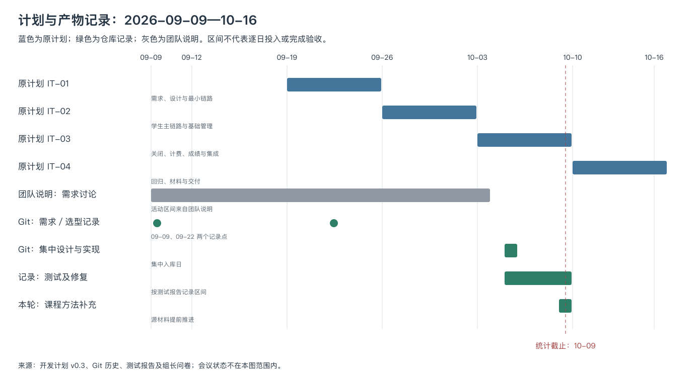
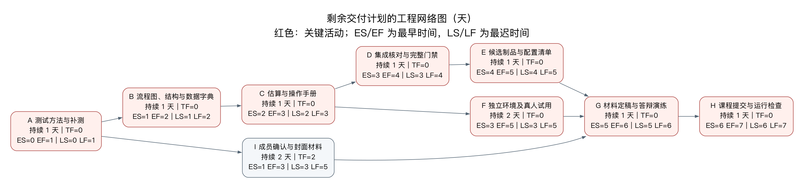

# 课程工作量估算与进度分析

- 版本：v0.1，2026-10-09；关联 US-030／IT-04。
- 本文是收尾阶段的回顾估算及剩余工作计划。数值输入见 [estimation-inputs.json](estimation-inputs.json)，计算命令为 `node scripts/course-estimates.mjs`；加 `--json` 可导出逐项结果。
- 图形复现：本机具备 Graphviz 与 librsvg 时运行 `node scripts/course-diagrams.mjs`，生成甘特图、工程网络图及模块结构 PNG，并保留 SVG／DOT 源文件。
- 依据：[开发计划](../PROJECT_DEVELOPMENT_PLAN.md)、UC-01—14、[API 契约](../design-docs/api-contract.md)、[数据字典](../design-docs/data-dictionary.md)、课件 9.1—9.4。活动时间与完成证据分别列出。

## 1. 功能点估算

### 1.1 边界与计数规则

边界包括 Web、API 和本地业务数据库；目录与计费系统是外部实体。模拟服务承担测试替身，不能再把模拟器功能重复计入本系统的功能点。按用户可辨认的完整基本过程计数，同一过程的多个 HTTP 请求合计一次；保存、正式提交、删除的意图和处理不同，分别计数。首次提交与后续加退选共用完整替换过程，合计一次。

采用课件的 EI（外部输入）、EO（有计算或派生结果的外部输出）、EQ（查询）、ILF（内部逻辑文件）、EIF（外部接口文件）五类。18 张物理表按用户能识别的数据组归并成 8 个 ILF，目录为 1 个 EIF；会话、锁、审计等内部技术设施不各算一个用户功能。学生和教授账户属性分别归入人员资料；教务登录仍复用同一个认证过程。账单确认作为发送过程的响应，不另算一个输入功能。

DET 是不重复、用户可识别的数据元素类型；数组的多行只计一种字段，UUID、CSRF、技术版本等内部控制字段不因出现在 HTTP 中就自动计入。FTR 是过程读／写的不同逻辑数据组数，同一组读写只计一次；RET 是逻辑文件内用户可识别的记录子组数。每项具体字段、数据组引用和分组合并理由均保存在 JSON 中，可据此修改假设后复算。

复杂度采用 DET 与 FTR／RET 的矩阵，权重如下。矩阵及权重参照 [ICEAA 功能点方法论文第 5 页表 1—4](https://www.iceaaonline.com/wp-content/uploads/2021/06/SWA03-paper-Hira-Get-to-the-Point.pdf)，概念边界参照 [IFPUG FPA](https://ifpug.org/ifpug-standards/fpa)。技术因子采用本课程课件的 14 项命名。此处用于教学估算，未经认证计数人员审定。

| 类型 | 低 | 中 | 高 |
| --- | --- | --- | --- |
| EI | 3 | 4 | 6 |
| EO | 4 | 5 | 7 |
| EQ | 3 | 4 | 6 |
| ILF | 7 | 10 | 15 |
| EIF | 5 | 7 | 10 |

矩阵均按行列由低到高取值：`[[低,低,中],[低,中,高],[中,高,高]]`。EI 的 DET 分段为 1—4／5—15／16+，FTR 为 0—1／2／3+；EO／EQ 的 DET 为 1—5／6—19／20+，FTR 为 0—1／2—3／4+；ILF／EIF 的 DET 为 1—19／20—50／51+，RET 为 1／2—5／6+。

### 1.2 逐项清单与结果

下表 RET／FTR 列对 ILF／EIF 表示 RET，对事务功能表示 FTR。

| 编号 | 用例 | 基本过程／数据组 | 类型 | DET | RET／FTR | 复杂度 | 权重 |
| --- | --- | --- | --- | --- | --- | --- | --- |
| I1 | UC-09 | 学生资料 | ILF | 8 | 1 | 低 | 7 |
| I2 | UC-08/14 | 教授资料与资格 | ILF | 9 | 2 | 低 | 7 |
| I3 | UC-12/10 | 学期及阶段 | ILF | 14 | 2 | 低 | 7 |
| I4 | UC-03 | 学生课表、注册与通知 | ILF | 14 | 3 | 低 | 7 |
| I5 | UC-04 | 授课安排及历史 | ILF | 5 | 2 | 低 | 7 |
| I6 | UC-06/07/14 | 成绩记录 | ILF | 7 | 1 | 低 | 7 |
| I7 | UC-11 | 完整账单与发送状态 | ILF | 21 | 2 | 中 | 10 |
| I8 | UC-02/04/10 | 班次本地状态 | ILF | 7 | 1 | 低 | 7 |
| X1 | UC-02 | 外部课程目录 | EIF | 14 | 3 | 低 | 5 |
| T01 | UC-01 | 登录 | EI | 3 | 2 | 低 | 3 |
| T02 | UC-01 | 退出 | EI | 2 | 0 | 低 | 3 |
| T03 | UC-01 | 修改密码 | EI | 3 | 2 | 低 | 3 |
| T04 | UC-03 | 保存课表 | EI | 4 | 2 | 低 | 3 |
| T05 | UC-03 | 正式提交／加退选 | EI | 5 | 7 | 高 | 6 |
| T06 | UC-03 | 删除课表 | EI | 3 | 1 | 低 | 3 |
| T07 | UC-04 | 更新授课选择 | EI | 5 | 5 | 高 | 6 |
| T08 | UC-06 | 录入／修改成绩 | EI | 5 | 5 | 高 | 6 |
| T09 | UC-08 | 新建教授 | EI | 9 | 2 | 中 | 4 |
| T10 | UC-08 | 修改教授／账户状态 | EI | 9 | 5 | 高 | 6 |
| T11 | UC-08 | 删除教授 | EI | 3 | 4 | 中 | 4 |
| T12 | UC-09 | 新建学生 | EI | 9 | 2 | 中 | 4 |
| T13 | UC-09 | 修改学生／账户状态 | EI | 9 | 5 | 高 | 6 |
| T14 | UC-09 | 删除学生 | EI | 3 | 5 | 中 | 4 |
| T15 | UC-10 | 请求关闭选课 | EI | 3 | 7 | 中 | 4 |
| T16 | UC-12 | 设定阶段窗口 | EI | 7 | 1 | 低 | 3 |
| T17 | UC-13 | 关闭后补选 | EI | 6 | 7 | 高 | 6 |
| T18 | UC-14 | 导入学生 | EI | 10 | 2 | 中 | 4 |
| T19 | UC-14 | 导入教授 | EI | 10 | 2 | 中 | 4 |
| T20 | UC-14 | 导入历史成绩 | EI | 7 | 4 | 高 | 6 |
| T21 | UC-14 | 导入授课资格 | EI | 5 | 2 | 中 | 4 |
| T22 | UC-08 | 教授影响预览 | EO | 8 | 4 | 高 | 7 |
| T23 | UC-09 | 学生影响预览 | EO | 8 | 4 | 高 | 7 |
| T24 | UC-10 | 关闭结果及计费汇总 | EO | 12 | 4 | 高 | 7 |
| T25 | UC-11 | 发送完整账单 | EO | 14 | 5 | 高 | 7 |
| T26 | UC-02 | 查询目录 | EQ | 19 | 6 | 高 | 6 |
| T27 | UC-03 | 查看课表 | EQ | 12 | 2 | 中 | 4 |
| T28 | UC-03 | 查看变更通知 | EQ | 6 | 1 | 低 | 3 |
| T29 | UC-04 | 查看授课选择 | EQ | 3 | 2 | 低 | 3 |
| T30 | UC-05 | 查看本人授课班次 | EQ | 9 | 5 | 高 | 6 |
| T31 | UC-05 | 查看名册 | EQ | 6 | 5 | 高 | 6 |
| T32 | UC-07 | 查看成绩单 | EQ | 6 | 4 | 高 | 6 |
| T33 | UC-08 | 查询教授资料 | EQ | 9 | 1 | 低 | 3 |
| T34 | UC-09 | 查询学生资料 | EQ | 9 | 1 | 低 | 3 |
| T35 | UC-11 | 查看账单送达状态 | EQ | 11 | 1 | 低 | 3 |
| T36 | UC-13 | 读取补选上下文 | EQ | 14 | 5 | 高 | 6 |

| 类别 | 数量 | 加权点数 |
| --- | --- | --- |
| EI | 21 | 92 |
| EO | 4 | 28 |
| EQ | 11 | 49 |
| ILF | 8 | 59 |
| EIF | 1 | 5 |
| 合计 | 45 | **233 UFP** |

### 1.3 技术复杂度因子

每项按 0（无影响）—5（很强影响）评分。以下是根据现有需求和设计作出的估算判断，后续可由团队修订。

| 因子（沿用课件名称） | Fi | 依据 |
| --- | --- | --- |
| F1 备份与恢复 | 3 | 持久化会话、关闭恢复、账单租约 |
| F2 数据通信 | 4 | 浏览器、API 与两类外部 HTTP |
| F3 分布式处理 | 1 | 单 API，外部服务独立但无分片 |
| F4 性能 | 4 | 500／2000 用户与时延指标 |
| F5 大量使用的配置 | 2 | 同机资源约束，资源利用需观测 |
| F6 联机数据输入 | 5 | 主要业务为在线表单 |
| F7 操作简便性 | 4 | 三角色交互、错误提示与确认 |
| F8 在线升级 | 0 | 当前无无停机热升级 |
| F9 复杂界面 | 2 | 表格、对话框与本地编辑状态 |
| F10 复杂数据处理 | 4 | 事务调剂、幂等计费及故障恢复 |
| F11 重复使用性 | 3 | 共享规则、contracts 与组件 |
| F12 安装简便性 | 3 | 初始化脚本，独立环境待复现 |
| F13 多工作点安装 | 1 | 单套部署，未规划多站点 |
| F14 易于修改 | 4 | 模块与迁移版本化，规则可测试 |

ΣFi = 40；TCF = 0.65 + 0.01 × 40 = **1.05**；FP = 233 × 1.05 = **244.65**。

功能点能用来对比功能规模。团队尚无“每功能点实际人时”的历史样本，因此不把它直接转换成承诺工时，也不把现有 157 小时除以 FP 得到的比值用于预测下一项目。不同的逻辑文件分组、DET 识别和过程拆分会改变估算，JSON 保留这些假设供复核。

## 2. COCOMO 与回顾工时

### 2.1 规模口径

原计划中“5.85 KLOC”没有保留可复算的行数口径，本次重新固定统计范围。2026-10-09 的 TS／TSX 非空物理行如下（含注释，不含测试、CSS、schema、seed、迁移、生成代码及第三方依赖）：

| 目录 | 非空行 |
| --- | --- |
| `apps/api/src` | 1313 |
| `apps/web/src` | 3457 |
| `apps/simulators/src` | 393 |
| `packages/contracts/src` | 238 |
| `packages/db/src` | 1 |
| 全部上述源码（含模拟服务） | **5402** |
| 主系统（排除模拟服务） | **5009** |

物理行与传统模型使用的交付源代码指令并不等价，TypeScript 的压缩写法、框架和复用也影响可比性。这里把 5.009 KLOC 作为主系统的近似规模输入，5.402 KLOC 表示包含模拟服务的敏感性情景；4 和 7 KLOC 是人为设置的低／高规模情景，5.85 仅保留为旧估值对照。它们都不是开发开始时留下的规模预测。

### 2.2 基本模型与中级模型

选择组织型作为课程演算情景：小型信息系统、少于 5 万行、无嵌入式硬实时约束。但团队经验及性能约束未必符合模型的全部标定条件，因此结果作为量级对照。

- 基本组织型：E = 2.4 × KLOC^1.05；T = 2.5 × E^0.38。
- 中级组织型：E = 3.2 × KLOC^1.05 × EAF；T = 2.5 × E^0.38。
- E 为人月，T 为日历月；两者不能与团队人数或兼职周数直接互换。

中级模型的 15 个因子为 RELY、DATA、CPLX、TIME、STOR、VIRT、TURN、ACAP、AEXP、PCAP、VEXP、LEXP、MODP、TOOL、SCED。缺少可靠的历史评分，本次全部取 nominal＝1，EAF＝1。这是明确的基准情景，不声称这些项目属性实测均为平均水平。若假设 EAF 为 0.8／1.2，中级工作量随之乘 0.8／1.2，工期乘相应因子的 0.38 次方。

| KLOC 情景 | 基本人月 | 基本工期（月） | 中级人月（EAF=1） | 中级工期（月） |
| --- | --- | --- | --- | --- |
| 4 | 10.29 | 6.06 | 13.72 | 6.76 |
| 5.009 | 13.03 | 6.63 | 17.37 | 7.40 |
| 5.402 | 14.11 | 6.83 | 18.81 | 7.62 |
| 5.85 | 15.34 | 7.06 | 20.45 | 7.87 |
| 7 | 18.52 | 7.58 | 24.69 | 8.45 |

公式以课件 9.1 的基本／中级组织型表为准，亦可核对 [Boehm 的 COCOMO 原始模型说明](https://staff.emu.edu.tr/alexanderchefranov/Documents/CMPE412/Boehm1981%20COCOMO.pdf)。课件前面的经验公式示例出现 3.2，不把它与基本组织型的 2.4 系数混用。

### 2.3 经组长审核的回顾工时

来源：根据提交内容和团队说明推断，2026-10-09 经组长审核接受。下表是回顾估算，没有逐日签到／工时日志；0 表示本表未分配该阶段时数，不能据此断言某成员没有线下参与。

| 成员 | 9 月需求与建模 | 10-05 设计与实现 | 10-06—09 测试、修复、文档 | 合计（小时） |
| --- | --- | --- | --- | --- |
| 倪成锦 | 30 | 14 | 16 | 60 |
| 浩宇 | 8 | 8 | 3 | 19 |
| 冯海洋 | 8 | 7 | 3 | 18 |
| 马喆 | 8 | 5 | 3 | 16 |
| 范昭 | 8 | 8 | 4 | 20 |
| 冯海伦 | 8 | 0 | 16 | 24 |
| 合计 | 70 | 42 | 45 | **157** |

按每人月 152 小时的换算约定，157／152 = **1.033 人月**。该换算用于模型比较，不代表小组实际连续工作了一个月；每人月小时数属于约定，可参考 [ICEAA 软件成本估算课程](https://www.iceaaonline.com/wp-content/uploads/2015/06/CEB-09-Software-Cost-Estimating.pdf)。

主系统基本模型为 13.03 人月，与 1.033 人月相差很大。可解释的因素包括：模型的历史标定样本不同、采用现成框架与模板、部分功能使用模拟系统、成员兼职且记时为回顾估计、行数口径不一致，以及课程交付和独立验收尚未全部结束。团队确认 AI 用于辅助代码，需求决策和审定由成员承担；本项目没有对照实验，不能把差值计算成“AI 提效倍数”。

## 3. 原计划、可核实记录与偏差

图中蓝色为开发计划 v0.3 的四个迭代；绿色为仓库可核实的产物记录区间；灰色为团队说明的活动区间。日期区间只表示相应来源可支持的范围，不推断每天投入，更不从提交集中反推线下没有工作。US-030 的源材料在 10-09 提前推进，原 10-10—12 节点保留作计划对照。

| 阶段 | 原计划 | 当前依据 | 偏差与处理 |
| --- | --- | --- | --- |
| 需求、建模与设计 | 09-19—25 形成第一轮增量 | 团队说明 09-09—10-03 正常讨论并开展需求工作；仓库 09-09／09-22 有文档，代码与设计大量于 10-05 入库 | 活动记录与入库时间脱节；按成员说明记录线下工作，后续每日同步可交付小增量 |
| 业务实现 | IT-02—03 逐轮交付 | 10-05 出现底座、设计和三角色业务代码的集中提交；用户确认各成员与 Agent 协作完成负责模块 | 集中入库压缩了逐增量核对的可见空间；拆分职责、PR 与逐 AC 证据弥补可追溯性 |
| 测试与修复 | IT-04 10-10—16 | 10-05 起已有开发测试，10-06—09 留下独立验收脚本、负载诊断、PERF-01 与 BUG-001 修复记录 | 测试较计划提前；负载问题通过诊断、修复和长测闭环，课程测试术语与方法映射在本轮补齐 |
| 交付 | 10-14 候选包、10-16 提交 | 截至 10-09，候选 tag、跨机复现、真人 Alpha 和课程提交仍待执行 | 剩余工作按网络图安排；预留复演窗口，逐项记录实际结果 |

本轮按用户要求不处理评审资料及相关状态。上述分析只讨论计划、工作说明、产物入库和验证记录；会议情况不作为本轮偏差结论。

## 4. 剩余工作的工程网络图与关键路径

以下在 10-09 对剩余交付活动作计划演算，以 **10-10 零时为 t=0**，一天为一个活动持续单位，t=7 对应 10-17 零时，即覆盖 10-16 当日。A—C 的初稿已提前推进，但仍保留原计划一天／项作为核对、修订窗口。时长为计划假设；真人试用、跨机运行和最终提交不能由文档自动完成。

采用 AON 活动节点网络。正向计算 ES=max(前驱 EF)、EF=ES+持续时间；反向计算 LF=min(后继 LS)、LS=LF−持续时间；总时差 TF=LS−ES。终点 LF 取项目最早完成时刻 7。

| 活动 | 负责 | 前驱 | 持续天 | ES | EF | LS | LF | TF |
| --- | --- | --- | --- | --- | --- | --- | --- | --- |
| A 测试方法与补测 | 冯海伦／倪成锦 | 无 | 1 | 0 | 1 | 0 | 1 | 0 |
| B 流程图、结构与数据字典 | 倪成锦 | A | 1 | 1 | 2 | 1 | 2 | 0 |
| C 估算与操作手册 | 倪成锦／范昭 | B | 1 | 2 | 3 | 2 | 3 | 0 |
| D 集成核对与完整门禁 | 倪成锦 | C | 1 | 3 | 4 | 3 | 4 | 0 |
| E 候选制品与配置清单 | 范昭 | D | 1 | 4 | 5 | 4 | 5 | 0 |
| F 独立环境及真人试用 | 冯海伦／参与成员 | C | 2 | 3 | 5 | 3 | 5 | 0 |
| I 成员确认与封面材料 | 全员 | A | 2 | 1 | 3 | 3 | 5 | 2 |
| G 材料定稿与答辩演练 | 全员 | E、F、I | 1 | 5 | 6 | 5 | 6 | 0 |
| H 课程提交与运行检查 | 倪成锦／全员 | G | 1 | 6 | 7 | 6 | 7 | 0 |

两条关键路径均为 **7 天**：A→B→C→D→E→G→H；A→B→C→F→G→H。I 有 2 天总时差；其他活动时差为 0。D／E 与 F 可并行，但这要求范昭、冯海伦和环境资源可同时投入，实际资源不足时必须重排。任何关键活动延误都会使末端超过 10-16；提前完成 A—C 可转为后续缓冲，不能预先把缓冲算成已经获得。

## 5. 人员组织与质量保证

用户确认采用“接近主程序员组”的组织：倪成锦负责关键决策、核心实现与集成；范昭承担外部系统、运行交付和部分编程秘书职责；浩宇、马喆、冯海洋分别承担三角色模块；冯海伦负责测试。没有专职后备程序员，主程序员仍可能成为瓶颈。通过契约、模型、可运行测试和交接文档降低单人知识集中风险，具体职责以 [TEAM_ROLES](../TEAM_ROLES.md) 为准。

质量保证措施包括需求／AC 可追溯、边界与路径测试、真实 PostgreSQL 集成、浏览器操作、性能复测、依赖锁定与漏洞扫描、CI 类型检查与构建、配置管理清单及版本化文档。本文只列已存在的机制；执行证据见 [测试报告](../TEST_REPORT.md) 和 [配置管理计划](../CONFIG_MANAGEMENT_PLAN.md)。技术走查与正式评审的结果由相应流程另行登记。

风险概率、影响和责任人统一维护在开发计划第 7 节。可维护性措施见 [维护设计](../design-docs/maintainability.md)。不另做 CMM 组织成熟度评级或软件再工程计划，因为本课程项目缺少组织级历史数据和遗留系统改造范围；可靠性 MTTF 需要长期故障记录，本次不以短时测试外推。
