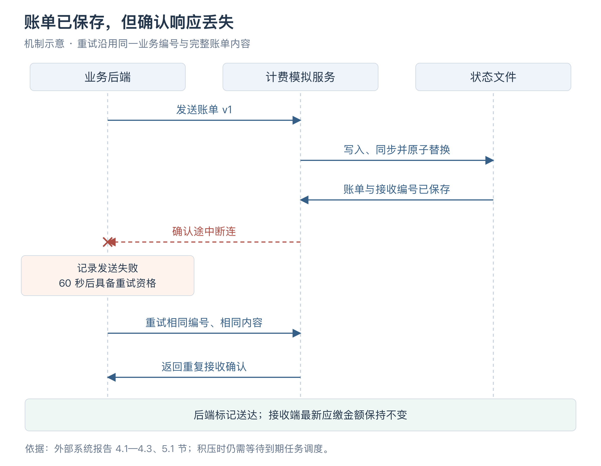
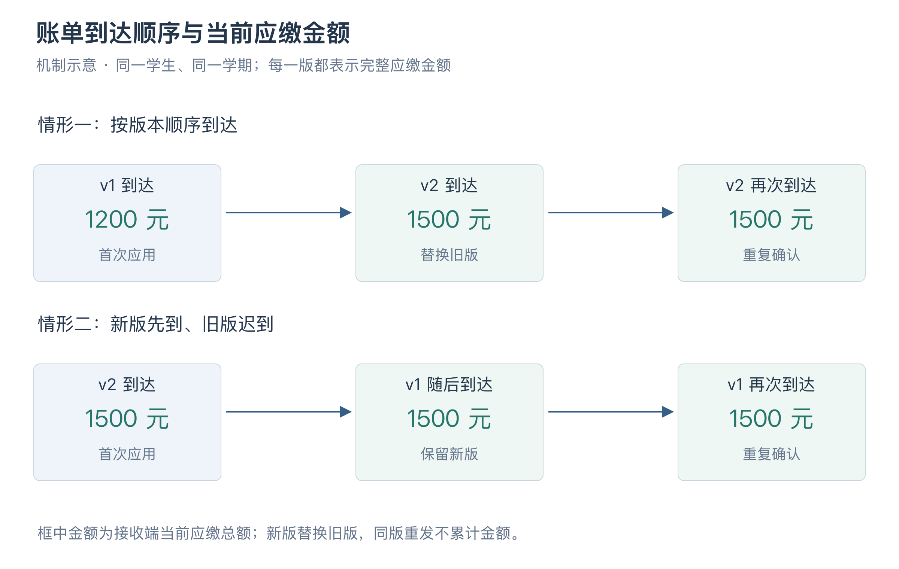

# 范昭个人工作汇报

- 姓名：范昭；学号：21230724。
- 项目：Wylie College 学生选课系统；角色：外部系统与交付负责人。
- 版本：v0.4；修订日期：2026-10-09。
- 汇报整理关联：US-028／IT-04；领域工作关联 US-005、US-016、US-022、US-027、US-029。

## 一、本人职责

我负责课程目录和计费模拟系统、演示数据、运行环境与启动说明，也承担配置管理和交付材料的整理。各业务模块需要能用的账号和课程数据，测试需要能控制的外部故障，交付时又需要让接手的人从同一份源码启动系统。这几部分相互关联，因此我把初始化、模拟服务和运行说明一起考虑。

在接通系统的过程中，演示账号曾经无法登录；计费测试则需要处理另一种容易误判的情况：发送方没有收到响应，外部其实已经保存了账单。程序重启、补选更正和目录变化，又要求两边继续使用原来的记录。下面按这些问题说明我的需求分析、设计、实现和验证工作。

## 二、需求分析与系统边界

### 2.1 课程目录与选课数据的职责边界

题目要求选课系统连接学校已有的课程目录与计费系统，但课程设计没有提供可直接访问的真实系统。小组在需求澄清时决定自行实现两个模拟服务。我需要保留题目中的外部关系，使业务后端能够通过网络读取课程、发送账单，也能够遇到连接失败和响应延迟。

课程目录提供课程名称、院系、学分、先修关系、班次和上课时间。教授选择哪些班次、学生是否已经取得名额、成绩和关闭结果，由选课系统维护。例如，教授在本系统选定了一个班次，外部目录就不应再传入另一份教授安排覆盖它。把数据来源分清后，双方才有确定的更新范围。

我采用独立进程运行模拟服务，并把它的目录和账单保存在独立文件中。如果模拟器直接查询业务数据库，测试修改外部目录时就很难分清哪些变化来自模拟器、哪些来自业务处理。分开以后，可以只在外部把一门课改到另一个上课时间，再观察后端是否刷新、原课表是否出现冲突提示。

独立存储仍需要共同的课程标识。业务初始化和模拟器使用同一份虚构数据中的课程、班次和学期 ID，避免两边各生成一套编号，再按名称寻找对应关系。

### 2.2 关闭结果与计费失败的处理

关闭选课会确定最终课表并计算学费。若计费系统暂时不能连接，重新执行关闭可能再次调剂，改变已经确定的结果。因此，需求中把关闭结果和账单送达分开：关闭结果保留，尚未送达的账单每隔 60 秒继续尝试，程序重启后也要接着处理。

没有选上任何课程的学生同样需要一张零元账单。否则，只看计费记录无法区分这个学生无需缴费，还是系统漏掉了他。补选则会产生新的完整账单，用来替换原来的总金额。重发旧账单与生成新账单是两种操作，后续编号和版本设计都要能区分它们。

账单只发送必要的学生身份、最终课程与金额，不发送成绩。课程学分和计费单价需要保留结算时的值，避免目录后来修改后，重试同一张账单却算出另一个金额。这些约定写入了[需求分析](../../REQUIREMENTS_ANALYSIS.md)和[外部接口契约](../../design-docs/api-contract.md)。

### 2.3 部署结构与服务依赖

系统按浏览器、业务后端、PostgreSQL 和独立模拟服务部署。开发时，页面使用 5173 端口，业务后端使用 3000，模拟服务使用 3001，数据库使用 5432；构建后由 Hono 同源提供页面和业务接口。浏览器通过后端处理选课，外部目录与计费也由后端访问。

图 1 组件与部署模型。业务后端连接数据库和独立模拟服务，模拟器单独保存目录与账单。图来自团队共享的[设计模型](../../design-docs/design-models.md)。

代码分为页面、业务后端、模拟服务、数据库访问和共享接口类型五个包。页面与模拟器都不依赖数据库包；金额、版本和错误响应使用共享类型校验，减少两端对同一字段的不同解释。当前方案运行一个业务后端进程，模拟状态文件也由一个进程写入，后面的排队和恢复机制都按这个运行范围设计。

## 三、环境初始化与演示账号联调

### 3.1 演示账号的登录故障

初次把演示数据和登录后端接起来时，使用初始化生成的账号仍然提示密码不正确。密码处理除了密码本身，还使用一段随机数据，称为盐值。初始化程序采用 16 字节随机盐计算 scrypt 摘要，再把盐转成十六进制文字保存。后端读取时直接把这段文字用于计算，没有还原成原来的字节，两次计算的输入就不同了。

登录模块自己的测试没有暴露这个问题，因为生成摘要和验证摘要都调用了同一套函数。两次采用相同的错误方式，结果仍然能够对应；换成初始化程序独立生成的账号，才出现失败。联调由倪成锦统筹修正后端解码，并用固定原始盐值和独立计算结果补上回归，随后重新检查登录、首次改密与会话保持。

这个问题也明确了演示数据应当怎样验证。我负责的 seed 测试直接使用独立的 `scryptSync`，按原始盐字节重新计算摘要，并核对生成的数据。这样既能检查初始化本身，也能给登录模块提供一份独立的对照，避免两端共享同一个错误后互相证明正确。

### 3.2 演示数据与业务阶段

演示库包含 14 名学生、4 名教授和 1 名教务员，共 19 个账号。我把数据安排在四个学期中，分别表示上线前历史、上一已完成且为上线学期的学期、当前初选和未来学期。

这几种状态对应不同操作。学生检查先修课，需要历史及格和不及格记录；教授录入成绩，需要上一已完成学期的名册，以及 A、I、未录入等不同成绩；当前初选则从没有预占名额的状态开始，便于观察保存和正式提交带来的差别。只给每张表放几条数据，无法把这些过程连起来。

上一学期还准备了 14 笔待发送账单，其中 10 笔 300 元、4 笔零元，用来构造已有关闭结果、等待发送的情形。这批记录属于初始化数据。后续真实关闭联调形成的 3 笔 1100 元和 11 笔零元账单，来自另一批操作，报告中分别记录。

每个账号使用独立的随机初始密码，首次登录要求改密。明文只保存在本机的私有凭据文件中，文件权限为 600；对外提供的目录 JSON 只包含课程数据。这样其他成员可以在自己的空数据库里生成演示账号，不需要复制开发机的密码。

### 3.3 重复初始化与数据保留

演示开始以后，账号可能已经改密，学生也可能完成选课，学期甚至已经关闭。如果为了重新启动就清空数据库、重新灌入初始数据，这些操作结果都会消失。因此，初始化脚本需要能够重复执行，并保留已有状态。

`env:local` 只补缺少的配置，已有密码和密钥继续使用；`.agents/setup` 准备依赖、数据库环境和数据客户端，不自动重新灌入演示数据。迁移应用已提交的 SQL，seed 发现已有账号或学期就跳过。即使凭据文件丢失，也不会擅自重置已改过的密码。

验证时，seed 集成测试建立随机命名的独立数据库，应用真实迁移后连续执行两遍 seed，比较两次凭据文件，检查 19 个密码是否各不相同、人员数量是否正确、当前学期是否仍为零注册，以及历史账单是否保留。[联调记录](../../histories/2026-10/20261005-0312-system-design.md)也记录了连续执行两次 `.agents/setup` 后，已有数据和凭据保持不变。

测试和演示分别使用数据库与模拟状态文件。这样，关闭、故障注入和重启测试可以修改自己的数据，其他成员正在使用的演示环境仍能继续工作。需要重新从初选开始时，另建空环境初始化即可。

## 四、计费发送与响应丢失处理

### 4.1 账单标识与重复发送

发送账单时，连接可能在两个不同的位置中断。一种是计费服务还没有接收请求，另一种是计费服务已经保存了账单，但确认响应没有送回。业务后端看到的都可能是网络错误，仅凭这个结果无法判断对方有没有收到。

如果每次失败都换一个编号发送，第二种情况就可能被当作两张账单。因此，每版账单都采用固定的业务编号，由学期、学生和版本组成。同一版重试时沿用编号与完整内容；接收端发现内容与已保存的相同，就返回已接收，不增加应缴金额。只有补选等业务变化才生成新版本。

这里还需要检查内容。如果编号相同，学生姓名或课程快照却变了，接收端不能直接当作重复成功，而应拒绝冲突并保留原记录。测试还调整 JSON 字段顺序，确认单纯的书写顺序变化不会被当成另一份账单。

### 4.2 持久化与接收后断连

为了检查这种情况，我在计费模拟器中加入了接收后断连模式。服务先把账单可靠写入文件，再销毁真实 HTTP 连接。调用者会收到连接失败，但状态文件中已经有这张账单。这个顺序使发送方必须面对“对方可能已接收”的情况。

保存也不能只改变内存。若内存更新后立即回应成功，进程退出就会丢失接收记录；若直接覆盖原文件，写到一半退出又可能留下不完整的 JSON。实现采用同目录临时文件，写入并执行 `fsync` 后原子替换，再同步父目录，完成后才更新内存并确认接收。

文件写入失败时，模拟器停止后续状态读写，要求修复存储后重启。这样可以避免磁盘结果尚不确定时，程序继续拿旧内存覆盖文件。对应测试先保存旧账单，再制造写入失败，检查新版返回 503；修复路径并重启后，旧记录仍在，新版能够重新发送。

图 2 按接收后断连的故障模式绘制。账单先可靠写入文件，响应丢失后发送方沿用原编号和内容重试；重复确认不增加应缴金额。图中的顺序对应[模拟服务存储实现](../../../apps/simulators/src/store.ts)，间距不表示真实耗时。[可编辑图源](attachments/figure-billing-retry.svg)。

### 4.3 关闭事务与待发送记录

接收端能够识别重复，还需要发送端记住自己欠着哪些账单。若先完成关闭，随后才另写发送任务，中间退出就可能只留下关闭结果；若在关闭事务中等待外部响应，又会长时间占用数据库锁。

我与核心业务模块按同一套账单约定衔接：关闭或补选时，把最终课表、账单版本和待发送记录一起提交到数据库。事务成功后，后台再通过 HTTP 发送。待发送记录称为 outbox，它保存本次应发送的完整内容，而非只有一个需要重新计算金额的提醒。

因此，计费暂时不可用时，教务已经确定的关闭结果仍然保留；后台只处理尚未送达的消息。收到确认后，还要核对响应对应的账单编号与版本，避免把一份无关的成功响应当成本账单已送达。

## 五、程序重启与补选后的账单更正

### 5.1 发送任务的租约与重试恢复

程序可能在取出任务后退出，也可能在外部已接收、本地还没记下确认时退出。如果发送状态永远停在“正在发送”，重启后这张账单就不会再被处理；如果完全忽略原状态，又可能重复启动大量仍在处理的请求。

发送任务因此设置了有效期限。领取任务时，数据库记下正在发送的状态、尝试次数和 15 秒租约；失败后，记录失败时刻加 60 秒作为下次尝试时间。重启时检查租约是否过期，过期任务可以恢复，但仍按已保存的到期时间重试。重试使用原来的编号和内容，即使外部曾经接收，也只会得到一次重复确认。

后台每轮最多取 50 条到期记录，每组最多同时发送 8 条，等已启动的请求结束后再开始下一轮。这样既能限制资源占用，也不会因一条慢请求让全部账单逐笔等待。60 秒表示失败后再次具备发送资格；积压较多时，还要等待前面的任务处理。

### 5.2 接收端重启与去重记录

发送方恢复同一张账单时，接收方可能也重启过。因此，模拟状态文件同时保存账单内容和已经接收的业务编号，启动时从这些记录恢复最新版本。故障开关则只放在内存，重启后回到正常模式，便于继续恢复流程。

测试使用独立 Node 子进程，在接收后断连的请求失败后立即检查磁盘，确认账单确实保存，再用 `SIGKILL` 结束进程。重新启动后原样重发，接收端返回 `DUPLICATE`。随后发送一个迟到的旧版本，返回 `STALE`，最新金额保持不变。整个过程跨过了实际进程退出，能够检查是否遗漏了只存在于内存中的记录。

启动也不能把原始 seed 当作每次覆盖状态的来源。已有状态时继续使用保存的目录和账单；seed 缺失或状态 JSON 损坏时，明确报错退出，避免用一份空数据掩盖恢复失败。服务从工作区子目录或构建目录启动，都按仓库根目录解析状态路径，防止意外读到另一份文件。

### 5.3 补选账单的版本替换

假设关闭时账单版本 1 为 1200 元，补选后版本 2 为 1500 元。新版表示补选后的完整应缴金额，接收端应该保留 1500 元。如果两版相加，就会变成 2700 元；如果迟到的旧版覆盖新版，又会退回 1200 元。

接收端按学生和学期保存最高版本。新版到达就替换最新账单，同版重复只确认收到，旧版迟到则保留最新金额，同时记录旧版内容供以后的重复检查。业务后端生成新版时，也把旧版标为已被替代，停止新的旧版发送任务。

已经发出去的旧请求无法撤回。它的响应即使晚到，也只能更新与自己匹配的账单和发送状态，不能改变新版是否送达。这一检查把本地状态更新与外部的版本比较对应起来。

图 3 沿用本节 v1 为 1200 元、v2 为 1500 元的设计示例，对比正常顺序与新版先到两种情况。金额始终取当前最高版本；同版重发只确认收到。示例用于解释版本规则，不是新增账单实测。[可编辑图源](attachments/figure-billing-versions.svg)。

图 4 计费恢复顺序模型。图中连接了响应丢失、补选生成新版、旧版迟到和重启后的重发，每一版都代表完整账单。来源为团队共享设计模型。

### 5.4 账单快照与金额一致性

每版账单冻结当时的课程学分和单价。接收端按这份快照校验，目录后来改名、改学分或删除班次，都不会改变旧账单。金额计算先合计全部学分，再乘单价，最后统一舍入到分，避免逐门舍入后累积误差。

例如 3.50 学分乘 125.55 元得到 439.425 元，按约定应为 439.43 元。实现使用十进制字符串与整数计算，接收端独立检查逐项学分、总学分、单价和金额是否相符。零课程账单的学分和金额均为零，后续补选可以从零元版本继续生成有金额的新版。

## 六、目录同步与故障模拟

### 6.1 空目录与目录读取故障

目录服务出故障时，页面暂时没有新数据，但这不能被处理成该学期的课程全部删除。模拟器将几种情况分别返回：已知学期成功返回空班次集合，才表示完整目录为空；未知学期返回 404；服务不可用返回 503，超时和错误响应也按读取失败处理。

目录修改提交完整集合，服务生成递增的 revision。测试要删除一个班次，就从集合中去掉它；日期、先修引用或上课时段不合法，则拒绝整次修改，保留原目录和版本。这样，业务后端可以根据一次成功的完整更新判断变化，失败时也有明确的保留依据。

正常业务访问和测试控制分别使用凭据。后端能读取目录、发送账单，不因此获得修改目录或制造故障的权限；测试控制默认关闭，启用后也只在私有网络使用。页面不接触这些控制接口。

### 6.2 计费与目录刷新的调度冲突

联调中发现，后台最初在同一个循环里先发送账单，再刷新课程目录。计费正常时，这个先后顺序没有明显影响；外部不可用时，每笔请求都要等待超时，多笔串行发送就把后面的目录刷新一起拖住。学生迟迟看不到课程变化，原因却在计费请求上。

这两个任务没有业务上的先后依赖：已经确定的账单按冻结内容发送，目录刷新也不必等账单全部送达。因此，集成修复把目录和计费拆成独立调度，并给计费设置每组 8 个并发的限制。

复测时持续阻塞 8 个计费请求，再修改目录，检查新 revision 是否仍在 5 秒内写入本地。这个场景直接检验了计费等待期间目录能否继续更新。它也说明故障模拟需要与业务后端一起运行，仅检查模拟器是否按要求返回超时，发现不了后台任务之间的等待关系。

### 6.3 故障模式与可重复验证

模拟器提供不可用、超时、正常延迟和计费接收后断连几种模式。超时模式即使没有另外设置延迟，也会超过客户端目录 8 秒、计费 5 秒的期限。每个请求开始时记下当前故障设置，后面恢复正常只影响新请求，避免测试中途切换开关改变已经开始的操作。

构造应用与监听端口分开，测试可使用随机端口、临时目录和独立凭据，正式入口则在端口绑定成功后再报告启动。日志保留请求编号、路由、业务编号、状态与耗时，接收后断连按连接中断记录；请求体和密码不写入日志。需要追查故障时，发送端看到的失败与接收端留下的记录可以相互对照。

## 七、测试与联调结果

### 7.1 账单幂等性与金额一致性验证

模拟模块开发阶段形成了 41 项真实 HTTP 测试，覆盖目录变化、账单版本、金额、故障、存储失败和重启等场景。我在这些用例中同时关注请求结果和保存的数据，避免只看到返回成功就结束检查。

例如同时发送 8 个相同编号、相同内容的请求，预期 1 个返回首次应用，7 个返回重复，最终只保留一个已接收编号。再用同一编号发送不同姓名的合法账单，预期返回 409，原有内容不被覆盖。前一个用例检查重复发送，后一个检查编号相同但内容冲突，两者都与重试有关。

| 检查内容 | 观察的结果 |
| --- | --- |
| 初始化连续执行 | 凭据、人员数量和已有业务数据保持一致 |
| 接收后连接中断 | 发送方收到失败，接收文件中已保存账单 |
| 接收进程硬退出后重发 | 同版返回重复，最新金额与退出前一致 |
| 新版先到、旧版迟到 | 保留新版总额，不相加、不回退 |
| 状态文件写入失败 | 拒绝成功确认，修复后能读取已保存的旧记录 |
| 计费请求持续等待 | 目录仍能在约定时间内更新 |

### 7.2 关闭与计费的端到端联调

10 月 5 日的真实开发联调接通了教务关闭、业务事务、后台发送与独立 HTTP 接收。关闭形成的 14 笔账单全部获得确认，其中 3 笔为 1100 元、11 笔为零元。随后一名学生补选，原零元版本 1 被替代，300 元版本 2 获得确认，外部文件保留两版，最新金额为 300 元。

这组操作比单独调用计费接口多检查了一层：页面发起的业务变化是否真的形成了应发账单，发送内容与接收记录是否一致。模拟器记录的是应缴账单与接收结果，项目没有接入银行或实际扣款服务。

底座的数据库测试要求显式指定独立测试库，名称以 `_test` 结尾且不能与开发库相同。连接失败就报告失败，避免缺少数据库时测试被跳过。外部模拟同样使用临时文件和随机端口，便于重复运行而不干扰演示。

### 7.3 测试规模与结果范围

项目最初开发集成通过 108 项测试，集中合入时为 134 项，后续验收回归增长到 207 项，性能修复后为 215 项。这些是全项目不同阶段的统计，模拟模块的 41 项单独记录；完整结果见[测试报告](../../TEST_REPORT.md)。

性能检查也保留了不同环境的结果。原 macOS 环境的 500 用户长测通过，2000 用户档中成功且不超过 120 秒的比例为 63.04%，没有达到 80% 的要求。后续目录性能修复在 Linux 同一 orb 的三个进程中复测，采用 2000 用户、5 分钟预热和 30 分钟稳态，报告记录通过。

从环境与交付角度，这些结果说明同一程序仍需要连同机器、进程安排和运行时长一起说明。Linux 同一 orb 的通过结果不能直接用于另一台电脑，也不能推算实际部署网络中的容量。我在整理启动和交付材料时保留这些条件，方便后续复现比较。

## 八、运行检查与配置交付

### 8.1 干净环境构建与启动步骤修正

同机干净目录复现时，安装完依赖便开始构建，API 因缺少 Prisma 类型失败。原开发目录中已经有生成的数据客户端，日常构建不会遇到这一问题；干净目录只有 schema，还需要执行 `db:generate`。补上运行说明中的这一步后，构建才通过。

因此，启动流程需要明确区分安装依赖、生成客户端、应用迁移、初始化数据和启动服务。底座固定 Node.js 22 LTS、Prisma 6、PostgreSQL 15，五个 npm workspace 共用根锁文件。[运行说明](../../DEVELOPMENT.md)分别提供 Docker Compose 和 orb 入口，前者通过持久卷保存数据库，后者通过受监督服务管理进程。

我负责的 CI 增量在原有门禁中加入 PostgreSQL 15、客户端生成、测试库迁移、strict 类型检查、全量 Vitest 和三个应用构建，统一由 `make ci` 进入。文档、仓库卫生、Shell 语法和 Action 固定版本检查也继续保留。这样远程检查会重新生成依赖产物，能够发现只在干净环境才出现的问题。

### 8.2 源码打包与清单校验

10 月 8 日，仓库已形成[配置管理计划 v0.1 草案](../../CONFIG_MANAGEMENT_PLAN.md)，并更新了源码打包脚本。当前 `make release-package` 按确定的 Git 提交打包全部版本化文件，生成源码压缩包、发布清单和配置项清单。清单记录提交、运行时要求、数据库迁移、各类文件、文件版本以及源码包的 SHA-256，接收者可以核对拿到的是哪个版本。

这次采用源码交付，由目标电脑按锁文件安装、生成数据客户端并构建。Prisma 查询引擎与操作系统有关，直接复制开发机的 `node_modules` 和构建目录，换到其他操作系统可能无法运行。源码包提供重建所需的输入，私有配置和演示密码则在目标环境生成。

打包脚本只包含已经提交的内容。工作区还有未提交修改时，清单会记录这一状态，提醒核对包中是否确实包含本次准备交付的修改。脚本还提供解包后安装并完整构建的检查入口，用于确认包本身具备构建条件。发布流程中已有依赖物料清单和来源证明的生成安排，这些文件会随对应版本一同整理。

### 8.3 配置管理与交付检查

配置管理草案已形成，我负责审定并落实交付检查。草案已把源码、迁移、演示数据、测试、设计模型和课程文档等分为 13 类，以文件路径和 Git 文件版本记录配置项。这样可以从一份清单查看程序与材料是否来自同一版本，也能检查某次修改是否漏了相关文档。

候选版计划用 `v1.0.0-rc.N` 标识，修复后产生新的候选版；最终交付使用 `v1.0.0`。跨机启动、构建、文档版本和测试结果都应回到这一确定版本上核对，避免演示的是本地新代码，提交包却来自更早的提交。

源码与运行数据分别保存。数据库备份保存选课和账单发送记录，模拟状态文件保存目录修改与外部接收记录；恢复时还要使用对应的本机凭据。已有草案写明了备份和恢复步骤，后续需要结合跨机演练确认它们能完整恢复同一时刻的状态。新环境从头演示时则使用迁移和 seed，不携带开发电脑上的私有密码与运行记录。

## 九、协作、总结与后续安排

我的工作经常需要和其他模块核对同一份数据。演示账号要与登录算法对应，目录要与学生选课使用同一组班次编号，关闭和补选要生成计费端能识别的完整版本，测试又需要稳定触发这些连接处的故障。

这次几个问题改变了我对运行准备的检查顺序。账号联调暴露出两个模块各自通过仍可能无法接通，因此数据生成和消费要用独立结果交叉检查；账单重试需要同时查看发送记录和接收文件；干净目录构建则应放在交付准备中尽早执行。以后处理类似任务，我会先接通一组完整数据，再扩充场景，减少最后联调时才发现格式不一致的情况。

组长已在小组报告中确认我的贡献比例为 14%，主要对应外部系统、初始化与演示数据、运行环境和交付准备。倪成锦为 30%，其余四位成员各为 14%。个人报告内容核对和签名继续按课程材料安排完成。

截至本稿，后续工作集中在以下几项：

- 审定配置管理计划并交由倪成锦复核，按候选版本完成配置清单、源码包和材料版本检查。
- 在另一台机器上从源码包启动，优先补 Windows Chrome／Edge 操作，并演练数据库、模拟状态与凭据的备份恢复。
- 配合冯海伦完成剩余独立复核、部分故障场景和七天可用性检查，按实际环境更新测试报告。
- 确认教师接受外部模拟方案，完成候选 tag、最终基线、课程封面与签名，以及最后的程序运行检查。

这些工作的结果将补入对应的运行说明、配置计划和测试报告，供最终提交时一起核对。

## 十、工作材料索引

| 工作项 | Git 提交／PR | 文件或验证记录 |
| --- | --- | --- |
| 工作区与依赖基线 | [e5d0f13](https://github.com/Nichengjin/software-engineering-project/commit/e5d0f13)、[PR #7](https://github.com/Nichengjin/software-engineering-project/pull/7) | [根包配置](../../../package.json)、[运行说明](../../DEVELOPMENT.md) |
| 虚构数据与随机凭据 | [435edd9](https://github.com/Nichengjin/software-engineering-project/commit/435edd9)、[PR #9](https://github.com/Nichengjin/software-engineering-project/pull/9) | [seed 实现](../../../packages/db/prisma/seed.ts)、[独立数据库复验](../../../packages/db/src/seed.integration.test.ts) |
| 初始化及本地运行 | [33df617](https://github.com/Nichengjin/software-engineering-project/commit/33df617)、[PR #9](https://github.com/Nichengjin/software-engineering-project/pull/9) | [重复初始化与联调记录](../../histories/2026-10/20261005-0312-system-design.md) |
| 目录和计费模拟 | [95a0f52](https://github.com/Nichengjin/software-engineering-project/commit/95a0f52)、[PR #12](https://github.com/Nichengjin/software-engineering-project/pull/12) | [模拟服务说明](../../SIMULATORS.md)、[持久化实现](../../../apps/simulators/src/store.ts) |
| 幂等、故障与恢复测试 | [25c6b62](https://github.com/Nichengjin/software-engineering-project/commit/25c6b62)、[PR #12](https://github.com/Nichengjin/software-engineering-project/pull/12) | [真实 HTTP 与硬重启测试](../../../apps/simulators/test/http.test.ts) |
| 账单与发送重试 | [950fbd3](https://github.com/Nichengjin/software-engineering-project/commit/950fbd3)、[PR #19](https://github.com/Nichengjin/software-engineering-project/pull/19) | [计费服务](../../../apps/api/src/modules/billing/service.ts)、[后端详细设计](../../design-docs/backend-detail.md) |
| 完整 CI | [99e9e29](https://github.com/Nichengjin/software-engineering-project/commit/99e9e29)、[PR #23](https://github.com/Nichengjin/software-engineering-project/pull/23) | [CI/CD 说明](../../CICD.md)、[远程 134 项 CI](https://github.com/Nichengjin/software-engineering-project/actions/runs/37324793707) |
| 验收与性能结果 | [测试报告](../../TEST_REPORT.md) | [集中检查修复记录](../../histories/2026-10/20261005-merge-checks.md) |
| 配置管理与源码交付 | [配置管理计划](../../CONFIG_MANAGEMENT_PLAN.md) | [源码打包脚本](../../../scripts/release-package.sh)、[清单生成脚本](../../../scripts/release-manifest.mjs) |
| 图 1、图 4 | [设计模型说明](../../design-docs/design-models.md) | D01 组件部署图、D04 计费版本恢复图 |

### 修订记录

| 日期 | 版本 | 修订内容 |
| --- | --- | --- |
| 2026-10-07 | v0.1 | 依据分工、提交、实现和验证记录形成简版初稿 |
| 2026-10-08 | v0.2 | 扩充需求、契约、初始化、模拟、计费恢复和交付过程，加入两张共享设计图 |
| 2026-10-09 | v0.2续 | 补充外部模拟前提与组内讨论 |
| 2026-10-09 | v0.3 | 按账号接通、响应丢失、重启恢复和补选更正重组全文；压缩接口与重复声明，更新配置计划和源码交付进度，补入贡献比例 |
| 2026-10-09 | v0.4 | 统一章节标题，新增两张流程、交互或数据图，补充图注、可编辑图源与已有记录来源，更新图号及引用 |
