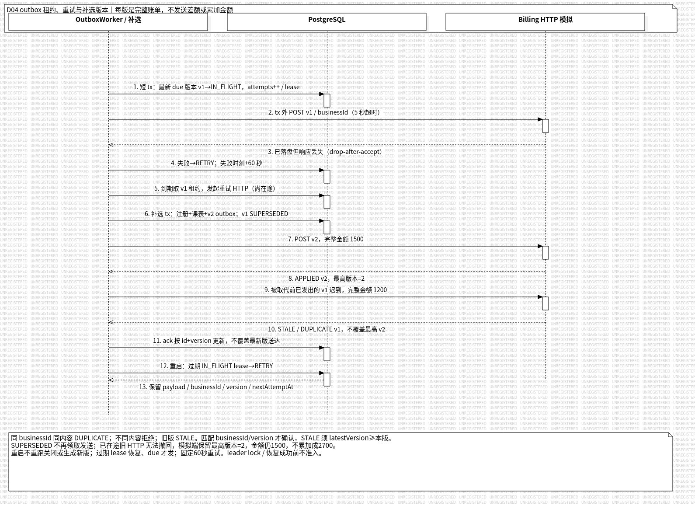

# 范昭个人工作汇报（扩充稿）

- 姓名：范昭；学号：21230724。
- 项目：Wylie College 学生选课系统；角色：外部系统与交付负责人。
- 版本：v0.2；编写日期、证据截至日期：2026-10-08。
- 汇报整理关联：US-028／IT-04；领域工作关联 US-005、US-016、US-022、US-027。
- 用途：课程个人汇报与总结草稿，正式审核、工时、贡献比例及签名另按实际记录确认。

## 一、角色与工作主线：让业务能够接入外部系统，也能够重新启动

依据[团队分工](../../TEAM_ROLES.md)和[个人指南](../../member-guides/fanzhao.md)，我负责课程目录与计费模拟系统、初始化与演示数据、运行启动说明、配置管理和提交材料汇总。我的工作贯穿两条链路：一条是为业务提供真实可访问的外部接口，另一条是让成员取得同一份源码后，能按照说明获得可验证的运行环境。

本项目代码由各成员与 Agent 协作完成，需求和技术决策由人类负责；提交中的 Amp 名称主要来自团队使用 Amp 统一撰写提交信息。本文按我的负责领域叙述设计、实现与验证过程，依据提交、源码、文档和测试记录整理。Agent 辅助执行与团队集成结果保留其实际来源，不能由工具署名否定成员参与，也不能把其他成员的具体修复、独立验收或正式审批归入我的个人经历。

我需要处理的核心问题不是简单地“让接口返回成功”：目录服务出故障不能被理解成所有课程都删除了；外部已经收到一张账单但响应丢失时，系统必须安全重发；补选后的新版账单应当替代旧版；启动脚本再次执行时不能破坏已经完成的演示。这些问题决定了环境、协议、存储和测试的具体设计。

| 阶段 | 我的工作重点 | 需要交付的可核对结果 |
| --- | --- | --- |
| 需求理解 | 区分外部目录权威、关闭结果与计费送达 | 外部边界、失败含义和恢复条件 |
| 分析与设计 | 明确进程、数据归属、版本与幂等标识 | HTTP 契约、部署模型、账单恢复模型 |
| 运行底座 | 固定依赖、迁移顺序、演示数据和配置入口 | 可重复初始化且保留已有数据的脚本与说明 |
| 模拟实现 | 真实 HTTP、故障注入、独立持久化 | 可重启的目录／计费模拟服务 |
| 计费协作 | 同事务 outbox、重试、租约及版本更正 | 内部结果不丢、外部重复接收不累加 |
| 验证与交付 | 隔离测试、持续集成和配置材料 | 有环境边界的验证记录及明确待办 |

选课事务、关闭调剂的业务规则由倪成锦统筹；学生端、教授端和教务端由对应负责人实现；冯海伦负责独立测试。我提供的环境与模拟服务应当支撑他们验证这些规则，但这并不意味着整个系统的实现或所有测试都属于我的个人成果。

## 二、需求分析：先确定外部系统拥有什么事实

### 2.1 课程目录不是本地数据库的另一个查询入口

原题中的课程目录是外部系统，因此我在实现模拟器时保留这个边界：课程名称、院系、学分、先修关系、班次和上课时间由外部目录提供；教授授课、选课人数、注册、成绩和关闭状态属于本系统。模拟器不能直接查询业务 PostgreSQL，再把查到的数据包装成“外部接口”。

如果两边共用业务表，目录故障、数据变化和网络延迟就难以独立制造，也无法证明 API 是按约定处理外部输入的。将模拟服务做成独立进程、独立状态文件后，测试可以只修改课程时间或删除一个班次，再观察业务系统如何刷新和复查，而不直接修改业务注册来替程序完成处理。

课程与班次 ID 则必须稳定一致。底座从同一份虚构源数据生成目录 JSON，业务初始化与模拟服务引用同一组标识；不能各自随机生成 UUID 后再靠课程名称猜测对应关系。这个选择兼顾数据一致性和存储独立性。

### 2.2 空目录、未知学期、服务故障必须有不同含义

对课程浏览来说，“没有课程”和“暂时没有读到课程”看起来都可能是空白页面，但后端后果不同。已知学期的成功响应包含空 `offerings`，表示该学期完整目录确实为空；未知学期返回 404；不可用返回 503，超时或坏响应同样属于读取失败。

我在模拟器和控制接口中保留这些差别，避免客户端把外部故障当成全量删除。目录更新要求提交完整集合，由服务生成递增 revision；从集合中移除班次才表示删除。非法日期、先修引用或上课时段应拒绝整次更新，原目录及 revision 保持不变。

这样测试负责人既能验证正常刷新，也能分别验证空集合和不可用的行为。目录不可用是否正确阻止提交、原注册是否保留，仍由业务模块的真实集成测试证明；模拟器负责提供具有明确语义的输入。

### 2.3 计费失败不能把选课结果恢复成未关闭

[需求分析](../../REQUIREMENTS_ANALYSIS.md)与[HTTP 契约](../../design-docs/api-contract.md)明确了计费要求：关闭形成最终课表；外部发送失败后每 60 秒重试，系统重启后继续；没有课程的学生也要有零元账单；账单不发送成绩。

我据此把“业务已经结算”和“外部已经确认接收”分开。若计费暂时不可用就重新关闭，会再次调剂并可能改变学生结果；若只在内存里记一个重试任务，进程退出后又会丢失待发送事实。持久化的待发送账单是必要的业务记录，不能只是定时器中的变量。

补选还引入了第三种情况：学生最终课程发生变化，需要生成新的完整账单版本。它不是旧账的再次发送，也不是一次额外收费指令。稳定业务标识、版本替代和零元账单，都是从这些需求推导出的协议约束。

## 三、总体与详细设计：把进程和契约边界落到文件中

### 3.1 部署结构及依赖方向

我与统筹约定的运行结构是浏览器访问 SPA／API，API 访问 PostgreSQL 和独立 HTTP 模拟服务。开发时 Vite 使用 5173，API 使用 3000，模拟使用 3001，PostgreSQL 使用 5432；交付方式由 Hono 同源托管构建后的 SPA。前端不直接连接数据库，也不直接调用模拟控制接口。

图 1：团队共享的 D01 组件与部署模型，来源为[设计模型](../../design-docs/design-models.md)，随 2026-10-05 设计实现形成，本次核对引用。图中的 API 与模拟之间使用私有 HTTP，模拟单独保存目录和账单；这是部署设计图，不是已经上线的截图。图中保留 StarUML 试用导出的水印。

工作区分为 `apps/api`、`apps/web`、`apps/simulators`、`packages/db`、`packages/contracts` 五个包。共享 DTO 和 Zod 校验避免两端分别解释金额、版本和错误响应；web／simulators 不依赖 db，防止模拟器绕过 HTTP 边界访问业务事实。

这里采用单实例 API 和单进程模拟状态写入，是明确的实现范围。API 通过专用 PostgreSQL session 的 leader lock 防止第二实例启动；模拟器只允许一个进程写同一状态文件。这些约束使恢复模型可解释，但不能把现有实现宣传成支持横向扩容的分布式系统。

### 3.2 业务访问和故障控制分开授权

外部目录与计费使用 `EXTERNAL_SERVICE_TOKEN`，测试控制另用 `SIM_CONTROL_TOKEN`，二者不能相同。控制功能默认关闭，关闭时接口返回 404；模拟只监听 loopback／私有网络，不能向 SPA 或公共入口暴露 `/control/*`。

这样做的直接原因是：正常 API 需要读取目录和发送账单，却不应该因为持有业务凭据就能随意删除课程、制造超时或读取测试控制状态。为了方便演示而让前端携带控制 token，会破坏这个边界。配置说明必须和代码保持一致，否则正确的认证代码也可能被错误部署绕开。

### 3.3 账单字段必须足以重放，又不携带无关信息

每版账单包含学生必要身份、学期、关闭时间、完整最终课程及学分快照、冻结单价和总金额。`businessId` 按 `termId:studentId:version` 构造，ID 不允许包含冒号，版本为正安全整数，避免业务标识存在多种解释。

字段采用严格校验，不接受额外的成绩、SSN 或密码。保留课程快照是为了以后能原样重试：目录后来改名、改学分或删除班次，不能改变先前已经确定的应缴金额。接收端不重新查询当前目录来“修正”旧账，也不依赖本地业务数据库判断历史消息是否合法。

确认响应同样属于契约的一部分。API 必须核对返回的 businessId、version 和 latestVersion，不能把任何 HTTP 200 都视为送达正确账单。这个边界由双方实现共同保证，不只靠接收端返回一个成功字符串。

## 四、运行底座与演示数据：重复执行不能改变已经形成的事实

### 4.1 固定工具链和启动顺序

运行底座采用 Node.js 22 LTS、Prisma 6、PostgreSQL 15 和 strict TypeScript；五个 npm workspace 共用根锁文件。成员按锁安装后，先生成 Prisma client，再应用迁移、初始化演示数据、启动服务，详细入口写入[开发说明](../../DEVELOPMENT.md)。

这一顺序不是文档排版问题。源码中的 schema 不等于已经生成的数据客户端，存在数据库也不等于已经应用当前迁移。后续同机干净目录复现曾漏跑 `db:generate`，API 构建因缺少 Prisma 类型失败；按既有说明补上后才通过。这说明交付检查必须从干净依赖开始，不能依靠开发者机器上残留的生成文件。

仓库提供 Docker Compose 和无 Docker 的 orb 两条入口。Compose 使用持久卷，orb 通过受监督服务管理 PostgreSQL 和应用；初始化脚本不靠临时后台 shell 长期维持服务。安装、初始化、迁移、seed、启动各自职责明确，失败时也能知道是哪一步尚未完成。

### 4.2 初始化的幂等性具体保护什么

`env:local` 只补缺失配置并生成机器自己的随机密钥，保留已有设置；`.agents/setup` 重复执行保留已有数据库、配置和密码，不自动 seed、不 reset。迁移使用已提交 SQL 的 deploy 路径，不能为了“启动成功”删除现有数据重来。

演示库往往已完成登录改密、关闭和补选，重跑初始化若把这些事实覆盖，就会破坏此前的演示证据。已有账户或学期时，seed 显式跳过；凭据文件丢失也不会擅自重置密码。初始化的承诺是安全补齐环境，不是每次把系统恢复成最初画面。

[集成 history](../../histories/2026-10/20261005-0312-system-design.md)记录 `.agents/setup` 连续执行两遍后已有数据和凭据保留。这是当时环境中的重复执行证据，不能代替所有机器、所有安装失败位置的恢复测试。

### 4.3 演示数据围绕业务状态组织

我与 Agent 完成的虚构 seed 包含四学期、14 名学生、4 名教授、1 名教务员。四学期分别覆盖上线前历史、上一已完成且为上线学期、当前初选和未来；历史中有先修及格／不及格，上一学期有名册以及 A、I、未录入等成绩状态，当前学期不预占注册名额。

这比为每张表随意插入几行更有价值。例如教授录分需要“上一已完成且不早于上线学期”，单有一张当前名册无法验证；学生先修判断需要历史成绩的差异；关闭计费则需要区分有课程和零课程学生。数据应当让不同路径自然出现，而不是在页面中硬编码成功结果。

上一学期 seed 含 14 笔待发送账单，其中 10 笔 300 元、4 笔零元。它们用于构造已有关闭事实和恢复场景，与后续真实关闭联调产生的 3 笔 1100 元、11 笔零元不是同一批记录。区分这两批数据，才能避免把初始化状态误写成运行结果。

### 4.4 初始凭据既要可用，也要能独立核对

每个演示账户生成独立随机初始密码和 16 字节盐，以 scrypt 存储摘要，首次登录要求改密。明文只写 ignored 的私有凭据文件，权限为 600，不打印、不进入目录 JSON、不随源码交付；重跑 seed 不轮换已有密码。

[seed 集成测试](../../../packages/db/src/seed.integration.test.ts)创建随机命名的独立测试数据库，应用真实迁移后执行两遍 seed，比较凭据文件完全一致，核对 19 个初始密码各不相同、文件权限、人员数量、当前零注册及历史账单。测试用独立 `scryptSync` 按原始盐字节重新派生摘要，而不是只调用产品自己的验证函数。

这里确实发生过联调故障：后端曾误把盐的 hex 文本直接用于派生，导致真实 seed 账号登录失败。倪成锦统筹联调修正后端的字节解码并补回归，不能记成我的独立修复。对我负责的底座来说，这个案例说明生成数据与消费数据必须交叉验证；各自模块自测通过，仍可能在格式交接处失败。

### 4.5 测试隔离也是运行设计的一部分

测试要求显式 `TEST_DATABASE_URL`，数据库名以 `_test` 结尾且不能等于开发库；没有数据库或连接错误应使测试失败，不静默跳过。seed 复验只清理自己创建的随机库及私有凭据文件，不能把现有演示库当作可随意 reset 的夹具。

模拟测试同样使用随机 loopback 端口、独立 token、临时 seed 和临时状态文件。数据库与模拟状态都隔离后，测试才可以安全关闭学期、注入故障和杀掉进程。当前演示库已经关闭时，应另建空环境重新验收初选流程，而不是修改业务时钟或偷偷重开它。

## 五、独立 HTTP 模拟：把不可用、超时和重启变成可测试的场景

### 5.1 服务工厂与实际监听分开

模拟模块将构造应用和监听端口分开：导入工厂不会自动启动服务，测试可以选择随机端口，正式入口等待 bind 成功后再宣布启动。seed 和状态路径统一按仓库根目录解析，避免从 workspace 子目录启动时读写另一份文件。

这些处理解决的是可复现问题。如果“运行测试”和“启动构建产物”实际读了不同状态文件，就可能把一次初始化误认为成功恢复；如果模块导入立即占用固定端口，多个隔离测试又会互相冲突。对应行为已经纳入[真实 HTTP 测试](../../../apps/simulators/test/http.test.ts)。

### 5.2 故障注入要真的影响连接

模拟器支持正常延迟、不可用、超时以及计费接收后断连。不可用返回 503 且不接受账单；超时模式即使 delayMs 为零，也会等待超过目录 8 秒、计费 5 秒的客户端期限。控制切换只影响后续开始的请求，不倒过来改变已经开始执行的请求。

其中 `drop-after-accept` 最重要：先可靠保存账单，再销毁真实 HTTP 连接。调用者观察到网络失败，接收者却已经保存成功。这与直接抛一个模拟异常不同，因为它能检查客户端是否错误地把“没收到响应”解释为“外部一定没有接受”。

故障开关保存在内存，重启后恢复 normal；目录修改、账单和去重事实写入文件，重启后保留。两类状态的生命周期不同，不能把“账单跨重启保存”写成“所有故障控制也持久化”。具体操作和限制集中在[模拟服务说明](../../SIMULATORS.md)。

### 5.3 持久化完成之前不能确认接收

状态修改在单进程内串行排队，写入顺序是：同目录临时文件、文件写入与 fsync、原子 rename、父目录 fsync，之后才更新内存并返回确认。文件权限设为 600，状态包含必要的学生身份与课程副本，因此也属于私有运行资料。

只改内存后就回应成功，进程硬退出会丢记录；直接覆盖原文件，中断可能留下半份 JSON。采用临时文件和原子替换可以保护已提交状态，但存储写入不确定时仍不能盲目继续。实现会拒绝后续状态读写，要求修复存储后重启读取最终文件，避免用不确定的内存副本继续覆盖磁盘。

相应测试先保存旧账单，再人为制造状态路径写入失败，确认新版返回 503、状态查询也不假装可靠；修复路径并重启后，旧账仍在，新版可以重新接受。seed 缺失或持久化 JSON 损坏时，服务明确启动失败，不自动清空文件“恢复正常”。

### 5.4 重启验证不能只重建同一个内存对象

响应丢失用例启动独立 Node 子进程，发送新版账单后观察真实连接失败，立即读取磁盘确认消息已保存，再 SIGKILL 该进程。重新启动后原样重发，结果应为 `DUPLICATE`；再发送迟到旧版，结果为 `STALE`，最终金额仍由新版决定。

这一测试同时检查网络、持久化和重启后的版本恢复。它证明的是当前文件存储与单进程边界内的行为，不是多实例共享存储或任意硬件故障下的分布式一致性。接收端也不负责定时重发；重试由主业务 outbox 驱动。

## 六、计费发送与补选更正：业务只结算一次，消息允许重复到达

### 6.1 同一事务形成业务结果和待发送记录

关闭／补选的注册变化、最终课表、账单版本与 outbox 在同一数据库事务中形成，由核心业务模块与[计费服务](../../../apps/api/src/modules/billing/service.ts)配合完成。如果只先提交业务再写待发送任务，中途退出可能导致已关闭却没有账单；若先向外部发送再提交业务，又可能形成内部回滚、外部已接收的不一致。

因此外部 HTTP 放在业务事务之外：内部提交确认“应该发什么”，后台再处理“是否已经送达”。等待外部服务时不占着关闭事务的数据库锁，计费不可用也不撤销已经确定的选课结果。这个设计把内部原子性和外部恢复分别落到了可验证的位置。

### 6.2 租约、到期时间和重试标识需要一起保存

发送前通过条件更新领取任务，把状态改为 `IN_FLIGHT`，递增尝试次数，保存 15 秒租约和恢复时间。失败后记录失败时刻加 60 秒为下次尝试时间；进程重启后将过期租约恢复为可重试状态，但仍遵守原到期时间，不能启动就立即把全部消息重发。

后台每轮最多读取 50 条已到期记录，每组最多 8 个 HTTP 并发，等待已启动任务结束后再释放运行标记。批次上限限制一轮资源占用，也意味着“执行一次 tick”不等于任意积压量都已送达；失败 60 秒后具备重试资格，也不等于积压下恰好第 60 秒完成接收。

重试沿用原 payload 和 businessId；只有新的业务更正才增加版本。这样，即便外部已接收、本地还未来得及保存 ACK 就退出，恢复后仍能安全地重发同一张账单。发送次数增加只表示传输尝试增加，不代表产生了多笔应缴金额。

### 6.3 幂等不是只记录“见过这个 ID”

接收端需要同时检查 ID 和内容。同 ID 同内容返回 `DUPLICATE`，JSON 对象字段顺序变化不构成新内容；同 ID 不同合法内容则返回 409 并保留原事实。否则某次重试意外带上改过的学生身份或课程快照，也会被错误确认。

测试包含 8 个并发同 ID 请求，预期恰好 1 次 `APPLIED`、7 次 `DUPLICATE`，最终只有一个已接收 ID。另有同 ID 改学生姓名的反例，确认返回 409 且原金额与身份对应事实不被覆盖。幂等保证必须包含拒绝矛盾消息，不能只让重复请求得到 200。

### 6.4 新版替代旧版，迟到消息也不能让金额倒退

假设版本 1 为 1200 元，补选形成版本 2 为 1500 元，正确最新金额是 1500 元。新版先到、旧版后到也必须保持 1500 元；既不能变成 2700 元，也不能回退到 1200 元。接收端按学生和学期分别保存最高版本，旧版仍记录其内容用于以后去重。

图 2：团队共享的 D04 恢复顺序模型，来源与日期同图 1，本次核对引用。图中串起接收后响应丢失、补选生成 v2、迟到 v1 和重启恢复；每版代表完整账单。它用于说明方案，实际行为由 HTTP、数据库和进程重启测试支撑。

API 创建新版时把旧版标为 `SUPERSEDED`。已经在途的旧 HTTP 无法撤回，因此旧响应回来时，本地更新仍要匹配账单标识、版本和发送状态，不能覆盖新版送达情况。对 `STALE` 确认还要检查 latestVersion 不小于本版，不能把一个不合理的响应当作无需重发的依据。

### 6.5 金额计算与零元账单也属于可靠性

账单金额由全部课程学分之和乘冻结单价，最后统一舍入到分。实现采用十进制字符串和 BigInt 百分单位，不使用二进制浮点逐门计算后相加。例如 3.50 学分乘 125.55 元等于 439.425 元，应按非负数 half-up 得到 439.43 元。

接收端独立校验逐项学分、总学分、单价和金额，拒绝负数、指数形式、超精度及不一致总额。零门课程则明确生成学分和金额均为零的消息。这样可以区分“已处理但无需缴费”和“漏生成账单”，也让后来补选从零元 v1 到有金额 v2 的过程可追溯。

## 七、集成与验证：检查两边的事实，而不只看发送成功

### 7.1 开发自测覆盖了什么

模拟模块的开发记录为 41 项真实 HTTP 测试，覆盖认证、目录与日期校验、并发幂等、同 ID 冲突、新旧版本顺序、金额、零元、故障控制、存储失败、脱敏日志和进程重启。底座另有真实数据库迁移、seed、凭据及隔离配置测试；这些是模块验证，与全项目功能验收分别统计。

日志只记录请求 ID、路由模板、业务 ID、状态和耗时，不输出请求体、认证头、密码、SSN 或完整学生资料。接收后断连记录连接中断的结果，不能因为内部已经保存就伪记一次 HTTP 200。这样问题追踪才能分清接收事实和客户端观察到的结果。

### 7.2 团队联调中的可核对结果

2026-10-05 [真实开发联调](../../histories/2026-10/20261005-0312-system-design.md)记录关闭后的 14 笔账单全部 ACK，其中 3 笔 1100 元、11 笔零元；随后一名学生补选，原零元 v1 变为 `SUPERSEDED`，300 元 v2 被确认，外部文件保留两版但不相加。

这个案例把教务操作、业务事务、outbox、独立 HTTP 接收和持久化连在一起，能够支撑我的领域成果与其他模块正确协作。它是团队集成执行证据，不能直接写成我个人完成了全部浏览器操作。模拟的接收确认也不代表真实扣款，系统目前没有接入银行或实际收费服务。

### 7.3 一个跨模块问题：慢计费曾拖住目录刷新

早期后台循环等待整轮串行计费后才继续目录轮询，外部不可用时，多笔超时会让学生迟迟看不到目录变化。这违反了两个模块的故障隔离目标：计费发送慢，不应让课程更新也停住。

集成阶段由倪成锦统筹修复，分离目录与计费调度，计费限制每组 8 并发；屏障测试持续阻塞 8 个发送请求时更新目录，确认后台仍在 5 秒内持久化新 revision。我在报告中保留这项协作修复，是因为模拟器提供的慢请求场景揭示了运行编排问题，不能把它写成我独自发现和修复的故障。

### 7.4 测试数字必须连同环境和阶段理解

最初集成门禁记录 108 项，集中合入时完整 CI 为 134 项；后续验收增长到 207 项，性能修复后为 215 项。[测试报告](../../TEST_REPORT.md)是当前结果入口，这些总数包含全项目多个领域，不作为我的个人测试数量。

环境结论同样分开：原 macOS 500 用户长测通过，原 2000 用户档成功且不超过 120 秒的比例为 63.04%，未达 80%；后续目录性能修复在 Linux 同 orb 的三进程环境完成 2000 用户、5 分钟预热和 30 分钟稳态复测，报告记录通过。后者不改写原失败，也不是不同机器或真实部署网络的容量认证。

Windows Chrome／Edge、另一台机器从空环境初始化、七天可用性及部分故障子场景仍有缺口。我的交付职责要求把环境和限制写清楚，不能用“能启动”“测试全绿”替代这些尚未执行的验收。

## 八、CI 与配置交付：自动检查通过以后，交付仍有下一步

### 8.1 在原有门禁中接入真实业务检查

我负责的 CI 增量通过 PR #23 接入真实 PostgreSQL 15、Prisma client 生成、测试库迁移、strict 类型检查、全量 Vitest 和三个应用构建，并保留原有文档、仓库卫生、Shell 语法及 Action SHA 检查。命令与本地 `make ci` 对齐，减少“本地一种流程、远程另一种流程”的差异。

CI 数据库是 runner 专用临时库，没有共享密码或持久化卷；开发库则使用随机凭据及私有监听。测试库不可用必须让 job 失败，不能为了全绿跳过数据库测试。缺少真实数据库的纯单元测试仍有价值，但无法验证 SQL 约束、事务或迁移。

合入前的依赖升级、安全检查适配及授课历史时钟修复由相应统筹工作闭环，不能因为它们让 CI 变绿，就全部归到我负责的流水线改动中。我的部分是将检查接入固定入口，并在交付说明里区分本地结果、远程 run 和尚未执行的验收。

### 8.2 CD 骨架与可交付程序包的距离

[CI/CD 说明](../../CICD.md)中的 release workflow 可在 tag 触发后生成仓库元数据、manifest、SBOM 和 provenance，但目前仍是制品骨架。已有 release 脚本不等于已经部署系统，也不等于已经把真实程序构建产物、私有配置注入和数据库恢复步骤打成最终课程交付包。

后续需要用真实产物替换占位打包逻辑，明确运行时版本、配置入口、迁移执行方式、外部模拟状态和备份恢复步骤，再按实际 tag 关联源码与材料。配置、源码和运行数据有不同的交付方式：私有密码及真实状态文件不能为了“一份压缩包能跑”直接塞进仓库。

### 8.3 配置管理计划与跨机复现待完成

按当前排期，我需要在 10 月 15 日前形成配置管理计划和最终配置库。已有锁文件、迁移、运行说明及 CI 是基础，但还不能等同于配置管理计划已经定稿。接下来需要完成以下内容：

| 待办 | 预期留下的证据 | 当前边界 |
| --- | --- | --- |
| 配置基线与版本标识 | 源码、文档、模型、迁移、依赖和制品对应表 | 已有 Git／锁文件基础，正式配置清单待整理 |
| 变更与审批流程 | 谁提变更、谁评审、如何同步基线的规则 | 仓库工作流已建立，实际评审记录另行补齐 |
| 私有配置与状态管理 | 必需变量、注入方式、备份恢复与权限说明 | 不交付初始密码、token 和现有私有状态 |
| 独立机器复现 | 从安装到三角色演示的环境、命令、结果及失败复测 | 现有同机干净依赖复现不能替代 |
| 最终材料核对 | 课程要求、文档作者、版本、附件及完整性校验 | 每份文档仍由原作者负责内容确认 |

正式发布 tag、课程封面定稿、个人签名和提交检查也需按实际发生记录。交付负责人可以汇总和检查缺项，不能代其他成员签字，也不能把排期日期直接写成完成日期。

## 九、工作复盘与后续改进

这项工作让我更明确地理解了软件工程中的“可运行”：它不仅是开发机上某一刻能打开页面，还包括新环境怎样初始化、已有状态怎样保留、外部失败怎样区分、重启以后怎样继续、证据怎样回到同一组需求。启动脚本、数据样例和故障控制因此都是系统的一部分，需要设计和验证。

我认为最有价值的取舍有三项。第一，外部模拟保持独立 HTTP 和独立存储，让网络与持久化问题真实出现；第二，内部结算和外部发送分离，以同事务 outbox 保留义务，以版本和幂等处理重复；第三，初始化默认保留已有数据，让演示、联调与后续复验不会互相毁掉状态。这些选择增加了一些实现工作，但使故障之后的行为能够说明白、查得到。

与 Agent 协作时，我需要对规则、边界和验证口径负责。生成出请求处理函数并不是终点；还要追问同 ID 内容不同怎么办、重启读哪份文件、控制 token 是否泄露给页面、seed 重跑是否改密码。把这些问题写成契约和反例，再让实现与测试相互核对，才有可靠的协作基础。

后续改进重点是尽早进行跨机启动演练，将缺失步骤及时反馈到运行说明；把配置基线、备份恢复与最终材料清单提前整理，避免到提交前才发现“源码完整但环境无法复现”。同时继续保留失败记录和修复归属，使报告既说明我负责领域的工作，也准确反映团队协作。

**待本人补充的个人记录：**实际审核与演示日期、跨机复现操作及结果、真实沟通中的具体判断、投入时间与贡献依据，以及最终确认签名。这些内容不影响已有技术过程的整理，补充时应附相应记录，不补写未发生的会议或验收。

## 十、证据索引

| 工作项 | Git 提交／PR | 文件或验证证据 |
| --- | --- | --- |
| 工作区与依赖基线 | [e5d0f13](https://github.com/Nichengjin/software-engineering-project/commit/e5d0f13)、[PR #7](https://github.com/Nichengjin/software-engineering-project/pull/7) | [根包配置](../../../package.json)、[运行说明](../../DEVELOPMENT.md) |
| 虚构 seed 与随机凭据 | [435edd9](https://github.com/Nichengjin/software-engineering-project/commit/435edd9)、[PR #9](https://github.com/Nichengjin/software-engineering-project/pull/9) | [seed 实现](../../../packages/db/prisma/seed.ts)、[独立数据库复验](../../../packages/db/src/seed.integration.test.ts) |
| 初始化及本地运行 | [33df617](https://github.com/Nichengjin/software-engineering-project/commit/33df617)、[PR #9](https://github.com/Nichengjin/software-engineering-project/pull/9) | [DEVELOPMENT](../../DEVELOPMENT.md)、[重复 setup 与联调记录](../../histories/2026-10/20261005-0312-system-design.md) |
| 目录和计费模拟 | [95a0f52](https://github.com/Nichengjin/software-engineering-project/commit/95a0f52)、[PR #12](https://github.com/Nichengjin/software-engineering-project/pull/12) | [SIMULATORS](../../SIMULATORS.md)、[持久化实现](../../../apps/simulators/src/store.ts)、[外部协议](../../design-docs/api-contract.md) |
| 幂等、故障与恢复测试 | [25c6b62](https://github.com/Nichengjin/software-engineering-project/commit/25c6b62)、[PR #12](https://github.com/Nichengjin/software-engineering-project/pull/12) | [真实 HTTP／硬重启测试](../../../apps/simulators/test/http.test.ts) |
| 账单与发送重试 | [950fbd3](https://github.com/Nichengjin/software-engineering-project/commit/950fbd3)、[PR #19](https://github.com/Nichengjin/software-engineering-project/pull/19) | [billing 服务](../../../apps/api/src/modules/billing/service.ts)、[后端详细设计](../../design-docs/backend-detail.md) |
| 完整 CI | [99e9e29](https://github.com/Nichengjin/software-engineering-project/commit/99e9e29)、[PR #23](https://github.com/Nichengjin/software-engineering-project/pull/23) | [CICD](../../CICD.md)、[远程 134 项 CI](https://github.com/Nichengjin/software-engineering-project/actions/runs/37324793707) |
| 团队后续验收与性能边界 | [测试报告](../../TEST_REPORT.md)、[检查修复记录](../../histories/2026-10/20261005-merge-checks.md) | 区分 108／134／207／215 项阶段结果、macOS 原失败、Linux 后续复测与未验收项目 |
| 图证与设计来源 | [设计模型说明](../../design-docs/design-models.md) | 共享 D01 组件部署图、D04 计费版本恢复图；本报告未另造运行截图 |

上表列出的领域提交及 PR 已合入；这不替代正式个人确认或课程交付。辅助过程参考[实现与真实开发联调线程](https://ampcode.com/threads/T-01a10ae1-7ce9-7136-8d6e-7a8f9ca8ee5d)，事实与限制以相应仓库记录交叉核对。

### 修订记录

| 日期 | 版本 | 修订内容 |
| --- | --- | --- |
| 2026-10-07 | v0.1 | 依据分工、提交、实现和验证记录形成简版初稿 |
| 2026-10-08 | v0.2 | 按需求、契约、运行与seed、独立模拟、计费恢复、CI及交付复盘扩充；按用户确认说明人机协作，引用两张共享设计图；配置管理计划和跨机复现等保留待办 |
