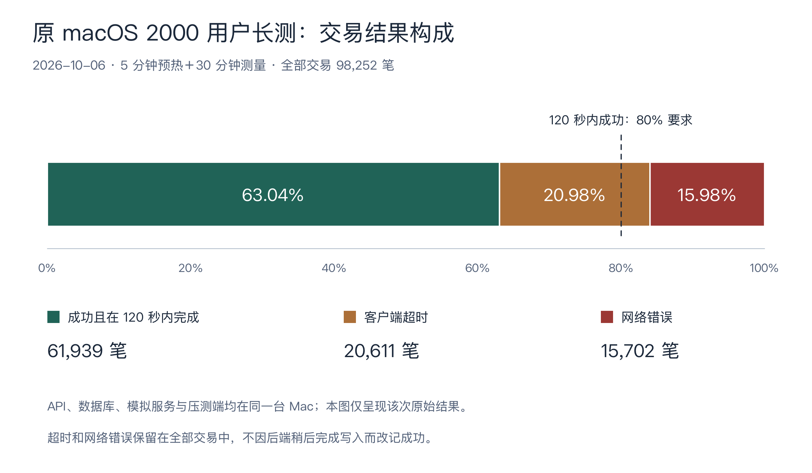
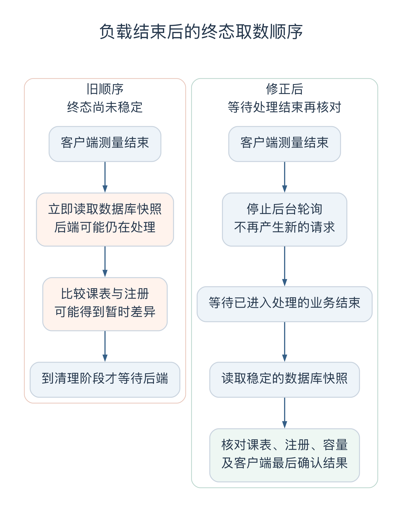

# 冯海伦个人工作汇报

- 姓名／学号：冯海伦／21230723
- 版本：v0.4，2026-10-09；测试结果依据截至 2026-10-08 的记录整理。
- 对应工作：US-018／IT-04 测试与验证；本汇报整理归入 US-028／IT-04。

## 一、我负责的测试工作

我负责测试计划、验收用例、集成与浏览器测试、权限和并发验证，以及测试结果的整理。各模块接通以后，我需要关注的是一项操作从页面到数据库，再到外部模拟系统，是否得到同一个结果。例如，学生看到“保存成功”时，保存的选择应该更新，但班次名额不能因此减少；教务员发起关闭后，还要等调剂完成、账单生成，才能继续检查外部计费是否收到。

这使测试准备很早就涉及需求和设计。只列出“保存、提交、关闭、计费”几个功能名称，无法决定怎样测试。我先把它们拆成具体情境，再确定每个情境中哪些数据应该改变、哪些应该保留。后面实际执行时，最后一个名额的竞争、重启前后的状态比较和高负载结束后的取数，都需要继续调整测试方法。

本轮形成了[测试计划](../../TEST_PLAN.md)、[64 条验收条件的场景设计](../../testing/acceptance-cases.md)、[执行账本](../../testing/acceptance-execution.md)和[测试报告](../../TEST_REPORT.md)。计划说明要测什么，场景设计给出输入和预期，执行账本记录实际覆盖到哪一步，报告再汇总结果和问题。下面主要说明这些判断是怎样形成的，以及执行中为什么需要修改测试准备。

## 二、需求分析与测试范围

### 2.1 课表保存的结果判定

需求讨论确定“保存课表不占名额”以后，最直接的用例是让一个没有选课的学生保存四门课，再检查各班次人数。但这只能覆盖第一次保存。已经正式选过课的学生，也可能打开页面修改选择，这时保存内容与有效注册本来就可以不同。

因此，我把场景继续展开。假设学生已经选上物理课，在编辑区删掉物理、加上美术，只点击保存。预期是美术出现在保存的选择中，物理课的注册仍然保留。随后提交时，如果美术班已满，这次换课失败，物理班的名册中仍应有这名学生。检查范围需要同时包含课表、注册和班次名册，不能只判断接口是否报错。

从[对象分析](../../design-docs/object-oriented-analysis.md)中的关系看，课表表达学生保存和提交的选择，注册表示真正选上的班次，教授名册则来自有效注册。理解这几者的区别以后，测试也有了明确的观察位置。保存时看选择是否更新，正式提交时看注册是否一起变化，教授查询时再看名册是否与注册对应。

关闭和计费也是这样。关闭成功确定了最终课程，但账单送达还要经过外部系统。如果计费暂时无法连接，预期应是关闭结果保留、账单等待重试。若只检查最后一个接口的成功或失败，就容易把两个阶段混为一谈。

### 2.2 数量与时间的边界值设计

先修课程的测试不能全部使用 A。我在数据中安排 D＋C、A＋F、I 和缺成绩等组合，分别检查所有先修是否通过。D 已达到通过要求，F、I 和缺失则不能通过。这样既能发现把 D 错当成不及格的问题，也能发现只要有一门通过就放行的错误。

关闭时的班次人数也要靠近分界点。场景准备 0、1、2、3、9、10 人的班次，检查不足三人、达到三人和人数上限的不同结果。另外准备一个已有十人却没有教授的班次，确认程序还会检查授课安排。对于可能通过备选调剂达到三人的班次，要观察完整的一轮调剂结果，不能在调剂前看到人数不足就判定应该取消。

时间窗口采用左闭右开的规则，所以截止前一毫秒、恰好截止、截止后一毫秒需要分别检查。还有一种情况是请求在截止前进入处理，却在截止后才确认。若测试只覆盖发送请求的时间，就发现不了程序是否漏掉了最终确认时的检查。提前关闭则另有规则：已经进入处理的请求先完成，再开始关闭。这两种情形需要用不同的时间和执行顺序安排。

关闭后补选也纳入本轮范围。它虽然在原计划中属于 P1，但实际实现范围已经包含这项功能，测试仍需检查每生最多四门、班次容量、先修以及补选后的账单变化。具体边界集中写在[测试计划第六节](../../TEST_PLAN.md#6-统筹已采纳的实施口径)，作为实现和测试共同使用的依据。

### 2.3 验收条件与覆盖范围

一条验收条件往往包含多个原因和不同页面反馈。例如换课失败可能来自满额、时间冲突或先修不足。接口已经逐项检查失败后保留旧课表，并不代表每一种错误都在浏览器中重现过。

我把场景设计和执行结果分开维护，在[执行账本](../../testing/acceptance-execution.md)中保留这些差别。这样补测时可以直接找出尚缺的页面操作或故障组合，而不必重新猜测“这条已经通过”究竟包含哪些内容。测试范围也能随着需求修改继续扩展，不受最初用例数量限制。

## 三、测试数据与环境设计

### 3.1 计费测试数据与独立预期

计费需要检查课程是否漏算、重复计算，以及补选后是否正确替换旧金额。如果四门课都设成三学分，取错一门课程仍可能得到相同总额，测试不容易看出问题。因此，我在测试数据中使用 3、2、4、1 这组不同学分，单价固定为每学分 125 元，直接计算预期金额。

| 测试情境 | 计算依据 | 预期金额 |
| --- | --- | --- |
| 四门课程全部保留 | （3＋2＋4＋1）×125 | 1250 元 |
| 取消原来 1 学分的课程 | （3＋2＋4）×125 | 1125 元 |
| 再补入一门 5 学分课程 | （3＋2＋4＋5）×125 | 1750 元 |
| 最后没有保留任何课程 | 0×125 | 0 元，仍生成账单 |

这些预期直接写在[验收测试](../../../tests/acceptance/scenarios.integration.test.ts)中，没有调用产品的计费函数。如果产品和测试都使用同一个函数，函数漏掉一门课程时，两边仍可能得出相同结果，测试就失去了核对作用。

补选场景还要到外部计费模拟中检查。同一学生先有 1125 元账单，补选后总额为 1750 元，对方应保留新版总额；如果把两张账单相加，就会记成 2875 元。测试随后再发送旧版，检查金额仍为 1750 元，防止旧账晚到把新金额覆盖。零元账单也单独保留，因为它能区分“这名学生已经处理完”与“遗漏了这名学生”。

### 3.2 身份、学期与成员集合校验

同样的考虑也用于人员和学期数据。夹具准备两名同名但账号不同的学生，避免查询误用姓名却恰好返回正确结果。学期分为上线前、上一已完成、当前选课和另一学期，历史班次使用与当前班次不同的编号。

这里有一处容易混淆：选课关闭了，不表示这个学期已经完成。教授录入上一已完成学期的成绩时，不能因为当前学期已经关闭就把成绩写到当前学期。数据中保留这些差别，才能看出查询究竟按了哪个学期。

名册也比较完整的成员集合。如果只检查人数，两名学生被串换以后人数仍然正确。并发测试因此同时核对谁成功加入、谁仍在原班，以及其他成员是否保持不变。

### 3.3 测试环境隔离与时钟控制

[测试夹具](../../../tests/acceptance/fixture.ts)为每个验收用例创建随机的 PostgreSQL 数据库，执行真实迁移，再通过 HTTP 连接课程目录和计费模拟。测试结束后清理本次创建的数据库和临时文件。

选择整库隔离，是因为关闭、人员停用、删除和重启会改变很多关联数据，系统还有数据库范围的运行锁。仅换几个学生编号，无法保证前一个用例留下的状态不会影响后一个。整库准备会增加运行时间，但失败后可以从相同前提重新开始，也能检查真实的数据库约束和事务。

时间则按用途处理。截止端点和关闭顺序使用可控制的业务时钟，方便准确停在某个时间；负载耗时、页面更新和计费的 60 秒重试使用真实经过时间。直接把业务时钟拨快一分钟可以检查某个分支，却无法说明实际进程是否按时重试。

## 四、集成与并发测试

### 4.1 末席竞争的确定性测试

学生末席测试先把一个班次填到九人，另外两名学生各自在原班已有注册，随后都尝试换到这个只剩一个位置的班次。预期有三部分：目标班恰好十人，一名学生换班成功，另一名学生收到满员结果并保留原班。

最初从场景文字看，“同时提交”似乎就够了，但两个异步请求谁先进入后端处理并不稳定。重复运行也可能总是同一个先到，这样很难判断程序是否正确处理了另一种顺序。因此，测试在提交确认前设置等待点，让第一名学生进入后暂停，再发出第二名学生的请求，随后放行第一名。完成一轮后，交换两人的先后顺序再执行。

两轮都核对完整名册和失败学生的旧注册。这里控制的是服务内部的确认顺序，不依赖两个人点击按钮的速度。教授竞争同一班次时，则利用 PostgreSQL 触发器和数据库锁暂停更新，等确认请求确实正在等待锁以后，再发起另一位教授的操作。失败的一方应保留整份原授课安排，不能取消了旧班却没有取得新班。

这些检查把需求中的“先确认者成功”变成了可重复的执行过程。对应脚本也保留了等待点和结果断言，后续修改事务或目录读取方式时，可以继续复跑同一组场景。

### 4.2 关闭失败的回滚基线

关闭选课需要等待已经进入处理的提交。测试先暂停一名学生的提交，然后请求关闭，检查此时新保存、新提交和新授课操作都被拒绝。接着放行原来的学生提交，等它成功后，记录用于比较的状态，再让关闭继续执行，并在调剂后安排一次故障。

这时要保留的是学生刚刚提交成功后的课表。如果仍拿点击关闭之前的旧快照比较，测试反而会要求系统撤销一次合法提交。处理顺序决定了基线应该取在哪里。

故障发生后，测试检查学期恢复开放、调剂结果回滚、没有残留账单，同时刚完成的学生注册仍在。解除故障后再执行关闭，核对正常调剂结果。这样既检查了关闭内部的事务，也检查了关闭与学生提交之间的衔接。

### 4.3 整体回滚与部分成功的验证

学生换课要求整体成功或整体保留，但成绩录入和 Excel 导入有不同规则。教授一次填写十格成绩，其中一格输入错误，其他合法成绩仍应保存；教务导入名单时，重复人员应跳过，缺字段的行应指出原表行号，已经成功导入的行要保留。

因此，这类测试混合准备合法、非法和空值，逐项检查结果与旧值。权限检查则在另一层：如果成绩请求混入一名不属于本班的学生，应先拒绝整份请求。只有名单属于教授权限以后，才允许逐格处理输入错误。

权限场景使用三类角色的真实登录会话，检查未登录、跨角色入口，以及请求中伪造学生或教授编号的情况。人员状态变化也同时检查允许和禁止的操作，例如休学学生仍能查看本人成绩，却不能继续选课。只把账号全部禁用，虽然可以挡住写入，也会破坏原本允许的查询。

写入中途的失败使用 PostgreSQL 触发器复现。触发器在授课或人员状态真正更新时抛错，测试再比较人员、课程、注册和历史记录。与入口处拒绝非法参数相比，这样能检查已经开始写入后是否真的回滚。

## 五、故障注入与重启恢复测试

### 5.1 账单接收后断连的故障注入

计费重试最需要检查的情形是：外部系统已经收到账单，但业务后端没有收到确认。后端只看到请求失败，必须继续重试；外部系统则要识别出这是同一张账单，不能重复计算金额。

测试通过计费模拟安排“接收后断连”，等后端把账单记为待重试后，保留原数据库，停止真实 API 子进程，再启动一个新进程。新进程应能找到原来的账单编号、发送次数和下次重试时间。测试在到期前约一秒检查它没有提前发送，到期后再检查发送次数从一次变为两次、状态变为已确认，而外部接受的业务标识仍只有一份。

这个场景使用一笔零元账单观察时序，其他账单推迟处理，避免多笔重试互相干扰。它检查的是实际进程退出重启与这笔账单的恢复，正常关闭时全部账单送达则在另一项页面流程中观察。两项测试的准备和判断不同。

### 5.2 重启测试的初始化等待

提交前的完整回归曾出现一次失败：206 项通过，重启场景的快照比较失败。重启前后的账单仍在，但完整数据中多出了其他学期的课程目录。这个现象需要先解释清楚，否则很容易把它记成重启改变了持久数据。

检查执行顺序后发现，API 健康检查就绪时，第一次后台目录同步还没有全部结束。测试看到服务可用就取了快照；停止并重新启动期间，尚未同步的学期完成了初始化。前后数据不同，是因为两次观察发生在不同的准备阶段。

修改时增加了一个明确条件：四个测试学期的首次目录快照都已形成，才记录重启前的基线。完整快照比较继续保留，60 秒真实重试和同一账单编号的检查也继续执行。随后该场景定向复测通过，耗时约 62.85 秒，再运行完整回归也通过。该问题记为 TEST-07，修改落在测试准备中。

这次失败让我更注意“服务可以接收请求”和“本次测试所需的数据已经稳定”之间的区别。前者适合判断能否开始连接，后者才决定能否取基线。等待固定几秒也不够可靠，应该等待本场景真正依赖的状态。

## 六、浏览器检查与阶段结果

### 6.1 页面反馈与后端结果核对

[浏览器脚本](../../../tests/e2e/browser-runner.ts)使用真实 Chrome，把学生、教授和教务操作连起来。学生提交后看教授名册，教授录入成绩后查学生成绩单，教务关闭后再看调剂和计费状态。名单导入、多页面编辑和断网后重新连接也安排了场景。

计费页面有一个取数问题：数据库已经记录送达，页面统计还可能等待下一次刷新。如果此时立即截图，画面仍是旧值。执行时需要同时等待数据库确认和页面更新。导入也要看成功、跳过、拒绝的分类是否显示，以及初始密码是否隐藏，不能只依靠后台返回值。

在线传播测量选择了人数变化、目录时间、目录先修、目录删除、名册更新和版本提示六条路径，每条十个样本。从业务请求或目录控制请求成功返回开始，到真实页面出现目标状态结束，最长为 1043.24 毫秒，60 个样本都在五秒以内。这个起点不包含鼠标按下到请求返回的时间，结果对应当时的本机 Chrome 环境。

双页面场景还检查了另一件事：旧页面能看到服务器版本变化，但仍保留本地尚未保存的编辑，并阻止用旧版本继续提交。断网重连后再显式采用新版本。页面出现新数据和用户旧编辑被保留，需要分别检查。

### 6.2 浏览器驱动问题的排查

执行中有些失败来自浏览器驱动。原始点击不会自动滚动，按钮可能在视口外；只按“确认”文字查找，还可能点到弹窗后面的表单。处理时先滚动到目标，再把查找范围限定为当前打开的弹窗。

日期填写、下拉选择和标签页切换也要按驱动实际支持的方式操作。部分日期输入使用原生 setter 并触发 input、change 事件，部分按钮使用 DOM click。这些记录能说明相应页面业务链路跑通了，但没有覆盖所有原生鼠标和日历交互。后续人工检查需要知道脚本是怎样完成这一步的。

### 6.3 各阶段回归结果

项目在集成、补充验收和性能修复后多次执行回归，数量随着场景增加而变化。我将这些结果放在同一张表中，避免把不同阶段重复执行的用例累加。

| 日期与阶段 | 检查结果 | 范围说明 |
| --- | --- | --- |
| 10 月 5 日开发联调 | 108 项通过 | 三角色与外部模拟的主要流程接通 |
| 10 月 5 日合入前回归 | 134 项通过 | 补充检查并修正授课历史的时间问题 |
| 10 月 6—7 日验收与提交前复测 | 207 项通过 | 其中包含 73 项验收集成测试；TEST-07 修正后再次完整通过 |
| 10 月 7 日性能修复后回归 | 215 项通过 | 增加目录刷新合并等相关检查 |
| 10 月 6 日 Chrome 末轮检查 | 32 项通过、0 失败 | 单独的浏览器检查记录，不并入上面的回归数量 |

前四行是不同阶段的完整回归集合，后一次包含前面的用例，73 项也已包含在相应集合中。它们反映项目回归范围，不能换算为个人新增测试量。每条验收条件下的具体覆盖仍按[执行账本](../../testing/acceptance-execution.md)查看。

## 七、性能测试与结果分析

### 7.1 性能指标与统计口径

需求问卷中，倪成锦最初考虑按小组电脑和演示规模另定性能标准。核对原题后，需求文档保留了 2000 用户、500 用户、目录访问不超过十秒，以及至少 80% 的交易在两分钟内完成这些指标。安排测试时，我又与他讨论过实际学校的人数和错峰选课，考虑是否需要下调最高并发。实际执行仍按已经明确的原题指标，测试环境和方法由小组安排，出现失败时再根据记录查找原因。

负载按 500 和 2000 个独立登录用户安排，每档预热五分钟，持续测量三十分钟，每名用户操作后随机等待 5—15 秒。目录查询、课表读取、保存、提交换班和成绩读取的比例为 40∶25∶15∶10∶10。提交会实际交换第四门课程，使程序执行容量检查和注册变更。

统计时，分母取测量阶段发起的全部交易，只有成功且在 120 秒以内完成的才计入分子。超时、网络错误和快速拒绝都留在分母中；测量结束前已经发出的请求，也要等到有结果后再汇总。这个约定决定了失败怎样呈现在报告里，不能运行结束以后再按结果调整。

### 7.2 原 macOS 长测结果

10 月 6 日的测试运行在 Apple M3 Pro、18 GiB 内存、macOS 27.0、Node 22 和 PostgreSQL 15 的环境中。API、数据库、模拟系统和压测端都在本机。500 用户档通过了既定指标，2000 用户档成功且在两分钟内完成的交易比例只有 63.04%，没有达到 80%。

| 环境与实现阶段 | 用户数 | 成功且在 120 秒内完成／全部交易 | 目录在十秒内成功／全部目录查询 |
| --- | --- | --- | --- |
| 10 月 6 日 macOS，修改前 | 500 | 89666／89666，100% | 35659／35659 |
| 10 月 6 日 macOS，修改前 | 2000 | 61939／98252，63.04% | 31079／39381，78.92% |
| 10 月 7 日 Linux，修改后 | 2000 | 264615／264615，100% | 105899／105899 |

图 1 使用[测试报告](../../TEST_REPORT.md)中 2026 年 10 月 6 日原 macOS 2000 用户长测数据：总计 98252 笔交易，成功且在 120 秒内完成 61939 笔，客户端超时 20611 笔，网络错误 15702 笔。80% 虚线对应题目要求，错误类别沿用客户端记录。[数据与绘图源文件](../figure-sources/README.md)。

原 2000 用户档共有 36313 次失败，其中 20611 次客户端超时、15702 次网络错误。当时还存在同机任务重叠、磁盘空间紧张等干扰，系统卷可用空间一度约为 104 MiB。因此，排查需要把运行环境和程序等待位置一起看。

后续短测比较同时启动和分批启动，完整应用仍然失败。无数据库的简单 HTTP 服务在瞬时建立 2000 个连接时也能复现连接重置，分散发出后则通过，说明连接阶段已有本机限制。应用内部又记录到目录同步排队超过 200 秒，而数据库连接采样最多约 24 个，上限是 100。客户端等 HTTP 响应超时，可能发生在进入业务数据库事务以前，不能统一解释成数据库连接用尽。

这些对照用于缩小问题范围。原长测没有保存每一次网络错误的底层原因，后续记录只能支持分层判断，无法给原来的每一次失败都指定同一个原因。详细数据保留在[测试报告第 5.1 节](../../TEST_REPORT.md#51-2000用户失败复现与分层诊断2026-10-06晚间)。

### 7.3 TEST-06：终态取数时机修正

原 2000 用户结果还记录了 806 名学生的客户端期望与数据库不符。进一步检查负载工具时发现，客户端超时结束后，服务器可能仍在处理已经接收的提交，而脚本先读取注册快照，随后才在清理阶段等待后端处理完。

例如，客户端发起换课，没有等到响应就记为超时，所以仍把原课程作为最后确认结果。服务器却可能在稍后完成换课。若此时比较两边，就会得到差异；如果服务器还在连续处理其他请求，数据库本身也还没到稳定状态。因此，原来的 806 名差异不能直接解释为课程丢失。

修正后的顺序是停止后台轮询，等待已进入处理的业务全部结束，再读取数据库并比较。在 40 用户、20 毫秒故意超时的复现中，旧顺序取数时仍有 206 个目录同步调用；修改后活动调用归零，160 条注册与课表集合一致。该负载仍因超时按预期失败退出，服务端后来完成操作没有被补算为客户端成功。

图 2 根据 TEST-06 的修正记录整理。先停止轮询、等待已进入处理的业务结束，再读取数据库终态；客户端已经发生的超时仍按失败统计。[可编辑图源](attachments/figure-terminal-snapshot.dot)。

负载工具还补充了失败退出码。正常负载应成功退出，空测量和强制超时应失败退出，这些检查防止脚本只写出失败数字、命令却返回成功。工具检查和正式长测各有用途，短时自检无法代替三十分钟的业务负载。

### 7.4 性能复测与超时恢复验证

10 月 7 日，倪成锦负责调整目录刷新：合并等待下一轮读取的请求、缩小查询范围，再把只读目录请求的重复工作合并。负载客户端、API 和模拟服务也改为独立进程运行。三轮短测用于观察每次修改的效果，完整实现和取舍见[目录刷新设计记录](../../design-docs/adr/ADR-003-catalog-refresh-generations.md)及[小组报告第九章](../team/report.md#九性能诊断与修改)。

修改后的 Linux 正式长测仍采用五分钟预热、三十分钟测量，结果见上表。等待后端处理结束后，共有 8000 条有效注册，班次人数不超过十人，每名学生不超过四门，课表、注册和客户端最后确认结果没有错配。

这次通过与原 macOS 失败都保留在报告中，因为代码和运行环境同时发生了变化。它说明修改后的候选在该次 Linux 同机环境下达到了指标，不能据此单独计算操作系统或某一项修改的贡献。

排空后取数也没有解决客户端的全部问题。在另一项 40 用户、1 毫秒故意超时的检查中，服务端内部数据一致，仍有 15 名客户端最后确认的课程与服务器不同。客户端没有收到成功响应，却可能已经换课成功，接下来必须重新查询最终结果。这是后续超时恢复验证需要覆盖的情形，正常长测没有发生超时，无法回答它。

## 八、协作、复盘与后续安排

### 8.1 缺陷记录与复现材料

对我来说，交给模块负责人的问题至少要包含输入、预期、实际结果和当时的数据状态。只留下“关闭失败”或“性能不通过”，对方还需要重新寻找触发条件。

问题记录也要能区分修改位置。TEST-07 修改目录初始化的等待条件，TEST-06 修改取终态的顺序，都属于测试工具调整。浏览器滚动、弹窗定位和日期操作同样先检查驱动。运行中还遇到磁盘不足、并行生成 Prisma 时引擎文件被读取到截断内容等环境问题，处理后按原步骤重跑。这些情况与产品在高负载下的目录排队问题分别记录，便于找到相应负责人。

测试夹具早期还漏过学期目录，误以为一次后台执行就能发完全部账单；导入脚本也出现过列数和返回字段理解不一致。修正时先核对实际输入、批次限制和接口契约，再调整测试准备。没有先弄清这些条件，就难以判断失败究竟要求修改哪一层。

### 8.2 测试方法的总结与调整

独立金额样本、末席竞争和两次快照问题，使我对测试准备有了更具体的要求。金额样本先算出可核对的答案；并发场景明确让哪个请求先到达确认位置；快照则定义观察之前必须完成哪些工作。只有这些前提清楚，失败才容易解释，修复以后也能重复检查同一个问题。

下一次我会更早把初始化完成、后台处理结束和客户端取得结果分别写进用例。重启测试已经表明，服务健康不等于测试数据就绪；负载测试又表明，客户端超时不等于服务器停止执行。这些结束条件应该由实际状态判断，不能只靠延长等待时间。

性能结果的整理也需要保留过程。500 用户通过、2000 用户失败和修改后通过，分别对应不同运行记录。报告把环境、负载、时间和统计方法写清楚，后续才能比较变化，而不只是看到一列通过数量。

### 8.3 后续验证安排

我的独立手工复核尚未完成，下一轮将固定候选版本和环境，优先检查权限、金额、失败前后状态、补选竞争的确认顺序，以及超时后重新读取。补选已有并发用例，但还缺交换两名学生先后顺序的确定性检查；执行账本中部分页面反馈、敏感响应字段、后台审计和故障组合也需要继续补测。PERF-01 的修复已有合入和复测记录，仍需独立核对；PERF-02 的超时恢复问题继续跟踪。

跨环境部分还包括 Windows Chrome／Edge、另一台机器初始化和七天可用性观察。已有的同机干净目录检查完成了依赖安装、客户端生成、构建和首轮验收，首次漏做 Prisma 生成导致构建失败，补上原有步骤后通过。它仍使用本机 PostgreSQL 和环境配置，下一次换机复现要从这些前置条件重新检查。

本稿按现有执行记录整理了测试过程，后续把本人复核日期、所用版本、操作结果和必要截图补入，再完成审核与签名。US-018 继续按测试计划推进，课程验收和最终交付另行记录。

## 主要材料与修订记录

测试方案和逐项结果见[测试计划](../../TEST_PLAN.md)、[场景矩阵](../../testing/acceptance-cases.md)、[执行账本](../../testing/acceptance-execution.md)与[测试报告](../../TEST_REPORT.md)。对应实现可从[集成测试](../../../tests/acceptance/scenarios.integration.test.ts)、[隔离夹具](../../../tests/acceptance/fixture.ts)、[浏览器说明](../../../tests/e2e/README.md)和[负载说明](../../../tests/load/README.md)定位。

原验收成果经[提交 95d0ab4](https://github.com/Nichengjin/software-engineering-project/commit/95d0ab4e97c9edcda85c66403ffdf5a0d45e0ecf)与[PR #24](https://github.com/Nichengjin/software-engineering-project/pull/24)合入，执行过程见[测试历史记录](../../histories/2026-10/20261006-1640-acceptance-execution.md)。倪成锦后续性能修复与追溯见[PR #25](https://github.com/Nichengjin/software-engineering-project/pull/25)和[PR #26](https://github.com/Nichengjin/software-engineering-project/pull/26)。

| 日期 | 版本 | 修订内容 |
| --- | --- | --- |
| 2026-10-07 | v0.1 | 形成职责、测试成果、原失败、后续修复与本人复核安排初稿 |
| 2026-10-08 | v0.2 | 补充独立预期、并发故障、工具修正、性能诊断与复盘 |
| 2026-10-09 | v0.2 续 | 补入性能要求讨论与组内协作方式；其中问卷初答的表述在本次重写中纠正 |
| 2026-10-09 | v0.3 | 按测试准备、执行与方法调整重写全文，合并重复的结果说明，区分性能问卷初答与最终决定，集中整理后续验证 |
| 2026-10-09 | v0.4 | 统一章节标题，新增两张流程、交互或数据图，补充图注、可编辑图源与已有记录来源，更新图号及引用 |
