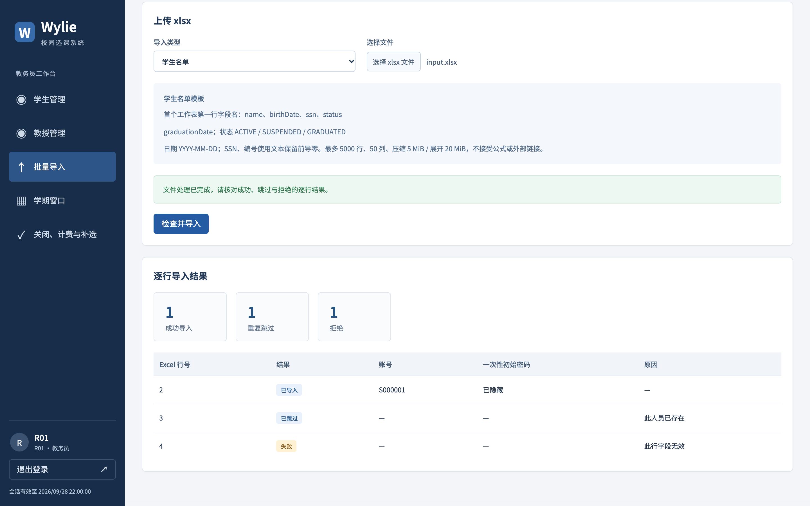

# 冯海洋个人工作汇报（扩充稿）

- 姓名：冯海洋；学号：21230729。
- 项目：Wylie College 学生选课系统；角色：教务端负责人。
- 日期／版本：2026-10-08，v0.2；证据截至该日。
- 汇报整理关联：US-028／IT-04；业务范围为 US-013、US-014、US-021、US-023，以及 US-015／US-016 操作呈现、US-022 补选界面。
- 状态：课程个人工作汇报草稿，待本人核对定稿；贡献比例与签名由团队确认。

## 阅读说明：围绕教务操作说明个人职责

我的工作重点是教务人员怎样安全地维护师生资料、建立基础数据、设定学期窗口，并在选课关闭后核对结果和办理补选。教务端的按钮不多，但一个状态修改可能同时影响登录、课表、名册、授课安排和历史记录，因此不能把它当成普通的增删改查页面。

按照[团队分工](../../TEAM_ROLES.md)，我负责人员维护与导入、学期窗口、关闭和补选操作界面，以及人员管理接口与自测。倪成锦负责共享数据模型、权限与核心关闭／调剂／补选事务，范昭负责计费和外部模拟，冯海伦负责测试组织与独立复核。报告按我的领域展开，跨模块问题说明接口和协作关系，不把共同完成的底层机制都记为个人独立成果。

**协作与来源说明。** 根据 2026-10-08 的明确说明，代码由各成员与 Agent 协作完成，决策由人类作出；提交中的 Amp 名称主要来自统一撰写提交信息及集中 Git 操作。本文据此以我的领域责任和技术判断叙述，材料来自需求、设计、源码、原始提交、测试和 history。提交当时“尚未复核”的备注保留其历史含义，不据此否定成员参与；尚无记录的会议、个人工时、特定缺陷发现者和独立验收签名也不补写。按组长2026-10-09澄清，总体设计在组内讨论过，实现阶段由成员监督Agent工作，并不是把任务交给Agent后不再过问；本人参与了哪些讨论、监督了哪些任务、改过哪些Agent输出，待本人问卷补充。

贯穿我的工作有三个问题：人员状态变化怎样保护历史；批量操作怎样说明部分成功；教务如何区分“操作已受理”“业务已完成”和“计费已送达”。下面沿着需求、分析、设计、实现与验证说明它们的处理过程。

| 阶段 | 教务领域需要回答的问题 | 对应产物 |
| --- | --- | --- |
| 需求分析 | 停用、离职、休学和删除分别改变什么？ | UC-08／09、BR-16、AC-24—27／52—53 |
| 对象与边界分析 | 人员身份、账户权限和历史关系如何区分？ | OOA、PersonIdentity、人员／账户模型 |
| 接口与详细设计 | 确认前后数据变化怎么办，批量失败如何返回？ | 影响预览 token、逐行导入、版本字段 |
| 页面实现 | 操作后应显示哪一种成功、哪些内容须重新核对？ | 人员、导入、窗口、关闭及补选页面 |
| 联调与回归 | 页面、事务、历史和外部账单是否一致？ | 真数据库测试、浏览器记录、缺陷修复证据 |
| 交付与复盘 | 哪些已经验证，哪些仍需要成员或环境复核？ | 本报告、证据表、后续核对清单 |

## 一、需求分析：先明确教务权限和业务后果

### 1.1 人员维护不是删除一条列表记录

题目要求维护教授和学生资料，最直接的实现是给列表加新增、编辑、删除按钮。但已有人员可能参与过授课、选课、成绩或计费；如果页面删除后把关联数据一并清空，教授历史成绩、学生账单和审计链都会受影响。

我在教务领域需要遵守的判断是：人员是否继续参与当前业务，与过去事实是否保留是两件事。[需求分析](../../REQUIREMENTS_ANALYSIS.md#uc-08)规定，有业务记录的人员不能硬删除，改用人员状态或账户停用；无业务记录的人员才能经确认删除。取消删除时不得产生写入，也不能把“找不到人员”当作删除成功。

因此，删除失败应说明是哪些业务历史限制了操作，并提示可用的状态调整方式。这个选择比直接清除关联多了一层设计，却避免了教务为了清理列表而破坏历史数据。

### 1.2 三种操作必须分开解释

| 操作 | 当前权限与业务关系 | 历史数据 |
| --- | --- | --- |
| 停用账户 | 撤销会话、禁止登录；不自动退课或撤销授课 | 保留 |
| 学生由在读改为休学／毕业 | 确认后清理未关闭学期课表和注册；仍可登录查看成绩 | 已关闭学期保留 |
| 教授由在职改为离职 | 不能登录；确认后撤销未关闭学期授课，班次显示暂无教授 | 已关闭授课与成绩保留 |
| 删除无业务记录人员 | 删除人员身份及关联账户 | 不允许借此删除已有业务历史 |

例如，一名学生只是账户暂时被停用，不能因此被系统自动退掉四门课程；而在读状态改为休学，教务需要先看到受影响的学期，再确认清理注册并释放名额。这两个入口若共用一条“禁用人员”逻辑，界面看似简单，实际后果会错误。

### 1.3 教务身份并不意味着可以任意改成绩和课程

教务负责人员基础资料，却没有因此取得代学生管理关闭前课表、任意修改教授成绩或编辑外部课程目录的权限。历史成绩导入是为上线前数据补录提供的有限入口，只接受早于上线学期的成绩，不覆盖已经存在的记录。

补选也是明确限定的新能力：只能在关闭后为在读学生增加符合规则的班次，最多四门，不提供重新开放选课或关闭后退课。上述边界分别对应 CHG-03／04、BR-17 和 UC-13／14，不能因为页面属于“管理后台”就扩大范围。

我的需求复盘是，管理功能首先要回答“能改什么、为什么能改、失败后保留什么”。这些问题明确以后，按钮名称、确认内容、接口权限和验收条件才有共同依据。

## 二、对象与数据设计：区分身份、账户和历史

### 2.1 唯一身份不能依赖姓名

学生和教授都可能重名，姓名适合搜索和显示，不能作为主键或登录账号。系统生成稳定的学号／教授编号，页面同时显示编号与姓名，并使用人员 ID 发起具体操作；改名不会生成一个新身份。

SSN 用于识别已有人员，但学生表和教授表各自加唯一约束还不够：同一 SSN 可能分别插入两个角色。共享模型通过 PersonIdentity 统一约束跨角色身份，人员服务在事务中创建人员、身份记录和账户，避免只生成其中一部分。底层数据模型由统筹维护，我的人员和导入接口使用同一约束。

这也影响页面设计：列表和详情只返回脱敏 SSN；编辑框不把脱敏字符串当成真实值回写。修改时 SSN 留空表示保留原值，只有明确输入新值才提交变更。账号保持稳定，不能因名字或 SSN 修改而失去原关联。

### 2.2 人员状态不能抹去过去的事实

当前在读／在职状态与历史注册、授课、成绩不是同一类数据。教授离职后，未关闭学期的班次需要重新安排教师，已经关闭学期的成绩却仍要能够解释；学生休学后，也不能让过去的成绩单消失。

人员状态更新按学期区分影响：未关闭学期允许按规则清理；已经关闭的记录保留。教授取消授课还要结束对应历史关系并提高授课版本，学生清理课表要同步有效注册和首次提交信息。教务操作必须接入既有业务服务，不能只改人员表的一个 status 字段。

### 2.3 审计记录与业务历史采用不同的删除策略

“保留历史”不意味着每条关联都要一律阻止删除。授课、选课、成绩、计费是业务历史；登录审计记录则用于解释已经发生的访问事件。两者的外键职责不同，后续联调中正是这种区别暴露了一个真实问题，见第七节。

对我而言，对象分析的价值在于看清一次教务操作会经过哪些关系。只有区分这些概念，才知道哪些记录应清理、哪些应保留、哪些引用可以变为空，而不是把数据库的删除报错直接显示给用户。

## 三、人员状态修改：把“已确认”绑定到实际影响

### 3.1 为什么一个普通确认框还不够

人员状态修改采用“编辑—预览影响—确认写入”的流程。预览列出受影响学期、班次、是否清理课表和是否保留已关闭记录，让教务看到将发生的业务变化，再作决定。

但预览只是某一时刻的事实。例如教务预览某学生休学时，对方有三门注册；停留期间学生又提交了第四门。如果最终请求只带 `confirmed: true`，服务器可能清理教务没有看过的第四门。这个例子用于说明并发风险，不是声称实际发生过的一次事故。

我采用的交互要求是：确认的必须是刚才那份修改和影响集合；内容变了，就重新预览，不能让一次确认无限期授权后续清理。

### 3.2 影响 token 如何落实这条要求

[人员服务](../../../apps/api/src/modules/people/service.ts)在预览结果中返回签名的 `impactToken`，绑定人员类型与 ID、人员版本、规范化修改内容、影响集合指纹和五分钟有效期。影响集合还包含学期版本、课表版本与关闭准入状态，避免只看人员表版本而漏掉关联变化。

最终写入时，服务在事务内重新计算影响并核对 token。版本变化、修改内容不同、影响集合变化、确认过期或学期进入关闭，都会要求重新预览。客户端不能靠修改 `confirmed` 字段绕过这一步，也不能把另一人的 token 用在当前人员上。

这里的取舍是多一次请求和一次可能被拒绝的确认，换取清楚的操作依据。拒绝不是让教务重新机械地点同一个按钮，而是让其看到新的影响后再作决定。

### 3.3 页面保留原始版本，后端保证事务完整

人员编辑器保存读取时的 `expectedVersion`；影响预览后锁定当前编辑内容，确认时提交同一份 patch 和 token。只有服务器成功返回才结束编辑。删除也携带读取到的版本，并在确认框中提示有历史记录时改用状态或停用。

服务器还需要在最终写事务里复查教务身份，完成关联清理、人员更新、账户或会话调整和审计。不能先退课，再单独更新人员；后一步失败时，前一步必须一起回滚。后续验收通过 PostgreSQL 触发器在人员更新处注入失败，再比较完整前后状态，验证这种原子性。

### 3.4 与关闭流程的协作

人员状态清理与关闭会触及同一批课表和班次。清理未关闭学期前必须通过准入检查，关闭开始后拒绝新的相关清理；关闭协调器通过准入与排空机制协调在途操作。关闭和人员服务不能各自维护一套互不相知的“是否允许修改”。

这部分需要和倪成锦负责的 gate、学期锁及关闭事务保持一致。我的教务界面负责解释“影响已变化，请重新预览”，核心一致性不能只靠禁用按钮维持。

## 四、批量导入：让部分成功可定位、可恢复

### 4.1 四类数据为什么共用入口但分别校验

批量导入包括学生名单、教授名单、上线前历史成绩、教授授课资格。页面共用文件选择、确认、逐行结果和统计区域，各类型分别显示必填表头与业务限制。

| 类型 | 识别与约束 | 重复或非法数据的处理 |
| --- | --- | --- |
| 学生／教授 | SSN 跨角色防重，创建唯一账号和随机初始密码 | 已存在跳过；缺失姓名等无效行拒绝 |
| 历史成绩 | 学生＋课程＋学期，学期早于系统上线，成绩值合法 | 已有成绩跳过且不覆盖；上线学期及以后拒绝 |
| 授课资格 | 教授编号＋权威目录课程 | 已有资格跳过；未知教授或课程拒绝 |

例如，已有某门课成绩为 B，后来导入同一门同学期的 A，系统保留原 B 并标记跳过。这不是导入覆盖失败，而是需求明确禁止借批量导入修改既有成绩。教授资格则按“教授＋课程”去重，重复导入不会生成多条资格。

### 4.2 逐行事务比整份成功提示更符合需求

需求 AC-59 指定三名新学生、一名已存在学生和一行缺少姓名：正确结果应为三成功、一跳过、一拒绝。若整份回滚，合法数据也无法导入；若只显示“导入成功”，教务又无法发现遗漏人员。

[导入服务](../../../apps/api/src/modules/imports/service.ts)因此逐行校验、逐行独立事务处理，在每一行返回原 Excel 行号、结果、账号或问题原因。坏行不撤销前面成功的行，重复行和非法行也使用不同状态。页面同时显示三个统计值及明细，教务可以回到原表定位修正。

部分成功还决定了重试方式：请求断开时，不保证整批尚未写入，页面不会自动重新上传。应先核对实际结果再处理剩余数据，避免把网络失败误解为“所有行都没执行”。

### 4.3 文件校验需要保护身份数据和运行资源

Excel 中的编号、SSN 如果按数字录入，前导零可能被表格软件提前删除，服务器无法可靠猜回原值。因此模板要求这些字段使用文本，解析拒绝数值编号、公式和超链接；日期字段可按约定转为日期字符串。

解析器在交给 ExcelJS 前检查 ZIP 结构、成员路径、加密、宏与外部链接及实际展开大小，再校验首个工作表表头、重复列和额外列。当前上限为压缩 5 MiB、展开 20 MiB、5000 条数据行和 50 列；不能只相信浏览器扩展名或 ZIP 声明长度。

这些限制使导入失败能够在进入业务写入前被解释，也控制了畸形压缩文件带来的资源风险。它们是具体校验和测试范围，不等于对所有恶意文件组合已经完成安全认证。

### 4.4 初始凭据交付是导入结果的一部分

成功创建人员时，初始密码只在该次授权响应中返回；数据库保存密码摘要，页面不把密码写入浏览器持久存储。教务完成交付后可以隐藏全部初始密码，截图材料使用隐藏后的状态。

这也有明确代价：重复导入只会跳过已有人员，不能重新取得初始密码；如果创建成功但响应丢失，不能通过重导“恢复”原密码。本期不能把尚未提供的凭据恢复能力写成已实现，交付时需要把这个边界说明清楚。

图1于 2026-10-09 重新拍摄（北京时间2026-10-09 12:25前后，macOS、headless Chrome 154、1440×900 CSS视口／2倍像素密度，只截浏览器可见画面；用验收夹具新建可丢弃数据库和独立HTTP模拟，页面由临时HTTP服务提供构建好的 `apps/web/dist`，不是开发服务器，结束后服务与数据都已清理）。10-06 验收留存的原图是整页截图，排版错乱：侧栏被挤到页面下方，只有键盘用户才会看到的“跳到主要内容”链接也露了出来，所以按同一组输入重拍。教务员 R01 上传三行学生名单：Excel 第 2／3／4 行分别导入、因同一 SSN 已存在而跳过、因姓名为空而拒绝；截图前已点“已交付，隐藏全部初始密码”。数据为虚构验收数据，侧栏 2026-09-28 是注入业务时钟下的会话到期时间，不是截图采集日期。截图由 Agent 驱动浏览器完成，证明页面反馈，不单独证明全部导入规则。

## 五、学期窗口：统一时间含义并防止旧页面覆盖

### 5.1 北京时间输入与 UTC 传输保持一致

教务设定授课选择开始、初选起止和加退选起止时间。页面统一以北京时间显示和输入，提交时转为 UTC，避免电脑所在时区不同导致同一个“17:00”代表不同业务时刻。

窗口关系明确为“授课开始 ≤ 初选开始 < 初选结束 ≤ 加退选开始 < 加退选结束”，允许初选与加退选之间存在空档。时间区间起点包含、终点不包含；学生是否及时完成提交由服务器确认时刻判断，不能以教务电脑时钟或请求发出时间替代。

正式学期的教学起止与顺序由部署元数据维护，窗口页只编辑授课和选课阶段。选课正在关闭或已关闭时不能通过改窗口重新开放，这使学期配置与关闭状态保持同一业务含义。

### 5.2 两个教务页面同时编辑时怎样处理

窗口页沿用版本化草稿：编辑时记录原版本，服务器轮询收到新版本也不直接覆盖未保存输入。检测到版本变化后，页面保留本地值、展示最新窗口并阻止旧版本保存；用户核对后可以明确采用服务器版本。

假设两个页面都从 v3 开始，一页保存到 v4，另一页不能把自己的版本号悄悄改成 v4 再提交旧内容。否则版本字段虽然存在，仍会发生静默覆盖。这一原则与学生课表的旧草稿保护一致，但作用对象是学期准入规则，影响范围更广。

### 5.3 验证必须区分页面换算与真实业务边界

[前端验证记录](../../FRONTEND.md)包含北京时间 17:00 转 UTC 09:00、携带原 v3 提交并显示 v4 的 fixture 检查。它能够验证界面到请求字段的换算，不能单独证明真实数据库已经按这个窗口允许或拒绝业务。

后端和验收测试另覆盖窗口起点、结束前一刻、结束时刻、初选与加退选空档，以及关闭后拒绝修改窗口。把这两层结果连起来，才能说明“用户输入的时间”和“服务器执行的规则”一致；报告不把 fixture 测试写成真人操作数据库的验收经历。

## 六、关闭与补选：把异步过程和账单版本说清楚

### 6.1 关闭请求返回不等于关闭已经完成

关闭需要停止新准入、等待在途操作、进行一轮调剂和取消、冻结最终结果并生成账单。我的页面不能在 POST 请求返回后立即显示“全部完成”，因为接口接收请求与后台最终事务完成是不同节点。

[关闭页面](../../../apps/web/src/routes/close.tsx)按 `OPEN`、`CLOSING`、`CLOSED` 展示：开放时允许确认关闭；处理中说明等待在途操作并移除重复关闭入口；完成后显示关闭时间及最终结果。若内部处理失败恢复开放，则显示上次失败原因，不能继续保留成功提示。

关闭后的结果分为取消班次、备选调剂、待处理学生和计费送达状态。未解决的目录冲突需要教务在系统外处理，不能因为关闭流程完成就隐去异常学生，也不能把没有调剂记录写成算法故障。

### 6.2 计费送达与实际收款是不同事实

账单列表展示学生标识、业务编号、版本、金额、送达状态、尝试次数及重试时间。页面明确写“计费送达状态（不是实际收款）”，因为外部系统确认收到资料不代表学生已经付款。

外部不可用时，选课关闭可以成功、账单仍等待重试。计费重试和持久化由范昭负责的模块处理；教务页面负责如实呈现，不提供一个“重新关闭”按钮来解决送达问题。否则既误导操作者，也可能把内部业务确定和外部通信失败混成同一件事。

### 6.3 补选仍遵守容量与课程规则

关闭后补选先查找学生，再读取该生当前课表及可选班次。页面对非在读、已有四门、班次取消、无教授、满额或已注册的明显条件禁用入口，先修、时间冲突及同课程等最终检查仍由服务端执行。

点击某班次时记录当时课表版本；确认期间如果轮询发现版本变化，要求取消后重新选择和核对，不能自动替换 `expectedVersion`。最终提交包括学生、班次、原版本和确认标记，成功后重新读取课表与账单送达状态。

### 6.4 新版账单代表完整应缴额

补选成功不只增加注册，还会生成该生的完整新版账单，旧版本标为已替代。教务看到 v1 为 0 元、v2 为 300 元时，应理解为最新应缴额 300 元；如果原来已有课程，新账单也包含全部保留课程，不能把新旧金额累加。

2026-10-05 的真实联调记录支持一个完整例子：关闭后 14 笔账单均送达，金额为 3 笔 1100 元和 11 笔 0 元；对其中一名学生补选后，0 元 v1 被 300 元 v2 替代，模拟端保留两版且不相加。这验证了页面、数据库和模拟端的对应关系，不代表教务端独立实现了账单版本协议。

该次关闭为 4 个取消、0 个调剂、0 个未解决问题，因而不能用它证明成功调剂分支。第四节截图来自 2026-10-09 另一套虚构夹具数据，也不与上述 14 人样例混算。

## 七、真实联调问题：从页面现象追到数据关系

### 7.1 登录审计阻止了本来允许删除的人员

[开发联调 history](../../histories/2026-10/20261005-0312-system-design.md)记录了一个实际问题：人员没有选课、授课、成绩或计费历史，按需求应可删除，但账户上的登录审计使用 RESTRICT 外键，导致删除被数据库阻止。

如果只改页面报错，合法删除仍无法完成；如果级联删除审计，又会丢失访问记录。最终修复将审计 actor 引用改为可空并使用 SET NULL，保留事件本身，同时继续禁止删除有真实业务历史的人员。[数据库约束测试](../../../packages/db/src/constraints.integration.test.ts)验证删除账户后审计事件仍存在、actor 引用为空。

这是团队集成中形成的修复，我的报告从人员维护的需求边界解释它，不把迁移和修复发现者改写为我个人。它让我更清楚地认识到，“有记录”必须按业务含义定义，不能让所有数据库引用都产生相同删除后果。

### 7.2 删除人员与关闭捕获学生集合存在竞争

另一项已记录问题发生在关闭 gate 进入 CLOSING、关闭 intent 尚未持久化的窗口：删除请求若只查数据库状态，可能仍判断允许删除。相反，删除已经通过检查、关闭随后开始，也会影响本次应该生成账单的学生集合。

处理方式是删除按稳定顺序锁学期行，同时复查数据库关闭状态与即时 gate；关闭 intent 取得同一行锁后再捕获学生集合。已有测试覆盖两种先后顺序。我的教务入口遵守统一结果，不能在前端加一次状态读取就宣称解决并发问题。

这里最重要的收获是：查询过“允许删除”不等于之后一定可以删除。权限、版本和状态都需要在真正写入的位置再次确认，这与人员影响 token 和补选版本检查是一条共同原则。

### 7.3 关闭结束后残留等待提示

前端联调还发现关闭已完成但旧的等待提示仍保留，以及确认弹窗取消后焦点回到页面 body 的问题。前者会让教务同时看到“关闭完成”和“请等待”，后者使键盘用户失去操作位置。

最终页面仅在 CLOSING 时显示受理后的等待提示；弹窗关闭后把焦点还给触发按钮。相关修复和复查记在 [前端说明](../../FRONTEND.md)与同轮 history。这个案例说明业务结果正确以后，还要检查提示的生命周期和取消路径；正常按钮能点通不等于操作流程已经清楚。

## 八、测试与证据：分别核对页面、事务和跨模块结果

### 8.1 我负责领域的验收依据

| 检查主题 | 已有证据 | 能够支持的结论 |
| --- | --- | --- |
| 人员 CRUD 与身份 | API 集成测试、数据库约束测试 | 编号稳定、跨角色 SSN 防重、脱敏、有历史拒删 |
| 状态影响与回滚 | token 校验及真实 PG 触发器失败测试 | 影响变化时拒绝；失败后人员与关联业务不留部分修改 |
| 真实 xlsx | API 的 3 新／1 重／1 坏及浏览器混合三行 | 逐行结果、前导零、公式拒绝、历史不覆盖、资格去重 |
| 窗口 | fixture 请求检查与真实 API 时间边界测试 | 时区换算、原版本提交、区间与关闭限制 |
| 关闭与补选 | 真浏览器主链路、API 并发和账单断言 | 状态区分、容量／四门限制、失败不产生新账单 |

开发期真实浏览器通过 Hono、PostgreSQL 15 和独立 HTTP 模拟完成三行 xlsx 上传；隐藏凭据后留图，随后通过页面删除新增的无业务记录人员，并在数据库确认原 14 人保留。这比只检查上传返回 200 更完整，因为它同时检查了结果呈现和后续人员生命周期。

后续 [测试说明](../../TESTING.md)与 [10-06 验收执行记录](../../histories/2026-10/20261006-1640-acceptance-execution.md)记录 73 项真实 PG／HTTP 验收集成，[测试报告 v0.3](../../TEST_REPORT.md)记录 Chrome 主流程和最终增长到 215 项的全仓回归。这些数量属于团队测试集合，不是我个人执行的 215 次手工验收；本报告只抽取与教务职责直接相关的证据。

### 8.2 已通过结果与未完成范围分别保留

已有测试包括人员状态写入失败整体回滚、补选最后一个名额与四门上限并发，但补选并发仍缺互换先后的确定性屏障证据。完整敏感响应逐字段检查、全部后台审计事件及部分页面组合在[逐 AC 账本](../../testing/acceptance-execution.md)中仍有“部分”项。

Windows Chrome／Edge、另一台机器从零初始化、七天可用性和独立签字验收仍未完成。原 macOS 2000 用户性能失败与后续 Linux 修复复测同时保留；后者通过不等于所有教务操作、所有环境和故障条件都已获得容量保证。

本次扩写只核对现有文档、源码、提交和截图，未重跑产品验收。需要报告新的运行结论时，仍应记录被测版本、隔离环境、实际输入和输出，不能用本次文档整理日期替代测试日期。

## 九、协作、个人复盘与后续工作

### 9.1 我的工作如何与其他模块衔接

与倪成锦的协作重点是共享人员／账户模型、统一错误码、关闭准入和版本字段，使教务操作服从同一事务边界。与浩宇的交接重点是学生状态清理后课表、名册和登录权限的表现；与马喆的交接重点是离职后的授课撤销、资格导入和历史成绩边界。

与范昭的交接重点是导入所需样例、上线学期元数据及账单版本／送达状态，不由教务页面自行重算外部结果。与冯海伦的交接则是把“可以删除”“清理已完成”“部分导入成功”转为可比较的前后事实，并保留真实失败记录。

Agent 协助编写和检查实现，不代替人类决定业务取舍。我的领域责任不仅是页面形成，还包括解释为何限制某种操作、核对跨模块结果、指出证据覆盖不到的部分。后续人类审核意见应写进具体记录，而不是只用“已看过”作为结束标记。

### 9.2 这部分工作带来的认识

首先，管理操作越有能力，越需要把作用对象和后果说清楚。人员状态、账户启用和删除之间的区别，比表单中多一个字段更重要；影响预览让操作者的确认有明确内容。

其次，确认是一种有时间和版本边界的业务约定。人员预览、窗口编辑和补选虽然看起来不同，都不能拿旧数据作出的决定去覆盖新事实。界面和事务共同维护这个约定，任何一端省略都会削弱保护。

再次，批量和异步操作不能只有一个“成功”标签。导入需要逐行反馈，关闭需要阶段状态，计费需要送达和版本；这些展示不是额外装饰，而是教务判断下一步行动的依据。

最后，复盘必须具体到证据：审计外键是已出现并修复的问题；预览期间新增一门课是设计风险的解释；Windows 验收是未做的工作。把三者分清，个人总结才能同时说明能力、过程和局限。

### 9.3 定稿前继续补齐的材料

- 本人核对这份报告与实际参与情况，补入尚未入库的真实审核意见、修改或操作记录；如没有，不编造会议和工时。
- 与测试负责人按账本复核人员状态、导入凭据交付、窗口冲突和补选失败反馈，保留实际环境及结果。
- 与交付负责人确认真实初始化流程中的名单模板、账号交付和上线学期配置；凭据不得进入课程公共附件。
- 由团队确认贡献说明和比例，再填写本人签名、确认日期及课程封面；本稿不预填比例或签名。

## 十、可追溯证据

| 范围 | 文档／实现／原始提交 | 使用说明 |
| --- | --- | --- |
| 需求与边界 | [需求分析](../../REQUIREMENTS_ANALYSIS.md)、[OOA](../../design-docs/object-oriented-analysis.md)、[API 契约](../../design-docs/api-contract.md) | 对应 UC-08／09／12／13／14，区分原题与补充能力 |
| 人员维护 | [people 页面](../../../apps/web/src/routes/people.tsx)、[人员服务](../../../apps/api/src/modules/people/service.ts)、[b35ea15](https://github.com/Nichengjin/software-engineering-project/commit/b35ea15ff7d37451e8f600b200f4e729e968eab0) | 身份、状态确认、历史保留及删除 |
| 四类导入 | [imports 页面](../../../apps/web/src/routes/imports.tsx)、[导入服务](../../../apps/api/src/modules/imports/service.ts)、[xlsx 解析](../../../apps/api/src/modules/imports/xlsx.ts)、[58cd6f1](https://github.com/Nichengjin/software-engineering-project/commit/58cd6f1fe55ec2e0e5ae1d7287ddf11df13f1b9a) | 逐行事务、字段与文件校验、一次性凭据 |
| 学期窗口 | [term-windows 页面](../../../apps/web/src/routes/term-windows.tsx)、[d50bc53](https://github.com/Nichengjin/software-engineering-project/commit/d50bc53c23d2cc6454cb658033c22a55b3aa6d83) | 该原始提交为前端版本化交互，不涵盖全部核心事务 |
| 关闭与补选 | [close 页面](../../../apps/web/src/routes/close.tsx)、[supplement 页面](../../../apps/web/src/routes/supplement.tsx)、[1741c8a](https://github.com/Nichengjin/software-engineering-project/commit/1741c8ae6ac9737b25bd9c8482df7513749892f4) | 操作、状态与金额展示；核心关闭事务和计费按协作归属 |
| 测试与实际问题 | [API 集成测试](../../../apps/api/test/backend.integration.test.ts)、[验收场景](../../../tests/acceptance/scenarios.integration.test.ts)、[开发 history](../../histories/2026-10/20261005-0312-system-design.md)、[测试报告](../../TEST_REPORT.md) | 自动化、fixture、浏览器与独立验收分开记录 |
| 本稿图证 | [导入截图](attachments/import-result-20261009.png) | 2026-10-09 按 10-06 验收同一组输入重拍的虚构数据图，密码已隐藏 |

相关集成记录见 [PR #17 人员与导入](https://github.com/Nichengjin/software-engineering-project/pull/17)、[PR #18 学期窗口](https://github.com/Nichengjin/software-engineering-project/pull/18)、[PR #21 教务关闭与补选](https://github.com/Nichengjin/software-engineering-project/pull/21)及[仓库追溯](../../product-specs/traceability.md)。这些原始提交用于定位工作范围与演变；报告的业务判断同时以需求、当前实现和实际测试记录核对，不按提交数量换算个人贡献。

### 修订记录

| 日期 | 版本 | 修订内容 |
| --- | --- | --- |
| 2026-10-07 | v0.1 | 依据职责、原提交和执行记录形成简版初稿 |
| 2026-10-08 | v0.2 | 按需求、数据与确认设计、导入、窗口、关闭补选、联调和复盘扩充；采用已确认的人机协作方式，归档一张历史导入图；贡献比例和签名待确认 |
| 2026-10-09 | v0.2续 | 导入截图按1440×900可见画面重拍；73项验收集成改引测试说明；更正“会话到期时间”；补入组长对人机协作的澄清 |
