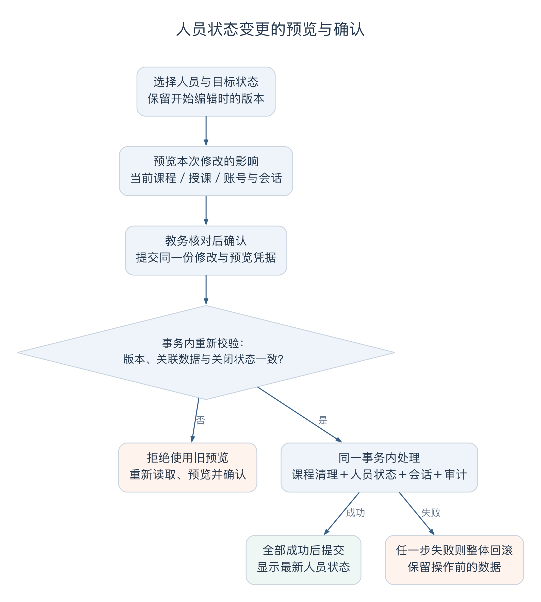
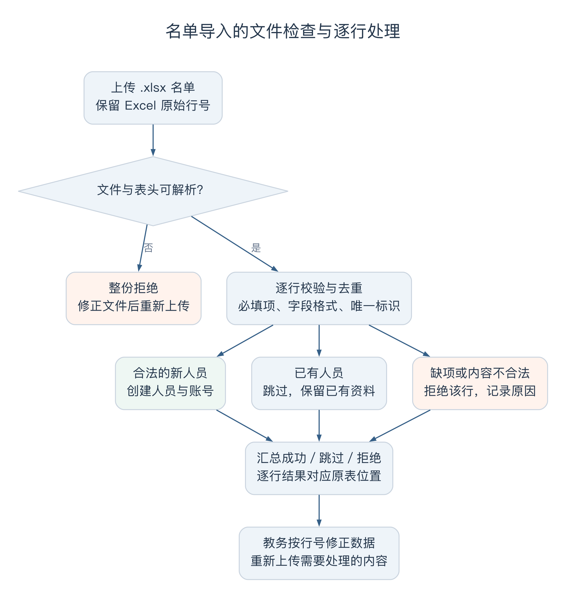

# 冯海洋个人工作汇报

- 姓名：冯海洋；学号：21230729。
- 项目：Wylie College 学生选课系统；角色：教务端负责人。
- 日期／版本：2026-10-09，v0.4。
- 汇报关联：US-028／IT-04；主要业务为 US-013、US-014、US-021、US-023，以及关闭选课、计费结果和补选的操作页面。

我负责师生资料维护、名单导入、选课时间设置，以及教务关闭选课和办理补选时使用的页面。这些操作会影响学生和教授正在使用的数据。例如，把学生改为休学以后，当前课程要怎样处理；导入一张名单时，有几行错误，其他行是否还能保存；关闭选课后，教务应该到哪里查看取消结果和账单。我的工作主要是把这些问题落实到人员接口、操作步骤和页面反馈中。

人员管理接口与教务页面由我负责，选课、关闭和补选的核心事务与倪成锦衔接，账单和模拟系统与范昭衔接。报告按需求、对象分析、具体功能的设计实现以及联调测试展开，重点说明教务员作出一次操作后，系统怎样处理相关数据，又怎样把结果交代清楚。

## 一、人员管理需求分析

### 1.1 账号停用、休学与人员删除

人员维护最初可以列成新增、查询、修改和删除几项，但把它放进选课流程，就需要继续说明操作的后果。假设一名学生已经选了四门课，也有过去学期的成绩。教务暂时停用他的账号时，是否应该连四门课一起退掉？如果后来改为休学，过去的成绩单是否还应保留？

我按这些后果区分了三个入口。停用账号只限制访问，撤销现有登录会话，学生暂时不能登录，但已经取得的名额不因此消失。把人员状态改为休学或毕业，则表示他不再参加当前选课，需要清理尚未关闭学期的课表和注册，释放相应名额；已经关闭的学期仍保留，账号启用时也能继续登录查看历史成绩。

删除的范围更窄。有选课、成绩或计费历史的人员不能直接删除，否则成绩和账单会失去对应的人。只有没有业务记录的人员，才能在确认后删除身份及关联账号。因此，对前面这名学生，删除会被拒绝，教务应根据实际情况选择停用账号或调整人员状态。

| 教务操作 | 登录会发生什么变化 | 课程和历史怎样处理 |
| --- | --- | --- |
| 停用学生账号 | 现有会话失效，不能继续登录 | 当前课表、注册和历史成绩保留 |
| 在读改为休学或毕业 | 启用的账号仍可登录，权限缩为成绩查询 | 清理未关闭学期的课表和注册，保留已关闭学期记录 |
| 教授在职改为离职 | 现有会话失效，不能继续登录 | 撤销未关闭学期的授课，保留已关闭的授课与成绩 |
| 删除无业务记录的人员 | 关联账号一并删除 | 有业务历史时拒绝删除 |

教授离职也要区分当前安排和历史。未关闭学期的班次需要撤销该教授的授课，页面显示暂无教授，供后续重新安排；已经关闭学期的授课与成绩继续保留。这样查询过去的课程时，仍然知道当时由谁授课。

### 1.2 教务操作的权限范围

人员维护并不意味着教务可以修改系统中的所有数据。课程名称、学分和先修要求由学校课程目录提供；学生关闭前的课表由本人管理；本系统内的成绩由教授录入。我据此检查了导入和补选两个容易扩大权限的入口。

历史成绩导入用来建立上线前的数据，以便检查学生是否修过先修课。因此，只允许导入早于上线学期的成绩，已有记录不能覆盖。如果允许导入当前学期或替换原成绩，就会绕过教授录分流程。教授授课资格也只说明某位教授可以教哪些课程，具体选择哪个班次仍由教授完成。

关闭后补选用于处理个别学生的选课需要，继续检查在读状态、四门上限、容量、先修和时间冲突。本次没有加入重新开放选课或关闭后退课。确定这些范围以后，我才能把页面上的入口与后端允许的操作对应起来，避免同一件事从另一处页面进入就换了一套规则。

## 二、对象分析与数据设计

### 2.1 人员标识与账号关联

学生和教授都可能重名，搜索结果里只显示姓名容易选错人。因此，列表同时显示姓名和系统生成的学号或教授编号，具体操作使用稳定的人员 ID。以后改名时，人员和原账号仍保持关联。

身份防重还涉及两个角色之间的关系。如果学生表、教授表各自判断 SSN 是否重复，同一个人仍可能分别在两个表中创建成功。共享数据模型用一份人员身份记录统一约束，我的人员新增和导入接口都按这个约束处理。在数据库中，人员资料、身份记录和账号一起创建，其中一步失败就撤销这一行的全部修改，避免名单里已经出现人员，却没有可用账号。

页面需要显示足够的信息来核对身份，也要避免把完整 SSN 带入列表和截图，所以读取时只返回脱敏值。这又带来一个编辑问题：掩码不能被当作新 SSN 保存。我把“留空”约定为保留原值，只有输入完整的新值时才修改，编号和账号也不跟着姓名变化。

### 2.2 人员状态与业务数据关联

在[对象分析](../../design-docs/object-oriented-analysis.md)中，人员、账号、课表、注册和成绩各有自己的含义。学生有一份保存的课表，并不一定已经取得其中所有课程的名额；教授有授课资格，也不表示已经承担某个班次。状态修改需要沿着这些关系检查，单改人员表上的状态还不够。

学生休学时，未关闭学期的编辑内容和有效注册都要清理，班次人数随注册变化，首次提交时间也要清除。否则学生以后重新建立课表，可能继续沿用旧的调剂排位。教授离职时，要撤销当前授课安排并更新授课历史和版本，让教授页面与学生看到的教师信息一起变化。

已关闭学期则保留原有关系。选择按学期处理，是因为同一个学生或教授可能同时关联当前和过去的课程；把所有关联一起删除，虽然数据库操作简单，却无法继续查询过去的结果。我的人员服务因此调用既有的业务处理，并与共享事务保持一致。

登录记录的作用又不同。它说明某个账号曾经访问过系统，不参与选课和计费。联调中出现的人员删除故障，正是因为数据库把这种访问记录也设成了阻止删除的条件，后文会说明具体处理。

## 三、人员状态变更的设计与实现

### 3.1 人员状态变更的影响预览

休学和离职会影响正在进行的业务，我把状态修改安排为编辑、预览影响、确认写入几个步骤。预览列出受影响的学期和班次，并说明哪些课表或授课安排会被清理，哪些已关闭记录会保留。教务可以在这里取消，返回修改资料。

不过，单有确认框还不够。假设教务预览学生休学时，看见三门注册，停留期间学生又提交了第四门。如果服务器收到“已确认”以后直接清理最新的四门课，第四门就没有经过教务核对。反过来，如果只清理原来的三门，学生休学以后又会留下不应存在的当前注册。

因此，确认必须对应刚才看过的那份影响。课程发生变化时，页面要求重新预览，让教务看见第四门再决定。这个处理会增加一次核对，但能把“确认修改”落实到具体的课程和学期。

### 3.2 预览结果的确认与重新校验

实现时，后端给每次预览生成一个签名的 `impactToken`，记录对应的人员版本、修改内容、受影响记录和有效期。确认请求带回这份 token，服务在事务里重新计算影响，检查是否仍与预览一致。有效期为五分钟，人员、课程或学期状态变化后，旧预览不能继续使用。

页面也保存最初读取到的版本，预览后锁定这次修改内容，确认时提交同一份修改。若版本过旧或影响已改变，就显示原因并要求重新核对；只有服务器成功返回后才结束编辑。普通资料修改和删除同样检查原版本，防止另一个教务页面已经改过数据，这边仍用旧内容覆盖。

这里需要同时检查关联数据。人员资料本身没有改变，并不表示学生没有新选一门课；只检查人员版本会漏掉前面的例子。后端还会核对课表、学期和关闭状态，使预览覆盖到真正要处理的内容。

### 3.3 状态变更与课程清理的原子性

一次确认涉及多项写入：清理当前课表或授课，修改人员状态，调整账号和会话，再留下操作记录。如果先退掉课程，随后人员状态修改失败，学生就会仍显示在读，却失去了原来的课表。因此，这些修改放在同一个事务中，任一步出错都恢复原状态。

后续验收在人员更新处通过 PostgreSQL 触发器故意制造失败，再比较操作前后的人员、课表和授课记录，检查有没有残留的部分修改。这样能直接检查中途失败后的结果，而不只看正常请求能否成功。

状态清理还要与关闭选课协调。关闭开始以后，正在确定最终课表，新发起的清理不能继续进入；已经进入处理的操作则由统一的准入机制协调。这个规则与倪成锦负责的关闭事务共用，教务页面收到影响变化或关闭中的结果后，再提示重新读取，避免单靠按钮是否禁用来判断能不能写入。

图 1 根据人员状态变更的设计流程绘制。确认时重新核对人员版本、关联数据与关闭状态；旧预览不再适用时要求重新确认，事务内任一步失败则整体回滚。[可编辑图源](attachments/figure-status-preview.dot)。

## 四、批量导入的设计与实现

### 4.1 导入逐行结果与错误修正

导入名单时，很常见的情况是一部分人员尚未建立，一部分已经存在，还有几行漏了必填内容。[需求中的验收样例](../../REQUIREMENTS_ANALYSIS.md)包含三名新学生、一名已有学生和一行缺少姓名的数据，预期结果是三行成功、一行跳过、一行拒绝。

如果其中一行错误就撤销整份名单，前面合法的人员也要重新导入；如果只显示一个“导入成功”，教务又不知道漏了谁。我采用逐行处理，每一行分别校验和保存，页面汇总成功、跳过和拒绝的数量，下面保留每行的具体结果。

行号使用 Excel 中的原始位置，第一行是表头，数据从第二行开始。即使中间有空行，错误提示仍能对应原表。教务看到“第 4 行姓名为空”后，可以回到那一行修正，再上传需要处理的数据，已经成功的行不会因为后面的错误而撤销。

已有人员选择跳过，不用名单中的值覆盖。重复上传可能只是教务没有确定上次是否成功，不能因此把已有资料改回旧版本；需要改资料时，应进入人员编辑流程，重新核对当前内容。导入服务也通过数据库唯一约束处理同时上传的重复人员，避免只在上传前查一次就产生两份账号。

图 2 根据[导入服务](../../../apps/api/src/modules/imports/service.ts)整理的处理流程。文件无法解析时整份拒绝；可解析的名单按行分别保存、跳过或拒绝，结果保留原表行号。[可编辑图源](attachments/figure-import-rows.dot)。

图 3 为 10 月 9 日使用虚构名单重拍的导入页面。Excel 第 2、3、4 行分别成功、跳过和拒绝，初始密码已隐藏。采集环境见文末附件说明。

### 4.2 四类导入数据的校验规则

页面共用文件选择、结果统计和明细展示，但学生、教授、历史成绩和授课资格的判断依据不同。选定导入类型后，页面显示对应表头，后端再按该类数据校验。

| 导入类型 | 主要判断 | 处理结果 |
| --- | --- | --- |
| 学生、教授名单 | 必填资料完整，SSN 在两个角色中都不重复 | 新人员创建账号，已有人员跳过，缺项的行拒绝 |
| 历史成绩 | 学生和课程存在，学期早于上线学期，成绩值合法 | 已有成绩跳过，不覆盖原值 |
| 教授授课资格 | 教授编号和权威目录中的课程存在 | 按教授与课程去重，未知编号或课程拒绝 |

例如，某学生某学期的成绩已经是 B，再上传同一门课程的 A，结果应显示跳过，原 B 保留。这样不能借导入替换原成绩。授课资格重复上传也只保留一份，后续教授选课仍按同一份资格查询。

历史成绩和资格依赖学校目录中的课程标识。目录暂时不可用时，相关导入会返回连接问题，待恢复后再处理，不根据名称猜测一门课程是否存在。

### 4.3 文件格式与解析校验

名单中的 SSN、学号或教授编号可能以零开头。如果表格把这些值存成数字，前导零在上传以前就可能丢失。因此，模板要求标识字段使用文本，解析时拒绝数值编号；公式和超链接也不当作普通字段接受。日期则按约定转换成日期字符串。

文件处理还设了范围：仅接受 `.xlsx`，压缩文件最多 5 MiB，展开后最多 20 MiB，最多 5000 条数据行、50 列。解析器先检查压缩包结构，再检查首个工作表的必填、重复和额外表头，避免文件内容还没有读清楚就开始写入人员。完全无法解析的文件整份拒绝，能够解析的文件再进入逐行处理。

### 4.4 上传中断后的结果核对

逐行保存意味着请求断开时，前面几行可能已经写入。因此，页面不会自动重传整份文件，教务需要先核对人员和已有结果，再处理剩余数据。重新导入已有人员会跳过，但这种防重不能把一次断连解释为整份都没有执行。

新人员的初始密码也在这一环节交付，只在创建成功的那次响应中显示。数据库保存密码摘要，页面提供“已交付，隐藏全部初始密码”，离开页面后不能重新查询原密码。截图前先隐藏凭据，避免把它们带进报告。

人员已经创建成功、响应却丢失时，重导只能得到重复跳过，无法取回初始密码。因此，导入结果除了核对成功人数，也需要核对新账号的凭据是否已经收到并完成交付。

## 五、选课时间设置

### 5.1 业务时区与时间转换

教务可以设置教授开始选择授课的时间，以及学生初选、加退选的起止时间。系统可能从不同时区的电脑打开，如果直接采用浏览器本地时间，同一个“17:00”会指向不同的实际时刻。我把页面显示和输入统一为北京时间，提交时转换成 UTC，由服务器按统一时刻判断。

几个时间点按“授课开始 ≤ 初选开始 < 初选结束 ≤ 加退选开始 < 加退选结束”排列，允许初选结束后留出一段空档。每个窗口包含起点、不包含终点，到截止时刻后就不能继续确认新的选课提交。判断使用服务器完成确认的时间，学生电脑的时钟或点击按钮的时刻不能替代它。

正式教学起止、学期顺序和上线学期由初始化资料维护，窗口页面只调整授课和选课阶段。已经开始关闭或完成关闭的学期，也不能通过把结束时间改到以后来重新开放。

### 5.2 多页面时间修改的版本检查

窗口调整与学生编辑课表有相同的问题。假设两个页面都从 v3 开始，一页已经保存为 v4，另一页还留着原来的时间。此时直接提交旧内容，就会覆盖刚才的调整。

页面因此保留本地编辑和最初版本。发现服务器已有新版本时，本地输入仍留着供比较，但旧版本不能保存，教务需要核对新的窗口，再明确采用服务器内容。后台轮询也不能把未保存的输入直接替换，或者悄悄给旧输入换上新版本号。

前端检查用北京时间 17:00 的输入，确认请求中为 UTC 09:00，并携带原 v3，成功后显示 v4。后端测试另检查窗口起点、结束前一刻、结束时刻、阶段空档和关闭后的限制。这两部分连起来，才能检查页面输入最终是否按同一含义执行。

## 六、关闭与补选页面

### 6.1 关闭进度与最终结果展示

教务发起关闭以后，系统先停止新的选课操作，等待已经进入处理的操作结束，再统计、调剂、取消班次和生成账单。这需要一段处理时间，所以接口返回“已受理”时，页面继续显示正在关闭，并查询后续结果。

我把页面按开放、正在关闭、已关闭三个状态显示。开放时可以确认关闭；处理中说明正在等待和处理，并移除重复关闭入口；完成以后显示关闭时间、取消班次、调剂结果和仍需处理的学生。关闭内部失败、恢复开放时，则显示失败原因，供教务重新核对。

这些结果要分别呈现。例如目录变动造成的冲突没有解决，关闭后仍需列出学生，不能因为本次关闭完成就把问题隐藏。没有调剂记录也要如实显示为空，不能让读者把“没有发生调剂”理解为页面没有加载。

### 6.2 账单送达与收款状态的区别

关闭完成后，计费系统可能暂时无法连接，账单仍在等待发送。如果把这些状态合成一个“关闭失败”，教务容易再次发起关闭。我在结果页把关闭结果与账单送达分开，显示账单金额、版本、送达状态、尝试次数和下次重试时间。

计费模块由后台保存和重试待发送账单，页面据实显示进展。计费系统收到账单只说明资料已经送达，实际缴费还在外部系统处理，所以页面将其标为计费送达状态。教务查看的是哪些账单已送出、哪些还在等待，无须重新执行选课关闭。

### 6.3 补选结果与账单更新

补选页面先查找学生，显示他的当前课表和可选班次，再选择要补的一门。非在读、已有四门、班次取消、没有教授、满额或已注册等条件，可以先在页面提示；先修和时间冲突等仍要在服务器写入前检查，因为从打开页面到确认之间，数据可能已经变化。

选择班次时记录当时的课表版本。如果确认期间发现版本已变，页面要求取消这次确认，重新选择并核对；成功后再读取课表和账单结果。这样不会把其他操作刚写入的课表当成原来的内容继续使用。

补选会改变整个学期的应缴金额，新账单表示完整课表的总额。假设原来应缴 1200 元，补选后变成 1500 元，最新金额就是 1500 元，不能再把旧的 1200 元加上去。页面显示新旧版本及替代关系，让教务能对照这次补选的影响。

10 月 5 日的真实联调中，关闭产生了 4 个取消班次，调剂和未解决问题均为 0；14 笔账单全部送达，其中 3 笔为 1100 元，11 笔为 0 元。随后为其中一名学生补选，原 0 元 v1 被 300 元 v2 替代，模拟计费系统保留了两版记录，最终金额没有累加。这个流程把补选页面、课表变化和账单版本接在了一起。

## 七、联调问题与处理

### 7.1 登录审计导致的人员删除失败

开发联调发现，一名人员没有选课、授课、成绩或计费记录，按需求应当允许删除，但实际操作被数据库阻止。继续检查关联关系，发现账号留下过登录日志，而日志的外键要求被引用的账号必须存在。

这使“有登录记录”产生了与“有成绩记录”相同的删除限制。直接删掉日志会丢失访问事件，只改页面提示又不能让合法删除完成。最后，数据库迁移把日志中的账号引用改成可空：账号删除后，引用置空，事件本身继续保留；选课、成绩、计费等业务历史仍阻止人员删除。

[数据库约束测试](../../../packages/db/src/constraints.integration.test.ts)进一步检查，删除账号后审计事件仍存在，账号引用为空。后续真实浏览器联调也通过页面删除了刚导入、没有业务记录的人员，并在数据库中确认原有 14 人保留。这个问题促使我在人员维护中更明确地区分两类记录，删除提示和处理依据都应指向具体业务关系。

### 7.2 人员删除与关闭选课的并发协调

关闭选课时需要确定本学期的学生集合，再为这些学生生成账单；教务又可能同时删除一个没有业务记录的学生。检查实现时发现，关闭已经停止新准入、但状态还没保存到数据库的一小段时间里，删除如果只读数据库，就可能以为仍处于开放状态。

处理办法是让删除和关闭获取同一学期行的锁。删除真正写入前，同时复查数据库状态和即时的关闭准入状态；关闭拿到锁后，再确定要处理的学生集合。这样，删除先完成时，关闭按更新后的人员处理；关闭先开始时，删除就不能越过这次关闭继续修改集合。

已有测试分别控制了这两种先后顺序。教务页面按后端结果显示操作是否允许，不再用打开页面时读到的“开放”状态推断最终一定可以删除。人员预览和窗口版本也有相似要求：读到的状态只代表当时，写入前仍需重新核对。

### 7.3 关闭页面的等待状态修正

页面联调还出现过一个更直接的问题：关闭结果已经显示完成，原来的等待提示却仍留着。教务会同时看到两种状态，难以判断是否还需要等待。修改后，等待提示只在正在关闭期间出现，进入已关闭状态后一起移除。

另一个问题发生在取消确认框以后。按 Escape 关闭弹窗，键盘焦点落到了页面 body，用户需要重新寻找原按钮。公共确认框补上了焦点恢复，关闭弹窗后回到触发位置，并在前端检查中复查。

这两处都没有改变关闭结果，却直接影响教务能否顺利完成一次操作。后面的页面走查也因此需要覆盖取消、等待结束和失败返回，不能只停在点击确认后出现成功结果。

## 八、测试与结果核对

教务功能的检查重点是一次操作前后的差别。人员状态修改要比较课表、注册、会话和历史；导入要看每行是否落库、账号是否对应；补选要同时看人数与账单。只看到页面提示成功，还不足以判断这些关系是否处理完整。

| 检查内容 | 使用的方法 | 已有结果 |
| --- | --- | --- |
| 人员新增与删除 | API、数据库约束及真实浏览器操作 | 编号稳定，跨角色 SSN 防重，有业务历史拒删，登录日志保留 |
| 状态预览与失败回滚 | 修改关联数据后再次确认，在人员写入处注入数据库失败 | 旧预览被拒绝，中途失败后人员与关联数据恢复 |
| 名单及其他导入 | 真实 xlsx、混合成功与错误行、重复导入 | 返回原行号，坏行不影响已成功行，历史成绩不覆盖，资格不重复 |
| 时间设置 | 页面请求检查与后端时间边界测试 | 北京时间正确转换，使用原版本提交，截止与关闭限制生效 |
| 关闭和补选 | 三角色浏览器联调、API 并发及账单断言 | 显示处理阶段，检查容量与四门上限，失败不生成新账单 |

导入的自动化样例使用三新、一重、一坏五行，浏览器样例使用成功、重复、无效各一行，两组结果分别保留。浏览器记录检查了上传、逐行反馈、隐藏初始密码以及后续删除人员；10 月 9 日的报告截图复用了后一组输入，方便在文中展示三种结果。

[测试报告](../../TEST_REPORT.md)记录的全项目回归，从开发联调的 108 项增加到后续 207 项，再到性能修复后的 215 项，其中包含 73 项 PostgreSQL／HTTP 验收集成测试。这里引用与教务功能有关的场景，具体执行环境和结果见[验收账本](../../testing/acceptance-execution.md)。图 3 展示逐行反馈，关闭的 14 人样例展示账单流转；其他分支仍要按各自用例检查，不能由一张图或一轮联调覆盖。

## 九、协作、总结与后续工作

### 9.1 跨模块协作与接口衔接

教务操作涉及其他角色正在使用的数据。我与倪成锦衔接人员模型、版本、关闭准入和核心事务，让页面请求与统一规则对应；学生状态调整后，课表和登录变化需要与浩宇负责的学生端一致；教授离职、资格导入和历史成绩则需要与马喆负责的授课和成绩模块一致。

名单样例、上线学期资料、账单版本和送达状态与范昭负责的环境及模拟系统衔接。测试场景交给冯海伦汇总时，需要写清操作前有什么数据、操作后哪些应变化、哪些应保留。比如“删除成功”还要检查账号是否删除、日志是否保留，不能只提供一个成功提示。

小组报告中，我的贡献比例为 14%，对应人员维护、导入、时间设置以及关闭和补选界面的工作。

### 9.2 工作方法与后续改进

这次最值得保留的做法，是在设计按钮之前先走一次具体操作。用同一名学生比较停用、休学和删除，很快就能看出账号权限、当前课程和历史成绩不能一起处理。以后再增加教务功能，我会先把受影响的人、学期和数据写清楚，再决定是否需要预览或确认。

预览和导入也让我更注意操作中途的变化。教务看到三门课时作出的决定，不能直接用于后来新增的第四门；一张名单出现错误，也要让人知道前面是否已经成功。这些信息会决定用户下一步怎么做，应当随功能一起设计，等联调以后才补提示，容易遗漏重试和取消路径。

人员删除故障则提醒我，需求里的“业务历史”需要落实到每一种数据关系。登录事件可以保留并解除账号引用，成绩和账单仍要保留完整归属。后续检查数据模型时，我会把这类删除和状态变化单独列成场景，沿着关联记录逐项看结果。

### 9.3 定稿与交付安排

当前还需要按验收账本复核人员状态影响列表的完整展示，补查毕业页面、敏感响应字段和后台审计事件；补选并发也要补齐交换请求先后顺序的确定性检查。已有触发器回滚和主流程通过记录保留，复核结果再写回对应场景。

导入方面，需要与交付负责人核对名单模板、上线学期配置和初始账号交付步骤，并明确创建成功但密码响应丢失时的处理办法。窗口冲突、状态预览、补选失败以及确认框取消，也应由另一位成员按实际操作重新走一遍。

Windows Chrome、Edge，另一台电脑从空环境启动，以及七天可用性观察仍在项目后续安排中。原 macOS 2000 用户负载失败和修改后 Linux 复测通过采用不同环境，不能直接代替这些操作检查。最后由本人核对报告中的工作内容，补齐课程封面与签名，随小组材料一起定稿。

## 主要参考材料

| 内容 | 文档、实现与提交 |
| --- | --- |
| 需求与对象分析 | [需求分析](../../REQUIREMENTS_ANALYSIS.md)、[面向对象分析](../../design-docs/object-oriented-analysis.md)、[接口约定](../../design-docs/api-contract.md) |
| 人员维护 | [人员页面](../../../apps/web/src/routes/people.tsx)、[人员服务](../../../apps/api/src/modules/people/service.ts)、[b35ea15](https://github.com/Nichengjin/software-engineering-project/commit/b35ea15ff7d37451e8f600b200f4e729e968eab0) |
| 四类导入 | [导入页面](../../../apps/web/src/routes/imports.tsx)、[导入服务](../../../apps/api/src/modules/imports/service.ts)、[xlsx 解析](../../../apps/api/src/modules/imports/xlsx.ts)、[58cd6f1](https://github.com/Nichengjin/software-engineering-project/commit/58cd6f1fe55ec2e0e5ae1d7287ddf11df13f1b9a) |
| 选课时间 | [窗口页面](../../../apps/web/src/routes/term-windows.tsx)、[d50bc53](https://github.com/Nichengjin/software-engineering-project/commit/d50bc53c23d2cc6454cb658033c22a55b3aa6d83) |
| 关闭与补选 | [关闭页面](../../../apps/web/src/routes/close.tsx)、[补选页面](../../../apps/web/src/routes/supplement.tsx)、[1741c8a](https://github.com/Nichengjin/software-engineering-project/commit/1741c8ae6ac9737b25bd9c8482df7513749892f4) |
| 联调问题和测试 | [开发联调记录](../../histories/2026-10/20261005-0312-system-design.md)、[前端检查](../../FRONTEND.md)、[API 集成测试](../../../apps/api/test/backend.integration.test.ts)、[验收场景](../../../tests/acceptance/scenarios.integration.test.ts)、[测试报告](../../TEST_REPORT.md) |

相关集成记录为 [PR #17 人员与导入](https://github.com/Nichengjin/software-engineering-project/pull/17)、[PR #18 学期窗口](https://github.com/Nichengjin/software-engineering-project/pull/18)和 [PR #21 教务关闭与补选](https://github.com/Nichengjin/software-engineering-project/pull/21)，需求、提交和测试的对应关系见[追溯表](../../product-specs/traceability.md)。

## 附件说明与修订记录

### 图 3 采集说明

[导入结果截图](attachments/import-result-20261009.png)于北京时间 2026 年 10 月 9 日 12:25 前后采集，使用 macOS、Chrome 154、1440×900 视口及两倍像素密度，只截浏览器可见画面。前端为构建后的页面，连接临时测试数据库和独立 HTTP 模拟服务，沿用 10 月 6 日验收的三行虚构输入。教务账号 R01 上传后，第 2 行成功，第 3 行因 SSN 重复跳过，第 4 行因姓名为空拒绝，密码已隐藏。

本次重拍替换了排版不完整的旧整页图。侧栏的 2026-09-28 是测试注入业务时间下的会话到期时间。采集完成后临时服务和数据已清理；正文中的 14 人关闭及补选结果来自 10 月 5 日的另一套联调数据。

### 修订记录

| 日期 | 版本 | 修订内容 |
| --- | --- | --- |
| 2026-10-07 | v0.1 | 依据职责、原提交和执行记录形成简版初稿 |
| 2026-10-08 | v0.2 | 扩充需求、数据与确认设计、导入、窗口、关闭补选、联调和复盘 |
| 2026-10-09 | v0.2续 | 重拍导入截图，更正会话时间说明和验收引用，补入协作方式澄清 |
| 2026-10-09 | v0.3 | 按教务操作重写全文，展开状态预览、导入和删除故障，合并重复说明，更新贡献比例，集中整理后续工作 |
| 2026-10-09 | v0.4 | 统一章节标题，新增两张流程、交互或数据图，补充图注、可编辑图源与已有记录来源，更新图号及引用 |
