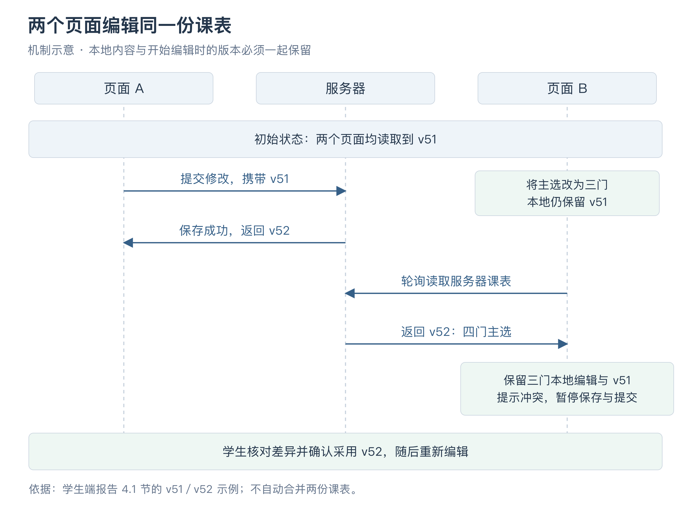
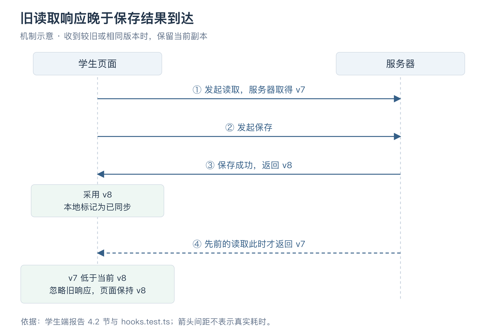

# 浩宇个人工作汇报

- 姓名：浩宇；学号：21230726。
- 项目：Wylie College 学生选课系统；角色：学生端负责人。
- 版本：v0.4，2026-10-09。
- 关联：US-028／IT-04；学生端涉及 US-004—008、US-012，公共权限交互涉及 US-017，时间显示涉及 US-021。

## 一、我负责的工作

我负责学生端的课程浏览、主备选编排、保存与正式提交、加退选、删除课表和成绩查询，也参与了登录入口、公共交互组件及学生端自测。学生打开页面后，要能从查课程一直操作到确认选课结果；中间遇到满员、版本变化或网络问题时，也要知道原来的课程是否还在、刚才的修改有没有保存。

这部分工作的一个主要问题，是同一名学生会同时有几份不同的课程选择。服务器上可能已经保存了一份，浏览器里正在修改另一份，实际占用名额的课程又与这两份不同。如果直接把它们放进同一个列表，保存、换课和失败提示都容易产生歧义。我先按需求梳理每次操作改变的内容，再据此安排页面和数据；实现时继续处理自动刷新与本地编辑之间的关系。

后端的容量、先修和事务规则由倪成锦统筹。我负责把这些规则接到学生操作中，并处理浏览器中的输入、版本和反馈。需求依据见[需求分析](../../REQUIREMENTS_ANALYSIS.md)，学生端的详细约定整理在[前端说明](../../FRONTEND.md)中。

## 二、需求分析

### 2.1 课表保存与正式提交

小组讨论确定保存不占名额后，学生页面需要把这个区别讲清楚。假设学生已经选上物理课，后来在编辑区删掉物理、加上美术，只点击“保存选择”。这时物理课仍然有效，美术只进入已保存的选择。如果页面把物理直接移除，再把美术标成已选上，学生看到的结果就会早于真正发生的换课。

因此，我把“保存选择”和“正式提交”分成两个入口。保存成功后显示“选择已保存，不预留名额”；实际选上的课程另放在“有效注册”区域。学生可以对照自己正在编排的内容和已经取得的名额，决定是否继续修改或正式提交。

换课时还要说明失败的后果。美术课如果已经满员，正式提交会整体失败，原来的物理课继续保留。页面显示具体错误，同时保留刚才编辑的选择，学生可以换一个班次后再提交。这样既能看见原课表没有丢，也不必重新挑选整张课表。

删除的含义也要分清。从编辑区移除一门课，只是在修改这次准备提交的内容；“删除整个课表”则会退出本学期的全部有效注册。后者单独设置确认框，说明会清空哪些内容，以及重新选课时需要满足什么条件。

### 2.2 首次提交与后续加退选规则

题目要求第一次提交选满四门主选、两门备选。但已经完成首次提交的学生，可能只想退掉一门，之后允许保留一至四门主选、零至两门备选。保存又不必一次选齐，否则学生整理到一半就无法留下进度。

我把这几种情况整理后，再决定页面提示和按钮条件。

| 学生正在做的事 | 数量要求与处理 |
| --- | --- |
| 还没选齐，先保存 | 可以保存不足四主选、两备选的内容，暂时不注册 |
| 第一次正式提交 | 必须刚好四门主选、两门有序备选 |
| 已提交过，继续加退选 | 允许一至四门主选、零至两门备选，整份检查后更新 |
| 准备退出全部课程 | 使用“删除整个课表”，确认后退出注册并清除首次提交时间 |
| 删除后重新选课 | 重新按首次提交的四主选、两备选要求处理 |

这里不能根据页面上有没有课程来判断“是否首次”。学生可能只保存过，也可能正式提交后又改了选择。我使用服务器返回的首次成功提交时间来判断，并在编排区显示当前适用的要求。数量不足时仍可保存，正式提交按钮则保持禁用，旁边说明原因。

### 2.3 备选课程的顺序与名额规则

备选用于关闭选课时的调剂，先尝试第一门，再尝试第二门。它不预留名额，不能保证最终补入。因此，备选单独显示为有序列表，提供上移、下移按钮；保存和提交时保留学生安排的顺序。

主选与备选的可选条件也有区别。一个已经满员的班次，不能新增为主选，但仍可以作为备选，因为关闭时人数可能变化。备选也允许与主选发生时间冲突，或选择同一课程的不同班次，后续调剂再检查能否加入。若把主选的禁用条件直接复制给备选，会挡住这些允许的操作。

反过来，某班次虽然已经满员，学生本人原来就在其中，也应允许继续保留这门主选。页面据此同时检查容量和本人已有注册，避免把“保留原课程”误判成“新增一个名额”。

### 2.4 名额展示与提交校验

学生挑选课程时，其他人也在操作。即使页面刚显示还有一个名额，也可能在点击提交之前被别人选走。课程时间、先修条件和开放状态同样可能变化，所以页面中的筛选和提示只能帮助选择，正式提交还要由服务器重新检查。

这影响了错误信息的写法。接口返回哪门课满员、哪里不满足先修或发生时间冲突，页面就保留相应内容，让学生知道要修改哪一项。目录发生变化时，也展示通知；如果原班次已经不在目录中，编辑区仍保留编号和“目录已变更”的提示，便于学生辨认原来的选择。

## 三、分析与设计

### 3.1 课表状态与数据划分

在[面向对象分析](../../design-docs/object-oriented-analysis.md)中，课表选择和注册关系已经分开。课表记录学生准备选择什么，注册关系记录实际取得了哪些班次的名额。教授名册和班次人数根据注册关系查询。

页面还需要增加一层本地编辑。例如服务器保存的是四门课，学生在浏览器里删掉其中一门，却还没点保存。这时服务器仍有四门，本地只剩三门，两者暂时不同是正常的。为了让刷新时知道哪份内容能替换，我把页面中用到的状态按来源列了出来。

| 状态 | 从哪里取得 | 什么时候改变 |
| --- | --- | --- |
| 本地编辑内容 | 首次读取服务器选择后建立 | 学生添加、移除、排序，或确认采用服务器版本 |
| 已保存选择 | 服务器课表 | 保存或正式提交成功后更新 |
| 有效注册 | 服务器课表中的注册记录 | 正式提交、删除、关闭调剂或补选后更新 |
| 课程目录和通知 | 目录、通知接口 | 页面定期读取，显示名额与课程变化 |

据此，页面左侧放课程目录、有效注册和变更通知，右侧放正在编排的主备选。右侧的内容与有效注册不一致时，页面保留这种差异，并通过“仅选择 · 未注册”等文字说明。

图 1 展示了选好四门主选、两门备选但尚未保存的页面。目录中的已选班次已有标记，右侧仍显示“本地未保存”，底部保留两个不同操作入口。

图 1 主备选编排页面，2026 年 10 月 9 日采集。四门主选标为“仅选择 · 未注册”，备选可调整顺序。保存后数据库是否仍无注册，在第六章的联调检查中核对。

### 3.2 整份课表提交的接口设计

如果学生想把物理换成美术，浏览器先发退课请求，再发选课请求，那么第二步失败以后还得设法恢复物理课。这个过程跨越两个请求，中途断网也会让页面难以判断结果。

我按[接口约定](../../design-docs/api-contract.md)提交整份主选和有序备选，让后端在一次操作中检查并更新。保存、正式提交和删除使用各自的接口，均带上开始编辑时的版本号。页面收到成功响应后采用服务器返回的选择和新版本，再更新提示。

前后端使用共享类型描述课表与错误结果，学生页面不直接访问数据库。读目录、课表和通知时，可以并行取得这些内容；但它们是三次独立读取，不能据此保证学生提交时数据仍然相同。因此，写入时的版本和业务检查始终保留。

### 3.3 公共组件与学生业务的边界

登录、刷新、错误反馈和确认弹窗也会被教授端、教务端使用，我将这些内容放入公共层。学生页面保留四主选、两备选、注册展示等专属规则，公共版本处理只负责判断一份编辑是否已经过期。

例如教授也可能在两个页面修改授课安排，可以复用版本检查；但教授选择多少班次，不应受学生首次提交数量的影响。这种划分使公共组件能解决共同问题，各业务页面仍能按自己的操作安排内容。

## 四、课表编辑与异步状态处理

### 4.1 多页面编辑与版本冲突

选课页要不断更新名额和课程信息，但学生可能正在调整尚未保存的内容。如果每次读取都替换编辑区，刚移除的课程会重新出现，刚排好的备选顺序也可能被恢复。只保留内容还不够，内容对应的原始版本也必须一起保留。

假设 A、B 两个页面最初都读到 v51。B 把本地主选减少到三门，还没有保存；A 随后保存了一份四门主选的内容，服务器变成 v52。B 刷新时，如果直接采用服务器内容，三门课的编辑会消失；如果保留三门课，却把版本改成 v52，下一次保存又会把 A 刚完成的修改覆盖掉。

因此，我把本地内容、开始编辑时的版本和是否有未保存修改放在一起。没有修改的页面可以接受更高版本；一旦学生开始编辑，刷新就保留这份内容及其原版本。发现服务器版本更高时，页面显示双方的版本和服务器选择，暂停旧副本的保存与提交，学生核对后再确认采用服务器版本。

图 2 根据本节 v51／v52 示例绘制的交互顺序。页面 B 保留本地三门课和原版本，待学生核对后再采用服务器内容；箭头间距不表示真实耗时。[可编辑图源](attachments/figure-multi-page.svg)。

图 3 是双页面检查中的结果。本地仍为 v51，右侧保留三门主选；提示区列出服务器 v52 的四门主选，并提供重新采用服务器版本的入口。

图 3 旧草稿保留与服务器内容对照，2026 年 10 月 6 日采集。旧副本的保存、提交按钮禁用，以及旧版本请求被拒绝，分别由浏览器和接口检查确认。

采用服务器版本会放弃当前本地编辑，所以这个入口也需要确认。当前实现让学生看过双方内容后重新编辑，没有自动合并两份课表。选课涉及数量、时间和备选顺序，简单拼接两个列表很难表达学生原本的意图。

### 4.2 异步响应乱序处理

版本检查还要处理响应到达顺序。假设页面先发出一次读取，随后保存成功，服务器返回 v8；之前的读取过了一会儿才返回，内容仍是 v7。如果按“最后收到哪个就用哪个”更新，页面会从刚确认的 v8 倒退到 v7。

仅检查有没有未保存编辑也处理不了这个问题。保存成功以后，本地已经被标记为已同步，仍然需要保留刚得到的 v8。因此，版本合并函数 `reconcileDraft` 除了保护未保存内容，还会比较版本：读取结果低于或等于当前版本时保留当前副本，只有真正更高的版本才更新未修改的副本。

图 4 根据 v7／v8 示例与版本处理规则绘制。保存结果已把页面更新为 v8，随后到达的 v7 读取结果不会覆盖它。[可编辑图源](attachments/figure-stale-response.svg)。

[版本测试](../../../apps/web/src/lib/hooks.test.ts)专门安排了这些顺序，包括写成功后旧读取晚到、同一版本却返回不同内容，以及干净副本接受更高版本。这样可以直接检查先后顺序，不必等待浏览器偶然出现网络延迟。

### 4.3 写请求失败与结果重查

网络失败与明确的业务拒绝还需要区别处理。版本过期时，服务器可以明确返回这次写入没有被接受，学生核对新版本即可。但如果提交已经写入数据库，返回途中断网，浏览器只知道没收到结果，无法据此判断服务器有没有执行。

页面因此保留本地输入，提示先刷新查询、不要重复提交。写操作结束后触发读取，只有明确收到成功响应才直接确认本地的新版本。公共请求层保留服务端给出的版本冲突与逐项错误，也不会自动重发写请求。

后来的性能检查表明，重新查询的时机还需要继续核对。故意把请求期限设得极短时，服务器可能在客户端超时以后才完成写入；如果查询发生得太早，读到的仍可能是旧结果。当前保留了提示和刷新处理，最终重新同步的问题列在第八章，后续要沿着超时、服务器完成、客户端重读的顺序继续验证。

### 4.4 页面轮询与请求合并

选课页可见时，每秒读取一次目录、课表和通知。若一次读取已经超过一秒，又按固定时钟发出下一批，慢网络下就会同时积压许多请求。请求越积越多，返回顺序也更难处理。

公共读取函数 `useResource` 为每个资源保留一批正在进行的请求。上一批未完成时，把新的刷新要求合并，等完成后再继续；页面卸载时取消读取，切到后台后停止安排后续轮询，回到前台立即重读。前端检查曾把目录响应人为延迟到 1.4 秒，观察到同时进行的目录请求最多为一个，说明这一路刷新没有继续叠加。

读取失败时，页面留下最后成功取得的数据，并显示连接异常，超过五秒没有更新时再提示数据可能过期。学生仍可以看原来的课表，但在读取错误解除前暂停写入，避免根据尚未核对的名额、版本和学期状态继续提交。

### 4.5 操作反馈与编辑状态保留

保存或提交进行中时，页面暂时禁用重复操作和相关编辑。否则，请求发送以后学生又改了一门课，成功响应回来时就难以判断它确认的是哪一份内容。请求被拒绝时保留输入，成功时再采用服务器返回的选择；采用新版本和删除课表则通过确认框说明将放弃什么。

确认框本身在开发检查中出现过一个实际问题：按 Escape 取消以后，焦点落到了页面的 `body`，没有回到原按钮。键盘操作的学生虽然取消了动作，却丢失了原来的位置，后续还得重新寻找按钮。

公共确认组件随后补上了关闭时恢复焦点的处理，并复查 Escape 取消后能够返回触发按钮。确认框打开时默认聚焦取消按钮，操作进行中不允许误关闭。除了检查“确认以后有没有发请求”，这次也把“取消以后能否继续操作”纳入了组件检查。

## 五、其余学生功能与公共入口

### 5.1 登录、选课时间与只读状态

学生通过统一登录入口进入工作台，首次登录需要先完成改密。登录恢复、退出和会话失效在公共身份组件中处理，避免每个页面各自保存一份登录判断。请求统一走同源接口，写请求带上必要的校验信息，密码与会话凭据不放入浏览器本地存储。

选课能否操作由服务器返回的学期阶段和关闭状态决定。处于初选或加退选阶段，且尚未进入关闭处理时，页面允许保存、提交和删除；其他时候显示不能编辑的原因。这样学生打开已经关闭的学期时，仍可查看结果，不会面对几个没有解释的灰色按钮。

时间统一按北京时间显示，避免不同电脑的默认时区改变选课窗口的含义。公共时间测试覆盖了跨日换算，例如北京时间 00:15 对应前一天 UTC 16:15。页面负责把时段展示清楚，真正的截止判断仍在服务器执行。

### 5.2 成绩单的空状态与读取异常

学生成绩单查询本人上一已完成学期。关闭选课只是确定本学期的注册与计费，不能据此认为这个学期已经结束，所以成绩页明确写出查询范围，并使用服务器返回的学期。

展示成绩时，我保留课程、班次、成绩和来源信息。历史导入的数据可能没有具体班次，就显示替代文字；成绩 `I` 是一个合法值，按原值展示，不与尚未录入混在一起。

空页面也有几种不同原因。系统没有已完成学期时，提示“暂无已完成学期”；有学期但没有记录时，提示“该学期暂无成绩记录”；已有课程但成绩为空时显示“未录入”。如果接口读取失败，则显示错误并提供刷新入口，避免学生把网络问题误认成自己没有成绩。

页面采用统一导航、表格和反馈样式。窄屏时右侧编排区移到表格下方，课程表格在自己的容器内横向滚动。错误和成功都有文字说明，备选排序按钮也提供可识别的名称，便于键盘操作。

## 六、测试与联调

### 6.1 异常场景与请求顺序测试

学生端需要检查的情形不能只靠正常点击自然出现。例如旧读取晚于写入返回、多页面版本变化和目录慢响应，都需要主动安排顺序。版本与请求层使用单元测试检查这些规则；页面检查则通过临时测试接口提供成功、输入错误、版本变化和慢响应，观察实际界面怎样使用返回的数据。

2026 年 10 月 5 日，前端类型检查、构建以及两个公共测试文件的八项测试通过。测试覆盖原版本与整份选择的请求内容、版本冲突不自动重发、会话失效、网络结果未知、未保存内容保护、迟到读取和北京时间转换。10 月 8 日整理报告时，统筹再次定向运行这两个文件，八项仍全部通过。

页面检查重点看操作以后留下的内容：数量不足时能否保存、备选排序是否随请求保留、提交被拒绝后输入与原注册是否还在、旧版本到达后按钮是否停止写入。慢响应和焦点恢复也在这一轮检查。测试接口便于控制这些条件，注册人数和事务结果则继续接入真实后端检查。

### 6.2 课表操作的数据库结果核对

10 月 5 日的[真实联调记录](../../histories/2026-10/20261005-0312-system-design.md)使用 Hono、PostgreSQL 15 和独立 HTTP 模拟系统，按学生登录、首次改密、保存和提交的顺序操作。

先保存选择，页面显示保存成功，数据库中的有效注册仍为零。随后提交一份不满足先修要求的选择，接口拒绝，课表仍为 v1，也没有产生注册。再提交满足要求的四门主选、两门备选，成功后课表到 v2。通过这几个连续结果，可以核对页面上的“保存”与“正式提交”是否真正对应了不同的业务行为。

联调还连接了教授名册和成绩录入。学生正式选上以后，教授名册应能查到；教授录入上一完成学期的成绩后，学生查询应取得本人记录。这样检查了一次操作跨到另一个角色后，内容是否仍然一致。

### 6.3 浏览器验收场景

10 月 6 日，三角色 Chrome 检查共通过 32 项。学生相关的内容包括首次提交、换课失败保留原注册、取消删除、提交后换一门、确认删除后重新选课，以及 D、I 成绩的本人隔离展示。双真实页面还检查了旧草稿保留和禁用写入，断网后重新连接时也能看到服务器版本变化，具体记录在[验收执行账本](../../testing/acceptance-execution.md)的 AC-49、AC-64 中。

同一轮对人数、目录、名册和版本提示等六条变化路径各观察十次，60 个样本中最长为 1,043.24 毫秒。这里从业务 HTTP 或模拟控制请求成功返回开始计时，到页面 DOM 出现目标状态结束，包含观察开销。它说明这批变化能在当时的环境中于五秒内显示，不包含完整的鼠标点击到绘制时间。

这些记录分别检查了函数、页面操作和真实数据结果。全项目在后续性能修复后通过 215 项回归，学生端相关结果仍按具体场景引用。原 macOS 2000 用户负载未达标、后续 Linux 修改后完整复测通过的过程见[测试报告](../../TEST_REPORT.md)，浏览器的刷新结果与负载结果分别保留。

## 七、协作与工作整理

学生端的许多反馈需要和其他模块对齐。与倪成锦衔接的是保存不占位、整份提交、原版本校验及错误内容；与马喆衔接的是有效注册怎样进入教授名册，以及成绩怎样返回给学生。教务设定时间或发起关闭后，学生页面需要及时进入相应状态；目录模拟改变班次后，页面又要显示更新与通知。

联调时，我负责的页面状态可以帮助缩小问题范围。例如本地修改还没发出时，先看编辑处理；服务器明确返回满员时，按错误调整选择；请求没有得到结果时，再结合后续查询判断。给测试准备场景也需要说明打开了几个页面、各自是什么版本、哪一步先完成，否则只写“刷新后不对”很难复现。

登录公共层、学生页面与版本测试分别保留了原提交，登录和学生功能通过 PR #11、#16 集中合入。共享请求、版本和确认组件也供教授、教务页面使用，修改公共部分时一起核对这些页面。

小组报告中，我的贡献比例为 14%，对应学生端页面、公共交互与版本保护等工作。后续继续按相同职责完成学生端复核，并与测试负责人核对记录。

## 八、个人总结与后续工作

这次学生端实现中，反复需要判断的是一次操作前后究竟应当保留什么。保存后保留原注册，业务失败后保留输入，版本变更后保留旧副本供核对，取消弹窗后保留键盘位置。这些问题落实到页面时，各有不同的处理，不能只靠统一的成功或失败提示完成。

以后开始类似页面前，我会先把本地编辑、服务器保存和实际业务结果列清楚，再检查每个动作改变哪一份数据。异步测试也会更早安排顺序颠倒的情形，尤其是先发出的请求后返回，以及写入成功但响应没有到达。对当前页面，还需要让第一次使用的人按完整流程操作，看看版本提示是否容易理解、失败后是否知道该怎样继续。

截至 10 月 9 日，学生端主要功能已接通。剩余工作按下面几项继续推进。

| 后续工作 | 要继续确认的内容 |
| --- | --- |
| 超时后的最终重新读取 | PERF-02 仍未关闭。40 用户、1 毫秒故意超时检查中，服务器处理结束后课表与注册一致，但仍有 15 名客户端最后确认的课程不同；继续核对服务器完成写入以后，页面何时重新取得结果 |
| 键盘与辅助技术检查 | 已修正 Escape 取消后的焦点恢复，完整人工键盘流程与辅助技术走查仍需执行 |
| 环境复核 | 当前已有 macOS Chrome 及 390px Chromium 视口检查；继续在 Windows Chrome、Edge 和独立机器上检查，真实移动设备尚未验收 |
| 团队验收与运行观察 | 配合冯海伦独立复核学生场景，按团队安排完成尚未覆盖的组合和七天可用性观察 |
| 报告定稿 | 本人核对工作叙述，补充有记录的具体参与内容，完成签名与确认日期 |

本地未保存内容目前保存在当前业务页面内，离开页面会卸载这份副本。刷新或关闭浏览器时有未保存提示，后续走查还需要检查学生能否理解这一点，避免把“失败后保留输入”理解成所有离开页面的情形都会自动恢复。

## 附录：截图与参考记录

### A. 截图采集说明

两张图均使用虚构测试人员、课程和学期，由自动化浏览器采集。页面中的 2026 年 9 月 28 日是测试业务时间，与实际采集日期不同。

| 图片 | 采集与复现信息 |
| --- | --- |
| 图 1 | 2026 年 10 月 9 日北京时间 12:25 前后，在 macOS、headless Chrome 154、1440×900 CSS 视口、两倍像素密度下重拍可见区域。验收夹具建立临时数据库与独立 HTTP 模拟，临时 HTTP 服务提供构建好的 `apps/web/dist`；结束后清理服务与数据。重拍补全了原图缺失的表头和右侧内容 |
| 图 3 | 2026 年 10 月 6 日 `browser-us018` 验收产物，使用 macOS headless Chrome、真实 API、PostgreSQL 和独立 HTTP 模拟。保留原图，双页面与离线恢复的执行结果见 AC-49、AC-64 |

### B. 代表性提交与材料

| 记录 | 对应内容 |
| --- | --- |
| [efb3874](https://github.com/Nichengjin/software-engineering-project/commit/efb387412051ba2a21bd71dcb121f68e9240e6a2)／[PR #11](https://github.com/Nichengjin/software-engineering-project/pull/11) | 登录交互、公共请求、身份、读取与组件 |
| [1157170](https://github.com/Nichengjin/software-engineering-project/commit/1157170484eb5d517adb00c1c290d8294417dcd1)／[PR #16](https://github.com/Nichengjin/software-engineering-project/pull/16) | 课表编排、保存提交删除、注册展示与成绩单 |
| [d3ce6c1](https://github.com/Nichengjin/software-engineering-project/commit/d3ce6c178dedef36b18cc43cc8713f44e8f211ee) | 版本基线与北京时间跨日测试 |
| [student.tsx](../../../apps/web/src/routes/student.tsx)、[hooks.ts](../../../apps/web/src/lib/hooks.ts) | 学生页面、串行读取、本地副本与迟到响应处理 |
| [api.test.ts](../../../apps/web/src/lib/api.test.ts)、[hooks.test.ts](../../../apps/web/src/lib/hooks.test.ts) | 请求、错误与版本规则的定向检查 |
| [需求分析](../../REQUIREMENTS_ANALYSIS.md)、[面向对象分析](../../design-docs/object-oriented-analysis.md)、[API 契约](../../design-docs/api-contract.md) | 学生操作规则、选择与注册关系、接口约定 |
| [前端说明](../../FRONTEND.md)、[集成 history](../../histories/2026-10/20261005-0312-system-design.md)、[合入检查](../../histories/2026-10/20261005-merge-checks.md) | 开发检查、真实联调、焦点修复与集中合入 |
| [测试报告](../../TEST_REPORT.md)、[验收执行账本](../../testing/acceptance-execution.md)、[追溯矩阵](../../product-specs/traceability.md) | 后续测试、环境与尚未覆盖的场景 |

### C. 修订记录

| 日期 | 版本 | 修订内容 |
| --- | --- | --- |
| 2026-10-07 | v0.1 | 依据职责、原提交和执行记录整理初稿 |
| 2026-10-08 | v0.2 | 扩充需求、设计、实现、版本问题、测试与总结，归档两张截图 |
| 2026-10-09 | v0.2 续 | 重拍图 1，修正按钮禁用的证据出处 |
| 2026-10-09 | v0.3 | 按学生编辑课表的过程重写全文，串联保存、版本和网络结果，压缩公共层说明，调整配图位置，更新贡献比例并集中后续工作 |
| 2026-10-09 | v0.4 | 统一章节标题，新增两张流程、交互或数据图，补充图注、可编辑图源与已有记录来源，更新图号及引用 |
