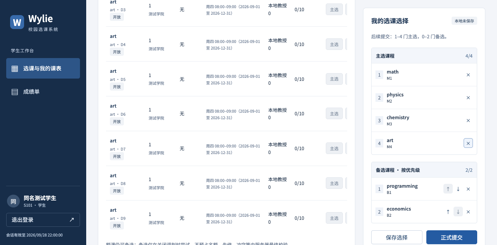
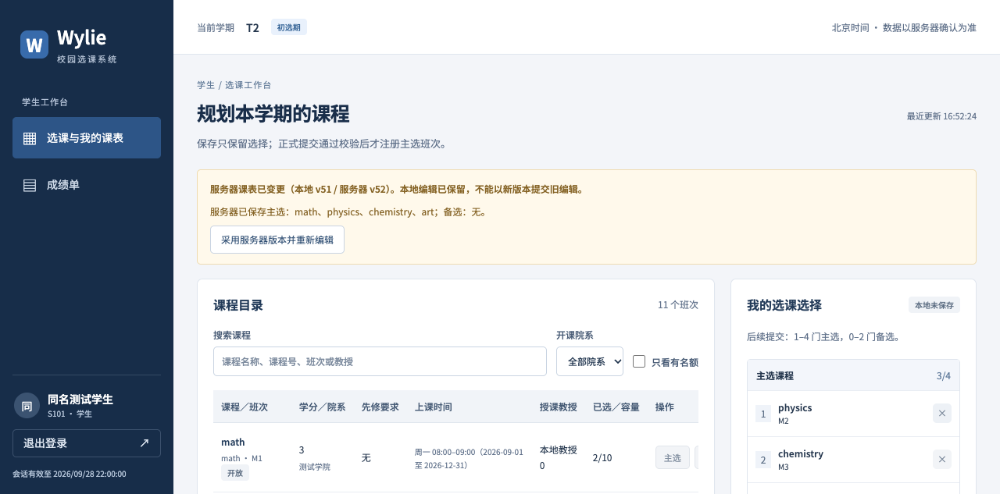

# 浩宇个人工作汇报（扩充稿）

- 姓名：浩宇；学号：21230726。
- 项目：Wylie College 学生选课系统；角色：学生端负责人。
- 版本：v0.2，2026-10-08；证据截至 2026-10-08。
- 汇报整理关联：US-028／IT-04；领域需求：US-004—008、US-012，公共层涉及 US-017，时间转换测试涉及 US-021。
- 用途：课程个人工作汇报与工作总结，具体经历、贡献比例和签名待本人补充确认。

> 协作与来源说明：本项目代码由各成员与 Agent 协助完成，需求、方案和取舍由人类决策；提交信息由团队使用 Amp 统一撰写，因此提交中的 Amp 名称不能据以否定成员的实际开发参与。本报告以我负责的学生端为主线，结合需求、代码、原提交和测试记录展开；既有自动化结果按执行阶段引用，不改写为本人独立操作，也不虚构会议、工时或评审签字。

## 一、职责与工作主线

### 1.1 我的责任范围

按[团队分工](../../TEAM_ROLES.md)，我负责课程浏览、主备选编排、课表保存与正式提交、加退选、删除课表和成绩单的页面与交互，同时参与登录公共入口、学生端详细设计和自测。学生用例不是几个按钮的集合：一次改选会影响本地选择、服务器保存结果、实际名额和教授名册，页面必须把这些不同事实讲清楚。

我的工作重点是把已经确认的业务规则转成学生能够理解并正确操作的界面。后端的认证、所有权、先修、容量竞争和事务由技术负责人统筹；我负责展示它们的输入、状态与结果，并处理页面自己的编辑基线、异步刷新和失败反馈。前端有禁用条件，不意味着服务端可以省去验证。

### 1.2 按生命周期组织工作

| 阶段 | 我负责领域需要回答的问题 | 对应产物 |
| --- | --- | --- |
| 需求理解 | 保存、提交、备选和删除分别改变什么？ | 学生 UC-01—03、UC-07 与相应 AC 的交互落点 |
| 分析与设计 | 哪些数据属于本地编辑，哪些是服务器事实？ | 选择／注册分离、版本基线、页面状态与接口约定 |
| 编码 | 怎样让公共请求层和学生页面保持同一规则？ | 登录入口、请求与轮询 hooks、课表及成绩单页面 |
| 验证 | 失败、旧页面和迟到响应会不会改变已有结果？ | 版本及请求层单测、浏览器场景、真实 PG 联调证据 |
| 交付与复盘 | 代码合入后还缺哪些人类检查？ | 原提交与 PR 追溯、缺口清单、个人报告与后续复核 |

贯穿这些阶段的主线是：**让学生知道自己“选了什么”“保存了什么”“真正注册了什么”，并在状态变化或操作失败时仍能判断下一步。** 这比单纯把后端字段显示到表格中更重要。

## 二、需求理解：先明确操作的业务含义

### 2.1 保存与正式提交不能共用一个“成功”含义

需求 Q-05／BR-04 明确保存不加课、不退课，正式提交才改变注册关系。假设学生已注册物理课，在页面中把物理换成美术，按“保存”后仍应保留物理名额；美术只进入已保存选择。只有整份正式提交成功，名册与有效注册才一起变化。

因此，我把“保存选择”和“正式提交”做成不同操作，并在页面标题、保存后的反馈和有效注册区持续说明区别。保存成功提示“选择已保存，不预留名额”，有效注册为空时明确显示“保存选择不会占用名额”。如果只显示绿色的“操作成功”，学生无法知道自己是否已经选上课程。

这一要求也约束删除按钮的含义：从右侧列表移除一门课只是编辑选择；“删除整个课表”才会清空本期课表并退出有效注册。页面不把两种操作放在相同的风险层级，整表删除必须经过确认。

### 2.2 首次提交、后续提交和保存采用不同数量规则

“4 门主选、2 门备选”看似简单，实际需要区分时机。Q-04 规定首次正式提交必须刚好 4+2；已有首次成功提交记录后，允许 1—4 门主选、0—2 门备选。保存可以暂时不足，让学生分次整理；要退出全部注册，应使用删除课表，而不是提交零主选。

| 操作情境 | 页面应允许的行为 | 必须说明的后果 |
| --- | --- | --- |
| 尚未完成首次正式提交 | 可以保存不足 4+2 的选择 | 保存不是注册；数量不足时不能正式提交 |
| 第一次正式提交 | 刚好 4 门主选、2 门有序备选 | 主选通过校验才占位，备选不占位 |
| 后续加退选 | 1—4 门主选、0—2 门备选 | 整份替换；失败保留原注册 |
| 删除整个课表 | 确认后清空本期选择和有效注册 | 首次提交时间清除，重建重新按 4+2 校验 |

实现时使用服务器返回的 `firstSubmittedAt` 判断首次或后续，不能根据“当前表格有没有课程”猜测。学生可能已提交后又保存了不同选择；也可能删除后重新进入，两个场景的规则完全不同。

### 2.3 备选不是另一组普通主选

备选表达关闭调剂时的尝试顺序，不预留名额，也不承诺一定补入。需求允许备选班次额满、与主选冲突或属于同课程的不同班次，但仍检查开放状态与先修条件。若直接复用主选的禁用规则，会错误地阻止这些合法备选。

因此，右侧将备选独立成有序列表，提供上移、下移按钮；请求中的 `alternateOfferingIds` 保留用户指定顺序。目录中的主选和备选按钮分别判断数量与容量，额满可以备选。学生已经有效注册的班次即使满员，也不能仅因“人数等于容量”阻止本人保留原主选。

### 2.4 在线信息是提示，不能当作提交保证

课程容量、时间、先修和开放状态可能在学生编辑时变化。AC-09 等要求在线页面及时展示变化，但页面看到“还有名额”与服务端最终取得名额不是同一件事。即使本地检查通过，另一名学生也可能先完成最后一个名额的提交。

我据此保留服务端逐项错误展示，避免只给“提交失败”的笼统提示；目录表下说明先修、冲突等由服务器最终校验。换班失败时，页面继续展示原有效注册，同时保留本地编辑供调整，不自动把学生改报到备选。

### 2.5 成绩单的范围同样需要准确表达

UC-07 的范围是本人上一已完成学期，不是任意历史查询，也不是当前选课已经关闭的学期。成绩 `I` 是合法值，不能与未录入混为一谈；没有已完成学期、该学期没有成绩记录、某课程尚未录入成绩，分别对应不同页面状态。

这些规则来自[需求分析](../../REQUIREMENTS_ANALYSIS.md)与[面向对象分析](../../design-docs/object-oriented-analysis.md)。学生端的需求理解不能只盯着成功选课，还要覆盖未完成、失败、取消和只读状态，避免后续用临时文案弥补语义不清。

## 三、分析与设计：让界面状态对应真实业务事实

### 3.1 从领域对象推导页面，而不是让一个列表承担全部职责

分析模型把学期课表、选择版本和注册关系分开：选择表达计划，注册表达占位。页面据此分为课程目录、我的选课选择、有效注册和目录变更通知。右侧编辑区可以和左侧有效注册不同，这种差异是正常业务状态，不应被当作界面数据没有同步。

例如学生已注册 M1—M4，把 M4 从编辑区移除并保存后，有效注册区仍保留 M4，并提示正式提交后才退出。如果前端直接拿右侧数组绘制名册结果，就会把尚未发生的退课展示为事实，违背保存不退课的需求。

我采用的状态划分如下，每一层都有明确来源和更新时机。

| 状态 | 来源与用途 | 可以改变它的动作 |
| --- | --- | --- |
| 本地编辑副本 | 当前浏览器中的主备选及其原始版本 | 添加、移除、排序；不直接改变服务器 |
| 服务器已保存选择 | 课表响应中的 `saved` | 保存或正式提交成功后由服务器返回 |
| 有效注册 | 课表响应中的 `registrations` | 后端正式提交、删除、关闭或补选事务 |
| 当前目录与通知 | 目录和通知接口 | 轮询读取外部变化及处理结果 |
| 首次提交时间与版本 | 服务器课表元数据 | 服务器确认，前端不能自行推算或重写 |

### 3.2 接口边界与共享类型

学生选课页面通过同源 `/api` 访问 Hono，DTO 来自 `@wylie/contracts`；web 不直接访问数据库，也不依赖 API 私有实现。读取时并行取得目录、课表和通知，再作为一次资源刷新结果供页面使用。三次 HTTP 读取并不是数据库级原子快照，最终写入仍要由服务端重新核对版本和规则。

写入将保存、提交和删除区分为 `PUT schedule`、`POST schedule/submit`、`DELETE schedule`。三者都携带原始 `expectedVersion`；保存和提交携带整份主备选，删除携带确认标记。这样接口表达的是一个完整意图，而不是先调用退课、再调用加课，让浏览器承担跨请求回滚。

### 3.3 公共请求与身份状态集中处理

登录、会话失效、业务错误和网络故障会影响全部角色，因此我负责的公共层将这些行为集中在[请求模块](../../../apps/web/src/lib/api.ts)及身份组件中。cookie 请求统一使用 `credentials: include`；写请求携带内存中的 CSRF token，登录不携带旧 token。session、密码和 token 不写入 localStorage。

恢复登录状态时先请求 `/auth/me`；首次改密完成前不挂载业务页；退出调用真实接口。收到 401 后公共层通知身份组件清除已失效状态，避免每个页面只弹出错误，却仍让用户停留在看似已登录的工作台。

业务失败保留错误码、逐项 `issues`、当前版本和 `requestId`。这些信息既支持学生理解错误，也方便联调时定位同一次请求；页面不自行把所有失败归类成网络错误，更不会把未收到成功响应处理为成功。

### 3.4 复用范围控制在实际共同问题上

[前端说明](../../FRONTEND.md)将代码分为业务路由、公共组件和工具层。学生页面保留主备选与注册的业务逻辑，公共层只抽出请求、身份、学期、轮询、版本编辑、格式及确认反馈等真实复用能力。这样教授授课和教务窗口也能使用版本保护，但不必被迫接受学生 4+2 的规则。

视觉上沿用统一导航、表格和右侧选择汇总，窄屏时汇总堆叠到表格下方，横向滚动限定在表格容器内。状态同时使用文字说明，错误和成功分别通过 `role=alert`、`role=status` 表达；备选排序按钮有可访问名称，确认弹窗默认聚焦取消操作。

## 四、实现：把规则转为完整的学生操作链路

### 4.1 课程浏览与主备选编排

课程目录提供检索、院系和有名额筛选，表格展示课程、班次、学分、先修、授课时间、教授与容量。学生不必先离开编排页再查这些信息。选中班次会标为“已选择”，防止同一班次重复进入主备选；已不存在的目录项仍以班次编号和“目录已变更”提示保留可解释性。

添加、移除和排序只修改本地副本，并将其标为未保存。右侧显示数量上限、首次或后续提交要求、本地版本和服务器版本。主选中尚未有效注册的项目明确标为“仅选择 · 未注册”，让学生在点击保存之前就能看到当前含义。

### 4.2 保存、正式提交与删除

保存成功后采用服务端返回的版本和 `saved`，清除本地 dirty 标记；正式提交前展示整份提交的确认提示，说明任一校验失败时原注册和已保存选择保持不变。删除确认明确说明会清空课表和有效注册，重建须重新满足首次 4+2。

写操作在途时通过 `useAction` 阻止重复触发，并禁用相关编辑动作。成功响应才进入 `edit.accept`，不能在发出请求时先把输入标为已同步。无论请求成功还是失败，结束后都刷新资源，以便核对服务器当前事实。

### 4.3 关闭与时间边界的页面反馈

可编辑状态由服务器学期阶段和关闭状态共同决定：只有 `OPEN` 且处于初选或加退选阶段时允许保存、提交和删除。进入关闭流程、已经关闭或离开选课窗口时，页面展示原因并禁用写入。客户端不是时间和状态的裁判，服务端仍检查自然截止及关闭准入。

这也影响日期显示。公共格式工具明确采用北京时间，在机器时区不同或跨 UTC 日期时仍显示相同业务时间。现有跨日测试验证了北京时间 00:15 对应前一天 UTC 16:15；该能力同时供教务窗口使用，因此不能把整个公共时间模块算作学生领域独占成果。

### 4.4 成绩单与空状态

[学生页面](../../../apps/web/src/routes/student.tsx)通过 `/student/report-card` 取得上一已完成学期及成绩行，展示课程号、课程名称、班次、成绩和来源。历史导入与教授录入分别标注，班次缺省的历史记录有明确替代文字；空成绩显示“未录入”，保留 `I` 本身的含义。

没有已完成学期时显示“暂无已完成学期”，有学期但无成绩时显示“该学期暂无成绩记录”。读取失败另行显示错误，不把失败伪装成空结果。页面提供主动刷新，范围仍由服务器身份和学期规则决定，浏览器不传入其他学生编号进行查询。

## 五、重点问题：异步刷新不能破坏编辑和判断

### 5.1 旧草稿不能被轮询覆盖，也不能被重标成新版本

选课页需要持续更新名额和目录，但学生可能正在调整尚未保存的选择。若每次轮询都用服务器内容覆盖输入，学生的编辑会消失；若保留输入却把版本更新成服务器新版本，则可能绕过版本冲突，覆盖另一个页面刚保存的内容。这是两个不同风险。

`useVersionedDraft` 将内容、基线版本和 dirty 状态保存在一起。未修改的副本可接受更高服务器版本；dirty 副本则保留原内容及原版本，不自动合并。当服务器版本更高时，页面显示两边版本和服务器选择，阻断旧副本的保存与提交，用户确认后才采用服务器版本重新编辑。

例如 A、B 两页都取得 v51，B 已把本地主选减少到三门，A 保存后服务器变成 v52。B 不应悄悄恢复成四门，也不能拿“三门内容＋v52”直接覆盖 A。现有历史截图展示的正是这一类状态：本地 v51 保留，服务器 v52 显示供对照，旧副本按钮禁用。

版本单测直接断言 dirty 对象保持原样；浏览器验收另用两个真实页面触发并核对本地内容、提示和禁用状态。前者验证合并函数，后者验证页面是否正确使用它，不能只凭函数测试就宣称多页面流程完成。

### 5.2 成功后的迟到读取不能把页面倒退

另一种顺序是：轮询已发出，随后写请求先成功返回 v8，旧轮询再返回 v7。如果无条件采用最近收到的响应，用户刚看到的成功结果会被旧数据覆盖。仅判断 dirty 也不够，因为写成功后副本已经恢复为干净状态。

`reconcileDraft` 因此还保留版本大于或等于读取结果的当前副本。现有测试分别覆盖迟到低版本、同版本却内容不同的读取，以及干净副本接受真正更高版本。设计的依据是已经得到服务器确认的版本，而不是网络响应到达浏览器的先后顺序。

这里记录的是代码与回归覆盖的竞态风险，不将它写成曾发生过的用户数据丢失事故。实际双页旧草稿与断网重连验证见[逐 AC 执行账本](../../testing/acceptance-execution.md)的 AC-49／64。

### 5.3 写请求网络失败意味着结果未知

业务 409 能明确表达旧版本被拒绝，网络断开却不能证明服务器没执行。例如提交已经落库，但响应丢失，学生如果把错误理解为“没有注册”并立即重复操作，就可能基于错误前提继续修改。

公共请求层对未知网络结果提示先刷新查询、不要重复提交；409 保留服务端错误，不自动重发。页面保留本地输入，写入结束后触发读取，只有成功响应才直接确认本地新版本。这一处理把“失败已知”和“执行结果尚待查询”分开。

现有保护不能直接写成所有超时问题已经解决。性能测试中的 PERF-02 仍保留：故意极短超时后，服务器可能继续提交，客户端最后确认集合仍可能不同。后续要核对读取发生的时机与最终重同步，不能用某一次刷新或正常网络下的通过替代未知结果场景。

### 5.4 轮询要有节制，也要显示数据是否新鲜

`useResource` 每个资源只允许一批请求在途，上一批未完成时合并刷新意图，不按固定间隔不断叠加请求。卸载取消在途读取，隐藏页面不再安排后续轮询，重新可见时立即读取；失败保留最后成功数据并显示连接异常，超过五秒未更新显示警告。

这能避免慢网络造成无意义排队，同时保留学生对已有信息的查看。但最后成功数据不能继续被宣传为实时状态。学生选课页在读取错误时也阻断写操作，提示先恢复连接并核对，而不是在页面未知的情况下继续让用户提交。

早期 fixture 检查人为把目录响应延迟到 1.4 秒，观察到最大并发目录请求数为 1，验证刷新循环没有堆叠。这个结果仅说明该前端场景的请求调度，不代表后端已满足 2000 用户容量。

### 5.5 实际交互问题：取消弹窗后焦点不能丢失

前端开发记录还保留了一项实际发现并复查的问题：Escape 关闭确认弹窗后，焦点曾落到 `body`，没有返回触发按钮。对键盘用户来说，取消操作后会失去原来所在的位置。

公共确认组件修正了关闭时的焦点恢复，并复查 Escape 返回触发按钮。该例子说明自测不能只看接口是否发送，还要看取消后页面是否回到可继续操作的状态；这一改动属于共用组件，学生、教授、教务页面共同受益。

## 六、验证：从函数行为到真实业务链路

### 6.1 公共层和版本规则的定向测试

2026-10-05 的记录中，前端类型检查、生产构建和两个 lib 测试文件共 8 项通过。[请求测试](../../../apps/web/src/lib/api.test.ts)与[版本测试](../../../apps/web/src/lib/hooks.test.ts)覆盖以下关键边界。

| 检查对象 | 具体断言 | 能证明什么 |
| --- | --- | --- |
| 同源及 CSRF | GET 不带 CSRF，写入带 token、原版本和整份选择 | 前端请求按约定构造 |
| 登录及文件上传 | 登录不带旧 token，FormData 不手工设置 boundary | 公共层没有破坏登录与 multipart 语义 |
| 409 业务失败 | 保留 issues、currentVersion、requestId，fetch 只调用一次 | 不静默重试旧版本请求 |
| 身份与网络错误 | 401 发出会话失效事件，断网返回结果未知 | 不把身份失效或网络故障冒充成功 |
| 本地版本 | dirty 不被覆盖、重标或合并，迟到读取不回退 | 编辑基线遵守版本规则 |
| 跨日时间 | 北京时间与 UTC 双向转换 | 显示与提交不依赖机器默认时区 |

这些测试不依赖真实数据库，不能证明容量锁或注册回滚；对应的服务端行为必须用真实 PostgreSQL 和 API 检查。测试数量包含公共能力，也不等于本人独立执行了八次人工验收。

2026-10-08 报告整理期间，统筹再次定向执行 `npm test -- apps/web/src/lib/hooks.test.ts apps/web/src/lib/api.test.ts`，两个文件、8 项测试全部通过。该结果只复核已有公共层与版本测试，没有重跑浏览器和全项目验收。

### 6.2 前端 fixture 检查与真实联调分别看待

早期 Chromium 检查使用独立临时 HTTP fixture，在不修改生产前端请求的前提下制造成功、422、版本变化和慢响应。学生场景包含首次数量、备选排序、保存不注册、错误保留输入、旧版本禁用及已关闭只读；这适合稳定观察页面状态，但不能证明真实业务事务。

随后[集成 history](../../histories/2026-10/20261005-0312-system-design.md)记录了真实 Hono／PG15／独立 HTTP 模拟的浏览器链路：seed 登录并改密、保存后有效注册为零、先修失败后仍为 v1 且无注册、合法 4+2 提交到 v2，并用数据库独立断言核对结果。页面成功、HTTP 返回和数据库状态三者一致，才构成这条链路的有效证据。

真实联调还覆盖教授名册及逐格成绩，帮助确认学生注册能在教授端正确体现。教授录分接口与后端选课事务分别属于其他负责人，我在报告中引用跨角色结果来说明学生链路已接通，不把相关实现归入自己的模块。

### 6.3 后续验收怎样补充学生端证据

[测试报告 v0.3](../../TEST_REPORT.md)记录 2026-10-06 的真实 Chrome 32 项检查及六条事件路径、每条十次的 DOM 观察；全部 60 个样本最大 1,043.24 毫秒。计时从业务 HTTP 或模拟控制成功返回开始，到 DOM 出现目标状态结束，包含观察开销，不是完整鼠标点击到绘制的端到端时延。

学生相关证据包括保存不注册、首次 4+2、冲突回滚、取消删除保持注册、提交后换一门、确认删除后重建，以及成绩单 D／I 对本人隔离展示。AC-49／64 另有双真实页面保留旧草稿、禁用旧版写入及离线变更后重连提示，弥补单元函数无法覆盖的页面使用链路。

这些结果属于历史验收执行，本次报告扩写没有重新运行浏览器或服务器。10-07 全项目回归增长到 13 文件／215 项，涵盖所有成员领域；不能把总数量作为学生端独立完成的工作量，也不能用它替代每条 AC 的子场景记录。

### 6.4 明确保留尚未覆盖的边界

已验证的 390px Chromium 窄屏只是浏览器视口检查，不是真实移动设备验收；macOS Chrome 不能替代 Windows Chrome／Edge。完整人工键盘与辅助技术走查、独立机器复现、七天可用性，以及账本中标为部分的组合仍需真实执行。

原 macOS 2000 用户档失败仍保留，后续 Linux 修复完整复测通过不意味着任意部署环境都达标。对我的领域，下一步重点是弱网下结果未知后的最终重读、版本提示能否让学生理解，以及用户在取消、失败、切换页面后是否知道哪些编辑仍保留。

## 七、协作与交付：接口、证据和责任相互对应

### 7.1 与后端、其他页面和测试的衔接

| 协作对象 | 需要保持一致的内容 | 我在学生端对应的工作 |
| --- | --- | --- |
| 倪成锦／核心规则 | 保存不占位、整体提交、expectedVersion、错误结构 | 页面状态和请求跟随契约，不自行实现另一套占位规则 |
| 马喆／教授端 | 有效注册形成名册，上一完成学期成绩对应学生 | 核对学生侧注册与成绩展示的语义，保留来源与空值差异 |
| 冯海洋／教务端 | 学期窗口、关闭和人员状态限制 | 显示不可编辑原因；共享版本、时间和确认组件 |
| 范昭／目录模拟 | 班次、容量、时间、先修变化及目录不可用 | 目录与通知刷新、异常状态和已失效条目说明 |
| 冯海伦／测试 | 复现数据、版本顺序、错误和页面断言 | 提供可定位的状态与请求信息，按证据核对未覆盖范围 |

学生端遇到错误时，排查应先分清输入未提交、接口拒绝、服务器结果未知和页面未刷新。例如容量错误归服务端最终校验，旧草稿覆盖归版本处理，网络超时则需要结合请求与后续读取判断。明确分层比把所有失败都转给后端更有助于联调。

### 7.2 原提交与合入的可追溯性

学生端工作主要对应登录公共层、学生业务页面和版本／时间测试三个原始增量，分别见文末证据表；登录与学生功能经 PR #11、#16 集中合入。成员与 Agent 的协作方式不改变代码责任，但提交信息由 Amp 整理、Git 平台创建者和实际评审者是不同维度。

因此，本报告以可核对的实现和验证结果说明领域工作，不根据提交数换算贡献比例，也不把集中合入写成每名成员已经在 GitHub 独立审批。原有评审、独立复核和课程材料定稿是否完成，仍按团队真实记录登记。

## 八、个人总结与后续改进

### 8.1 对学生端工作的理解

我的学生端工作把需求中的“选课”转为了一组可区分、可恢复、可核对的操作。核心不只是显示课程列表，而是把选择与注册分开，把编辑基线与最新服务器状态分开，把业务拒绝与结果未知分开。只要其中一处混淆，页面即使视觉完整，也可能给学生错误的承诺。

通过这条领域工作主线，我对前端职责的理解是：前端应帮助用户形成正确判断，并忠实表达服务器事实。事务一致性在后端保障，前端仍要处理异步顺序、未保存输入和操作反馈；两者都需要明确规则和针对性的验证。

### 8.2 可以落实到后续工作的改进

**第一，把状态表放到页面实现之前。** 保存、提交、删除、关闭和空成绩各自有不同语义。先列清数据来源、允许动作和失败后保留内容，可减少用一个 loading 或 success 状态处理全部流程的问题。

**第二，优先测试顺序颠倒，而不只测试顺序正常。** 更高版本到达、写成功后旧读取晚到、响应丢失和重新上线，都是普通操作组合后产生的问题。测试应显式安排这些顺序，而不是仅增加几个成功请求样本。

**第三，公共组件需要测试操作结束后的体验。** 确认框打开正确还不够，取消后焦点、失败后输入、退出后凭据是否清除同样重要。后续人工走查应把键盘和取消路径列入，而不只截图检查页面外观。

**第四，错误提示要帮助用户行动。** 版本冲突应给出服务器内容和重新编辑入口，网络未知结果应引导查询，保存成功应明确没有占位。可用性来自正确解释具体状态，而不是尽量多弹通知。

**第五，人机协作需要留下决策依据。** Agent 可以协助实现和回归，人类仍要决定保存与提交的含义、冲突时采用什么策略及哪些结果足以交付。后续应把采纳或修改建议的原因写在契约、测试和评审中，便于本人和其他成员复查。

### 8.3 仍需本人补充和团队完成的内容

| 待补内容 | 需要的具体材料 |
| --- | --- |
| 个人经历 | 实际参与时间、最有代表性的一次人类判断、采纳或修改 Agent 建议的例子 |
| 人工检查 | 本人操作的角色、输入、版本、预期、实际结果与尚未执行的场景 |
| 协作记录 | 真实接口沟通、需求意见、复核和缺陷交接记录，不补造会议 |
| 后续验收 | 弱网最终重同步、Windows／Edge、独立环境及实际辅助技术检查 |
| 材料定稿 | 本人核对叙述、团队确认贡献比例、签名与确认日期 |

本人确认签名：**【待本人补充】**；确认日期：**【待本人补充】**。贡献比例由团队结合实际工作确认，不按提交数、代码行数或 Agent 执行次数预分。

## 九、截图与代表性证据

### 9.1 历史验收截图

以下两张图片复制自 2026-10-06 验收执行的本地 `browser-us018` 产物，使用 macOS headless Chrome、真实 API／PostgreSQL 和独立 HTTP 模拟；数据为虚构测试人员、课程和学期，页面中的 2026-09-28 会话时间由夹具业务时钟形成，不是拍摄日期。本次仅检查并归档既有图片，没有重新执行场景，也不将其标为本人独立操作。

**图 1：主备选分别编排，保存与提交具有不同含义。** 这是页面滚动后的局部视口，右侧可见四门主选、两门有序备选以及独立的保存和正式提交按钮，状态为“本地未保存”。图中不能单独读出数据库是否已注册，相关结论需结合 AC-05／06 的数据断言。

**图 2：保留旧草稿并显示服务器新版本。** 提示区明确列出本地 v51、服务器 v52，并给出采用服务器版本的入口；右侧仍保留本地三门主选，与提示中的服务器四门不同。截图支持“没有静默覆盖输入”的可见状态，旧版请求返回 409 的结论则来自对应 API 与浏览器断言。

### 9.2 原提交、文档与测试入口

| 证据 | 支持的内容 |
| --- | --- |
| [efb3874](https://github.com/Nichengjin/software-engineering-project/commit/efb387412051ba2a21bd71dcb121f68e9240e6a2)／[PR #11](https://github.com/Nichengjin/software-engineering-project/pull/11) | 登录交互、同源请求、身份、公共 hooks 与组件 |
| [1157170](https://github.com/Nichengjin/software-engineering-project/commit/1157170484eb5d517adb00c1c290d8294417dcd1)／[PR #16](https://github.com/Nichengjin/software-engineering-project/pull/16) | 课表编排、保存提交删除、注册展示与成绩单 |
| [d3ce6c1](https://github.com/Nichengjin/software-engineering-project/commit/d3ce6c178dedef36b18cc43cc8713f44e8f211ee) | 三项版本基线及一项北京时间跨日测试 |
| [API 契约](../../design-docs/api-contract.md)、[前端说明](../../FRONTEND.md) | 请求、错误、版本、身份与页面交互边界 |
| [hooks.ts](../../../apps/web/src/lib/hooks.ts)、[student.tsx](../../../apps/web/src/routes/student.tsx) | 串行刷新、dirty 基线、迟到保护和学生状态实现 |
| [集成 history](../../histories/2026-10/20261005-0312-system-design.md)、[合入检查](../../histories/2026-10/20261005-merge-checks.md) | 开发检查、真实三角色联调与集中合入事实 |
| [测试报告](../../TEST_REPORT.md)、[逐 AC 账本](../../testing/acceptance-execution.md)、[追溯矩阵](../../product-specs/traceability.md) | 后续结果、不同环境与尚未覆盖范围 |

原提交保留的 [Amp 整理线程](https://ampcode.com/threads/T-01a10837-a069-7667-9a9f-8e5c333a031e)及[集成浏览器链路线程](https://ampcode.com/threads/T-01a10ae1-7ce9-7136-8d6e-7a8f9ca8ee5d)用于追溯上下文；本文具体结论以仓库内需求、代码和执行记录相互核对。

### 9.3 修订记录

| 日期 | 版本 | 修订内容 |
| --- | --- | --- |
| 2026-10-07 | v0.1 | 依据职责、原提交和执行记录整理简版报告 |
| 2026-10-08 | v0.2 | 按需求、设计、实现、竞态问题、验证、协作与复盘扩充；按用户确认修正人机协作口径，归档两张历史验收截图；个人经历与签名待补 |
