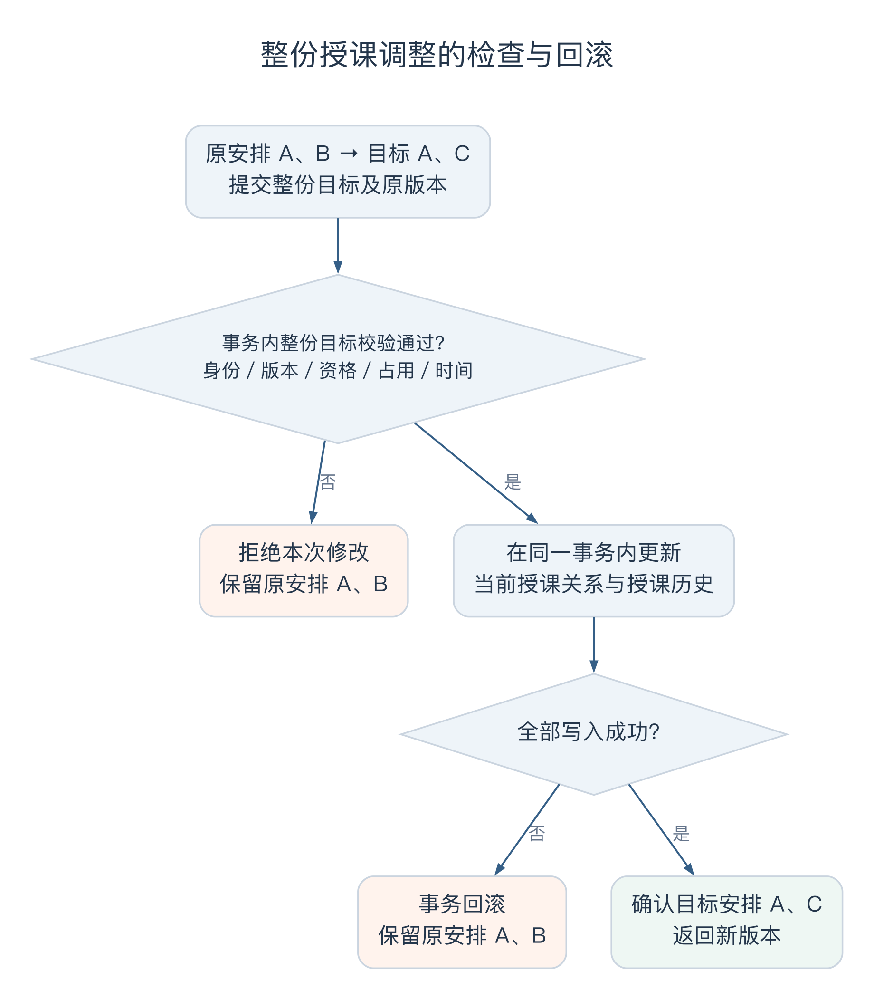
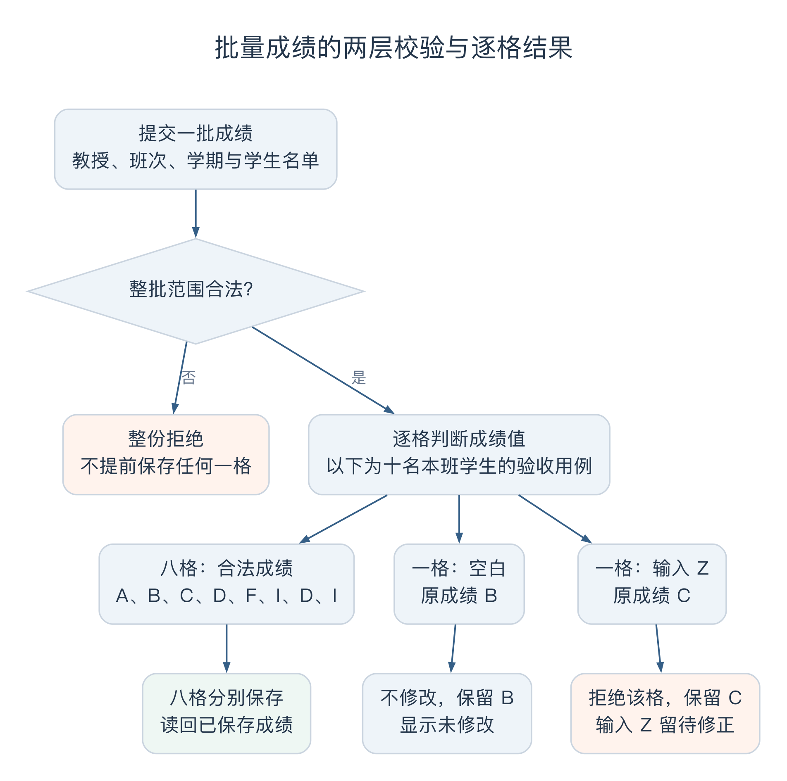

# 马喆个人工作汇报

- 姓名：马喆；学号：21230727。
- 版本：v0.4，2026-10-09。
- 项目：Wylie College 学生选课系统。
- 职责：教授端授课选择、学生名册、成绩录入及相应接口、详细设计和自测。
- 关联需求：US-009、US-010、US-011；报告整理关联 US-028／IT-04。

## 一、我负责的工作

我负责教授使用的三个功能：选择本学期要教的班次、查看班上的学生，以及为上一已完成学期的学生录入成绩。这三个功能在页面上分开，数据却连在一起。教授选择授课以后，系统才能确定他可以查看哪份名册；学生正式选上课程以后，才会出现在名册里；到了录分时，还要检查班次、学生和学期是否都在允许范围内。

因此，我在整理需求和实现时，主要围绕教授的一次完整操作检查这些关系。例如，取消原来的班次并选择新班次，如果新班次没选上，原安排应当怎样处理；一批成绩中有一格填错，其他格保存后，教授又该怎样继续修改。这些问题决定了接口如何保存，也决定了页面需要给出什么反馈。

| 功能 | 需要解决的问题 | 与其他成员工作的联系 |
| --- | --- | --- |
| 选择授课 | 检查资格、占用和时间冲突，失败后保留原安排 | 教务维护资格和时间窗口，目录提供课程资料，学生端显示授课教授 |
| 查看名册 | 只查询本人班次中的有效注册学生 | 学生提交、退选和关闭调剂都会改变注册记录 |
| 录入成绩 | 限定录分范围，分别处理合法值、空白和错误值 | 教务导入上线前历史成绩，学生端查询上一完成学期的成绩单 |

教授服务集中在 [TeachingService](../../../apps/api/src/modules/teaching/service.ts)，授课、名册和录分页面在 [professor.tsx](../../../apps/web/src/routes/professor.tsx)。我沿用公共的登录身份、事务和数据库模型，在这些基础上完成教授端功能。

## 二、需求分析

### 2.1 授课调整的整体成功与回滚

[选择授课用例](../../REQUIREMENTS_ANALYSIS.md#uc-04)描述了教授选择和取消班次的过程。继续检查其中的先后顺序时，需要明确取消和新增是否分别生效。假设教授原来负责 A、B，准备改为 A、C，而 C 已经被另一位教授先选走。如果先取消 B，再检查 C，就会出现新班次没选上、原班次也丢了的结果。

我们在需求中把这次调整看成一个完整决定：A、C 都能成立，才把原来的 A、B 替换掉；任何条件不满足，仍然保留 A、B。教授取消确认时也保持原安排。这样，页面上的勾选只是编辑过程，点击保存并确认以后才真正改变授课关系。

这个例子也说明，时间冲突必须检查调整后的全部班次。保留 A、增加 C 时，既要检查新增班次之间的冲突，也要比较 A 和 C 的上课时间。仅仅检查“这次新选了什么”，还不能判断教授最后的安排是否可行。

### 2.2 授课资格与班次选择约束

教授具备教授某门课程的资格，并不表示一定能选择该课程的所有班次。数据结构可以开设多个班次，各班的上课时间和授课教授不同。某位教授有数据结构的资格，但其中一个班已被别人选择，另一个班又与他保留的课程冲突，都不能直接保存。

我把这几项限制分别落实到操作中。页面显示教授是否有资格、班次是否被他人选择，让人先判断可选范围；保存时，后端再使用最新课程资料和当前授课关系检查。页面上看到的“可选”到按下确认之间可能发生变化，因此最终结果仍要在保存时确定。

两名教授同时看到一个空班次，也是同样的情况。系统允许两人编辑自己的方案，但确认时只能有一人取得这个班次，另一人收到已被选择的提示，并保留原来的完整安排。

### 2.3 授课选择的时间范围

学生初选前就能看到授课教授，有助于选择课程，因此教授选择授课的开始时间安排在学生初选之前。但题目在关闭选课时，还要求取消没有教授的班次。这说明学生选课期间可以暂时存在尚未确定教授的班次，不能增加“所有教授选完以后学生才能开始”的限制。

最后确定的规则是：教务设置授课开始时间，此后教授可以持续选择到关闭选课；学生端对尚未确定教授的班次显示相应提示。到关闭时仍无教授的班次再取消，并进入学生调剂流程。

这条规则落实到教授端时，需要单独检查授课窗口。学生初选结束、加退选尚未开始的间隔，以及加退选截止后尚未关闭的阶段，都不能直接当成教授授课选择已经截止。关闭开始处理后，系统才停止接收新的授课修改。

### 2.4 成绩批量录入的处理规则

[成绩录入用例](../../REQUIREMENTS_ANALYSIS.md#uc-06)允许逐格处理成绩。教授填写十名学生的成绩，一格填错就让其他九格全部作废，会增加重复录入，因此合法成绩可以先保存，错误格指出原因后继续修改。

但“部分成功”要有前提：这一批学生都必须属于教授负责的班次。成绩填成 Z 是输入错误，混入一名其他班的学生则超出了操作权限。如果把两者都放进同一个逐格循环，前面的成绩可能已经改了，程序到后面才发现请求越权。

我们据此区分了两层检查。先检查教授、班次、学期和整份学生名单，范围不对就整份拒绝；通过以后，再逐格判断成绩值。A、B、C、D、F、I 都可以保存，空白表示本次不改，其他值保留原成绩并返回错误。I 本身是一个明确的成绩值，与尚未录入不同；本期也没有通过空白清除已有成绩的功能。

## 三、面向对象分析

### 3.1 授课资格与授课安排

在团队的[面向对象分析](../../design-docs/object-oriented-analysis.md)中，我重点核对了教授、课程、班次和授课安排之间的关系。课程表达“教什么”，班次表达这个学期具体开设的哪一个班。授课资格连接教授与课程，授课安排连接教授与班次。

这样划分后，取消一个班次的授课，只改变当前安排，教授原有的课程资格仍然保留。教务导入资格以后，教授可以自行选班；教授选班的操作也不会反过来给自己增加资格。两项业务的维护入口由此分清了。

人员状态又带来一个时间上的区别。教授离职以后，未关闭学期的授课安排需要由教务流程清理，但已经完成学期的授课和成绩仍需保存。分析时把当前安排与发生过的授课经历区分开，后面的设计才有依据保留历史。

### 3.2 有效注册与学生名册

学生可以先保存课表，再正式提交；还可以填写备选课程。假如把保存的选择都列入教授名册，教授看到的人数就会包含尚未取得名额的学生。学生把某门课从备选改掉以后，名册还得再次跟着修改。

我们已经在选课分析中区分了课表选择与有效注册，我在教授端继续使用有效注册生成名册。这样，学生只保存时不会出现，正式提交成功后才出现；退选、删除课表或关闭调剂改变注册关系以后，重新查询就能得到对应的学生名单。

名册因此是对已有注册的查询结果，无需再维护一份独立的学生清单。同一份注册关系同时支撑学生选课结果、班次人数和教授名册，也减少了几处数据互相不同步的可能。

### 3.3 跨学期成绩记录

成绩虽然在名册页面上录入，却不能随着名册清空而消失。学生以后查询成绩单、检查先修课程，都还需要用到这项记录。模型按学生、课程和学期确定一条成绩，并保留教授录分时的班次关联。

教务导入的历史成绩可能来自系统上线以前，当时的班次没有进入本系统，因此这类成绩可以没有班次关联。教授录分则限定为上一已完成且不早于上线的学期。两类记录共同服务于成绩查询，但各自的录入范围不同，不能让历史导入成为修改当前成绩的另一条入口。

## 四、详细设计

### 4.1 授课安排的版本检查

整份保存能够解决一次请求内部的新增和取消问题，还需要处理同一位教授打开两个页面的情况。假设两个页面都读到 v1，第一页保存后成为 v2，第二页仍按 v1 编辑。如果第二页直接覆盖，第一页刚确认的选择就可能消失。

我在授课保存中使用教授与学期对应的版本号。页面提交完整目标班次，并带上开始编辑时的版本；后端发现版本已经变化，就拒绝覆盖，返回冲突。客户端保留本地内容，展示服务器上的新安排，由教授重新核对。

这里不能自动把旧页面的版本换成 v2 再重试。版本变化说明原来的依据已经过时，自动重试会把旧选择当成教授刚刚确认的新决定。接口因此同时表达两件事：教授想把安排改成什么，以及他修改时看到的是哪一版。

### 4.2 授课变更的事务处理

保存授课安排时，后端先获取最新目录，再在事务中检查身份、授课窗口、版本、资格、班次归属和时间冲突。检查通过以后，才一起取消不再保留的班次、增加新班次，并更新版本和历史。中途失败，整次调整撤销。

A、B 改为 A、C 的例子在这里有了具体处理方式：C 已被别人选择，就在修改 B 以前返回错误；即使写入过程中出现异常，事务也会保留原来的 A、B。教授主动取消所有班次同样是一份需要确认的安排，仍然检查时间、权限和版本。

两位教授争选时，后端在同一个受保护的事务过程中重新读取归属。前一人成功以后，后一人会读到已经确定的教授，收到 `OFFERING_TAKEN`。本项目按单个 API 实例设计，相关写入使用公共锁和数据库事务协调顺序；页面上的可选状态只提供操作参考。

图 1 按本节事务设计绘制，A、B 改为 A、C 是需求说明中的示例。整份目标通过校验且写入成功后才生效，失败时保留原授课安排。[可编辑图源](attachments/figure-teaching-transaction.dot)。

### 4.3 当前授课关系与历史记录

当前班次记录负责回答“现在由谁授课”，历史记录保存选择、取消和重新选择的经过。取消时清空当前归属，并结束这一段历史；以后重新选择，再增加一条新的历史。这样不会把中间的取消过程抹掉。

图 2 将这些关系落实为数据结构。授课版本用于识别旧编辑，授课历史保留前后变化，资格与成绩分别保存各自的业务信息。

图 2：团队共享设计模型 D02c，展示授课安排、资格、历史和成绩的数据关系，可编辑模型见[设计模型说明](../../design-docs/design-models.md)。

历史也会影响教务的人员维护。曾有授课或成绩记录的教授，不能因为现在取消了所有班次就变成“没有业务记录的人员”。教务可以办理离职或停用，但直接删除仍受到历史记录的限制。因此，维护当前归属时需要同时保留已经发生的业务。

成绩数据则按学生、课程和学期唯一保存，附上来源、课程名称快照和修改账户。详细字段与事务约定放在[接口文档](../../design-docs/api-contract.md)和[后端详细设计](../../design-docs/backend-detail.md)中，教授页面据此提交和读取结果。

## 五、页面与接口实现

### 5.1 授课编辑与后台刷新

授课页面每秒刷新课程目录和服务器安排，让教授看到其他人刚选走的班次、课程资料变化和当前保存结果。但教授正在勾选的内容保存在本地草稿里，轮询不能直接把它覆盖。

页面因此同时保留服务器安排和本地编辑。正常保存后，用服务器返回的版本确认这一轮修改；如果服务器版本已变化，就提示本地版本与最新版本，展示服务器当前有哪些班次，并暂时禁止提交旧草稿。教授选择“采用服务器安排”时，再确认是否放弃本地编辑。

保存前的确认也要说清影响：取消已保存的班次，会释放该班次的授课归属。请求失败后重新读取最新数据，但不自动重发。目录连接失败时保留已有上下文并显示错误，不能把失败显示成一张空课程表，否则教授很难判断是没有可选课程，还是资料尚未读到。

### 5.2 本人班次与名册查询

名册页先列出教授本人负责的班次，选择后再查询其中的有效注册学生。接口根据登录账户取得教授身份，并重新核对班次归属；客户端传来的班次编号只能用于查找，不能单独证明有权查看。

列表显示学号、姓名和当前成绩。同名学生通过学号区分，教授不需要接触 SSN、密码等与录分无关的信息。页面还区分“尚无本人授课班次”和“该班次暂无有效注册学生”：前一种需要先确认授课安排，后一种表示已选班次还没有学生正式注册。

进入成绩页时，后端提供上一已完成学期和符合范围的本人班次。这个学期由系统的学期顺序与完成状态决定，不能简单用当前年份减一。提交成绩前还会重新检查一次，避免页面打开以后条件发生变化，旧页面仍继续写入。

### 5.3 成绩逐格保存与结果反馈

逐格反馈需要让教授知道哪些已经保存、哪些还要处理。现有验收用例准备了十名本班学生，第一名原成绩为 B，第二名为 C。本次依次提交空白、Z，以及 A、B、C、D、F、I、D、I 八个合法值。

| 本次输入 | 保存结果 | 教授看到的内容 |
| --- | --- | --- |
| 第一格空白 | 不修改，原 B 保留 | 显示未修改 |
| 第二格 Z | 拒绝这一格，原 C 保留 | 显示成绩值错误，保留 Z 供修正 |
| 其余八格合法值 | 各格保存 | 显示已保存，并读回相应成绩 |

页面把“当前成绩”和“本次录入”分成两列，避免把尚未保存的输入当成正式成绩。提交后，每行显示处理结果；成功和未修改的输入清理，错误输入留在原位置。教授只需修改失败格，再次提交即可，不需要重填已成功的八格。

整批请求返回成功时，提示写成“请求已处理，请核对每名学生的逐格结果”。因为接口完成了处理，并不表示十格全部保存。如果请求混入外班学生，则在进入逐格处理以前整份拒绝；即使第一格是一个合法的 D，也不会提前改掉原来的 B。

图 3 对应[验收用例](../../../tests/acceptance/scenarios.integration.test.ts)中的十格输入：八格保存、一格空白不改、一格错误拒绝。只有整批身份与名单范围合法后才逐格处理；这里是测试用例的结果划分，不是实际用户成绩统计。[可编辑图源](attachments/figure-grade-results.dot)。

录分过程中还可能遇到名册变化。页面刷新后，如果发现本地正在录分的学生已经不在最新名册，就提示变化、阻止继续提交，并保留本地数据。教授需要重新确认名单，不能沿用旧名册取得写入权限。

图 4：教授在上一完成学期的班次中录入成绩。S101 的 D、S310 的 I 已保存；S205 原成绩 C 保留，错误输入 Z 留在输入框中等待修改。图于 10 月 9 日按 10 月 6 日验收场景重拍，人物与学期为演示数据。

这张图使用三名学生，便于看清每行反馈；上面的十人格用例则在接口和数据库中检查各格结果。两者共同对应逐格保存的规则，越权时整份不改的情况另由集成测试检查。

## 六、授课历史时间错误的排查与修复

### 6.1 授课历史时间错误的定位

教授模块集中合入前，完整回归出现了 130 项通过、3 项失败。错误涉及授课历史：创建记录时，程序使用数据库默认的真实时间；取消授课时，却使用测试设置的业务时间。测试业务日期早于电脑的真实日期，于是同一条记录出现了结束时间早于开始时间的情况，被数据库的时间顺序约束拒绝。

这个问题影响的是选择和取消之间的关系。页面可以正常显示日期，但只要两次写入使用不同的时钟，就不能准确记录授课经历。在测试中固定业务时间，本来是为了稳定地检查开放窗口和历史，结果也暴露了默认值与显式写入不一致的问题。

### 6.2 业务时钟统一与回归检查

修复时，创建授课历史也改为显式使用业务时钟 `rt.now(tx)`，与取消时的结束时间保持一致。测试同时检查首次选择、七秒后取消和十一秒后重新选择：第一段历史的开始、结束时间要准确，重新选择应产生另一条历史。

补充的测试先在旧实现上复现了开始时间不符合预期，再检查修复后的精确时间和记录数量。数据库的时间顺序约束继续保留，测试日期也保持原设定。这样既修正了写入来源，也保留了发现同类错误的检查。

这项修复由倪成锦在[提交 655ad72](https://github.com/Nichengjin/software-engineering-project/commit/655ad72)中完成。[合入检查记录](../../histories/2026-10/20261005-merge-checks.md)记载，修复后在 Node 22.23.3、PostgreSQL 15 下，11 个文件中的 134 项测试通过，迁移、类型检查和构建也通过。

对教授端来说，这次问题补上了一个容易漏看的检查位置。查看时间处理时，除了选择和取消的代码，还要一起看数据库默认值。历史记录要在重选、人员维护和后续查询中继续使用，三个动作必须使用同一套时间。

## 七、测试与结果核对

### 7.1 失败场景下的数据一致性验证

教授端的几个关键规则都涉及失败后的状态。只看到“班次已被选择”还不够，需要确认教授原来的全部安排仍在；只收到越权错误，也需要确认这一批成绩没有提前写入。

两位教授竞争同一班次的验收，用控制点安排谁先进入确认，再交换先行的人。检查包括最终班次归谁，以及失败一方原来的班次集合是否完整保留。这样可以排除测试恰好总由同一个请求先执行的影响。

成绩测试则先保存已有值，再提交混合输入。合法值、空白和错误值分别比较返回结果与数据库原值；混入外班学生、访问他人班次和录入不允许的学期时，比较请求前后的数据，检查是否整份未改。

| 检查内容 | 主要验收条件 | 核对结果 |
| --- | --- | --- |
| 新增、取消和重选授课 | AC-14 | 当前归属、历史结束时间、新历史记录相互对应 |
| 换班失败保留原安排 | AC-15、AC-16 | 失败前后完整班次集合一致 |
| 两位教授争选 | AC-51 | 两种先后顺序下各有一人成功，失败方原安排保留 |
| 名册只包含有效注册 | AC-17 | 已提交学生出现，保存和备选学生不出现 |
| 他人班次、外班学生和录分学期 | AC-18、AC-21、AC-39 | 拒绝请求，原成绩及相关数据不变 |
| 六种成绩、空白和非法值 | AC-19、AC-20 | 十格中八格保存，一格未修改，一格拒绝 |

这些检查见[后端集成测试](../../../apps/api/test/backend.integration.test.ts)和[验收集成测试](../../../tests/acceptance/scenarios.integration.test.ts)，具体执行记录汇总在[测试报告](../../TEST_REPORT.md)与[验收账本](../../testing/acceptance-execution.md)。

### 7.2 页面、接口与数据库联调

10 月 5 日的[联调记录](../../histories/2026-10/20261005-0312-system-design.md)包含教授端的实际浏览器操作。当前名册只显示三名有效注册学生；上一完成学期录入 B 成功，输入 Z 则失败，原来的 A 和失败输入保留。检查同时经过页面、API 和 PostgreSQL，确认录入结果能回到页面。

10 月 6 日的浏览器验收使用另一组独立数据，检查了图 4 所示的 D、Z、I 输入和 D、C、I 结果。10 月 9 日整理报告时按相同输入重拍，让页面顶部、当前成绩和失败输入都能完整显示。前一轮的 B、A 与后一轮的 D、C 来自不同场景，各自保留对应记录。

当日验收环境为 macOS、Node 22、PostgreSQL 15、独立 HTTP 模拟和随机创建的测试数据库，浏览器使用本机 Chrome。全项目形成 73 项验收集成、32 项浏览器检查等记录；到 10 月 7 日，完整自动化回归为 13 个文件、215 项测试。这里的数量覆盖整个项目，教授端的具体检查范围以上表为准。

## 八、协作与工作方法

教授端与学生端需要共用注册事实。学生提交以后，名册应当能查询到对应学生；只保存时，名册不能跟着增加。教授录入完成的成绩，也要在学生端按同一学期显示。因此，与浩宇负责的页面衔接时，需要对齐学期、班次和学生标识，不能各自根据页面列表重新推断归属。

教务端维护授课资格、开放时间和人员状态。我使用这些结果限制教授操作，冯海洋负责的人员维护也会依据授课与成绩历史判断能否删除。倪成锦统筹公共模型和事务机制，冯海伦整理验收场景与运行结果。共享规则写进需求和设计后，各模块继续用具体操作检查是否接得上。

教授端的服务和页面分别形成了[后端提交](https://github.com/Nichengjin/software-engineering-project/commit/7dddc25)与[页面提交](https://github.com/Nichengjin/software-engineering-project/commit/016cf36)，通过 [PR #15](https://github.com/Nichengjin/software-engineering-project/pull/15)关联合入。

## 九、个人总结与后续工作

这部分工作中，具体的失败例子帮助我把需求、接口和页面连在一起。A、B 改为 A、C，要求后端整体检查，也要求页面确认整份替换；十格成绩允许部分成功，就需要逐格结果和失败输入保留。以后整理类似功能时，我会在实现前写出操作前后各自应有的数据，让页面、后端和测试共同核对。

测试方式也需要跟着业务问题选择。教授竞争班次要控制确认顺序，越权录分要比较整批数据，授课历史要给出独立的精确时间。只检查一个返回码，容易漏掉前面已经发生的修改；只沿用程序自己的时间计算，也可能与程序一起出错。授课历史的回归过程，使这两点在本模块里有了具体例子。

页面还需要照顾出错后怎样继续操作。保留原安排、保留错误输入、显示最新服务器内容，都与教授下一步能否顺利完成任务有关。后续走查时，我会从一次完整任务开始，继续检查失败以后是否能看懂原因、是否需要重新输入，以及重新提交前是否已拿到最新信息。

小组报告中，我的贡献比例为 14%，对应教授授课、名册、录分及相关设计和问题处理。课程提交前仍有以下工作需要完成。

| 后续工作 | 具体安排 |
| --- | --- |
| 教授端复核 | 继续检查旧安排完整保留、越权时整批未改、失败格修正后再次提交，以及身份或名册变化后的处理 |
| 环境与交互检查 | 配合 Windows Chrome／Edge、另一台电脑初始化和七天可用性检查；补查真实鼠标、键盘和原生日期控件操作 |
| 团队走查与验收 | 参加需求、模型和详细设计走查，配合冯海伦独立复核，记录意见和处理结果 |
| 课程材料 | 本人核对报告内容，统一封面、版式、签名和日期，配合最终演示与运行检查 |

## 附：材料来源与修订记录

### 主要来源

| 材料 | 对应内容 |
| --- | --- |
| [需求分析](../../REQUIREMENTS_ANALYSIS.md)、[面向对象分析](../../design-docs/object-oriented-analysis.md) | 教授用例、资格、授课安排、有效注册与成绩的关系 |
| [API 契约](../../design-docs/api-contract.md)、[后端详细设计](../../design-docs/backend-detail.md)、[前端说明](../../FRONTEND.md) | 整份保存、版本检查、名册授权、逐格成绩和本地编辑 |
| [联调记录](../../histories/2026-10/20261005-0312-system-design.md)、[合入检查](../../histories/2026-10/20261005-merge-checks.md) | 浏览器操作结果、授课历史故障及修复前后检查 |
| [测试报告](../../TEST_REPORT.md)、[验收账本](../../testing/acceptance-execution.md) | 运行环境、测试结果和后续复核事项 |
| [小组总结](../team/report.md)、[团队分工](../../TEAM_ROLES.md) | 协作分工与已确认贡献比例 |

图 4 的采集环境为 macOS、headless Chrome 154，视口 1440×900、2 倍像素密度。使用临时数据库和独立 HTTP 模拟，通过构建后的页面操作；P11 在上一完成学期 T1 的 H1 班，为 S101、S205、S310 分别录入 D、Z、I。截图由自动化浏览器于 2026 年 10 月 9 日采集，画面中的会话日期来自测试业务时钟，采集后临时服务和数据已清理。

### 修订记录

| 版本 | 日期 | 内容 |
| --- | --- | --- |
| v0.1 | 2026-10-07 | 按成员分工、提交和项目记录形成初稿 |
| v0.2 | 2026-10-08 | 扩充教授端需求、设计、实现、故障和测试内容 |
| v0.2 续 | 2026-10-09 | 重拍成绩录入截图，补充协作说明 |
| v0.3 | 2026-10-09 | 围绕授课调整和逐格录分重写全文，将数据设计图移入详细设计，整理历史故障与测试过程，更新贡献比例和后续工作 |
| 2026-10-09 | v0.4 | 统一章节标题，新增两张流程、交互或数据图，补充图注、可编辑图源与已有记录来源，更新图号及引用 |
