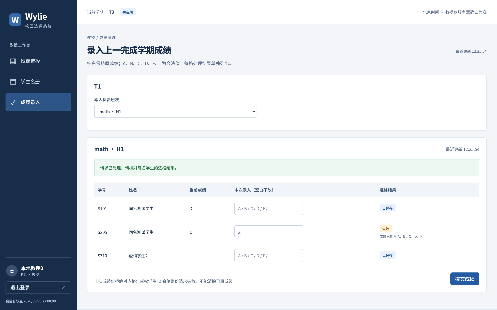

# 马喆个人工作汇报（扩充稿）

- 姓名：马喆；学号：21230727。
- 版本：2026-10-08 v0.2；技术事实依据截至 2026-10-07 的仓库记录，10-08 补充协作说明与报告整理。
- 项目：Wylie College 学生选课系统；汇报整理关联 US-028／IT-04，领域需求为 US-009、US-010、US-011。
- 职责：教授端授课选择、学生名册、成绩录入的页面与接口，以及相关详细设计、自测和缺陷闭环。

本报告按“需求理解—分析建模—详细设计—实现联调—测试复盘”展开。依据 2026-10-08 的团队补充确认，代码由各成员与 Agent 协助完成，决策由人类作出；提交中的 Amp 名称主要来自团队使用 Amp 统一撰写提交信息，不能据此否定成员参与。以下以我负责的教授领域为主线说明人机协作成果，跨模块设计和集中测试按团队成果引用；原始提交与 history 保留，未举行的评审、未执行的独立验收和个人签名仍不写成完成。按组长2026-10-09澄清，总体设计在组内讨论过，实现阶段由成员监督Agent工作，并不是把任务交给Agent后不再过问；本人参与了哪些讨论、监督了哪些任务、改过哪些Agent输出，待本人问卷补充。

## 一、工作范围：围绕教授的一条完整业务链路

### 1.1 从三个页面理解到三个相互约束的用例

我的工作包括授课选择、学生名册和成绩录入三个页面，但它们共同依赖一个事实：当前教授究竟负责哪个班次。授课选择产生归属，名册依据归属读取有效注册学生，成绩录入又在归属之外增加学期和学生范围限制。若三个页面各自维护一份判断，容易出现页面与服务端权限不一致。

因此，我把教授端看作一个从授课安排到教学结果的业务链路。实现时通过统一接口契约表达身份、班次和结果，页面负责让教授理解当前状态，服务端负责最终校验和提交；前端禁用按钮不能替代后端授权。

| 需求与用例 | 我负责解决的问题 | 与其他模块的联系 |
| --- | --- | --- |
| US-009／UC-04 选择授课 | 哪些班次有资格选择，修改失败如何保留原安排，两人争选如何裁决 | 外部目录、教务资格导入、学期窗口、关闭准入 |
| US-010／UC-05 学生名册 | 哪些学生真正属于这个班次，教授能读取哪些信息 | 正式注册、退选／删除、关闭调剂、人员状态 |
| US-011／UC-06 成绩录入 | 能给谁、在哪个学期录分，合法与非法格子如何处理 | 成绩记录、学生成绩单、历史导入、审计 |

### 1.2 我的模块边界与协作分工

教授服务位于 [TeachingService](../../../apps/api/src/modules/teaching/service.ts)，页面位于 [professor.tsx](../../../apps/web/src/routes/professor.tsx)。身份认证、事务运行时和数据模型由统筹维护公共基础；授课资格由教务导入，正式注册由学生选课和关闭流程维护。我在教授端使用这些既有事实，不另建一套身份、名册或资格维护接口。

这种划分也决定了模块间需要核对的内容：学生端显示的授课教授与教授选择一致，教务维护的资格和窗口能限制教授操作，关闭期间的新授课请求被阻断，成绩能够在学生成绩单中正确读取。我的工作需要将教授端接口与这些公共规则接起来，而不是只完成孤立页面。

## 二、需求分析：把题目的操作过程改写为可验证结果

### 2.1 资格、班次归属与时间冲突是三种不同限制

[UC-04](../../REQUIREMENTS_ANALYSIS.md#uc-04)要求教授选择有资格教授的班次，并且不能与本人其他授课冲突。我需要分别回答三个问题：是否有这门课程的资格、班次是否已归其他教授、与这次整份安排中的其他班次是否冲突。只判断其中一项都不足以说明可以保存。

资格对应“教授＋课程”，授课对应“教授＋班次”。同一门课程可以有多个班次，取得资格不代表已经取得其中某个班次；班次尚无教授也不代表任何教授都能选择。因此，页面同时呈现资格与占用信息，后端按课程资格集合与班次当前归属分别检查。

时间冲突还必须检查保留的旧班次。例如原安排有甲课，新方案保留甲课并新增乙课，不能只比较本次新增的班次彼此是否冲突。验收对象是保存后的完整安排，这也是采用整份替换接口的依据。

### 2.2 修改失败不能丢失教授的旧安排

需求分析对原文“先移除，再校验”的操作描述作了明确约束：新增、取消和保留要一起判断，失败或用户取消时保留此前全部安排。我的实现重点因此不是让每次勾选立即落库，而是先收集目标安排，确认时一次提交。

举例来说，教授原来负责 A、B 两个班次，准备取消 B、改选 C；如果 C 已被其他教授先选，结果应是仍然负责 A、B，而不是只剩 A。这个例子同时检查新增失败和取消回滚，能发现仅测试“新增失败提示正确”时遗漏的问题。

### 2.3 教授授课窗口不能直接套用学生选课窗口

教授选择授课从教务配置的开始时间开放，持续到选课关闭。学生则有初选、加退选及其间隔，二者不是同一套开放判断。需求 AC-56 明确教授在关闭前仍可选择授课；学生加退选截止后、尚未关闭的状态，不能机械地把教授操作也判为截止。

实现中分别检查授课开始时间和关闭状态，并在关闭进入处理中时通过准入机制拒绝新写入。这个边界说明，时间规则应当从各自用例推导，不能因为系统共用一个“当前学期”就共用全部阶段限制。

### 2.4 成绩的“部分成功”有明确前提

[UC-06](../../REQUIREMENTS_ANALYSIS.md#uc-06)允许合法格子保存、非法格子拒绝，但不允许越权数据混在请求中获得部分处理。成绩值填错属于输入问题，学生不属于该班或班次不属于该教授属于权限问题，二者需要不同的失败范围。

| 输入情况 | 需求中的处理 | 必须保留的事实 |
| --- | --- | --- |
| A、B、C、D、F、I | 保存对应格，允许修改已有成绩 | 重新查询得到新值，I 是明确成绩 |
| 空白或 null | 本次不修改该学生 | 原成绩保持，不能理解成清除 |
| Z 等非法成绩 | 拒绝该格，其他合法格继续处理 | 旧成绩保持，并指出失败格 |
| 非本班学生或他人班次 | 整份请求拒绝 | 所有原成绩保持不变 |

先明确这些情况，使代码、错误提示和测试能够围绕同一套规则工作。页面中的“请求已处理”必须提示查看逐格结果，不能把 HTTP 成功显示成“全部成绩保存成功”。

## 三、面向对象分析：区分业务事实、历史和查询视图

### 3.1 授课安排和授课资格不能合成一个对象

在团队的 [OOA](../../design-docs/object-oriented-analysis.md)中，E11 授课安排表达教授与班次的当前关系，E12 授课资格表达教授可教授的课程集合。前者会在选择、取消和人员状态变化中改变，后者本期只有导入、没有撤销；生命周期和修改入口都不同。

我据此核对教授端职责：选择授课只能改变安排，不能顺便授予资格；取消安排也不能删除资格。人员离职时，教务流程清理未关闭学期的安排，已经关闭学期的授课与成绩历史仍保留。当前不能继续授课与过去确实教过这门课可以同时成立。

### 3.2 名册应从注册事实生成

E10 注册关系表达学生与班次之间的有效占位，名册、人数和容量判断由这份事实导出。学生只保存课表时尚未注册，备选也不占名额；如果教授名册从保存的选择或备选数组拼出来，就会把尚未成为本班学生的人列入。

我在名册接口中使用有效注册作为数据来源，避免再建立一张可以独立修改的“名册表”。退选、删除课表、人员状态清理、目录删除或关闭调剂改变注册后，教授刷新名册就读取同一事实的结果，不需要额外同步第二份学生清单。

### 3.3 成绩记录按学生、课程、学期定位

成绩记录按“学生＋课程＋学期”唯一，教授录入时还关联班次，历史导入则可能没有本系统的班次。名册是查询视图，成绩还承担跨学期保留和先修判断的职责，不能把它理解为随名册增删的一段临时文本。

成绩来源区分教授录入与历史导入，记录课程名称快照以及修改账户。教授端只处理上一已完成且不早于系统上线的学期，教务只导入上线以前的历史，两类入口在时间上分界，不能互相借用来绕过角色权限。

图 1：团队设计模型 D02c，来源为 [设计模型说明](../../design-docs/design-models.md)及其可编辑 StarUML 源文件。授课版本、授课历史、资格和成绩各有职责；我按该共享模型衔接教授端实现，不将全图绘制归为个人独立成果。

## 四、详细设计与后端实现：先检查整份安排，再提交变化

### 4.1 用版本号表达教授在某学期的安排

接口使用 `Teaching = { termId, version, offeringIds }` 表达当前安排，保存请求提交 `expectedVersion` 和完整 `offeringIds`。版本属于“教授＋学期”，并非每个复选框单独一个版本，因此服务端可以判断提交的依据是否已经过期。

例如两个页面都读到 v1，第一页修改后得到 v2，第二页仍携带 v1 时应返回版本冲突。直接自动重试并换成 v2 会把旧页面内容当成新决定，可能撤销第一页已经确认的班次，所以客户端保留本地草稿，要求重新核对。

空安排也是合法业务状态，但仍受开始时间、关闭状态和版本限制，不能因为数组为空就省略校验。“没有选择任何班次”与“尚未加载到数据”也应在界面中区分。

### 4.2 一次保存的执行边界

[后端详细设计](../../design-docs/backend-detail.md)和服务源码体现了以下处理顺序：

1. 取得该学期准入资格，读取并应用新鲜目录；目录不可用时不能拿旧页面内容冒充最新可选班次。
2. 进入公共事务，重新确认账户、教授状态、学期状态和授课开始时间。
3. 比较授课版本与目录 revision，核对目标班次都存在、有资格、开放、未被其他教授占用且互不冲突。
4. 全部检查通过后，释放取消班次的当前归属并结束对应历史，为新增班次写入归属和新历史。
5. 同一事务更新授课版本和审计，提交后读取实际安排返回；最终释放准入资格。

关键是检查和写入属于同一受保护的确认过程。若先在事务外检查“无人占用”，再分别修改旧班次和新班次，另一位教授可能在两步之间成功选择，原子性和唯一归属都会受到影响。

### 4.3 两位教授争选时，后端重新确认当前归属

两个浏览器可以同时显示班次未被选择，这不是页面能够彻底避免的情况。服务端需要在公共事务锁内读取班次最新归属，后确认的一方若看到已有其他教授，就返回 `OFFERING_TAKEN`。

本项目使用单 API 实例与公共数据库锁／事务机制，不能说成已经验证了任意多实例部署。当前设计统一相关写入的顺序，明确一个成功、一个失败，并保证失败者原安排没有被局部修改。

验收代码不仅并发启动两个请求，还使用屏障控制先后，并交换两名教授的先行顺序。检查最终班次教授标识以及失败方完整旧安排，比只断言“一个成功、一个失败”更能说明业务结果正确。

### 4.4 当前归属与历史记录一起维护

取消授课时，当前班次的教授字段置空，对应未结束的历史写入结束时间；重新选择时新增一条历史，不把旧记录重新改为未结束。这样可以表达先选择、后取消、再重选的过程。

历史保留还与人员删除规则相关：有授课或成绩记录的教授不能直接删除，应使用离职或停用。若取消授课时连历史一起删除，教务端可能把曾经承担教学业务的人错误识别为“无记录”，因此历史完整性不是教授模块内部的小细节。

## 五、名册与成绩实现：权限边界先于输入容错

### 5.1 名册查询先证明班次属于本人

名册接口通过当前登录账户取得教授身份，不接受客户端传入另一个教授编号作为授权依据。请求中的班次标识需要与数据库中的教授归属匹配；不匹配时拒绝，不能先返回学生清单，再靠前端隐藏。

通过所有权校验后，响应按有效注册组合学号、姓名与当前成绩，不暴露 SSN、密码等无关字段。同名学生通过学号区分，避免只凭姓名给错误对象录分。查询本身不修改课表、注册或成绩。

页面分别呈现“尚无本人授课班次”和“该班次暂无有效注册学生”。前者是没有可选班次，后者是已选班次没有学生；如果都只显示一个空表，教授无法判断是授课安排未成功、学生未注册，还是数据加载失败。

### 5.2 录分学期由服务端确定

录分页面通过 `grade-context` 获取上一已完成学期及符合条件的本人班次。“上一学期”由系统学期顺序和完成状态确定，不让客户端任意选择一个历史学期，也不简单根据当前年份减一。

实际保存时，服务端在事务内再次检查班次所有权和学期范围。即使客户端绕过页面，直接把当前学期或上线前学期的班次放进请求，也不能取得录分权限。入口筛选解决易用性，写入前复查解决正确性。

### 5.3 整份授权后，再逐格决定结果

保存成绩先取该班有效注册名单，检查请求中所有学生标识；发现一个不属于本班的学生，就整份拒绝，合法学生那一格也不能提前改动。之后才依次处理合法值、空值和非法值。

具体测试中，本班学生原成绩 A，请求同时要把他改成 D，并夹入一名外班学生的 A。正确结果是请求被拒绝，本班原成绩仍为 A。如果先循环处理格子，遇到外班学生才停止，就可能留下前面已修改的部分结果。

对已通过授权的请求，十名学生中一格留空、一格填 Z，其余八格合法，预期是八格 `SAVED`、一格 `UNCHANGED`、一格 `REJECTED`。空格的旧 B 保留，Z 对应的旧值也保留；HTTP 200 只说明逐格处理完成。

### 5.4 页面保留需要教授处理的信息

页面将“当前成绩”和“本次录入”放在不同列，并在每行展示处理结果。提交完成后，成功或保持不变的输入可以清理，失败输入仍留在原位置供修正；原成绩通过重新查询展示，避免把未保存的输入误当成已生效成绩。

如果刷新后发现本地正在录分的学生已不在最新名册，页面提示名册变化并阻止继续提交，同时保留本地数据。这样既不会静默丢掉输入，也不会让过期名册继续成为可写权限。

此外，I 与未录入必须在界面中区分：I 是可保存的业务值，未录入显示为相应空状态。空白表示“本次不改”，本期没有清除成绩功能，不能用一个空输入框悄悄引入额外业务能力。

## 六、前端交互与联调：刷新不能覆盖人的编辑决定

### 6.1 将服务器安排和本地草稿分开

授课页面按契约每秒刷新目录和服务器安排，但教授未保存的选择保持独立。本地发生修改后，轮询得到新数据不能直接覆盖草稿，否则教授可能在勾选过程中丢掉刚做的调整。

服务器版本变化时，页面展示本地与服务器版本、服务器已有安排，并提供“采用服务器安排”的确认操作。旧草稿过期时禁止提交；采用服务器安排意味着主动放弃本地编辑，需要清楚表达后果。

保存也有整份替换确认，明确取消已保存班次会释放授课归属。失败后触发重新读取，但不自动重发写入；这一设计与 `expectedVersion` 配合，保证最终提交仍来自教授对当前事实的确认。

### 6.2 错误应说明原因和下一步

目录读取失败、授课尚未开始、选课正在关闭、版本冲突、无资格和他人先选的处理方向不同。页面要保留已有上下文，显示连接或状态问题，而不是把所有失败都替换为“没有课程”。

版本冲突需要重新核对安排，他人先选需要调整班次，非法成绩只需修正相应格，越权请求则不能给出其他学生的信息。把错误与下一步联系起来，才能让后端约束在界面中成为可理解的行为。

### 6.3 联调检查跨过页面、API 和数据库

[2026-10-05 联调记录](../../histories/2026-10/20261005-0312-system-design.md)记载真实浏览器经 API、PostgreSQL 的检查：当前名册仅三名有效注册，上一完成学期 B 保存成功，Z 保存失败且旧 A 和失败输入保留。这证明代表性主链路接通，不能据此推断所有成绩组合和权限路径已完整覆盖。

后续 10-06 浏览器验收又使用独立夹具检查逐格结果，截图（10-09 按同一组输入重拍）中的数据与前一轮不同。报告保留两轮各自的场景，不把截图中 D／C／I 的结果改写成前一轮 B／A 的证据。

## 七、真实故障分析：授课历史必须使用同一业务时钟

### 7.1 问题从数据库约束暴露出来

[集中合入检查](../../histories/2026-10/20261005-merge-checks.md)记录首次完整回归 130 项通过、3 项失败。原因是创建 `TeachingHistory` 时依赖数据库默认真实时间，取消时却使用注入的业务时钟；当测试业务日期早于真实日期，结束时间小于开始时间，违反 `time_order` 约束。

这不是简单统一页面日期格式就能解决的问题。程序已经支持可控业务时间，但只在部分写入中使用，导致同一条历史的两个端点不在一个时间体系里。普通环境中真实时间接近业务时间，问题可能不明显，固定时钟测试反而把它准确暴露出来。

### 7.2 处理依据与回归方式

修复采用显式 `rt.now(tx)` 写入创建时间，并增加独立期望：首次选择记为设定时间，七秒后取消时结束时间正确，十一秒后重新选择产生新历史。测试先在旧实现上证明创建时间不符，再验证修复后符合精确时间和记录数量。

处理保留 SQL 顺序约束，也没有把测试日期改到未来来回避失败。约束负责发现无效历史，测试负责证明业务时间被一致使用，二者共同保护模型承诺。

修复提交 [655ad72](https://github.com/Nichengjin/software-engineering-project/commit/655ad72)的原始 Author 为倪成锦。我在教授领域报告中分析它对模块的影响和验证要求，保留实际修复归属，不写成由我独立发现或提交。修复后团队记录为 Node 22.23.3 下 11 个文件／134 项测试、迁移、类型检查和构建通过。

### 7.3 对我后续实现的启发

时间不是仅供展示的附属字段。授课历史用于说明先后关系、保留业务记录和支撑后续维护；允许注入业务时钟后，创建、取消、重选都必须遵守同一来源。以后审查这类代码时，我会同时检查默认值、显式写入和夹具，不能只看到 Clock 接口就认为时间问题已经解决。

## 八、测试证据与验证范围

### 8.1 从需求到断言的对应关系

| 检查点 | 对应验收 | 现有验证如何判断正确 |
| --- | --- | --- |
| 授课新增、取消和重选 | AC-14 | 检查当前安排、历史结束状态及新历史时间 |
| 修改失败保留原安排 | AC-15、AC-16 | 比较失败前后的完整班次集合 |
| 两位教授竞争同一班次 | AC-51 | 交换屏障先后，检查赢家归属和失败方旧安排 |
| 名册只含有效注册 | AC-17 | 正式注册与保存、备选区分，检查实际学生标识 |
| 他人班次及外班学生拒绝 | AC-18、AC-39 | 请求拒绝，原成绩和其他业务数据不变 |
| 六种成绩、空值与非法值 | AC-19、AC-20 | 比较逐格结果、旧值及十格中八格保存 |
| 录分学期和空状态 | AC-21 及权限规则 | 无符合条件的本人班次时返回空，不展示他人学生 |

主要源码证据为 [后端集成测试](../../../apps/api/test/backend.integration.test.ts)和 [验收集成测试](../../../tests/acceptance/scenarios.integration.test.ts)，执行结论以 [测试报告](../../TEST_REPORT.md)和 [逐 AC 账本](../../testing/acceptance-execution.md)为准。测试文件存在说明具备检查手段，执行记录才说明某次环境中实际运行的结果。

### 8.2 已有结果与本轮文档整理的区别

10-06 验收采用 macOS、Node 22、PostgreSQL 15、真实 HTTP 模拟和随机独立数据库；浏览器为本机 Chrome 的 headless 检查。团队形成 73 项验收集成、32 项浏览器检查等记录，10-07 完整回归增长到 13 文件／215 项。这些数量覆盖全项目，不等于教授模块单独有 215 项，也不等于我手工逐项执行了全部测试。

本次 10-08 扩写核对了需求、模型、源码、测试文件、原提交、history 和既有截图，没有重新启动系统执行教授端验收。引用的历史运行结果保留原环境和日期，不将材料整理说成一次新的运行通过。

### 8.3 仍需继续完成的验证

当前系统尚有 Windows Chrome／Edge、另一机器初始化、七天可用性以及部分 AC 子场景待补测。已有浏览器脚本部分使用 DOM click 和日期 setter，不能替代所有真实鼠标、键盘和原生日历交互检查。

教授端进一步复核应围绕完整旧安排保留、越权请求零修改、失败格可修正、状态变化后不能沿用旧权限展开，并记录执行者、版本、输入、预期和实际结果。测试通过、PR 合入、成员审核和课程验收分别记录。

## 九、个人复盘与交付待办

### 9.1 对需求、实现和测试关系的理解

这部分工作让我认识到，教授端的复杂度主要来自规则之间的连接。整份安排替换要求同时考虑新增与取消，名册要求复用正式注册，逐格成绩要求先完成整体权限校验，轮询要求保护本地编辑。只按页面拆功能，容易遗漏跨步骤约束。

我在与 Agent 协作时承担的责任，是把业务取舍、失败后应保留什么、允许什么范围的部分成功表达清楚，再用实现和测试检查这些决定是否成立。Agent 可以协助编码、检索和生成测试，但不能代替人类决定空白是否清除成绩、版本冲突是否覆盖、外班学生是否部分处理等业务含义。

### 9.2 可以改进的工作方式

第一，设计说明应尽早给出失败案例。A、B 改为 A、C 但 C 被抢先的例子，能够同时约束接口、事务、确认文案和回归测试，比一句“支持取消授课”明确得多。

第二，权限测试要比较完整状态。看到 403 只能证明接口拒绝了响应，不能自动证明此前没有写入；在混入外班学生的成绩请求中检查原 A 不变，才闭合了“整份未修改”的要求。

第三，人机协作需要留下可复查的决定与证据。提交说明记录增量，需求和设计记录规则，测试与 history 记录实际结果。三者结合才能说明工作，不能用提交行数、自动化数量或 Agent 名称代替个人贡献判断。

### 9.3 定稿前保留的真实待办

- 由本人复核本稿的教授领域职责、实现分析和反思，补充确有记录且有必要展示的具体协作经历与实际耗时。
- 配合团队完成需求、模型和详细设计走查，将真实意见及处理结论写回仓库；不追认尚未举行的评审。
- 按测试报告补齐尚缺的环境和场景，独立复核结果由实际执行者记录。
- 统一课程封面与版式，确认个人贡献事实、签名和日期；贡献比例由团队核实，不在本稿估算。

## 十、实际截图与代表性来源

### 10.1 成绩逐格反馈截图

图 2：教授录分画面，2026-10-09 重新拍摄（北京时间2026-10-09 12:25前后，macOS、headless Chrome 154、1440×900 CSS视口／2倍像素密度，只截浏览器可见画面；用验收夹具新建可丢弃数据库和独立HTTP模拟，页面由临时HTTP服务提供构建好的 `apps/web/dist`，不是开发服务器，结束后服务与数据都已清理）。10-06 验收留存的原图滚动后顶部被切掉，第三个输入框还带着输入焦点的蓝框，所以按同一组输入重拍：P11 选择上一完成学期 T1 的 H1 班，给 S101、S205、S310 分别填 D、Z、I 后提交。图中 T1、P11、S101、S205、S310 及姓名均为虚构夹具数据，页面会话日期来自测试业务时钟，不是截图采集日期；截图由 Agent 驱动浏览器完成，不是本人手工操作。

截图中 S101 的 D 和 S310 的 I 显示已保存；S205 仍保留原 C，本次输入 Z 显示失败并留在输入框内。画面支持合法值与非法值可以在同一请求中分别反馈，也说明同名学生通过学号区分。它不能单独证明越权整份回滚或教授竞争，这些结论依赖相应集成测试。

### 10.2 原始提交与材料索引

| 来源 | 本稿使用的事实 |
| --- | --- |
| [7dddc25](https://github.com/Nichengjin/software-engineering-project/commit/7dddc25) | 马喆 Author 的授课、名册与逐项成绩服务原提交 |
| [016cf36](https://github.com/Nichengjin/software-engineering-project/commit/016cf36) | 马喆 Author 的授课、名册与录分页面原提交 |
| [PR #15](https://github.com/Nichengjin/software-engineering-project/pull/15) | 教授领域服务与页面的合入关联，原提交保留 |
| [655ad72](https://github.com/Nichengjin/software-engineering-project/commit/655ad72) | 倪成锦 Author 的授课历史业务时钟修复 |
| [需求分析](../../REQUIREMENTS_ANALYSIS.md)、[OOA](../../design-docs/object-oriented-analysis.md) | UC-04—06、授课／资格／注册／成绩关系及验收边界 |
| [API 契约](../../design-docs/api-contract.md)、[后端详细设计](../../design-docs/backend-detail.md)、[前端说明](../../FRONTEND.md) | 整份替换、版本、名册授权、逐格成绩与草稿交互 |
| [集成 history](../../histories/2026-10/20261005-0312-system-design.md)、[合入检查](../../histories/2026-10/20261005-merge-checks.md) | 实际联调及授课历史故障、修复前后验证 |
| [测试报告](../../TEST_REPORT.md)、[验收账本](../../testing/acceptance-execution.md) | 运行环境、执行结果和未完成场景 |

### 10.3 修订记录

| 版本 | 日期 | 内容 |
| --- | --- | --- |
| v0.1 | 2026-10-07 | 依据成员分工、原提交和仓库证据形成初稿 |
| v0.2 | 2026-10-08 | 按人类决策、Agent 辅助的协作事实扩写教授端生命周期，补充模型、失败案例、真实故障、验证边界与既有截图 |
| v0.2续 | 2026-10-09 | 成绩录入截图按1440×900可见画面重拍；补入组长对人机协作的澄清 |
