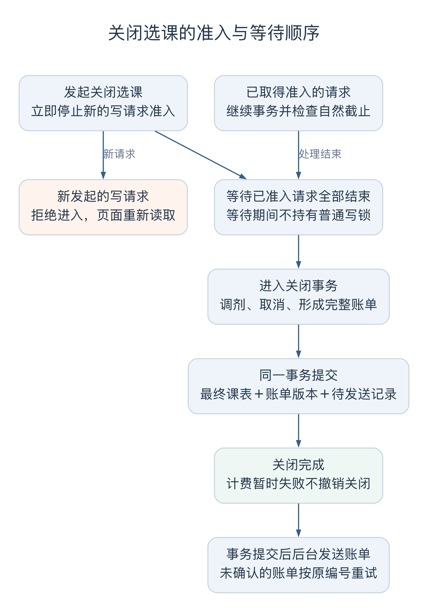
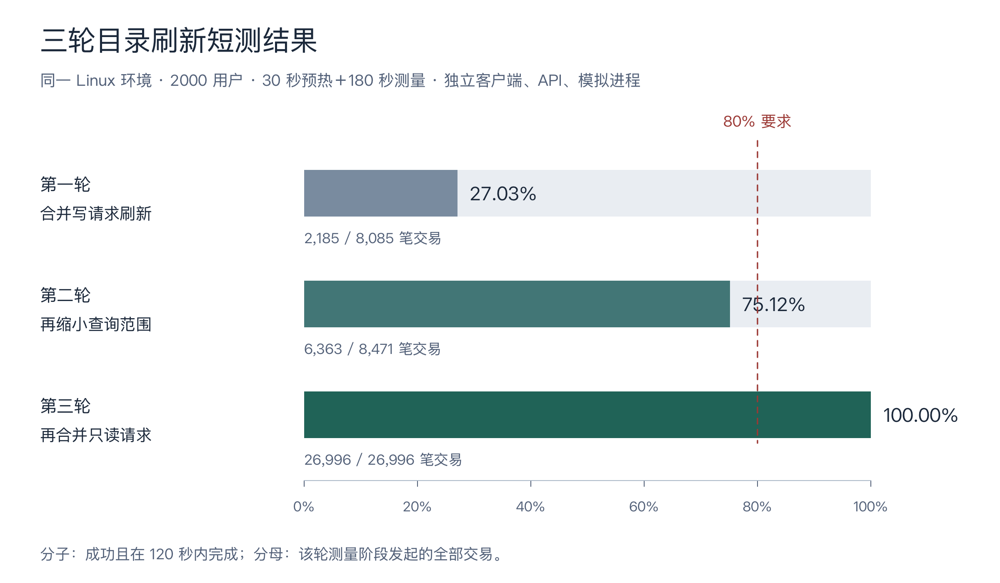
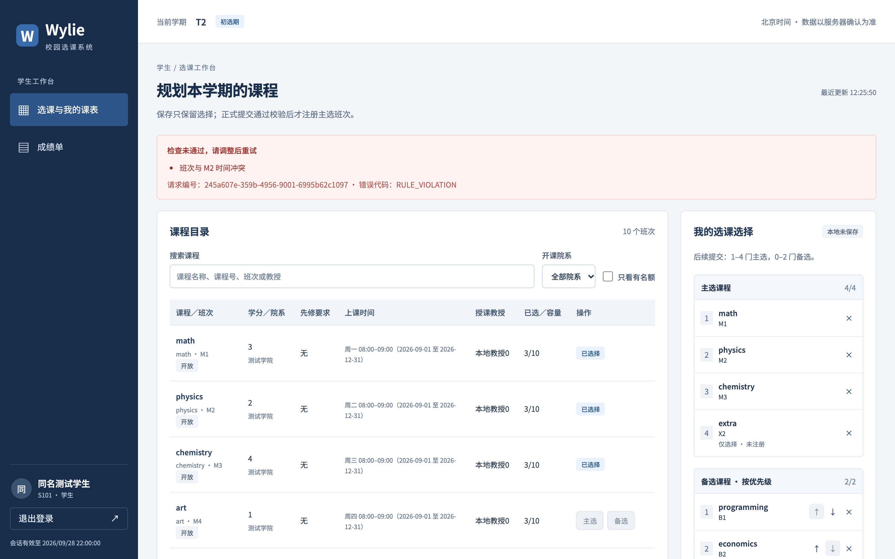
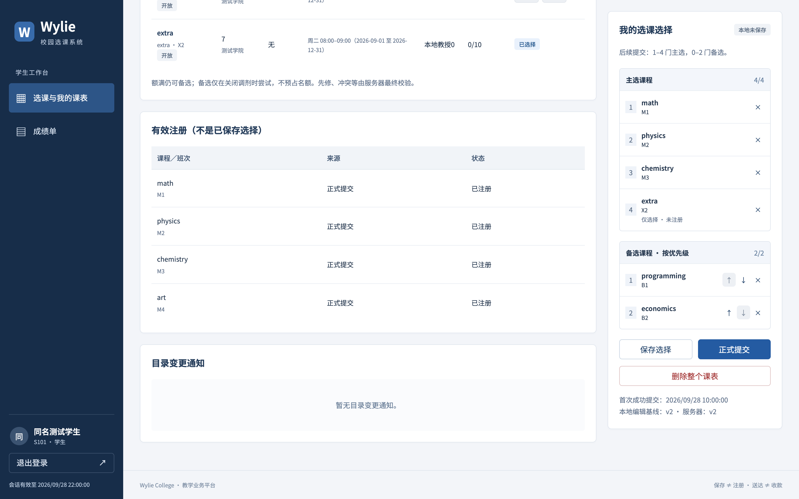

# 倪成锦个人工作汇报

- 姓名：倪成锦；学号：21230728。
- 项目：Wylie College 学生选课系统。
- 职责：项目统筹、技术负责人。
- 版本：v0.5，2026-10-09；关联：US-028／IT-04。

这次项目中，我主要负责需求澄清、总体设计、登录权限、选课与关闭的核心规则，以及系统集成和交付安排。浩宇、马喆和冯海洋分别负责学生、教授、教务三个方向，冯海伦负责测试，范昭负责外部系统模拟和运行交付。我的工作需要把这些模块接在一起，例如学生提交一份课表以后，页面上的选课结果、教授看到的名册、关闭时统计的人数和账单应当相互对应。

我主要决定需求规则、技术方向和推进安排，根据检查结果追问原因、选择后续方案。报告按需求、分析、设计、实现、测试和交付展开，重点记录几次改变原有判断的过程，以及这些决定怎样影响了后面的工作。

## 一、需求分析

### 1.1 情境化需求澄清

9 月 22 日第一次澄清需求时，我先确定了首次正式提交必须有四门主选、两门备选，并要求把其余问题集中列出来。到 10 月 3 日看到完整清单时，我发现不少问题仅凭文字很难回答。例如“加退选后是否仍满足数量约束”，没有说清是谁在什么情况下操作；“草稿”这个名称在题目里也不明显，我需要先弄清它是否对应原来的“保存课表”。

我要求把问题改成具体情境。例如，一个学生已经选好四门课，现在只想退掉一门，是否必须补选另一门才能提交？这样就能讨论后续加退选和首次提交有什么区别。整理后的问卷共有 28 题，我集中填写，再与题目逐项核对。拿不准的地方，也会和组内同学讨论，主要参考学校现有做法，以及操作后的结果是否符合使用者的预期。

经过这轮整理，首次提交和后续修改被分开规定：首次必须选满四门主选、两门备选，后续可以保留一至四门主选、零至两门备选；保存时可以还没选齐。如果学生要把所有课程都退掉，则使用删除课表。备选按顺序记录，暂时不占名额，关闭时才结合实际情况尝试调剂。这样既保留了题目的首次选课要求，也允许学生在加退选阶段减少课程。

### 1.2 保存课表的占位规则

我最初希望保存课表就能占住名额。站在学生的角度，花时间挑好一门课，只是其他课程还没有选完，当然希望下次回来时它还在。

但把这个想法放到整个班次来看，就会有问题。一个班次最多十人，如果有人保存以后一直不提交，其他学生就用不了这些名额。为了继续采用这种办法，还得增加预留期限、到期释放和通知规则。题目没有要求预留功能，而且保存的内容本来就可能继续变化。我后来接受了保存只记录选择、正式提交才占名额的做法。

接着需要处理已经选过课的学生。假设他已选上物理课，又把课表里的物理换成美术，只点保存。此时还没有确认换课，物理名额应继续保留，美术也不应增加人数。正式提交时，如果美术已经满员，就让这次换课整体失败，学生仍留在原来的物理班。

据此确定的规则是：保存不加课、不退课，正式提交整份成功或整份不生效。这条规则后来同时影响了数据模型、后端事务和页面提示。浩宇的学生页面需要分开显示已保存的选择和实际注册；马喆的教授名册只统计有效注册；关闭和计费也使用已经生效的结果。

### 1.3 需求问卷的核对与修订

参考本校做法能够帮助理解需求，但也有与题目不一致的地方。问卷填写后，我又对照原题修改了几个回答。

授课教授最初被我归到外部课程目录中：如果本系统和目录不一致，就按目录为准并提示错误。但题目又要求教授在本系统选择授课班次，而本系统不能修改外部目录。照原来的回答，教授在这里作出的选择就无法成为有效安排。最后明确，课程名称、班次、学分、时间和先修要求从目录读取，谁负责哪个班次则由本系统记录。

我也问过，教授是否应该在学生初选前全部选完，否则学生看到的课程列表怎样产生。核对后明确，班次本来就由目录提供，教授是在已有班次上选择授课。题目还要求关闭时取消仍然没有教授的班次，说明关闭前允许教授尚未确定。因此，教授选择在学生初选前开放，一直持续到关闭；尚无教授的班次可以被学生选择，关闭时再取消并尝试调剂。

历史成绩导入的回答也作了修改。检查先修课需要旧成绩，我起初认为教务可以随时导入。但如果当前学期成绩也能通过导入覆盖，就绕过了教授录入成绩的权限。最终只允许导入系统上线以前学期的成绩，且不覆盖已有记录。

其他几项决定沿用了比较明确的使用情境，写入了[需求分析文档](../../REQUIREMENTS_ANALYSIS.md)：

| 讨论的问题 | 采用的处理 |
| --- | --- |
| 目录更改上课时间或先修要求后，已选课的学生怎么办？ | 跟随目录更新，重新检查影响；发现冲突时保留课程并通知学生调整 |
| 教务怎样录入较多学生和教授？ | 支持 Excel 导入，按编号生成账号，重复行跳过、错误行反馈 |
| 学生休学、毕业以后还能做什么？ | 可以查询本人成绩，不能继续选课，当前选课按状态变更规则处理 |
| 一批成绩中有一格不合法怎么办？ | 合法成绩照常保存，错误位置保留输入并提示修改 |
| 选课关闭后是否重新开放？ | 保持关闭，必要时由教务执行补选，仍遵守课程数量限制 |

目录改变时间后产生的冲突，没有直接通过替学生退掉一门来解决。系统不知道学生更愿意保留哪一门，自动退课可能与其意愿相反。因此先通知学生，等下一次正式提交时重新检查；到关闭时仍未解决的情况交给教务处理。

### 1.4 提交请求与提前关闭的先后关系

我希望教务能设置选课时间，也能在需要时提前关闭。但原题写着“选课进行中时，不得执行关闭选课处理”，这里的“进行中”既可能指选课时间段，也可能指某个提交正在处理。

关闭要统计人数、调剂、取消班次并生成账单，需要一份不再不断变化的结果。我们据此采用后一种理解：教务可以发起提前关闭，系统随即拒绝新的选课操作，已经进入处理的请求则继续完成，通过检查的结果计入这次关闭。对象分析继续检查这个过程时，我还追问过实际业务怎样处理截止前的请求，最后接受了先停止接收、再等待已有请求结束的顺序。

调剂的次序也需要说清。一个有教授但暂时只有两名学生的班次，可能通过备选调剂增加到三人，所以不能一开始就取消。关闭先按学生首次成功提交时间排序，同一时刻再按学号处理，完成一轮调剂后，人数仍不足三人的班次才取消，不再重复进行第二轮调剂。

计费暂时不可用时，关闭结果保留，未送达的账单每 60 秒重试一次。如果计费失败就把选课重新打开，再次关闭还可能重新分配课程，学生得到的结果会变化。零课程学生同样生成零元账单，便于区分已经处理但无需缴费，与尚未处理这两种情况。

### 1.5 性能指标的确认

需求问卷中，我最初考虑由小组根据电脑和演示规模制定性能标准，担心现有环境难以支撑题目中的用户数量。

重新核对原题后，我保留了原来的指标：中央数据库支持最多 2000 名同时用户，本地服务器支持最多 500 名同时用户，目录访问不超过 10 秒，至少 80% 的交易在两分钟内完成。这些数字已经写明，不能当作题目留给小组自行解释的空白。测试环境、业务比例和持续时间可以由我们安排，再说明实际结果与目标的差距。

安排测试时，我又和冯海伦讨论过规模，提到本校一个学院所有年级大约有两千人，选课还可能错峰，是否需要下调最高并发要求。实际测试仍然沿用已经确定的原题指标。2000 用户测试失败时，下一步需要查明请求为什么等这么久，继续修改和复测，原来的数字提供了明确的比较依据。

## 二、面向对象分析

### 2.1 课表选择与有效注册

需求明确以后，按课程顺序先进行面向对象分析，再做总体设计。分析阶段需要说明学生、课程、班次、课表、成绩等对象之间的关系，暂时不决定每个对象对应哪张数据库表。

保存与正式提交的区别在这里继续影响模型。学生已经选上物理课，又保存了改成美术课的选择，两份内容必须同时存在。若只保留一个课程列表，就无法回答他正在编辑什么、实际选上什么，以及关闭时应该使用哪份结果。

模型因此区分了学期课表、选择版本、主备选条目和注册关系。课表记录所属学生、学期、版本及首次提交时间；选择版本保存最近编辑和最后成功提交的内容；注册关系表示实际取得的名额。名册和人数根据注册查询，不另外维护一份可以独立修改的名单。

图1中，选择版本用于保存编辑内容，注册关系连接学生与实际选上的班次。班次一端的“0..10”表示班次容量，每名学生最多四门主选由另一个业务约束规定。图中的课程与班次也分开，例如数据结构是一门课程，数据结构一班和二班可以有不同的时间和教授。

这使后面的实现有了共同依据。学生只保存时，教授名册不变；正式换课成功时，注册关系一起更新，名册和人数随后反映同一份事实。分析类表达的是这些职责，详细设计可以结合实现需要合并或拆分，无需把每个分析类都建成同名的表和代码文件。

### 2.2 分析模型与需求修正

进入总体设计前，我要求把需求和对象分析整体检查一遍。画关闭状态及顺序时，原来的文字出现了一处矛盾：一方面说等待正在处理的提交，另一方面又把关闭的结果限定在按下按钮时。等待期间成功的提交究竟算不算，需要明确。

这个问题后来登记为 R-01，需求补充为等待已有请求完成后，再开始关闭事务。关闭内部失败，也应恢复到等待结束后的状态。否则，一次关闭失败会把之前已经合法完成的学生提交一起撤销。

同一轮还补齐了另外三处边界。

| 检查场景 | 补充的规则及原因 |
| --- | --- |
| 关闭后补选 | 仍然最多四门主选，避免补选绕过全局上限 |
| 删除课表后重新建立 | 清除旧首次提交时间，重新满足首次提交要求并重新排位 |
| 两个页面同时保存 | 保存和提交都核对版本，防止旧页面先覆盖保存内容，再等到提交时才报错 |

这些结果一并写回需求、分析模型和验收条件，形成需求 v0.6。整理模型文件时，还发现用例模型放在被 Git 忽略的临时目录里，我决定移入正式模型目录，使后续成员能够取得可编辑源文件。相关过程保存在[需求边界修订记录](../../histories/2026-10/20261005-0220-requirements-v05-team-roles.md)中。

### 2.3 模型审阅与图例补充

建模工具由我选用 StarUML，主要是为了按课程要求交付可以继续编辑的 UML 模型。生成的模型保留原生对象、关系和状态，同时导出图片；试用版水印也保留。我当时没有逐张审阅分析图。10 月 8 日整理报告时，我补看了保存课表顺序图和学期关闭状态图。

保存课表的顺序图一开始不容易读懂，我主要卡在“学生课表边界”“课表控制”这些名称上。解释后才明确，它们来自课件中的分析类：边界负责与使用者或外部系统交接，控制负责组织一次操作，实体保存需要长期保留的业务数据。图中原来缺少这层解释，读者容易把分析类误当作具体页面和接口。

我决定保留课件术语，在图下补上图例。A04—A07 四张顺序图使用同一套命名，便一起修改和重新导出，[面向对象分析文档](../../design-docs/object-oriented-analysis.md)随之更新为 v0.4。此时再沿着学生点击保存后的消息顺序阅读，就容易对应到实际操作。

A08 学期关闭状态图比较直观，从未关闭进入正在关闭，处理成功后变成已关闭，内部失败则回到未关闭。我看图时提出过按本校习惯到点自动关闭、教务手动操作可以提前关闭的想法。但题目的关闭用例由教务员发起，时间截止后停止学生提交，与随后执行调剂和计费可以分开。加入自动关闭还要处理定时任务与手动关闭同时发生的情况，当时离交付只剩一周，我最终决定保留现有手动流程。

## 三、总体设计

### 3.1 技术选型与实施成本

数据库选择 PostgreSQL，主要因为我熟悉 SQL，也了解这个数据库。前后端统一使用 TypeScript，数据访问采用 Prisma，希望在共同字段和数据结构上保留类型检查。后端在 Hono 和 NestJS 中选了 Hono，前端用 React。

选型时，我也希望组合与其他小组有所区别。讨论中曾为此不断出现替换 Prisma、引入陌生工具的建议，我没有继续采纳。新工具会增加学习和排错时间，而选课模型、并发和测试仍需要逐项完成。最后保留 Prisma，把差异体现在这些具体设计中。

前端框架又经历了一次澄清。我已经决定不用 Next.js，但方案里先出现 TanStack Start，随后又只写 Vite，我追问过到底采用哪一种。最终明确为 React、Vite 和 TanStack Router：React 编写界面，Vite 负责开发与构建，Router 处理页面导航。项目主要是登录后的表单和列表，业务接口已有 Hono 承担，没有再增加服务端框架。选型及理由写入了[ADR-001](../../design-docs/adr/ADR-001-technology-stack.md)。

### 3.2 共享模型与接口约定

10 月 4 日夜间，我安排并行推进计划、设计、运行底座和业务实现，并要求每一步完成后检查。共享的字段、接口和状态需要先确定，否则几个模块各自完成后，仍可能对同一次操作产生不同理解。

[总体设计](../../design-docs/system-design.md)把系统分成浏览器页面、Hono 后端、PostgreSQL 数据库，以及独立的课程目录和计费模拟服务。题目没有提供可以接入的真实外部系统，因此采用独立 HTTP 模拟；模拟服务自己保存目录和接收的账单，业务后端通过接口访问它们。这样才能实际检查目录更新、计费断连和重复发送。

代码分为页面、API、模拟服务、共享接口类型和数据库访问五个包。页面和模拟服务不直接访问业务数据库，角色权限和业务规则由后端检查。[API 文档](../../design-docs/api-contract.md)同时约定保存所需字段、版本冲突、成绩部分成功和关闭已受理等返回结果，供各模块使用。

10 月 5 日我看过总体设计、接口和数据表。业务时区、时间窗口、目录与价格冻结等细节在这一轮细化中形成；我的协调重点是它们是否与前面的需求决定一致，以及页面、模拟和测试能否据此继续工作。例如关闭返回“已受理”，教务页面就需要继续查询，不能马上显示关闭完成。

### 3.3 并发选课的容量控制

两名学生都看到一个空位时，如果后端各自查询人数，再各自写入注册，两次查询都可能认为还有名额。为避免出现第十一个学生，检查和写入需要在同一数据库事务里完成，并对相关人员和学期加锁。后一个请求取得锁后，重新检查前一个请求已写入的结果。

同样的事务边界也用于换课。容量、先修、时间冲突和版本都满足以后，才一起替换原注册；任何一步失败，整次修改撤销。这样前面确定的“新课没选上就保留旧课”才能真正成立。

本次采用单个业务后端进程，并由启动锁阻止第二个实例同时工作。一个进程便于统一协调正在处理的请求和关闭状态，减少交付期间需要处理的分布式协调。代价是部分写入必须排队，不能通过直接增加后端副本来扩容。这项选择写在[ADR-002](../../design-docs/adr/ADR-002-single-instance-consistency.md)中，后面的负载测试继续检查它在题目规模下的表现。

### 3.4 关闭选课与异步计费

关闭先拒绝新操作，再等待已经进入处理的请求结束，最后执行调剂、取消和账单生成。等待已有请求时不能占着学期锁，因为学生提交也需要取得这把锁才能完成。否则关闭等学生，学生又等关闭，两边都无法继续。

图 2 按[后端详细设计](../../design-docs/backend-detail.md)整理的处理流程。关闭先停止新请求准入，等待已进入处理的请求结束，再提交关闭事务；后台计费在事务之后进行。[可编辑图源](attachments/figure-close-order.dot)。

账单记录与关闭结果一起保存，称为 outbox。这样程序即使在关闭后退出，重启仍能找到待发送内容。如果等关闭完才另写账单，中间退出就可能漏单；如果一直在关闭事务中等待计费 HTTP，又会长时间占锁。

发送放到事务完成后进行，收到确认再更新送达状态。对方可能已经收到账单，只是响应没有传回来，所以重试还要使用同一个账单标识，并由接收端识别重复。教务页面分别显示关闭结果与计费进展，这两个状态对应不同步骤。

## 四、详细设计

### 4.1 课表版本与并发修改

保存和提交都需要防止旧页面覆盖新内容。假设两个页面读到的都是第三版课表，第一页保存后成为第四版，第二页仍带着第三版请求保存，后端就拒绝这次更新，让学生先核对最新结果。页面也应保留学生正在编辑的内容，显示与服务器版本的差别，再由学生决定如何继续。

删除时还出现一个容易遗漏的问题。如果把整条课表物理删除，重建以后版本又从零开始，删除以前的旧请求可能碰巧与新版本相同。因此，删除会清空选择、首次提交时间和有效注册，但仍保留一个递增后的版本记录。它不占名额，用来识别旧请求，详细设计中称为删除墓碑。

重新建立课表后，学生需要重新满足首次四主选、两备选的要求，也重新获得调剂排位。版本记录保留下来，业务上的首次提交时间则清除，两者承担不同作用。对应的字段、约束和处理步骤写在[后端详细设计](../../design-docs/backend-detail.md)中。

### 4.2 截止时间的确认点

假设选课在 18:00 截止，一个请求 17:59:59 到达，却因为排队在 18:00 之后才准备确认。按自然截止规则，它已经超过有效时间。若使用收到 HTTP 的时刻或事务开始时间，就会让排队较久的请求继续通过。

实现因此在事务末端按数据库当前时刻进行条件确认，生产使用 `clock_timestamp()`，而非固定在事务开始时的 `now()`。确认条件失败时，前面已经进行的注册和课表变化一起回滚。提前关闭允许已有请求继续，也仍要遵守这个自然截止时间。

锁的次序同样固定下来：普通写入先锁人员，再锁学期，并在事务内重新检查人员状态、所有权、版本和容量。外部目录读取放在事务外，避免拿着数据库锁等网络。关闭意图则通过独立短事务持久化，等已有请求结束后，再进入最终关闭事务。这些安排给后续并发测试提供了可以控制的处理顺序。

### 4.3 身份权限与人员状态校验

原题采用姓名登录，但实际可能重名。我选择使用唯一学号或教授编号作为账号，显示姓名继续保留；初始化时生成随机密码，首次登录要求修改。演示数据也包含同名学生，用来检查是否仍然分别读取各自的课表。

登录后不能只靠页面隐藏按钮来限制操作。后端每次从会话取得身份，在写入前再次检查角色、人员状态和对象归属。学生只能操作自己的课表，教授只能处理自己的班次；教务也不能通过历史成绩导入修改当前学期成绩。休学、毕业学生可以查本人成绩，但选课被拒绝，离职教授原有会话不能继续获得授课权限。

会话持久化到数据库，随机会话标识通过受限 cookie 传递，密码和明文会话标识不写入日志。改密时轮换会话、撤销旧登录，变更请求同时检查来源和 CSRF。人员编号由数据库序列产生，身份唯一性由数据库约束保证，避免两次并发导入都查到“尚不存在”后各插入一份。

### 4.4 补选账单的版本替换

如果学生原来应缴 1200 元，补选以后总额变成 1500 元，接收端应把当前金额更新为 1500 元。把两次发来的总额相加，就会错误地算成 2700 元。

每份账单因此带有学生、学期和版本，每版表示完整最终课表及总金额。补选产生新版，旧版标记为被替代；同版重发只确认已经收到，新版先到、旧版后到也不能让金额退回旧值。账单保留关闭时冻结的单价和课程学分快照，避免稍后目录变化影响原账单。

发送内容、尝试次数和下一次重试时间都存入数据库，进程重启后继续原任务。只有业务结果改变才产生新版本，网络重试沿用原标识。金额按规定精度计算并舍入，这部分设计与范昭的计费模拟保持一致，测试再检查重复、乱序和断连后的结果。

## 五、编码与联调

### 5.1 跨模块业务联调

我安排先确定共享结构，再整合业务服务和页面。联调使用真实 PostgreSQL、初始化账号和独立 HTTP 模拟，使一次操作能够从浏览器进入后端，最终检查到数据库与外部服务。

以下问题在团队联调和代码检查中暴露，诊断与修复由相应实现任务推进。我在集成时关注它们会影响哪些共同规则，相关记录集中在[实现与联调 history](../../histories/2026-10/20261005-0312-system-design.md)。

### 5.2 初始化账号的登录故障

第一次用初始化账号在浏览器登录时，密码校验失败。初始化程序计算密码摘要时使用原始盐字节，后端却把盐的十六进制文本直接传入 scrypt。两边看起来用了相同的参数，实际输入不同，结果自然对不上。

这个问题也说明了原来测试方式的不足。如果测试只是先调用程序自己的加密函数，再调用自己的校验函数，两边犯同一个错误时仍可能通过。因此，修复时用独立的 `scryptSync` 和固定原始盐构造初始化格式的数据，先复现失败，再把后端的十六进制盐解码回原始字节。

修改后重新检查登录、首次改密、会话和数据库相关测试，初始化账号才与后端接通。以后为不同模块约定一种数据格式时，至少需要一个不依赖双方实现的样本，才能检查两边是否对同一格式有相同理解。

### 5.3 登录审计对人员删除的影响

教务删除没有选课、授课和成绩历史的人员时，数据库仍然拒绝。原因是登录审计通过限制删除的外键关联账号，只要这个人登录过，就无法删除。

这里需要同时保留两条规则：无业务历史的人员允许删除，已经形成的审计事件继续保留。处理办法是允许审计中的账号引用为空，人员删除时解除引用，审计内容本身留下；选课、授课等业务历史仍按原规则阻止删除。

真实数据库测试随后覆盖了“有登录审计、无业务历史”的删除，并检查业务历史限制继续有效。这次调整也提醒我，设计关系时要区分它是在表示必须共同存在的数据，还是在记录过去发生过的事件。把所有外键都设成同一种删除方式，会让看似无关的记录挡住正常操作。

### 5.4 计费与目录刷新的调度冲突

后台原来先等待一轮计费发送结束，再继续刷新课程目录。计费不可用时，每笔账单都要等待超时，多笔累积以后，学生迟迟收不到目录变化。两项任务虽然都在后台执行，但没有必须互相等待的业务关系。

修复把目录轮询和计费发送分开调度，各自防止重复重叠执行，计费每批最多八个 HTTP 请求并发。检查时故意让八个发送一直等待，再修改目录，确认新的目录版本仍能在五秒内写入本地。这样即使账单暂时送不出去，课程变化也能继续被学生看到。

### 5.5 人员删除与关闭选课的并发协调

关闭需要为学生生成账单，删除没有业务历史的学生又会改变学生集合。如果关闭已在内存中进入处理中，但还没有写入数据库，删除请求可能仍看到“未关闭”；另一种次序则是删除已经检查通过，关闭才开始。

处理时让两项操作取得相同的学期行锁。删除在锁内同时核对数据库状态和当前关闭状态，关闭记录意图后再确定本次学生集合。测试分别安排删除先进入和关闭先进入，核对结果符合实际顺序。仅在页面上禁用删除按钮，不能挡住已经发出的请求，因此这项协调必须放在后端。

### 5.6 联调结果与试用反馈

10 月 5 日接通主链路后，108 项开发测试、类型检查和构建通过。三类角色又通过浏览器相互检查：学生只保存时没有有效注册，提交成功后教授名册出现该学生；教授录入合法成绩可以保存，错误成绩保留提示；教务关闭后能看到取消班次和账单进展。

其中一次关闭场景产生 14 笔已确认账单，三笔各 1100 元，其余十一笔为零元；该次没有发生成功调剂。补选检查则观察到零元旧账单被 300 元新版替代。Excel 三行样例分别显示成功、重复跳过和拒绝。这些小场景用于接通模块，成功调剂和故障恢复再由专门的集成用例检查。

10 月 6 日，我在本机启动系统并实际使用了一遍。主要功能已经具备，但整体仍有明显的原型感，页面细节和操作提示还需要继续检查。联调中发现的关闭等待提示残留、取消弹窗后焦点丢失，也属于这类问题。后端完成了工作，使用者仍需要知道当前处于什么状态，失败以后怎样继续。

本报告第十章保留了 10 月 9 日补充演示的截图，用同一名学生展示只保存、提交成功和换课失败后的页面，再接到教务关闭。这样可以直接看到需求中区分的几种结果。

## 六、测试安排与缺陷处理

### 6.1 验收安排与结果记录

测试计划和 64 条验收条件先形成，再按业务规则准备数据和场景。测试文档记录输入、步骤、预期及实际结果，供冯海伦之后复核和修改。

我的工作主要是安排测试范围、提供可以运行的集成版本，并根据结果决定后续处理。正常流程之外，我希望继续检查几个会改变结果的边界：两个人争最后一个名额、换课失败、关闭与提交同时发生、计费收到后断连。它们需要比较操作前后的完整数据，仅看到请求成功还不足以判断规则是否正确。

### 6.2 授课历史的时间来源错误

合入前的完整回归曾出现 130 项通过、3 项失败。原因在授课历史的时间来源：创建记录时使用数据库真实时钟，取消时使用测试注入的业务时钟。测试固定日期早于实际日期，取消时间就落在创建时间以前，违反了数据库的时间顺序约束。

直接把测试日期移到未来虽然可能通过，却没有消除两种时间混用。修复统一使用业务时钟写入授课历史，并加入首次创建、七秒后取消、十一秒后重选的精确断言。检查开始和结束时间后，才确认这一段历史符合预期。

修复后的完整检查达到 134 项通过，迁移、类型检查和构建也通过。这件事影响的不只是教授页面：既然系统为了验证截止时间提供了可控时钟，相关业务记录也需要按同一套时间形成，否则测试所控制的时刻与数据库里的时刻仍然不一致。

### 6.3 测试数据与独立预期

登录失败的经历已经说明，测试预期不能完全由被测程序自己生成。后续计费测试采用不同学分的课程组合，按独立的每学分 125 元单价计算 1250、1125、1750 和零元等结果。课程组合不对称，少算一门、错用一门或把新版累加到旧版，就更容易在金额上表现出来。

并发测试使用真实数据库和可控制的处理屏障。两名学生争最后一席时，安排谁先进入关键步骤，再交换先后次序，最终核对赢家、人数和全部注册。关闭失败时，也比较课表、注册和待发账单，确认已经完成的在途提交仍然保留。随机独立数据库用于隔离这些测试，真实迁移才能检查行锁、外键和回滚。

测试准备本身也出现过错误，例如一次只发送五十笔账单，却过早期待八十笔全部送达；浏览器驱动又曾把弹窗按钮与背景按钮混淆。遇到失败时，需要先核对数据是否准备完、操作是否真正发生，再判断产品行为。修正准备或驱动后重跑对应场景，避免为错误的预期改动业务规则。

### 6.4 各阶段测试结果

| 阶段 | 完整回归结果 | 主要内容 |
| --- | --- | --- |
| 10 月 5 日开发联调 | 108 项通过 | 三角色、真实数据库及外部模拟的主要流程 |
| 10 月 5 日合入前检查 | 134 项通过 | 补充检查并修复授课历史时钟问题 |
| 10 月 6—7 日验收整理 | 207 项通过 | 包含 73 项验收集成测试，检查并发、故障和恢复 |
| 10 月 7 日性能修复后 | 215 项通过 | 加入目录刷新合并等回归场景 |

这些是不同阶段的完整集合，后一次包含前面的用例。浏览器检查另记录了 32 项操作，以及六条页面更新路径各十个样本；从业务请求成功返回到页面显示变化，60 个样本中最长为 1043.24 毫秒。这组结果说明当时的页面更新情况，高负载表现另按第七章的正式负载测量。

测试文档与代码通过 PR #24 合入。具体执行情况保存在[测试报告](../../TEST_REPORT.md)、[测试说明](../../TESTING.md)和[逐项验收记录](../../testing/acceptance-execution.md)中，后续复核继续使用这些记录。

## 七、性能诊断与方案选择

### 7.1 性能失败的初步判断

按题目指标，测试安排了 500 和 2000 两档已登录虚拟用户，每档预热五分钟，再持续测量三十分钟。用户按比例浏览目录、读课表、保存、换课和查成绩，操作之间等待 5—15 秒。成功率按全部交易计算，失败和超时也留在总数里。

10 月 6 日 macOS 的 500 用户档全部通过。2000 用户档只有 61939 笔交易成功并在两分钟内完成，占 98252 笔的 63.04%，低于要求的 80%；目录在十秒内成功返回的比例为 78.92%。

我最初怀疑电脑合盖导致了中断，也问过数据库就在本机，为什么仍然超时。我要求继续核对运行环境和失败原因。电源日志显示压测期间没有睡眠；数据库最多使用约 24 个连接，上限为 100，没有用满。报告里的客户端超时，是等待整个 HTTP 响应超过 120 秒，不能直接理解成数据库连接超时。

同时，macOS 大量瞬时建连出现了连接重置，不连接数据库的简单 HTTP 服务也能复现。把连接分散发出后有所改善，但完整应用改为分批启动用户仍然失败。到这里，环境因素已经无法解释全部结果，需要继续检查请求在应用内部等在哪里。

### 7.2 目录刷新队列的定位

记录各阶段等待时间后，发现保存和提交前都要刷新目录，而这些刷新按学期逐个排队。队列最多积压 1573 个未完成调用，等待达到 214 秒；同轮事务连接和锁等待最长约 4.95 秒。许多请求尚未进入选课事务，就已经超过客户端两分钟的期限。

我随后继续追问，换到 Linux 是否能解决问题，以及这是不是我们设计本身造成的。对照结果表明，Linux 没有复现同样的建连重置，但逐请求读取目录形成的积压仍需要修改。至此，我接受了应该调整应用处理流程的判断，继续推进性能方案，而没有停在更换环境上。

这一区分直接影响修复方向。增大数据库连接池、延长事务期限，都不能减少请求进入事务以前的重复目录读取。当前先要减少这部分工作，再看是否还有其他等待。

### 7.3 目录刷新合并与数据时效性

每次保存和提交都刷新目录，原意是使用较新的课程信息。但许多用户操作同一学期时，重复读取相同目录，反而形成长队列。

直接缓存一段时间可以减少访问，却可能在学生提交时使用变更以前的数据。让新请求加入正在进行的读取，也有相近的问题：那次读取在新请求到达以前就已经发出，可能没有包含随后发生的变化。

最后选择按轮次合并。一轮正在读取时，之后到达的请求共同等待下一轮；下一轮真正开始读取以后，新来的请求再排到后面。这样一批等待者共用一次在它们到达后发起的读取。取得结果并更新本地目录以后，再让这一批请求继续，防止后完成的旧结果覆盖新版本。

关闭仍然等待已经取得准入资格的请求，各写请求保留自己的处理记录。只读目录也按相同思路合并，但教授看到的课程与其授课资格有关，所以还要区分学期和教授，不能把一位教授的结果交给另一位。具体方案记录在[ADR-003](../../design-docs/adr/ADR-003-catalog-refresh-generations.md)中。

### 7.4 三轮性能修改与短测结果

修复在 Linux 环境继续测量，客户端、业务后端和模拟服务分别运行在独立进程。为了比较每一步修改，先采用 2000 用户、30 秒预热和三分钟正式测量的短时诊断。

| 修改内容 | 成功且在两分钟内完成 | 比例 |
| --- | --- | --- |
| 合并保存、提交前的目录刷新 | 2185／8085 | 27.03% |
| 再缩小读取字段、注册计数和班次查询范围 | 6363／8471 | 75.12% |
| 再合并只读目录的下一轮请求 | 26996／26996 | 100% |

图 3 对应上表三轮短时诊断，虚线为 80% 要求。各轮均采用同一 Linux 环境、2000 用户、30 秒预热和 180 秒测量，分母为各轮发起的全部交易；图中没有混入 macOS 长测或 Linux 正式长测。数据来源：[测试报告](../../TEST_REPORT.md)，[数据与绘图源文件](../figure-sources/README.md)。

第一轮仍然远低于要求，我没有把最初找到一个瓶颈当作问题已经解决，而是继续要求诊断。只处理写操作后，大量浏览目录的请求还在各自读取和组装完整结果。第二轮减少查询内容已有改善，但仍不足 80%；加入只读请求合并以后，短时诊断才全部通过。我最终选定了这套继续缩小查询并合并只读请求的方案。

回归还使用可控制的目录读取屏障，检查运行中到达、不同学期、读取失败后恢复和教授视角隔离。旧实现曾发出 2002 次外部请求，而同一组受控请求正确合并后应为两次。检查这些顺序，是为了确认性能改善仍然遵守原来的数据规则。修改没有依赖放宽客户端期限，也没有改大数据库连接池或移除原有写锁。

### 7.5 正式复测与数据一致性检查

短时诊断通过后，重新运行五分钟预热、三十分钟正式测量。2000 名已登录用户共发起 264615 笔交易，全部成功并在两分钟内完成；105899 次目录查询全部在十秒内完成。停止新操作并等待后端处理结束后，检查到 8000 条有效注册，班次人数不超过十人，每名学生不超过四门，课表与客户端最后确认的内容一致。

| 正式测量 | 成功且在两分钟内完成 | 目录在十秒内成功 |
| --- | --- | --- |
| macOS，修改前，500 用户 | 89666／89666 | 35659／35659 |
| macOS，修改前，2000 用户 | 61939／98252 | 31079／39381 |
| Linux，修改后，2000 用户 | 264615／264615 | 105899／105899 |

两次正式的 2000 用户测量环境不同，因此比较代码修改时，主要参考同一 Linux 环境下的三轮短测。完整复测时，三个进程仍在同一台机器上；全部交易的 p95 约 6.41 秒，最大约 9.92 秒，增加网络延迟或换一台机器后的表现还要另行检查。[性能修复记录](../../histories/2026-10/20261007-1918-catalog-throughput.md)保留了失败、各轮修改和正式复测结果，修复与追溯经 PR #25、#26 合入。

### 7.6 客户端超时后的终态核对

负载测试还暴露了一项取数问题。客户端超时后，服务器可能仍在处理提交。原脚本在后端全部结束前就比较课表，记录到 806 名学生与客户端最后确认的内容不同。当时数据库仍在变化，这个数字不能直接当作最终数据丢失。

脚本后来改为先停止新操作和后台轮询，等待已进入处理的请求完成，再核对最终状态。另一次故意设置 1 毫秒超时的检查中，服务器课表与注册保持一致，但仍有 15 名客户端最后确认的内容与服务器不同：客户端没收到成功响应，服务器却可能稍后完成了提交。

这说明等待处理结束只解决了取快照的时机，客户端还需要在超时后重新读取结果。PERF-02 继续记录这项问题，后续需要与学生页面的提示和重新同步流程一起验证。

## 八、集成、成员交接与材料组织

### 8.1 项目延期与排期调整

9 月 9 日建立项目时，我选择迭代增量开发和持续交付，希望每一轮都能形成一部分可运行的结果，再用它检查需求和设计。9 月 22 日又对照课件调整了阶段顺序，在总体设计前补上需求规约与对象分析。

原计划第一轮到 9 月 25 日完成登录和课程浏览，实际没有按期交付，评审和回顾也没有举行。到 10 月 5 日，进度比原计划晚约十天。后续安排调整为先确定共享接口和底座，再并行实现业务，测试准备同步开展，10 月 10—13 日继续验收，14—16 日整理交付和演示。

集中推进后，程序很快接通，但成员熟悉完整系统和互相检查的时间被压缩。原计划和实际安排保留在[开发计划](../../PROJECT_DEVELOPMENT_PLAN.md)及[迭代记录](../../iterations/README.md)中，后续集中实现的结果按实际时间登记。

### 8.2 成员交接的准备与阻碍

10 月 5 日，我按模块规划提交内容、成员分支和合入次序，要求使用保留原提交的 merge commit。共享结构先进入，依赖它的后端和页面再接入，避免主线出现页面已经存在、调用的接口却还没进入的情况。

我最初希望成员在自己的电脑上登录 GitHub，使用脚本提交和创建 PR，再由我实际查看。为降低操作难度，先准备通用说明，随后改为逐人的教程。

几次调整解决的是步骤是否容易执行，但没有同时解决成员能在什么时候投入。成员当时都有其他安排，短期内无法接手，我决定先集中合入已有的 PR #6—23，共 18 条任务分支，保留 30 个普通提交，使后续测试有统一版本可用。成员之后的新工作仍需从主线开展。

这次交接让我看到，只写“负责学生端”或“负责测试”还不够具体。下次应当约定一个可以检查的结果，例如在什么时间取得哪个版本、完成哪条操作、遇到问题交给谁。教程随任务提供，可投入时间也要一起确认。

### 8.3 分支合入与检查修正

合入过程中，课程资料转换后的 Markdown 未通过格式检查。处理标题层级和空行后，再核对正文内容，避免整理格式时改动课程原文。私有仓库无法使用原来的依赖审查功能，则改用依赖漏洞检查，并保留 OSV 扫描，使后续提交仍有固定检查入口。

依赖更新也没有一次完成。第一次只更新锁文件，实际安装的部分嵌套依赖仍然是旧版本；检查依赖树后才发现，两者并没有一致。后来针对使用这些依赖的包设置版本覆盖，重新安装并核对，再实际读写一次 Excel 文件，检查教务导入所需的表格功能仍可使用。

这些问题与授课历史时钟修复完成以后，134 项回归、构建和远程检查通过，再按顺序合入。配置文件改好后继续查看实际安装结果，并执行受影响功能，这一步后来也用于检查交付说明。

### 8.4 源码交付与环境复现

同机新目录复现时，曾漏掉生成 Prisma 数据客户端的步骤，导致构建缺少类型。开发目录中以前已经生成过，日常运行没有暴露这一缺口。补上生成步骤以后，才继续完成构建和检查。这要求运行说明按一台新环境的顺序编写，不能假定对方已经做过开发时的准备。

10 月 8 日，[配置管理计划](../../CONFIG_MANAGEMENT_PLAN.md)草案形成，后续由范昭审定。源码、锁文件、数据库迁移、模型和课程文档按同一个提交打包，脚本同时生成文件清单及校验值，方便确认交付材料属于同一版本。

目标电脑按锁文件安装依赖、生成数据库客户端，再构建程序；私有配置和运行中的数据库不混入源码包，根据配置示例、迁移和演示数据重新建立。候选版本还需要由另一位成员在另一台电脑上照着[运行说明](../../DEVELOPMENT.md)完成启动，实际检查步骤是否充分。

### 8.5 工作报告的整理与修订

10 月 7—8 日，我安排根据分工、提交与测试记录起草六份个人报告和小组总结。最初内容较短，看不出各阶段怎样推进，我要求继续补充需要决定的问题、处理理由和实际故障。扩充以后，技术材料已经比较充分，但个人经历又集中在章末，前面仍像一份系统说明。

这次继续修订时，我选定小组报告第三章的写法，把问题、考虑和决定接在一起。例如保存占位的改变放回需求章节，性能失败后的判断放回诊断过程。各份报告按个人职责选择重点，测试数字、接口和代码引用用于说明具体结果，详细清单另见相应文档。

## 九、个人总结与后续工作

### 9.1 需求判断与业务后果

这次需求分析中，我经常先按自己作为学生的习惯回答。保存就占名额、教授先全部选好授课、到截止时间自动关闭，第一眼都很自然。但继续考虑其他学生、教授、教务和外部系统，原来的回答就需要调整。

保存不占位是其中最明确的一次变化。我起初只想到给自己保留选择，后来才考虑到长期不提交会占住其他人的名额，以及预留到期后又要怎样处理。以后分析类似功能，我会把一个人的操作继续推到其他人的页面和最终数据上，检查它会留下什么结果。失败以后保留哪些内容，也应在这个阶段说明。

模型阅读同样需要具体操作作参照。A04 的名称符合课件，但没有图例时我仍然难以理解。后面检查模型，除了核对关系，还需要沿着一条用户操作完整读一遍，确认图能帮助成员讨论同一个过程。

### 9.2 测量结果对方案选择的影响

性能失败时，我最先怀疑合盖和数据库，这些猜测并没有得到后面的记录支持。检查电源日志、连接数和各阶段等待时间以后，问题才逐步落到目录刷新队列上。第一次修改又只解决了一部分，继续缩小查询和处理只读请求后才通过。

这段过程使我更注意一个结果到底说明了什么。客户端等待超时，需要继续追到后端的具体步骤；课表比较不一致，需要先看数据是否已经停止变化；短时诊断通过，还要回到原定时长复测。后续遇到类似问题，我会先把测量条件和观察位置说清楚，再选择修改哪一层。

### 9.3 协作交接的改进

我承担的工作贯穿需求、公共设计、核心业务、性能方案和集成材料，已确认的贡献比例为 30%，其余五位成员各 14%。这个分配同时考虑技术范围和协调工作，具体分工见[小组总结](../team/report.md#十二成员贡献)。

项目后期集中推进虽然接通了功能，但第一轮没有形成登录和浏览课程的可运行结果，后面又集中处理业务、测试和材料，成员接手的时间变得紧张。下一次我会把第一轮范围缩得更小，尽早完成一名用户的一条操作路径，安排实际演示和交接。这样环境、接口和人员时间的问题能在更早一轮暴露。

截至 10 月 9 日，主要业务已接通，多轮回归、Chrome 检查和负载测量已经形成记录，课程文档和源码打包机制也已建立。最终提交前还需要继续完成以下工作。

| 后续工作 | 安排 |
| --- | --- |
| 需求、模型与设计走查 | 安排成员一起核对，记录意见及处理结果，补齐迭代评审和回顾 |
| 测试复核与补测 | 冯海伦独立复核现有执行记录，继续检查剩余验收子场景及超时后的重新同步 |
| 环境与可靠性检查 | Windows 的 Chrome、Edge 操作，另一台机器从空环境启动，七天可用性观察 |
| 课程材料 | 确认外部模拟方案，范昭审定配置管理计划，六人核对报告并完善封面、签名 |
| 演示与交付 | 10 月 14 日准备候选包，15 日演练，16 日完成运行检查和课程提交 |

## 十、实际截图与参考记录

### 10.1 课表保存、提交与冲突处理截图

以下截图于 10 月 9 日在独立测试数据库中重新拍摄，使用虚构账号、真实 API、PostgreSQL 和外部模拟。浏览器为 macOS 上的 Chrome，画面采用 1440×900 视口；页面显示的 9 月 28 日是固定业务时间。演示前已为部分学生建立注册，以便检查关闭时人数达到开课要求的班次。

学生 S101 先保存四门主选和两门备选。图4右侧课程标为“仅选择·未注册”，左侧有效注册区为空；对应数据库中有效注册数量为零。

同一份课表正式提交成功后，图5左侧出现 M1—M4 四门有效注册，版本从 v1 升到 v2。两门备选仍未占名额；M1 名册核对为 S101、S205、S310。

随后把 M4 换成与 M2 时间冲突的 X2，提交被拒绝。图6上半部分显示冲突提示，X2 仍只是本地未保存的选择；向下查看有效注册，原来的 M1—M4 四门仍然保留，课表版本也保持 v2。数据库完整状态与前一次成功提交后相同。

### 10.2 关闭结果与账单送达截图

同一次演示中，教务在关闭前导入了一名新学生，随后执行关闭。数据库与页面均显示 13 笔账单送达，其中三笔各 1250 元、三笔各 625 元、七笔零元，合计 5625 元。新增学生对应其中一笔零元账单；页面同时显示 B2、A1 等人数不足的班次已取消。

这组演示数据与第五章 10 月 5 日的联调数据不同，分别保留各次账单数量和金额。完整调剂、故障重试与负载场景见测试报告。

### 10.3 主要提交与参考文档

| 原提交 | 内容 | 对应记录 |
| --- | --- | --- |
| [218af5a](https://github.com/Nichengjin/software-engineering-project/commit/218af5a) | 需求 v0.4 与澄清结论 | [需求澄清过程](../../histories/2026-10/20261004-2112-requirements-clarification.md) |
| [75816e3](https://github.com/Nichengjin/software-engineering-project/commit/75816e3) | 面向对象分析与边界补充 | [面向对象分析](../../design-docs/object-oriented-analysis.md) |
| [892fd74](https://github.com/Nichengjin/software-engineering-project/commit/892fd74) | 九张设计图与可编辑模型 | [PR #6](https://github.com/Nichengjin/software-engineering-project/pull/6) |
| [fc04f13](https://github.com/Nichengjin/software-engineering-project/commit/fc04f13) | 数据模型、迁移及约束 | [PR #8](https://github.com/Nichengjin/software-engineering-project/pull/8) |
| [e5a87b7](https://github.com/Nichengjin/software-engineering-project/commit/e5a87b7) | 持久化会话与请求安全 | [PR #10](https://github.com/Nichengjin/software-engineering-project/pull/10) |
| [53c45ed](https://github.com/Nichengjin/software-engineering-project/commit/53c45ed) | 保存、提交、删除事务 | [PR #14](https://github.com/Nichengjin/software-engineering-project/pull/14) |
| [186c9e3](https://github.com/Nichengjin/software-engineering-project/commit/186c9e3) | 关闭调剂与补选事务 | [PR #20](https://github.com/Nichengjin/software-engineering-project/pull/20) |
| [a330b47](https://github.com/Nichengjin/software-engineering-project/commit/a330b47) | 启动恢复及集成检查 | [PR #22](https://github.com/Nichengjin/software-engineering-project/pull/22) |
| [655ad72](https://github.com/Nichengjin/software-engineering-project/commit/655ad72) | 授课历史统一使用业务时钟 | [合入检查记录](../../histories/2026-10/20261005-merge-checks.md) |
| [80d0142](https://github.com/Nichengjin/software-engineering-project/commit/80d0142) | 目录合并与性能复测 | [PR #25](https://github.com/Nichengjin/software-engineering-project/pull/25)、[PR #26](https://github.com/Nichengjin/software-engineering-project/pull/26) |

### 10.4 文档修订记录

| 日期 | 版本 | 修订内容 |
| --- | --- | --- |
| 2026-10-07 | v0.1 | 根据分工、提交和执行记录形成初稿，经[PR #27](https://github.com/Nichengjin/software-engineering-project/pull/27)合入 |
| 2026-10-07 | v0.2 | 按需求至交付阶段扩写，加入截图和分析图；10 月 8 日经[PR #28](https://github.com/Nichengjin/software-engineering-project/pull/28)合入 |
| 2026-10-08 | v0.3 | 补入需求改答、技术选型、模型阅读、性能判断和成员交接等本人经历 |
| 2026-10-09 | v0.3 续 | 按浏览器可见画面重新拍摄演示，保留冲突后的原注册，更新本次关闭的 13 笔账单数据 |
| 2026-10-09 | v0.4 | 将个人经历与技术过程合并，重写各章叙述；统一当前 OOA v0.4 口径，补入贡献比例和配置管理进展，集中整理后续工作 |
| 2026-10-09 | v0.5 | 统一章节标题，新增两张流程、交互或数据图，补充图注、可编辑图源与已有记录来源，更新图号及引用 |
