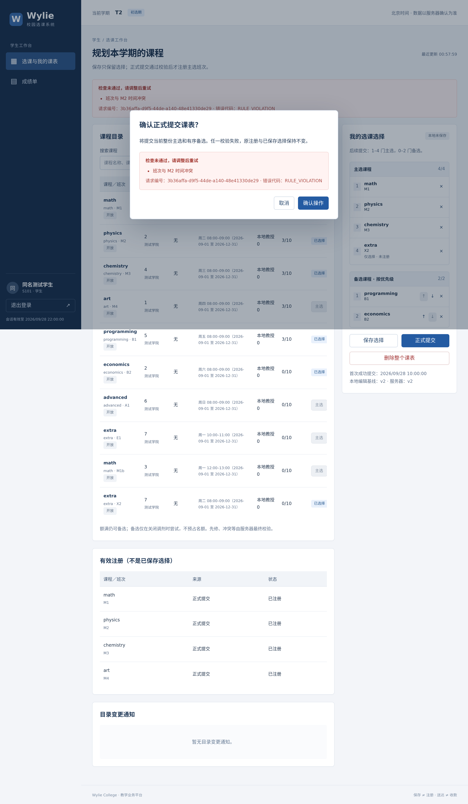
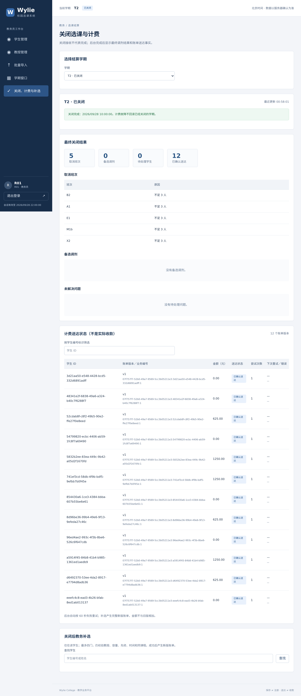

# 倪成锦个人工作汇报（初稿）

- 姓名：倪成锦；学号：21230728。
- 项目：Wylie College 学生选课系统；角色：项目统筹、技术负责人。
- 版本：2026-10-07 v0.2 扩充初稿；证据截至该日，补充演示基线为[已合入初稿的主线](https://github.com/Nichengjin/software-engineering-project/commit/fb00ab3ff2b8759e19ec024999a453874871688c)。
- 汇报整理关联：US-028／IT-04；领域需求包括US-002—004、US-006—008、US-015、US-017—020、US-024—027。
- 用途：课程个人工作汇报与工作总结草稿，待本人补充实际经历并确认，不是最终签字材料。

## 阅读说明：以需求贯穿开发，不把团队成果全部算作个人工作

按照[团队分工](../../TEAM_ROLES.md)，我的责任范围是总体设计、数据模型与接口契约、登录权限、选课核心规则与事务、关闭调剂及集成发布。学生端、教授端、教务端分别由浩宇、马喆、冯海洋负责，范昭负责外部模拟与交付，冯海伦负责独立测试。我需要协调共享接口和规则，而不是把各成员领域的全部产出算作个人成果。

这份报告的主线不是“写了多少文件”，而是同一组业务规则怎样经过需求澄清、对象分析、设计、实现、联调、测试和交付，最终形成可运行、可核对的系统。各章按“阶段任务—决策问题—实际问题—处理与验证—协作和复盘”展开。设计取舍不等于曾经发生的bug；只有执行记录支持的失败才写为实际故障。

本项目借助AI工具推进。需求问卷及早期整理包含Claude Code执行记录，后续模型、实现、自动化测试及集中Git操作主要由Amp和子Agent执行。部分原提交按授权登记为倪成锦Author、Amp Committer；这一记录支持责任和产物追溯，不证明本人独立编写、执行测试或逐项审核。下面以我的负责领域和统筹任务为叙述视角，技术过程依据仓库事实整理；具体亲自参与的程度、同学沟通及投入时间由本人确认。

**贯穿全文的三个例子：**保存不占名额，推动选择与注册分离；提前关闭等待在途请求，推动准入与排空设计；计费失败不撤销关闭，推动同事务outbox与外部幂等协议。这些问题不是某一章独立解决，而是每进入下一阶段都要重新核对。

| 阶段 | 需要回答的问题 | 形成的主要产物 |
| --- | --- | --- |
| 需求分析 | 原题哪些规则明确，哪些须解释或修改？ | 需求v0.6、Q-01—19、BR-01—17、64条AC |
| 面向对象分析 | 哪些是业务事实，哪些是视图与控制职责？ | OOA v0.3、用例模型、A01—A09分析图 |
| 总体设计 | 谁拥有数据，如何保证并发和外部失败的一致性？ | 总体设计、API契约、ADR、9张设计图 |
| 详细设计 | 规则如何落为字段、约束、事务和状态？ | Prisma迁移、DTO、后端详细设计及测试接口 |
| 编码与联调 | 模块接起来以后，真实数据和页面是否一致？ | 三角色主链路、问题修复与108项开发自测 |
| 测试与缺陷修复 | 测试能否揭露错误，而不只是证明“能运行”？ | 时钟复现、验收账本、故障与并发测试 |
| 性能诊断 | 2000用户失败发生在哪一层，修复是否保持语义？ | PERF-01修复、ADR-003、完整Linux复测 |
| 集成交付 | 提交、合入、评审、课程验收分别到了哪里？ | 保留原提交的PR、CI、追溯、材料初稿 |

## 一、需求分析：先把题目的歧义变成可验收规则

### 1.1 阶段任务：不能把“做选课系统”直接当作开发清单

首先需要整理题目中的学生、教授、教务员，以及课程目录、计费系统各自承担什么职责；再区分正常流程、异常流程、权限限制、时间窗口和非功能指标。一个“提交选课”按钮背后同时涉及数量、先修、冲突、容量和截止时间，如果这些规则没有先确定，前端、后端、测试各自补充默认理解，就会形成三套不同系统。

这一阶段的统筹重点是把问题写出来，追问会影响实现的边界，并形成可以判断对错的验收条件。[需求分析](../../REQUIREMENTS_ANALYSIS.md)将题目要求、项目解释、项目补充与对原文的修改分开标记；不是所有合理的新功能都可以冒充原题要求。

### 1.2 决策问题：保存到底应不应该占选课名额？

可以比较两种解释：一种是保存即预留座位，之后提交只是确认；另一种是保存仅记录选择，正式提交才产生注册。如果采用前一种，未确定的选择会长期占用名额，学生更换保存内容还可能提前失去原班次；名册中也会混入尚未正式选课的人。后者则要求界面明确告诉学生“保存不预留名额”，不能让人误以为保存成功就已经选上。

最终Q-05／BR-04采用**保存不加课、不退课，正式提交整份生效或整份不生效**。例如学生已经注册物理课，改成美术课但只保存时，物理名册和美术人数都不变；正式提交美术成功后才释放物理名额。如果美术已满，不能先退物理再报错，而要保留原注册。这一选择同时决定了后续数据模型、事务和页面提示。

另一个容易误解的点是“4门主选、2门备选”。Q-04将首次正式提交规定为刚好4+2，之后提交允许1—4主选、0—2备选，保存可以不足。备选有顺序但不占位；其提交时检查开放和先修，不因额满、与主选冲突、同课程不同班次而一律拒绝。否则备选就无法表达未来调剂时的替代选择。零主选不靠提交实现退空，而走删除课表流程。

### 1.3 决策问题：关闭、调剂和计费的失败如何区分？

关闭不是简单把一个开关改为false。它要确定哪些班次保留、如何使用备选、按什么顺序分配最后名额、什么时候取消小班，并把最终课表用于计费。Q-06明确：有教授但暂时不足3人的班次不立即取消，先允许一轮调剂补到3人；按首次成功提交时间排序，同时则按学号；最终人数仍不足3才取消，之后不再进行第二轮调剂。

对计费失败，可以选择把关闭一起判为失败，或者先保留关闭结果、等待计费恢复。Q-08采用后者：外部计费不可用不撤销关闭，每60秒重发、重启继续。原因是内部选课已确定与外部送达是两件事；重新关闭可能重复调剂，学生得到不同课程。Q-07又规定零课程学生仍有0元账单、不发送成绩，避免把“没有应缴金额”混同为“漏处理学生”。

### 1.4 实际问题与处理：文字完整不代表规则互相一致

需求先通过两轮问卷形成Q-01—Q-15，再在对象分析中发现四处边界，不能把第一次澄清当作永远正确的基线。

| 后续发现的问题 | 最后采用的规则 | 为什么这样处理／验收落点 |
| --- | --- | --- |
| 提前关闭按按钮截断，与AC-28等待在途提交相矛盾 | Q-19：拒绝新请求，已处理请求完成后计入关闭 | 保留已获准处理的请求；自然截止另按确认时间检查，AC-28／55 |
| 关闭后补选是否可以突破四门 | Q-16：仍最多四门 | 不为补选开一个与全局规则冲突的例外，AC-62 |
| 删除后是否保留首次提交排位 | Q-17：删除清除首次时间，重建重新4+2 | 删除视为放弃旧排位，避免删除重建仍插在前面，AC-63 |
| 多页面保存是否能静默覆盖 | Q-18：保存、提交都校验版本 | 只检查提交挡不住旧页面覆盖已保存选择，AC-64 |

上述R-01—R-04最终写回需求v0.5／v0.6及相关图，不只留在对话中。这里的“问题”是需求矛盾和遗漏，不是已经运行出的程序故障。[澄清history](../../histories/2026-10/20261004-2112-requirements-clarification.md)与[边界修订history](../../histories/2026-10/20261005-0220-requirements-v05-team-roles.md)保留了形成过程。

### 1.5 协作与阶段复盘

需求统筹还需协调各角色的边界：学生负责人关注保存与提交提示，教授负责人关注名册只包含有效注册，教务负责人关注关闭结果与操作确认，测试负责人将规则转成边界用例。共同依据是需求文件，而不是各自猜测同一个按钮的意义。

这一阶段已有记录的是用户采纳执行者建议；没有证据证明某位同学持相反意见或已举行团队评审。**【待本人补充】**本人对保存占位、调剂顺序等问题最初怎样理解，实际向哪些成员或教师确认，对方有哪些不同意见，最后如何形成结论。需求复盘应说明改变理解的理由，而不把合理取舍写成虚构讨论。

## 二、面向对象分析：用模型检查需求，而不是为了凑UML图

### 2.1 阶段任务：把业务名词变成有职责的对象

按照课程顺序，需求明确之后先进行需求规约与OOA，再进入总体设计。这时需要回答：哪些对象拥有业务事实，哪些只是页面或查询结果，哪些职责负责协调一次操作。已有[OOA文档](../../design-docs/object-oriented-analysis.md)区分实体、边界和控制职责，覆盖UC-01—14；模型包括16个实体、9个边界、10个控制职责。

分析阶段不能直接把“系统中出现的每个名词”都建成数据库表。名册、已注册人数、成绩单是事实的视图；如果各自保存一份可独立修改的数据，就容易出现课表已删除但名册仍有人、人数已减而注册仍在的情况。控制职责也不意味着必须创建同名TypeScript类。

### 2.2 决策问题：为什么要分开课表、选择版本和注册关系？

最重要的分析不是增加对象数量，而是区分四种含义：最近保存的选择、最后成功提交的选择、实际占位的注册、关闭后的最终确认。如果只设置一个“课表列表”，新的保存会覆盖生效结果，关闭时也无法判断应处理哪一份。

因此E07学期课表负责学生／学期归属、版本及首次提交时间；E08选择版本表示保存或提交的选择；E09条目表示主备选和备选顺序；E10注册关系表示实际名额及名册事实。学生和班次之间的有效注册是名册、人数的共同依据。分析模型表达这些语义，详细设计再决定如何持久化，不要求四个概念逐一对应四张表。


图1引用已有A01分析图，保留StarUML试用水印；不是本轮重新绘制的实现图。班次一端的0..10是每个班次容量，不是每名学生可以注册十门；学生主选最多四门由业务规则约束。图中版本引用表达最近保存／最后提交，全部历史版本归属与提交时序还需结合文字和顺序图阅读。

### 2.3 实际问题与处理：模型反查出文字规则的冲突

画关闭顺序和学期状态时，必须确定“正在关闭”期间旧请求能否继续；这暴露了BR-05与AC-28的矛盾。分析没有擅自以图代替需求，而是把问题登记为R-01，再回写Q-19、关闭异常流程和AC-55。恢复基准改为在途请求完成后的状态，否则一次关闭失败可能撤销此前已经合法完成的学生提交。

另外，旧页面保存、删除后重新建立、补选第五门的场景也需要明确迁移条件。处理是需求、模型和验收条件一起修改，不是只改某张图的注释。还有用例模型原先处于被忽略临时目录的工具问题，后来将可编辑`.mdj`移入正式模型目录，使交付者可以打开和修改，而不是只收到截图。

### 2.4 模型验证与复盘

模型采用原生StarUML对象、关联、消息、状态与迁移，不把外部图片嵌入后冒充可编辑UML。历史记录包含1,318个对象ID无重复、3,764处引用可解析、九张分析图导出，以及依赖线穿过节点、计费状态线拥挤后的视觉修正。后续与U01用例图一起形成十张导出图。结构检查、导出成功和视觉检查各验证不同问题，不能相互替代。

这一阶段的收获是：模型不只是需求的插图，也是发现需求缺口的方法。反过来，图能加载不代表业务已经实现。**【待本人补充】**本人实际检查了哪些关系和场景，是否发现或修改过具体标注，向哪位成员解释过“选择不等于注册”；团队模型走查仍需真实记录。

## 三、总体设计：先固定边界，再决定一致性机制

### 3.1 阶段任务：让并行实现共享一份契约

进入设计时，需要先确定系统拓扑、模块依赖、数据权威、身份来源、错误格式和事务边界。如果前端已经写页面，而后端仍在改变“关闭返回成功”的含义，集成时就会靠临时兼容代码补洞。我的统筹职责是先收口这些公共问题，再让各角色领域并行推进。

[总体设计](../../design-docs/system-design.md)与[API契约](../../design-docs/api-contract.md)固定HTTP／DTO形状、错误码、版本字段和Excel列规范。运行组织为五个workspace：浏览器页面、Hono API、独立模拟、共享contracts及db。web和模拟不依赖db；数据库访问只在服务端。Vite负责开发与构建，React负责界面，TanStack Router负责前端导航，不能把路由守卫当成可信授权。

### 3.2 技术取舍：保留熟悉的工具，不为展示技术增加服务端层

[ADR-001](../../design-docs/adr/ADR-001-technology-stack.md)记录负责人对React、Hono、PostgreSQL、Prisma及StarUML的选择。项目以登录后的选课和教务操作为主，没有明确SSR或搜索引擎收录需求，业务API已由Hono承担，因此采用React＋Vite＋TanStack Router SPA，不再增加TanStack Start服务端层，也不改用Next.js。

这个选择的理由是职责已经可以满足需求，额外框架会增加构建、部署和学习成本；不是断言替代框架不好。TypeScript、DTO校验和Prisma也只分别提供静态类型、运行时结构检查和数据访问，不能代替容量、先修、时间窗口等业务判断。

### 3.3 一致性取舍：单实例更容易验证，但必须承认代价

可以选择多API实例和分布式协调，也可以先采用单API实例加数据库锁。项目选择[ADR-002](../../design-docs/adr/ADR-002-single-instance-consistency.md)的单实例方案：进程内准入gate定义关闭瞬间的请求顺序，PostgreSQL事务和固定锁序保证持久化一致性，专用连接的leader lock拒绝第二实例启动。

这样减少了需要同时证明正确的机制，适合当前交付时间和课程规模。代价是不能直接横向增加副本，全局写锁还可能限制吞吐；“设计简单”不等于2000用户指标自然达标，性能必须实测。部署说明不能口头说单实例却允许cluster或多worker运行。

### 3.4 关闭与计费取舍：不把跨系统失败塞进一个大事务

关闭采用三个边界：先停止新准入，再等待已经登记的请求结束，最后进入关闭事务。排空时不能持学期锁，否则在途提交需要这把锁才能完成，关闭又在等待它，形成互等。202仅表示关闭已受理，页面必须继续查询最终结果。

```diagram
┌──────────────────┐   ┌────────────────────┐   ┌──────────────────┐
│ gate进入CLOSING  │──▶│ 等待已准入请求结束 │──▶│ 执行关闭事务     │
│ 拒绝后到新写入   │   │ 不持锁等待         │   │ 调剂/取消/outbox │
└──────────────────┘   └────────────────────┘   └────────┬─────────┘
                                                        │ commit
                                               ┌────────▼─────────┐
                                               │ 关闭已完成       │
                                               │ 异步送达计费系统 │
                                               └──────────────────┘
```

旧请求即使获得提前关闭许可，也不能越过自然截止：17:59:59收到、18:00以后确认的请求仍失败。内部关闭事务失败则恢复在途处理完成后的状态；不能把已经成功的学生提交一起回滚。

计费采用同事务outbox：关闭结果、注册及待发账单一起提交，HTTP在事务外发送。若先关闭再写账单，进程中断可能留下已关闭但无账单的结果；若在数据库事务里一直等待外部HTTP，会占锁且仍无法消除“对方收到了、本地没收到响应”的不确定性。稳定业务标识与版本协议解决重复接收问题，不宣称完成跨系统分布式事务。

### 3.5 实际设计协调与阶段复盘

用户授权“有不清楚的地方代为决定”后，执行者补定了业务时区、左闭右开时间窗口、关闭冻结目录和价格、最近完成学期等边界；这些写入设计，不冒充六人共同评审通过。总体设计还提供可注入时钟和命名故障屏障，让后续测试能安排确定性顺序，而不是靠sleep碰运气。

设计图最终覆盖部署、组件、四组数据关系、准入排空、关闭原子事务及计费恢复；原生源模型和导出图均保留。统筹的重点不是替每位成员实现页面，而是确保学生、教授、教务、模拟和测试对同一状态的理解一致。**【待本人补充】**本人亲自提出或修改的架构意见、采纳或否决方案的过程，以及向成员说明契约的实际记录。

## 四、详细设计：把规则落到数据、事务和失败边界

### 4.1 阶段任务：从“必须一致”落到具体写入位置

详细设计需要回答哪些字段可以改变、哪些事实必须保留、什么时候检查版本、哪里可能失败、失败后谁负责恢复。[后端详细设计](../../design-docs/backend-detail.md)、Prisma schema与迁移把这些要求落为实际结构，而不是再重复一遍总体架构。

例如容量从有效Registration计数，不另设一个可随意修改的enrolledCount；人员编号用sequence而非总人数加一；跨学生／教授SSN去重由PersonIdentity和数据库约束兜底。应用先查询“没有重复”后再插入，并不能防止并发导入两次都通过。CHECK、唯一约束和外键是持久化边界，不能仅以DTO检查代替。

### 4.2 版本与删除：为什么删除后还要留下墓碑？

普通更新携带expectedVersion，事务中与服务器版本比较；保存和提交均递增版本。删除不是简单物理删掉整行，而是exists=false、清空选择与首次时间、递增版本并移除有效注册。留下的版本记录称为墓碑：它不占课程名额，但挡住删除前旧页面迟到的保存或提交。

如果删除后版本重新从0开始，旧请求可能恰好与重建版本匹配，再覆盖新的结果。墓碑同时保留历史责任，不会因“当前没有有效课程”就把有业务历史的人员当成从未参与过选课的人删除。重建课表按首次4+2，首次提交时间重新产生，与需求Q-17一致。

### 4.3 时间与锁：确认时刻不是请求发起时刻

生产确认使用事务末端的`clock_timestamp()`条件更新，而不是HTTP收到时间、JavaScript事务开始时间或PostgreSQL事务起始`now()`。最终条件不满足时，此前注册增删、课表和审计在同一事务回滚。这是AC-50的实现落点：不能让排队很久的请求因为发出得早就突破截止。

普通写事务固定先人员锁、再学期锁，并在事务内重查人员状态、容量、所有权和版本。外部目录读取放在事务外，不能拿着数据库锁等待网络。关闭intent使用独立短事务，是防止在途确认屏障挡住关闭受理的明确例外；最终调剂与关闭仍用统一锁序。

### 4.4 恢复与账单：新的版本是替代，不是加收一次

每笔账单包含学生、学期、版本、完整最终课表、学分快照及金额；金额用十进制或整数单位计算，避免浮点累计。补选新建完整新版账单并将旧版标SUPERSEDED，沿用关闭冻结价格；不是给旧金额再加一个“新版总金额”。

若旧账单1200元、新账单1500元，正确结果是1500，不是2700；新版先到、旧版晚到，也不能回退到1200。发送的租约、attempts、nextAttemptAt和payload持久化，响应丢失时重复发送同一业务标识。重启恢复到期任务，不重新执行调剂或生成新账单；失败后按固定60秒重试，而非擅自改成指数退避。

### 4.5 登录与权限：登录成功不代表所有操作都获准

题目的姓名登录可能遇到重名，Q-09改为唯一学号或教授编号，首次密码随机生成、第一次登录强制改密。测试特意包含同名学生，证明身份来自唯一账号，不因显示名称相同而读取同一课表。密码不明文存储，随机sid只在HttpOnly／SameSite cookie传输，数据库保存摘要和持久session，重启不依赖内存登录状态。

前端隐藏按钮不能防越权：后端每次请求加载可信身份，写事务再次检查角色、人员状态和对象所有权。学生只能改本人课表，教授只能操作本人班次；教务员也不因“管理员”称呼就自动获得代改所有成绩的权限，历史成绩导入仅限上线前学期且不覆盖。休学／毕业学生可看本人成绩却不能选课，离职教授不能继续使用旧session。

变更请求同时校验Origin与CSRF，改密轮换会话并撤销旧session，浏览器localStorage不保存认证凭据。成功审计与业务同事务，失败审计另用短事务；日志和错误不输出密码、cookie、完整SSN及无关成绩。这样的边界既保护数据，也让后续权限测试有明确拒绝条件，而不是靠正常角色演示推断安全。

### 4.6 实际问题如何进入下一阶段的验证

详细设计并不假定全部约束已正确实现。它列出了错误实现应怎样被识别：保存误退课、先查容量后写造成第十一人、过早取消2人小班、旧账覆盖新版、关闭失败撤销在途结果等。每个风险都要求独立期望值、故障点或竞争屏障，下一阶段再实际执行。

我的职责还包括协调版本的消费者：学生端收到STALE_VERSION后不能静默重试覆盖；教务端收到202不能立即显示关闭成功；模拟计费必须识别旧版；测试必须区分内部回滚和外部重试。**【待本人补充】**本人核对过的字段、迁移或错误响应，以及与模块负责人讨论过的边界。尚未执行的走查不能写成完成。

## 五、编码与联调：真实链路暴露了各模块自测看不到的问题

### 5.1 阶段任务：把候选整合为可提测的程序

用户授权由统筹推进设计到底座、实现和测试准备，七个子任务分别处理设计、测试准备、运行底座、模拟、后端、前端与UML。它们是Agent任务，不是七位人类成员的经历。独立orb不共享工作区，必须传输实际文件，再在集成工作区核对依赖、契约和运行结果；发送commit ID不等于代码已经转移。

整合目标包含真实PostgreSQL迁移、虚构seed和随机密码、独立HTTP目录／计费模拟，以及浏览器到API的三角色链路。仅能build不能算联调完成，模块单测通过也不能证明seed、登录、数据库约束和后台循环能同时工作。

### 5.2 实际故障一：seed账号无法登录，密码算法的测试也可能互相包庇

初次浏览器用真实seed账号登录失败。seed按原始盐字节进行scrypt派生，后端却把盐的hex文本直接作为输入；二者参数看似相同，输入字节不同，派生结果就不同。

只测试`hashPassword`之后再`verifyPassword`可能发现不了这个问题：若两函数共同犯同一个错误，自循环仍通过。处理是用独立`scryptSync`和固定原始盐构造seed格式期望，先复现失败，再将后端hex解码回原始字节，与seed一致。没有通过重置密码或增加错误格式兼容分支掩盖故障。之后重跑登录、首次改密、会话及DB测试。

### 5.3 实际故障二：审计记录意外阻止合法删除人员

一个没有选课、授课、成绩等业务历史的人员，按需求应该能够删除；但已有登录审计通过RESTRICT外键关联账户，实际阻止删除。问题不在页面按钮，而在“必须保留审计”和“允许删除无业务历史人员”两条要求落到同一个外键时产生冲突。

处理选择保留审计事件、让actor引用可为空，并使用SET NULL迁移，而不是级联删除审计或放宽所有业务历史删除限制。真实数据库测试覆盖“有登录审计但无业务历史”的删除，原有历史阻断仍保留。这体现了外键策略必须按关系职责选择，不能所有关系一律RESTRICT或CASCADE。

### 5.4 实际故障三：目录轮询被计费超时拖住

原后台循环等待整轮串行计费后才继续目录轮询。计费不可用时，每笔等待超时，多笔累积会让学生迟迟收不到目录变更；计费故障本来不应影响目录可见性。

修复分离两条调度，分别控制重叠；计费每批最多8个HTTP并发。验证不只是看正常速度，而是在8个发送被屏障持续阻塞时修改目录，确认后台仍在5秒内持久化新revision。这个案例说明恢复机制也会影响其他正常业务，不能只测试计费最后是否能送达。

### 5.5 实际故障四：关闭与删除无记录学生存在竞争窗口

gate先进入CLOSING、关闭intent随后持久化，期间仍可能有删除请求只看到数据库未关闭；反过来，删除已经通过检查，关闭才开始，又可能捕获已经将被删除的学生。结果会影响“关闭时每名学生应有账单”的集合。

处理让删除按固定顺序锁Term行，同时复查数据库closeState及即时gate；关闭intent取得相同行锁后再捕获学生集合。测试覆盖两种先后顺序，不能只验证一次正常关闭。这样决定关闭集合的时刻和删除完成顺序，而不是增加一个不受锁保护的预检查。

### 5.6 联调结果与阶段复盘

[实现与联调history](../../histories/2026-10/20261005-0312-system-design.md)记录Node22／26下108项测试、strict类型检查和全应用构建通过，另有三角色实际浏览器→API→PG→HTTP模拟交叉检查：

- 学生只保存后0注册，先修失败仍为v1／0注册，有效提交到v2；页面和DB各自核对。
- 教授名册仅包含三名有效注册；上一完成学期B录入成功、Z失败，原A及失败输入保留。
- 教务关闭当次4取消、0调剂、0未解决；14笔账单ACK，3×1100元＋11×0。**0调剂不等于浏览器演示了成功调剂**，相应证据来自其他集成测试。
- 补选后0元v1被取代、300元v2送达，外部保留版本但不累加；真实xlsx三行分别成功、重复、拒绝，截图前隐藏初始密码。

本轮也修正关闭后残留等待提示和取消弹窗焦点等界面问题。统筹要检查主链路的事实一致，而不是只向各任务询问“是否完成”。**【待本人补充】**本人实际复现、判断、审核过哪些故障，成员如何反馈，以及哪些检查由本人操作；上述自动化和浏览器执行量不能全部算作个人手工测试量。

## 六、测试与缺陷修复：先证明错误存在，再证明修复有效

### 6.1 阶段任务：把需求交给能独立判断的测试者

测试计划与64条AC设计先形成，模块开发自测和独立验收分开。冯海伦负责独立核对，各模块负责人仍负责自己的单元与集成测试；不能把所有测试工作转给测试负责人，也不能把Agent执行结果写成冯海伦本人签字通过。

统筹需要提供可控时钟、故障屏障、真实模拟和独立数据库，使测试能比较操作前后完整事实，而不只断言HTTP状态200。竞争最后一个名额应检查最终人数和赢家；失败换班应比较旧注册；关闭失败应保留此前在途提交。测试期望从业务规则独立推导，不能调用同一产品函数计算期望。

### 6.2 实际故障：授课历史混用了真实时钟与业务时钟

集中合入前首次完整回归出现130通过、3失败。TeachingHistory创建时间由数据库默认真实时钟写入，取消时却使用注入的业务时钟；固定测试日期早于真实日期，结束时间小于开始时间，违反SQL时间顺序约束。

可以改测试日期、去掉约束或统一业务时间来源。前两种会隐藏错误，系统仍无法可靠地在可控时间下工作。实际选择第三种：新增首次创建、七秒后取消、十一秒后重选的精确断言，先验证创建时间与独立期望不符，再显式使用`rt.now(tx)`创建历史。没有将测试日期移到未来来制造通过。

修复后Node22下`make ci`为11文件／134项通过，迁移、类型检查和构建通过。这个问题说明“支持注入时钟”不能只存在于截止判断，全部业务时间写入都必须遵守同一约定；数据库createdAt默认值在测试中也不是天然正确。

### 6.3 验证方法的选择：真数据库、确定性顺序、独立金额

后续验收采用随机独立`acceptance_*_test`数据库和真实迁移，结束只删除自己创建的数据。mock Prisma不能验证行锁、外键、事务回滚或最后一席竞争；共享开发库也不应作为可随意reset的夹具。

金额使用非对称学分3／2／4／1和独立125元单价，分别推导1250、1125、1750及0元，能区别错误课程、漏项及版本累加。关闭测试检查2→3保留、最终2人取消、同时提交时按学号，以及失败前后注册／课表／outbox。单一对称样本或只断言“没有抛异常”，不足以发现这些错误。

低负载功能验收未确认新增产品缺陷，但夹具、浏览器驱动和采样工具也有问题，例如把一轮50笔计费当成80笔全部送达、日期fill置空、弹窗确认误匹配背景按钮。必须区分产品故障和测试工具错误，修正工具后重跑，不为错误期望修改业务批量上限。

### 6.4 测试结果和未完成边界

[测试报告v0.3](../../TEST_REPORT.md)及[逐AC账本](../../testing/acceptance-execution.md)记录73项真实PG／HTTP验收集成、历史Chrome32项检查及六路径60个事件到DOM样本；这不是64条AC所有子场景全部通过。六路径样本最大1,043.24ms，计时从业务HTTP或模拟控制成功返回开始，不包括完整鼠标点击到绘制的所有时间，也不是高负载刷新SLA。

当前完整回归已增长到13文件／215项；测试数量包含多个成员负责领域及工具测试，不应算成个人215项贡献。Windows Chrome／Edge、另一机器初始化、七天可用性及独立签字仍待完成。**【待本人补充】**实际参与测试设计或复核的用例、本人对时钟问题的判断、与冯海伦交接的数据和缺陷记录。

## 七、性能诊断：保留失败证据，不靠放宽指标宣布达标

### 7.1 阶段任务：先定位失败层，再选择修复

原题要求目录访问不超过10秒、至少80%交易两分钟内完成，以及2000／500同时用户。Q-15保留原数字，测试计划另规定环境、业务比例、思考时间及持续时长；2000用户不等于2000数据库连接，也不能直接换成某个QPS数字。

原macOS500用户正式档通过，但2000用户档成功且≤120秒只有61,939／98,252，即63.04%，低于80%；目录及时成功78.92%。这是实际失败，不能因单元测试全绿就忽略。原测量还存在同机资源争用和空间不足，必须记录，而不是把所有失败预先归因于代码或环境中的某一种。

### 7.2 决策问题：是数据库不够，还是请求在进入数据库前就积压？

诊断先区分客户端HTTP超时、HTTP建连错误、应用排队和事务等待。CLIENT_TIMEOUT只表示客户端没及时收到响应，不等于数据库连接超时。无数据库Node／Hono对照在macOS瞬时2000建连时也出现重置，分散2秒则成功，说明部分连接错误发生在PG之前。

应用层另有明确瓶颈：每个保存／提交先逐请求串行刷新目录，队列峰值1573个未完成调用，等待可达214秒，而同轮事务连接及锁等待最大4.95秒。排队请求尚未进入业务事务；增大数据库池或只改事务超时不能消除这段等待。Linux对照未复现同样建连重置，但仍观察到监听溢出，不能说Linux完全没有TCP限制。

### 7.3 方案取舍：为什么共享“下一轮”，而不是直接缓存？

可以逐请求刷新，可以共享正在进行的HTTP，也可以采用TTL缓存。逐请求容易积压；复用请求到达前已经开始的HTTP或过期缓存，则可能不满足本项目要求的新鲜度边界。[ADR-003](../../design-docs/adr/ADR-003-catalog-refresh-generations.md)选择**一轮运行、一轮尚未开始**：运行中到达的请求共享下一轮，下一轮开始后新到请求再进入后继轮次。

结果必须在HTTP读取与镜像应用都完成后发布，防止旧轮次晚到覆盖新revision；同轮准入资格合并，但各写请求持有自己的token，关闭仍等待它们完成。失败拒绝同轮参与者，后继轮次可以恢复。只读目录另按学期＋教授视角合并下一轮，不写镜像，不缓存已完成结果，避免教授资格视角互相泄露。

修复同时缩小字段与查询，只加载有效注册计数、revision／observedAt及选课涉及班次，减少完整目录重复投影。全局写锁、数据库池、8秒外部期限、120秒客户端期限和内核参数均未靠调大来掩盖问题。

### 7.4 三轮诊断与正式复测：不能只留下最后一次成功

| Linux短诊断候选 | 成功且≤120秒比例 | 结论 |
| --- | --- | --- |
| 只合并写刷新 | 2185／8085，27.03% | 仍失败，不能宣称最初猜测已解决全部瓶颈 |
| 再缩小字段、计数及查询 | 6363／8471，75.12% | 仍未达80%，目录及时成功仍失败 |
| 再加入只读下一轮合并 | 26996／26996，100% | 短诊断通过，继续完整测量 |

三轮均30秒预热、180秒稳态，原比例与120秒期限；短诊断不替代正式容量验收。目录屏障回归先失败后通过：旧实现产生2002次外部请求，而正确合并期望2次；同时覆盖运行中到达、跨学期、失败恢复、关闭排空和教授视角隔离，避免优化只在一组请求下有效。

随后客户端、单API和HTTP模拟分别运行于三个Node进程，仍同一Linux orb。正式2000已认证用户5分钟预热＋30分钟稳态完成264615笔交易，全部成功且≤120秒；105899次目录查询全部成功且≤10秒；排空后8000条有效注册、容量≤10、每生≤4、课表与客户端零错配，退出0。[性能history](../../histories/2026-10/20261007-1918-catalog-throughput.md)保留原始口径、命令和合入证据。

总交易p95为6413.64ms，最大9923.79ms接近10秒门槛；这不是单列目录最大值，也不能承诺更大规模、真实网络或外部故障下仍有足够余量。不同环境的通过不抹去原macOS失败，修复已合入但仍待独立复核，不称生产容量认证。

### 7.5 测试工具问题：超时不等于业务没有提交

原负载脚本在服务端排空前取终态快照，客户端结束时仍有目录任务运行，因此806名客户端差异不能直接解释成数据库丢失。脚本修为停止后台轮询、等待已准入业务完成后再比较；失败仍留在分母，不追记成功。

故意1ms超时复测中，排空后课表与注册一致，但15名客户端最后确认集合仍不同：服务端可能晚提交，客户端因超时没有更新本地预期。等待排空只能解决采样时机，不能代替客户端重新读取；PERF-02仍未关闭。**【待本人补充】**本人对最初失败原因的判断、选择方案或审核诊断的真实过程，以及这一轮如何改变对“超时”“数据库性能”“测试可信度”的理解。

## 八、集成与交付：保留过程证据，区分合入与课程完成

### 8.1 阶段任务：可运行程序还需要可复查的交付过程

统筹需要把模块候选整理成有依赖关系的提交，确认拆分后代码与验证过的候选一致，再完成PR、CI、追溯及材料准备。原IT-01评审没有举行，实际进度落后约十天；后续集中推进不追认旧评审完成。迭代安排保留原计划和修订执行时间，不回填提交日期。

用户明确要求成员任务分支与保留原提交的merge commit，不能squash掉课程过程。最终集中准备18条任务分支，按真实依赖调整计费、关闭、入口、测试等顺序；隔离worktree整理后比较Git tree一致，再跑完整验证。不是为了显示协作而伪造六人独立开发时间线。

### 8.2 实际检查阻塞与处理

全量Markdown最初在课程原文转换处失败，处理标题层级和空行，并对正文去除格式后核对内容不变，未关闭全量检查制造绿灯。private仓库的Dependency Review能力不支持，采用完整lockfile的npm high门禁并保留OSV；替代方案不提供许可证增量比较，不能宣称完全等价。

依赖修复采用限定消费者的overrides，分别更新Prisma配置路径deepmerge-ts及ExcelJS的uuid，保留Prisma主版本和CommonJS兼容。首次lock-only安装未更新嵌套版本，`npm ls`揭露不一致；定向更新后locked install、版本核对、审计及ExcelJS实际读写回归通过。扫描为0漏洞只表示当时已知数据库下的结果，不代表软件零风险。

这些工作与业务时钟回归一起闭环后，原PR #6—23按授权集中合入，保留原Author、Committer和AI来源。集中合入与GitHub真实成员审批是不同事实，不在报告中补造审批。

### 8.3 当前交付状态与个人材料

后续验收代码及报告经PR #24合入，性能修复经PR #25、追溯经PR #26合入；六份个人汇报和小组总结v0.1经[PR #27](https://github.com/Nichengjin/software-engineering-project/pull/27)合入，六份个人报告分别登记相应成员Author，merge Author为倪成锦。提交身份表示授权署名，不替代本人对内容和贡献的确认。

本份v0.2是进一步扩充的工作草稿，原提交经[PR #28](https://github.com/Nichengjin/software-engineering-project/pull/28)检查通过，按用户授权以倪成锦Author的双亲merge commit合入main；不冒用PR #27作为本轮证据。尚未发布、部署或完成课程最终提交。当前不能仅因为各类文档已存在就说“只剩签名”：真实团队走查、未覆盖子场景、跨浏览器、独立环境、演练、贡献确认及运行检查仍有待办。

### 8.4 协作与阶段复盘

接口或数据结构变更需要我协调影响范围，但页面交互、教授业务、教务维护、外部模拟和测试仍按分工分别确认。组长的价值是让交付条件可检查，并如实暴露欠项，而不是把所有提交数量归为个人贡献。**【待本人补充】**本人实际参与的合入审核、成员交接、教师确认和答辩准备；没有真实记录的会议、审批和贡献比例不补写。

## 九、个人工作总结与下一步修订

### 9.1 本次工作主线的总结

从负责领域看，这次项目把一组并不复杂的功能，逐步转化为有明确语义、并发边界和失败恢复的实现。需求阶段的“保存不占位”决定OOA分离对象，再决定数据库事实与事务；关闭等待在途请求决定gate和锁的顺序，也决定回滚基准；计费重试决定outbox和外部版本协议，再决定响应丢失与重启测试。设计、代码与测试不是独立交付后就不再关联，而要持续相互校验。

阶段成果包含需求和分析基线、总体契约、核心事务、真实三角色联调、可复现缺陷及性能诊断、可追溯合入。我的责任主线是把这些环节连起来；实际完成方式包含AI辅助，不能把全部生成代码、测试次数或他人模块成果当作本人独立劳动。

### 9.2 可以据事实展开的反思（待本人确认）

**第一，需求分析要讨论失败后的事实，而不只讨论按钮做什么。** “换班”只有在明确失败保留原课后才有可验证语义；“关闭”只有在明确在途请求和计费失败后才有完整边界。以后应在每个用例中补问谁拥有事实、何时生效、失败后保留什么。

**第二，抽象要服务于问题，不追求对象和层数多。** 选择与注册分离有明确业务原因，分析类一比一变表则没有必要；共用DTO有真实消费者，额外服务端框架没有当前需求。能够解释必要性和代价，比只列技术名词更重要。

**第三，验证可以通过却没有发现共同错误。** 密码hash／verify自循环的例子说明，独立输入与期望不可省；真实DB、非对称金额、确定性屏障和精确时间断言，比增加简单成功案例更能找问题。

**第四，错误结果也可能来自测量工具。** 超时、未排空快照、错误驱动按钮各有不同含义；先定位层次，再判断产品。保留失败分母和原始记录，避免只拿最后一次绿灯证明结论。

**第五，进度管理不应以完成文件数量代替退出条件。** 本项目原迭代延期、评审未举行，后续并行实现虽推进很快，也不替代真实复核。以后需要更早交付可运行的小增量，及时演示和反馈，而不是到后期才一次性整合大量候选。

以上是根据工程事实整理的复盘方向，不替本人声明亲历感受。**【待本人补充】**最有收获的一个判断、一次判断失误及改变原因、实际投入时间、AI辅助前后本人承担的工作、与同学合作最需要改善的一点。

### 9.3 仍需完成与本人确认的事项

| 待办 | 应形成的真实证据 |
| --- | --- |
| 本人逐章确认贡献、删改不适用叙述 | 实际发起、设计、审核、修改、测试记录；具体文件和日期 |
| 团队需求／模型／设计走查 | 真实意见、处理结论与参与者，不追认旧评审 |
| 冯海伦独立复核及完整AC子场景 | 执行者、数据、步骤、预期、实际、版本和未通过项 |
| PERF-02与其他NFR欠项 | 超时后重同步、Windows／Edge、七天可用性、独立机器结果 |
| 教师确认与材料定稿 | 模拟系统认可、封面、演练、签名、课程运行检查 |
| 贡献比例与最终发布 | 六人核实，总和100%；仅在真实授权和退出条件满足后交付 |

本人确认签名：**【待本人补充】**；确认日期：**【待本人补充】**。贡献比例由本人和团队核实后填写，不按提交数或Agent执行量预分。

## 十、实际截图与代表性证据

### 10.1 本轮补充演示：同一规则的保存、成功、失败和关闭状态

以下四张截图于北京时间2026-10-08 00:58前后实拍（任务日期按UTC 10-07记录），环境为Linux orb、headless Chromium、1280×900 CSS视口／2倍像素密度。使用已有验收夹具创建独立可丢弃数据库、12名虚构学生及独立HTTP模拟，服务与数据在结束后清理。页面操作经过实际API和PG，未改产品代码，未重开旧开发学期；不是10-05或10-06历史截图，也不代表完整E2E／Windows验收。页面上的9月28日业务时间由夹具固定，不是拍摄日期。

测试准备设置两名学生已有M1—M4注册，三名学生已有B1注册，使需要展示的班次关闭后能保留；这是夹具前置，不声称这些学生也通过浏览器逐人操作。演示者S101的保存、提交、冲突和教务关闭经过页面。图片与数据断言一起说明结果，截图本身不能证明事务原子性。

**图2：只保存，不注册。** S101保存4主选＋2备选后，页面显示“选择已保存，不预留名额”和“尚无有效注册”；DB检查该生有效注册为0，已保存与生效结果分开。


**图3：正式提交后才占位。** 同一份4+2经确认提交成功，课表版本由v1到v2，M1名册独立核对为S101、S205、S310；S101有四门有效主选而非六门注册。


**图4：本地换课冲突，服务器保留旧注册。** 将M4替换为与M2时间重叠的X2，正式提交被拒绝；测试比较服务器完整课表，确认与成功提交后的状态相同。本地未提交编辑和服务器有效结果不同，不表示数据库已被部分修改。



**图5：关闭完成与计费送达是两个状态。** 教务关闭后等待DB及页面都确认12笔账单送达；独立核对三笔1250元、三笔625元、六笔0元，金额合计5625元。这个小场景展示正常关闭和零元账单，不把它写成全部调剂、故障重试或性能验收。



### 10.2 原提交及仓库材料

下表选取10个原始变更核对范围，不重复统计祖先提交、merge节点或同补丁副本；证据支持领域产出，不直接换算个人贡献。

| 原提交 | 核对内容 | 对应PR或仓库依据 |
| --- | --- | --- |
| [218af5a](https://github.com/Nichengjin/software-engineering-project/commit/218af5a) | 需求v0.4及澄清结论 | [需求分析](../../REQUIREMENTS_ANALYSIS.md) |
| [75816e3](https://github.com/Nichengjin/software-engineering-project/commit/75816e3) | OOA、分析图及后续需求边界 | [OOA](../../design-docs/object-oriented-analysis.md) |
| [892fd74](https://github.com/Nichengjin/software-engineering-project/commit/892fd74) | 9张设计图、可编辑源模型 | [#6](https://github.com/Nichengjin/software-engineering-project/pull/6) |
| [fc04f13](https://github.com/Nichengjin/software-engineering-project/commit/fc04f13) | Prisma模型、迁移和约束测试 | [#8](https://github.com/Nichengjin/software-engineering-project/pull/8) |
| [e5a87b7](https://github.com/Nichengjin/software-engineering-project/commit/e5a87b7) | 持久化session与请求安全 | [#10](https://github.com/Nichengjin/software-engineering-project/pull/10) |
| [53c45ed](https://github.com/Nichengjin/software-engineering-project/commit/53c45ed) | 保存、提交、删除事务服务 | [#14](https://github.com/Nichengjin/software-engineering-project/pull/14) |
| [186c9e3](https://github.com/Nichengjin/software-engineering-project/commit/186c9e3) | 关闭调剂及补选事务 | [#20](https://github.com/Nichengjin/software-engineering-project/pull/20) |
| [a330b47](https://github.com/Nichengjin/software-engineering-project/commit/a330b47) | 入口、启动恢复、集成测试及联测记录 | [#22](https://github.com/Nichengjin/software-engineering-project/pull/22) |
| [655ad72](https://github.com/Nichengjin/software-engineering-project/commit/655ad72) | 授课创建时间使用业务时钟 | [检查history](../../histories/2026-10/20261005-merge-checks.md)；不另计同补丁`a17270c` |
| [80d0142](https://github.com/Nichengjin/software-engineering-project/commit/80d0142) | 目录下一轮合并、回归和三进程负载 | [#25](https://github.com/Nichengjin/software-engineering-project/pull/25)；[#26追溯](https://github.com/Nichengjin/software-engineering-project/pull/26) |

线程来源：[需求与OOA整理线程](https://ampcode.com/threads/T-01a10833-7160-77c0-8537-c7df6caa1e52)、[设计实现与集中拆分线程](https://ampcode.com/threads/T-01a10837-a069-7667-9a9f-8e5c333a031e)、[集成与集中合入线程](https://ampcode.com/threads/T-01a10ae1-7ce9-7136-8d6e-7a8f9ca8ee5d)、[验收执行线程](https://ampcode.com/threads/T-01a1120b-09a1-7799-a395-ae682a74fc2e)、[目录性能诊断与修复线程](https://ampcode.com/threads/T-01a115eb-a415-74a3-a081-1fb0ea0d3575)。事实以对应仓库文件和原提交交叉核对，早期线程当时的状态不覆盖后续合入记录，线程不替代本人确认。

### 10.3 文档修订记录

| 日期 | 版本 | 修订与状态 |
| --- | --- | --- |
| 2026-10-07 | v0.1 | 根据分工、提交和线程形成简版初稿，经PR #27合入；本人确认待补 |
| 2026-10-07 | v0.2 | 按需求至交付的八个阶段扩写决策、真实问题、修复验证、协作边界和复盘；加入独立环境实拍及原分析图，其他成员报告本轮不修改；2026-10-08经PR #28检查通过，以倪成锦Author的merge commit合入main，本人修订待完成 |
