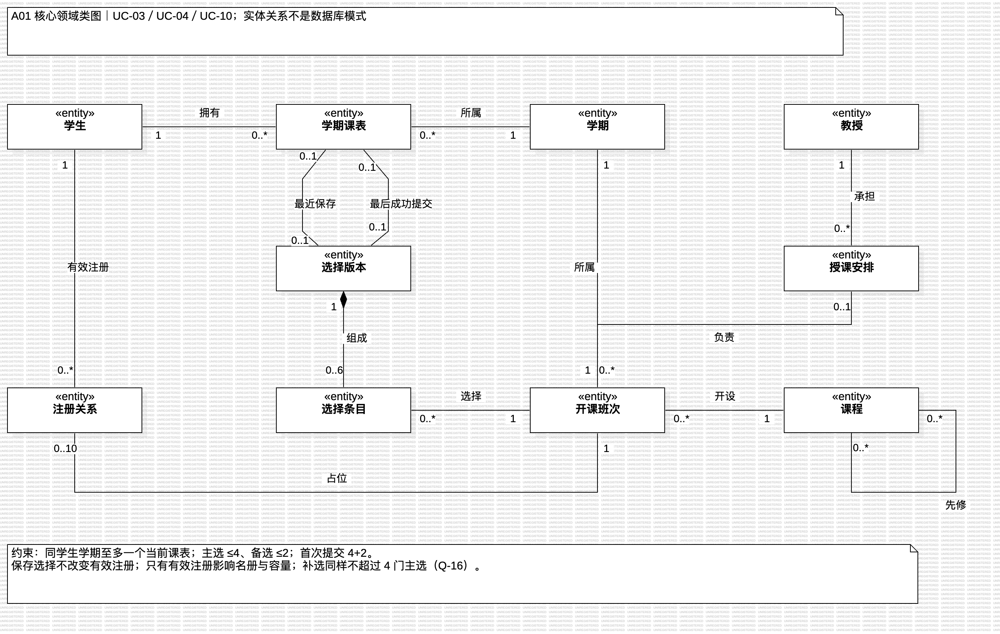
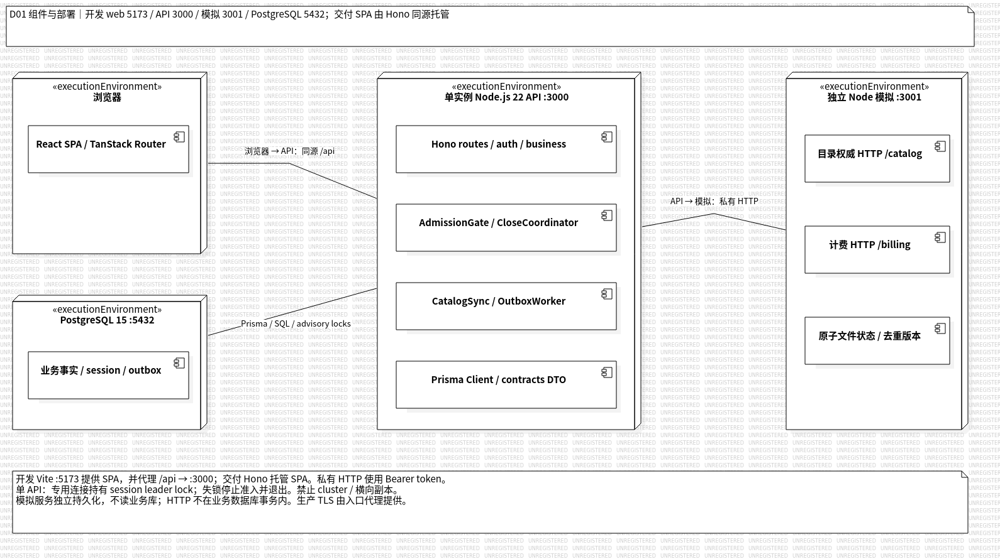
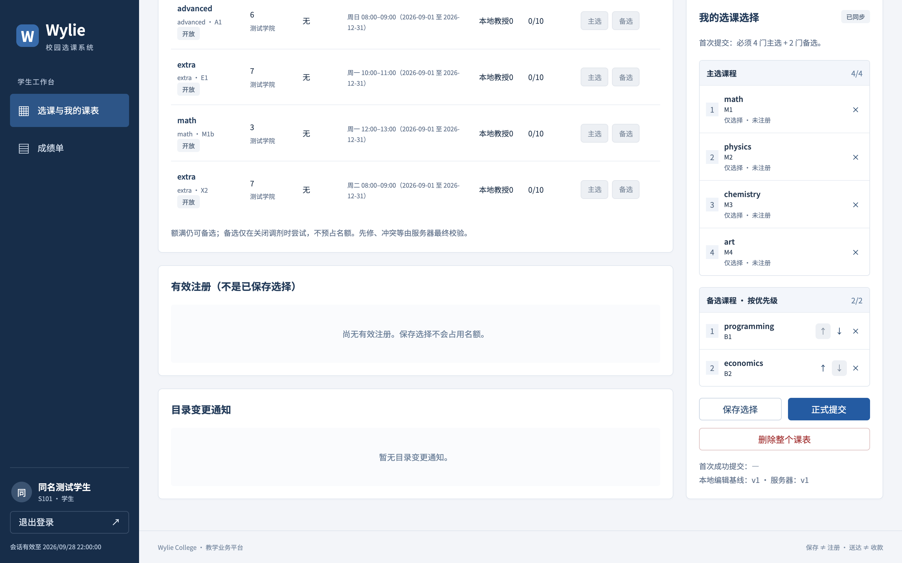
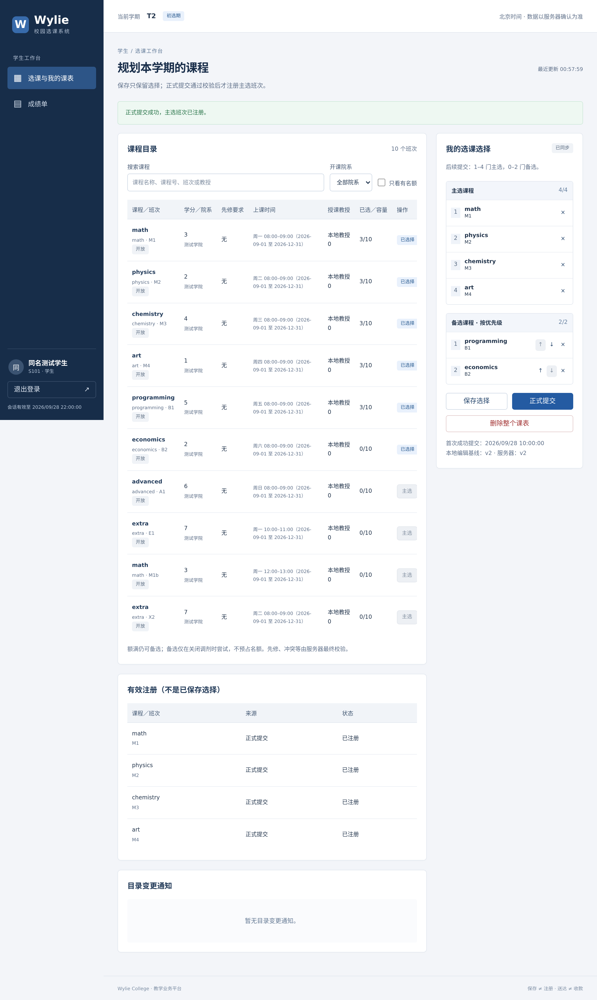

# Wylie College 学生选课系统小组工作总结

- 课程：软件工程课程设计。
- 组长：倪成锦。
- 版本：v0.5，2026-10-09。

## 一、项目概况与分工

本次课程设计的题目是 Wylie College 学生选课系统。系统面向学生、教授和教务员：学生选择课程、调整课表和查询成绩；教授选择授课班次、查看学生名单和录入成绩；教务员维护师生资料、安排选课时间，并在选课结束后进行调剂和计费。经教师同意，我们采用网页形式实现，用户登录后进入对应的操作页面。

小组共六人，按业务分工。倪成锦负责需求统筹、总体设计和选课核心逻辑，三类用户的页面与业务分别由浩宇、马喆和冯海洋负责，冯海伦负责测试，范昭负责外部系统模拟和运行交付。选课结果会同时影响学生课表、教授名册和计费数据，因此几个人负责的模块需要共同遵守同一套规则。

| 成员 | 学号 | 主要负责内容 |
| --- | --- | --- |
| 倪成锦 | 21230728 | 需求与进度统筹、总体设计、登录权限、选课与关闭事务、系统集成 |
| 浩宇 | 21230726 | 学生端课程浏览、课表编辑与提交、成绩单、公共交互组件 |
| 马喆 | 21230727 | 教授端授课选择、名册、成绩录入及相应接口 |
| 冯海洋 | 21230729 | 教务端人员维护与导入、时间设置、关闭与补选操作 |
| 冯海伦 | 21230723 | 测试计划、用例、集成与浏览器测试、性能测试、测试报告 |
| 范昭 | 21230724 | 课程目录和计费模拟、环境初始化、演示数据、配置管理与交付材料 |

## 二、软件过程与进度调整

### 2.1 为什么选择迭代增量开发

9 月 9 日建立项目时，我们讨论了开发过程的安排。选课系统虽然有明确的题目，但保存、提交、调剂等细节还需要澄清。如果等全部文档完成才开始做程序，许多问题要到最后联调时才能发现；到时再修改，会同时影响页面、接口和数据库。因此，我们选择迭代增量开发，配合任务分工、版本管理和持续集成，逐步做出可以运行的功能。

最初安排是先接通登录和课程浏览，再做学生选课，随后加入教授、教务和计费，最后集中测试与交付。这样每一轮都能用已有功能检查前面的理解。例如，保存课表做好后，可以马上核对它是否真的没有占用名额，再继续实现正式提交。

9 月 22 日对照课件时，我们还调整了分析与设计的顺序：需求明确后先进行需求规约和面向对象分析，再进入总体设计。后面画状态图时发现的几处遗漏，也说明这个步骤有实际作用。

### 2.2 原计划没有按时完成后怎样调整

[开发计划](../../PROJECT_DEVELOPMENT_PLAN.md)原本按四轮安排，第一轮应在 9 月 25 日前做出登录和浏览课程的最小系统。实际没有按时完成，原定的评审和回顾也没有举行。到 10 月 5 日，进度已经比原计划晚了约十天，距离 10 月 16 日提交只剩不到两周。

表 2-1 原计划与实际推进情况

| 原计划 | 实际推进情况 |
| --- | --- |
| 9 月 19—25 日：项目启动，接通登录与课程浏览 | 主要形成开发计划、需求初稿和技术选型，最小系统未按期完成 |
| 9 月 26 日—10 月 2 日：学生选课功能 | 需求澄清延续到 10 月 3—4 日，随后开始对象分析 |
| 10 月 3—9 日：教授、教务、关闭与计费 | 10 月 5 日集中推进设计与实现，接通三角色业务；6—7 日测试并处理性能问题 |
| 10 月 10—16 日：验收、材料与交付 | 测试和材料整理已提前开始，后续继续补测、复核并准备演示 |

调整后，我们先确定共享的数据结构和接口，再并行推进各个模块。10 月 5—9 日主要完成设计和业务接通，10—13 日安排集成验收，14—16 日集中处理交付材料和演示。测试准备也与开发同时进行，避免等代码全部写完后再从头整理用例。

集中推进使程序较快形成，但成员熟悉完整系统、互相检查和安排复测的时间变得紧张。后面的协作也遇到了同样的问题：技术操作准备好了，成员却不一定能同时投入。第十三章会结合这次安排讨论后续应该怎样改进。

## 三、需求分析

开始做需求分析时，我们先按学生、教授和教务员整理了各自要用的功能，再对照题目中的用例，检查每一步操作前后会发生什么变化。选课系统大家都用过，一些规则很容易按自己的习惯理解。例如，看到“保存课表”，我们最初就觉得应该先给学生保留名额。但题目同时提供了“保存”和“提交”两个操作，这两个按钮到底有什么区别，需要单独说清楚。

我们把类似的问题列成清单，共整理了 28 道，并在 10 月 3 日至 4 日集中讨论、填写了回答。整理过程中，有些问题只看文字很难判断。例如“加退选后是否仍满足数量约束”，换成“一个学生已经选好四门课，现在只想退掉一门，是否必须再选一门才能提交”，大家就容易理解了。因此，后面的讨论尽量用具体操作来说明。表 3-1 摘录了其中几项。

表 3-1 需求分析中讨论的部分问题

| 问题 | 我们的决定 |
| --- | --- |
| 第一次提交必须选满 4 门主选、2 门备选；之后只想退一门，还需要补满吗？ | 首次提交必须选满；后续允许保留 1—4 门主选、0—2 门备选 |
| 学生把物理课换成美术课，只点了保存，是否已经退掉物理课？ | 保留物理课的名额，美术课只记录为待提交的选择 |
| 换班时新班次已经满员，原来的班次还在吗？ | 换班失败时保留原课表，不先退掉原来的班次 |
| 两名学生同时提交，争抢同一个班次的最后一个名额，怎么处理？ | 先完成确认的学生选上，另一人收到满员提示 |
| 教授一次保存十名学生的成绩，其中一格填错，其他九格是否保存？ | 保存合法的成绩，指出填错的位置，供教授修改后再保存 |
| 关闭选课时，计费系统暂时无法连接，是否需要重新开放选课？ | 保留关闭结果，记录尚未发出的账单，恢复后继续发送 |

下面说明其中几个影响后续设计的问题。

### 问题 1：草稿保存是否占用选课名额

对于保存课表，我们最初考虑的是学生使用时是否方便：学生花时间挑好了课程，只是暂时没有全部选完，如果保存后能先留住名额，下次回来就可以接着选。

但从其他学生的角度看，这样会产生问题。一个班次只有十个名额，如果有人保存后一直不提交，其他人就无法使用被占住的名额。要解决这个问题，还得规定预留多长时间、什么时候释放，以及释放后怎样告知学生。原题没有要求这样的预留功能，而且学生保存的内容本身也可能继续修改。讨论后，我们决定保存只记录选择，正式提交时才占用名额。

接着还要考虑已经选过课的学生。假设一个学生已经选上物理课，后来在页面上删掉物理、加上美术，只点了保存。这时他还没有确认换课，物理课的名额应该保留，美术课也不应增加人数。即使随后正式提交，如果美术课已经满员，这次换课也应整体失败，让他继续留在原来的物理班。否则，一次没有成功的换课会让学生失去原来的课程。

我们据此补齐了保存和提交的规则：保存不加课、不退课；正式提交时检查整张课表，全部满足条件才一起更新。关闭选课时，也以最后一次成功提交的结果为准。后续设计中，保存的选择和实际选上的课程分开记录，页面保存成功后显示“选择已保存，不预留名额”，教授查看的名册则只包含正式选上的学生。

### 问题 2：选课期间课程目录改了上课时间，已报名的学生怎么办

题目要求从学校原有的课程目录系统读取课程资料。我们起初比较关注能否把课程列表显示出来，整理选课流程时又遇到了一个问题：如果学生选课后，目录中的上课时间发生变化，原来的课表应该怎样处理？例如，学生已经选了周一的数据结构和周二的英语，后来数据结构也改到周二同一时间，两门原本可以同时选的课就冲突了。

一种处理办法是整个选课期间沿用最初读到的时间，这样学生的课表不会因为目录更新而变化。但我们参考自己学校的选课方式后，认为上课时间应该统一：学校已经改了时间，选课系统继续显示旧时间，学生就会根据错误的时间安排选课。因此，我们决定跟随目录更新，并检查这次变化是否影响已经选课的学生。

发现冲突后，也不能随意替学生退掉其中一门，因为系统不知道学生更想保留哪门课。我们选择先保留两门课并通知学生，由学生调整，下一次正式提交时再检查冲突是否解决。对于关闭选课时仍未解决的情况，系统列出名单交给教务员处理。目录中被删除的班次则按取消处理，并通知受影响的学生。

核对课程资料时，我们还修改了授课教授的来源。最初打算所有课程信息都以外部目录为准，但题目又要求教授在本系统里选择自己要教的班次。如果目录中的教授信息同时生效，一门课就可能出现两份不同的授课安排。最后确定，课程名称、学分、上课时间和先修要求从目录读取，授课教授由本系统的选择结果确定。

### 问题 3：教授应该在什么时候选择授课

整理学期安排时，我们先列出了学生初选、加退选和教务员关闭选课几个阶段，教授只要在关闭前完成授课选择。讨论时提出，学生通常会参考授课教师来选课，因此教授选择授课应该在学生初选之前就开放。

不过，提前开放还涉及另一个决定：是否要求所有教授都选完，学生才能开始选课？我们对照了题目中关闭选课的处理步骤，其中明确要求取消仍然没有教授授课的班次。这说明在选课尚未关闭时，允许存在授课教授尚未确定的班次。如果要求学生初选前全部安排完，就会增加一项题目没有要求的限制。

最后，我们把教授选择授课的开始时间放在学生初选之前，结束时间保留到关闭选课。学生能看到已经确定的授课教授；尚未确定的班次显示“暂无授课教授”，仍允许选择。到关闭时还没有教授的班次被取消，再按学生填写的备选进行调剂。这个安排尽量让学生提前获得教师信息，同时保留了题目规定的后续处理流程。

### 问题 4：教务员能不能在选课期结束前提前关闭选课

我们参考学校教务管理的习惯，准备让教务员设置各阶段的起止时间，也允许在需要时提前关闭选课。但核对用例时，发现题目中写着“选课进行中时，不得执行关闭选课处理”。这里的“进行中”需要明确：它指整个选课时间段，还是指系统正在处理某个学生的提交？

我们考虑了关闭操作真正要做的事：统计选课人数、取消不满足开课条件的班次、调剂学生，再计算学费。这些操作需要一份已经确定的选课结果。如果一边统计，另一边还有学生不断提交，人数和课表都可能在处理过程中变化。我们据此采用第二种理解，允许教务员提前发起关闭，但要先停止接收新的保存和提交，等已经接收的提交处理完，再进行统计和调剂。

这条规则后来在画状态图时又补充了一次。当时的文字只说“等待正在处理的提交完成”，没有把这些提交是否计入最终结果写清楚。我们补充为：提前关闭时，已经在处理的提交继续完成，通过检查的结果纳入本次关闭。按预设时间正常结束选课时，则以系统完成确认的时间判断，只有截止前确认成功的提交有效。

### 问题 5：题目里的性能指标要不要照原样保留

题目除了功能要求，还规定了中央数据库支持最多 2000 名用户同时访问、本地服务器支持最多 500 名用户同时访问，访问课程目录不超过 10 秒，以及至少 80% 的交易在两分钟内完成。我们最初考虑过根据自己的电脑和演示规模另定一套评测标准，主要担心现有环境难以支撑题目中的用户数量。

重新核对要求后，我们保留了这些数字。硬件条件会影响实际结果，但如果先按自己的环境降低要求，后面就无法回答系统距离原定目标还有多大差距。因此，需求文档仍按题目记录性能目标，测试计划再说明使用什么机器、怎样模拟用户、测哪些操作和持续多长时间。后续测试也分别安排了 500 用户和 2000 用户的负载，出现失败时再根据测量结果查找原因。

### 需求整理与检查

讨论的结论写入[需求分析文档](../../REQUIREMENTS_ANALYSIS.md)后，我们又逐项对照原题，检查新增的规则会不会与已有功能冲突。例如，为了检查先修课是否及格，我们需要导入历史成绩；但如果教务员可以随时导入当前学期的成绩，就会绕过教授录入成绩的权限。因此，导入范围被限定为系统上线以前的学期，已有成绩也不能被覆盖。

我们同时把讨论中的例子整理为验收条件。以保存课表为例，需要检查保存后原班次的人数是否不变、新班次是否没有增加该学生；换课失败时，还要检查原来的课程是否保留。这些条件后来用于设计测试。进入面向对象分析后，状态图和操作流程又帮助我们发现了提前关闭、删除后重新选课等几处遗漏，需求文档也随之继续修改。

## 四、面向对象分析

需求讨论后，我们开始整理系统中的对象和它们之间的关系。用例图先确定三类用户分别可以做什么，类图再整理学生、课程、班次、课表和成绩之间的联系；保存、提交和关闭这些涉及多个对象的操作，用顺序图和状态图继续检查。

### 4.1 课表、选课记录和教授名册怎样对应

第三章确定了保存不占名额，但在建模时还要回答：保存的内容和已经选上的课程分别放在哪里？假设学生已经选上物理课，后来又保存了一份改成美术课的课表，这两份内容需要同时存在。如果只保留一份课程列表，就无法同时回答“学生正在修改什么”和“学生实际选上了什么”。

我们把课表中的选择与正式注册分开。课表保存学生最近编辑的主选、备选及顺序，也记录最后一次成功提交的选择；注册关系表示学生已经取得某个班次的名额。教授名册和班次人数都根据注册关系查询。这样，保存课表只影响编辑内容，正式提交才改变人数和名册。

图 4-1 中，学生通过课表保存选择，又通过注册关系关联实际选上的班次。图中的“课程”和“开课班次”也分开表示：数据结构是一门课程，数据结构 1 班和 2 班则可以有不同的上课时间、授课教授和剩余名额。

图 4-1 核心领域模型。左侧的注册关系用于统计人数和生成名册，中间的选择版本用于保存课表编辑内容。

教授方面也有类似的区别。某位教授具备教授数据结构的资格，并不表示他已经选择了数据结构 1 班。我们分别记录授课资格和授课安排，取消某个班次的授课时，只取消安排，保留原有资格。这样也便于教务员先导入资格，再让教授自行选择班次。

### 4.2 画状态和操作顺序时发现的遗漏

文字中的“关闭前等待提交完成”比较容易理解，但画到状态转换时，就需要写清每一步发生的条件。我们检查关闭失败后的恢复过程时发现，如果直接恢复到按下关闭按钮以前的课表，会把等待期间已经成功的学生提交一起撤销。于是又回到需求文档，补充为：先等待这些提交结束，再以这个时刻的数据开始关闭；关闭内部失败时，恢复到这份数据。

另外三处遗漏也在这一轮检查中明确下来。

| 检查的操作 | 原来没有说清楚的地方 | 补充后的处理 |
| --- | --- | --- |
| 关闭后补选 | 学生已有四门主选，还能否再补一门？ | 补选仍遵守四门上限 |
| 删除后重新选课 | 是否保留原来的首次提交时间和调剂顺序？ | 删除时清除原时间，重建后重新满足首次提交要求并重新排位 |
| 在两个页面保存课表 | 旧页面能否覆盖另一个页面刚保存的内容？ | 保存和正式提交都检查版本，旧内容需要重新核对 |

这些修改同时写回了需求和模型。比如，删除课表不仅要画出“有课表”变成“无课表”，还要说明名额被释放、原来的调剂排位被清除；否则后续实现很容易只清掉页面中的课程列表。

### 4.3 模型图怎样让其他人看懂

我们使用 StarUML 保存可编辑模型，同时导出图片供文档引用。整理过程中发现，用例模型最初放在临时目录里，没有进入版本管理，后来移到了正式模型目录。这样交付时可以继续打开和修改模型。

10 月 8 日整理报告时，倪成锦查看保存课表的顺序图，对“学生课表边界”“课表控制”几个名称提出了疑问。这些名称来自课件中的分析类：边界负责与使用者或外部系统交互，控制负责组织一次操作，实体保存需要长期保留的数据。图里只有名称，缺少解释，第一次阅读的人很难对应到实际操作。

我们保留了课程要求的命名，在使用同一套术语的四张顺序图下补了图例，同时调整连线和标签的位置。这里需要照顾两种阅读方式：检查模型时要能辨认对象职责，阅读报告时也要能沿着“学生点保存以后发生什么”把流程看完。

### 4.4 为什么保留手动关闭选课

查看学期状态图时，我们还讨论过选课截止后是否自动关闭。按本校的使用习惯，到点结束会比较方便；但题目中的关闭用例由教务员发起，关闭还包括调剂、取消班次和生成账单。时间到了停止学生提交，与教务员执行这批处理，可以分成两个步骤。

当时离交付只剩一周，加入自动关闭还要处理定时任务与手动操作同时发生的情况，并调整需求、实现和测试。我们决定本次保留手动关闭，学生到截止时间后停止选课，教务员再执行关闭处理。自动关闭留作后续改进。

## 五、总体设计

总体设计开始时，我们需要先约定哪些工作放在页面，哪些由后端处理，以及各模块共同使用哪些数据。如果学生端和教授端各保存一份报名名单，后面每次退课都要同步两份数据；如果关闭按钮返回后究竟算不算完成都没有说清，教务页面也很难正确显示结果。因此，这一阶段先确定公共结构和接口，再继续各自的功能。

### 5.1 技术选型怎样兼顾熟悉程度和项目需要

数据库选择 PostgreSQL，主要因为组长对 SQL 和这个数据库比较熟悉，选课人数、历史成绩和账单之间的关系也适合用关系数据库管理。前后端统一使用 TypeScript，数据访问采用 Prisma，便于共享字段类型，减少同一个字段在两端写法不同的问题。

后端在 Hono 和 NestJS 之间选择了 Hono。前端采用 React，由 Vite 负责开发和构建，TanStack Router 负责页面导航。讨论中曾出现是否加入 TanStack Start 的问题，后来明确，这个项目主要是登录后的表单和列表操作，业务接口已经由 Hono 提供，现有组合可以完成需要的功能，因此没有再增加服务端框架。

我们也考虑过采用较少见的工具，使技术选型与其他小组有所区别。但换成不熟悉的工具会增加学习和排错时间，而课表规则、事务和测试仍然需要逐项完成。最后保留了熟悉的 Prisma，把精力放在这些业务问题上。选型和理由写入了[技术选型记录](../../design-docs/adr/ADR-001-technology-stack.md)，后面按这套组合开发。

### 5.2 三类页面怎样共用后端和外部系统

系统由浏览器页面、业务后端、PostgreSQL 数据库，以及独立的课程目录和计费模拟服务组成。页面向后端发送请求，后端检查身份和业务规则后访问数据库；需要课程资料或发送账单时，再通过 HTTP 访问模拟服务。

题目没有提供可以直接接入的真实课程目录和计费系统，因此我们自行实现了模拟服务。它们单独保存课程资料和收到的账单，这样可以主动修改课程时间、让计费暂停响应，再观察业务系统的处理结果。如果模拟服务直接从选课数据库里读出结果，就很难检查两边的数据是否真正通过接口传递。

图 5-1 系统组件与部署。浏览器通过业务后端操作选课数据，课程目录和计费模拟服务独立运行。

在代码组织上，页面、后端、模拟服务、共享接口类型和数据库访问各放在独立的包里。保存课表需要哪些字段、版本冲突怎样返回、成绩保存怎样表示部分成功，都提前写进[接口文档](../../design-docs/api-contract.md)。例如教务发起关闭后，接口先返回已受理，页面继续查询处理结果；这就要求前后端都区分“正在关闭”和“已经关闭”。

### 5.3 两个人同时抢最后一个名额怎样处理

并发是总体设计中必须提前考虑的问题。两名学生都看到某个班次还有一个名额，如果后端先分别查询人数，再各自插入选课记录，两次检查都可能通过，最后出现第十一个学生。

我们选择在数据库事务内完成检查和写入，并对相关人员、学期的数据加锁。后一个请求进入后，要重新检查前一个请求完成后的状态，再决定是否能够提交。事务中的一步失败时，前面已经进行的选课变更也一起撤销，从而保留换课前的结果。

本次部署采用一个业务后端进程，以便统一协调关闭与正在处理的请求。这样需要处理的协调问题较少，也便于复现先后顺序。这个方案的代价是部分写入需要排队，所以设计完成后还要通过负载测试检查等待时间。第九章中的性能问题就发生在这套处理流程里。

### 5.4 关闭选课和发送账单怎样衔接

关闭开始后，系统先停止接受新的选课操作，再等待已经进入处理的请求结束，最后统计、调剂并生成账单。这里还要注意等待的顺序：如果关闭操作一边占着数据库锁，一边等学生提交结束，而学生提交又需要同一把锁，两边就会互相等待。因此，我们把等待已有请求和执行关闭事务分开。

账单发送则放在关闭事务完成之后。假设计费服务暂时断开，如果一直在数据库事务里等待它，关闭会长期占用锁；如果只先关闭，过一会儿才记录要发送哪些账单，中间程序退出又可能漏掉账单。

最后采用的办法是，把关闭结果和待发送账单一起保存到数据库，再由后台逐笔发送。失败的账单保留，下次继续尝试；系统重启后也能从数据库找到它们。这份待发送记录在设计中称为 outbox。教务页面分别显示关闭结果和账单送达情况，计费暂时不可用时，可以看到哪些账单还在等待。

## 六、详细设计

总体结构确定以后，各模块开始细化数据字段、处理顺序和页面反馈。这里有几类问题仅靠一张架构图还无法解决：旧页面的内容能否覆盖新内容，教务确认后数据又变化怎么办，以及一次批量操作究竟应该全部失败还是允许部分成功。

### 6.1 旧页面保存和删除后重建怎样避免互相覆盖

一个学生可能同时打开两个选课页面。假设两个页面读到的都是第 3 版课表，第一页保存后已经变成第 4 版，第二页仍然停在旧内容。如果后端直接接受第二页的保存，第一次修改就会被覆盖。

我们给课表设置版本号，页面提交时带上开始编辑时的版本。后端发现版本已经变化，就拒绝这次旧内容的保存，让学生先核对最新课表。页面自动刷新名额时，也不能顺便把未保存的编辑替换掉，更不能保留旧内容却把版本号更新成最新版本。后者会让过期内容绕过检查。

图 6-1 展示了这种情况：服务器已经是 v52，本地仍保留 v51 的编辑，页面同时显示双方的内容，并提供重新采用服务器版本的入口。

图 6-1 旧课表的提示与对照。截图来自 10 月 6 日的浏览器检查，右侧仍保留本地三门主选，上方列出服务器中的四门。

删除课表时也需要保留版本信息。如果直接删掉整条记录，新建课表又从第 0 版开始，旧页面迟到的请求可能碰巧与新版本匹配。因此，我们清除课程和首次提交时间后，仍留下这次删除后的版本记录。它不占用名额，用来识别删除以前的旧请求。

### 6.2 教务确认修改时，确认的内容是否还是原来的内容

教务把学生状态改为休学时，系统会清理尚未关闭学期的选课。我们为此设计了影响预览，先列出会处理哪些学期和课程，再让教务确认。

但预览与确认之间还可能发生变化。例如，教务预览时学生有三门课，停留了一会儿，学生又提交了第四门。若确认按钮只传回一个“已同意”，后端就可能清理教务没有看过的第四门课。

因此，确认请求要与刚才的预览对应。后端保存预览涉及的人员版本、修改内容和受影响记录，并在真正写入前重新核对。如果内容发生变化，就要求重新预览。学生休学、教授离职以及关联课程的处理放在同一事务中，避免出现课程已经清掉，但人员状态修改失败的情况。

### 6.3 成绩录入和名单导入为什么允许部分成功

学生换课要求整体成功或整体不变，但教授录入成绩时，一格填错就让其他九格全部作废，会增加重复输入。需求讨论已经确定合法格子可以保存，因此我们为每一行返回具体结果：哪些已保存、哪些未修改、哪些需要更正。页面保留错误输入，教授可以直接在原位置修改。

这里还需要先检查权限。如果请求混入一名不属于本班的学生，就拒绝整份请求，保留全部原成绩；确认整份学生名单都在教授权限内以后，才逐格检查 A、B、C、D、F、I 等成绩值。这样，输入错误和操作了不属于自己的学生会得到不同处理。

教务导入名单也采用逐行处理。一张表里可能有新学生、已经存在的学生，以及漏填姓名的行。我们分别返回导入成功、重复跳过和数据错误，并保留原 Excel 行号。教务可以根据行号修改原表，不必猜是哪名学生没有导入。各行独立处理，坏行不会撤销前面已成功的行。

### 6.4 补选后的账单怎样替换旧账单

关闭后补选会改变学生应缴金额。假设原账单是 1200 元，补选后总额变成 1500 元，那么新的应缴金额就是 1500 元。如果接收端把每次发来的金额都相加，就会错误地记成 2700 元。

我们给同一学生、同一学期的账单编版本号，每版都表示完整课表和总金额。接收端保留最新版本，重复收到同一版时只确认已经收到；旧版晚于新版到达时，也保留新版金额。后台重试沿用原来的账单编号和内容，只有补选这种业务变化才产生新版本。

账单还保存当时的课程学分和计费单价。这样，即使课程目录后来变化，重新发送旧账单时仍能得到原来的金额。详细设计据此明确了账单字段、发送状态和重启后的恢复步骤，后续测试再分别检查重复发送、顺序颠倒和中途断连。

## 七、编码与联调

各模块实现后，我们把页面、后端、数据库和两个模拟系统一起启动，用演示账号依次走学生、教授和教务员的操作。联调时既看页面反馈，也检查数据库和模拟服务中的结果。这个阶段发现的问题，往往出现在两个模块对同一份数据的理解不同，或者几项操作同时发生的时候。

### 7.1 演示账号为什么无法登录

初次使用初始化生成的账号登录时，系统提示密码不正确。检查后发现，初始化程序和登录程序使用了同一种密码处理算法，但对其中一份数据的读取方式不同。密码计算除了密码本身，还使用一段随机数据，通常称为盐值。初始化时使用原始字节，保存时把它转成十六进制文字；登录程序读取后，却直接拿这段文字参与计算，没有先还原成原始字节。

这也解释了为什么登录模块自己的测试能够通过。测试先用模块中的函数生成密码摘要，再用同一模块的函数验证，两边采用相同的错误处理方式，结果仍然一致。换成初始化程序生成的数据，差异才暴露出来。

修复时，我们先用固定的原始盐值和独立的计算方法生成期望结果，复现登录失败，再修改后端的读取方式。之后重新检查登录、首次改密和会话保持，确认初始化程序与登录程序可以使用同一份账号数据。

### 7.2 没有选过课的人员为什么也删不掉

教务端还遇到过一个与需求不符的问题：某个人员没有选课、授课、成绩或账单，按规则允许删除，但实际操作被数据库拒绝。继续检查关联记录，发现阻止删除的是登录日志。账号曾登录过，日志就引用这个账号，而数据库要求被引用的账号必须保留。

我们需要同时保留访问记录和允许删除无业务历史的人员。直接连日志一起删除，会丢失记录；让任何登录过的人都不能删除，又超出了需求规定的限制。最后把日志中的账号关联改为可以为空，删除账号时解除关联，日志事件本身保留。选课、成绩等业务历史仍然按原规则阻止删除。

修复后，数据库测试检查了两件事：无业务历史的账号能够删除，原来的日志事件仍然存在。人员维护由此可以按业务规则工作，也保留了发生过的访问记录。

### 7.3 计费超时为什么会让课程目录也不更新

目录刷新和账单发送最初放在同一个后台循环里，程序先等这一批账单发送完，再刷新目录。计费服务正常时，两项工作能够依次完成；一旦计费服务不可用，每笔账单都要等到超时，后面的目录刷新也被一起拖住。结果是计费出故障，学生却迟迟看不到课程时间的更新。

我们把目录刷新和计费发送拆成独立调度，并限制计费同时发送的数量。复测时，特意让八个计费请求持续等待，再修改课程目录，检查新的目录是否仍能在五秒内写入本地。这样可以直接观察计费慢时，目录更新是否还能继续进行。

### 7.4 删除人员和关闭选课同时发生时怎样确定结果

关闭选课需要确定本学期的学生名单，再为每人生成账单；教务端同时可能删除一个没有业务记录的学生。检查代码时发现，系统已经开始关闭，但关闭状态还没有保存到数据库的一小段时间里，删除操作可能只读到旧状态，以为仍然允许删除。

我们让这两项操作在同一个学期记录上协调顺序。删除写入前重新检查关闭状态，关闭则在取得同一把锁后确定学生集合。复测分别安排删除先发生和关闭先发生，检查最终名单与账单是否符合各自的顺序。仅在页面上提前检查一次状态，无法处理检查以后又发生变化的情况。

### 7.5 接通业务后继续检查页面反馈

10 月 5 日的联调接通了保存、正式提交、教授名册、成绩录入、关闭计费和补选等主要流程。学生只保存时，数据库中的有效注册仍为零；正式提交成功后，教授名册能够查到对应学生。补选以后，原来的零元账单被新的 300 元账单替代，接收端也保留了正确的最新金额。当时的开发检查共通过 108 项测试，并完成类型检查和构建。

页面上还修正了两处容易让使用者困惑的问题。一处是关闭已经完成，原来的等待提示还留着，我们把提示的显示条件限定在正在关闭期间；另一处是用 Escape 取消确认框后，键盘焦点没有回到原按钮，我们补了关闭弹窗后的焦点恢复。

图 7-1 和图 7-2 使用同一组演示数据，分别展示只保存与正式提交后的页面。两张图于 10 月 9 日整理报告时重新拍摄，页面中的学期日期为演示设定。

图 7-1 保存后，右侧保留四门主选和两门备选，主选仍显示“仅选择·未注册”，左侧没有有效注册。

图 7-2 正式提交后，左侧显示四门已注册课程，右侧课表版本也随之更新。

## 八、测试

测试计划从需求文档中的 64 条验收条件展开。我们先把每条规则拆成可以操作和比较的场景，再安排接口、数据库和浏览器检查。对于保存、换课和关闭，尤其需要观察操作失败以后留下什么数据。

### 8.1 怎样确定测试的预期结果

例如，“换课失败时保留原课表”不能只检查页面是否出现错误提示。测试要在操作前记下原来的课程和名额，再故意选择一个已经满员的班次，比较失败后的完整课表与注册名单。只有旧课程都还在、新课程没有加入，结果才符合需求。

计费测试也需要独立计算预期。我们准备了学分分别为 3、2、4、1 的四门课，按每学分 125 元计算，总金额为 1250 元；取消 1 学分的课后应为 1125 元，再补入一门 5 学分的课后应为 1750 元。各门课使用不同学分，漏算或选错课程时更容易从金额上看出来。

这些测试连接真实 PostgreSQL，并为每个验收用例建立独立数据库。这样可以在同一场景中检查数据库约束、事务回滚和外部接口，也避免上一项测试的选课结果影响下一项。相应的数据、步骤和结果分别记录在[验收用例](../../testing/acceptance-cases.md)和[执行账本](../../testing/acceptance-execution.md)中。

### 8.2 最后一个名额和截止时刻怎样测试

两名学生争抢最后一个名额时，仅同时发送两个请求，运行几次可能都是同一个人先完成。我们在处理过程中设置暂停点，先让一名学生进入指定位置，再发出另一名学生的请求，最后继续执行。然后交换两个人的先后顺序再测一次，检查成功者、失败者原来的课程和最终班级人数。

时间条件也按相邻的几个时刻分别检查：截止前一毫秒、刚到截止时刻，以及截止后一毫秒。另一个场景是请求在截止前到达，但排队后才完成确认。测试使用可控制的业务时间来安排这些顺序，检查后端是否在真正确认时执行了截止判断。

关闭失败的测试则在调剂进行到一半时制造错误，比较课表、名册和账单是否恢复。恢复的基准取在已经接收的学生提交全部结束之后，使这些先完成的合法提交得到保留。

### 8.3 授课历史为什么出现结束时间早于开始时间

集中合入前，一次完整回归出现 130 项通过、3 项失败，问题出在授课历史。创建记录时使用数据库的真实时间，取消授课时却使用测试设定的业务时间。当业务日期早于测试当天，记录就变成了先结束、后开始，违反数据库的时间顺序约束。

我们统一了这两处时间来源，让创建、取消和重新选择都使用同一个业务时钟。回归场景依次安排首次选择、七秒后取消、十一秒后重新选择，检查每条历史的开始时间、结束时间和记录数量。修改后，完整回归为 134 项通过。

这个问题也影响了后续检查方式：只要一项功能依赖时间，就需要沿着记录的创建、修改和结束过程核对，避免只有截止判断使用业务时间，数据写入仍然使用另一套时间。

### 8.4 重启测试失败后怎样判断问题来源

计费重试测试会先让外部服务收到账单，再断开响应连接。业务系统没有收到确认，就需要保留待发记录。随后停止并重新启动后端，等待原定重试时间，检查它是否继续发送同一张账单，以及外部系统是否只计算一次。

提交前运行这项测试时，曾出现重启前后数据库快照不一致。当时的回归结果是 206 项通过、1 项失败。检查差异后发现，有些学期的课程目录在重启前还没有完成第一次同步，测试就先取了快照；重启期间同步完成，快照自然多出了一些数据。

我们修改了测试的准备步骤，等四个测试学期的目录都同步完成后，再记录重启前的状态。随后保留原来的完整数据比较和真实等待 60 秒的重试检查，先单独复测该场景，再运行全部测试，207 项全部通过。失败来自测试取数过早，因此这次修改落在测试准备中。

### 8.5 浏览器检查与阶段结果

浏览器检查把三类用户的操作接起来，包括学生提交后教授能否看到名册、教授录分后学生能否查询成绩，以及教务关闭后账单状态是否更新。多页面编辑、断网后重新连接和导入部分成功也安排了对应场景。

10 月 6 日的 Chrome 检查完成 32 项。另对人数、目录、名册和版本提示等六条变化路径各观察十次，从业务请求成功返回到页面出现变化，60 个样本中最长约 1.04 秒，满足当时五秒内显示更新的要求。

表 8-1 按阶段记录的完整回归结果

| 阶段 | 回归结果 | 主要变化 |
| --- | --- | --- |
| 10 月 5 日开发联调 | 108 项通过 | 接通三角色和外部模拟的主要流程 |
| 10 月 5 日合入前检查 | 134 项通过 | 补充检查并修复授课历史时间问题 |
| 10 月 6—7 日验收整理 | 207 项通过 | 包含 73 项验收集成测试，补充并发、故障和恢复场景 |
| 10 月 7 日性能修复后 | 215 项通过 | 增加目录刷新合并等回归检查 |

表中的数量是各阶段的完整测试集合，后一次包含前面的用例。具体场景和仍需补测的部分记录在[测试报告](../../TEST_REPORT.md)中，后续按执行账本继续复核。

## 九、性能诊断与修改

功能流程接通后，我们按题目要求安排了 500 用户和 2000 用户两档负载。每档先预热五分钟，再持续测量三十分钟。模拟用户按一定比例浏览目录、读取课表、保存、换课和查看成绩，操作之间间隔 5—15 秒，以便观察一批用户持续使用时的情况。

### 9.1 2000 用户测试失败后先查什么

10 月 6 日在 macOS 上运行时，500 用户档的 89666 次交易全部成功，并在两分钟内完成。2000 用户档则只有 61939 次满足这一条件，占 98252 次总交易的 63.04%，低于题目要求的 80%。目录查询也有一部分超过十秒或失败。

看到结果后，倪成锦最初怀疑电脑合盖导致中断，也提出数据库就在本机，为什么还会超时。我们先检查运行环境：电源日志显示压测期间没有睡眠；数据库连接数最多约 24 个，上限为 100，也没有用满。客户端报告的超时，是等待整个 HTTP 响应超过两分钟，需要继续检查请求在后端的哪个步骤等待。

进一步记录各步骤的等待时间后，发现保存和提交前都会刷新课程目录，而这些刷新按学期逐个排队。用户多时，队列中最多积压了 1573 个调用，等待时间达到 214 秒。有些请求还没有进入选课事务，就已经等过了客户端的期限。

另外，macOS 上同时建立大量连接时还出现了连接重置。我们用不连接数据库的简单 HTTP 服务作对照，同样能复现这类错误；把连接分散发出后有所改善。但完整应用改为分批启动用户，仍然无法通过，说明连接问题之外，目录刷新队列本身也需要修改。

### 9.2 怎样减少重复刷新，又让新请求取得较新的目录

最初每个请求都单独刷新，是为了在确认选课前取得最新的课程资料。大量用户操作同一个学期时，它们却反复读取相同的目录，形成了重复工作。

直接给目录设置一段缓存时间可以减少访问，但学生提交时可能使用变化以前的数据。我们也考虑过让新请求共享已经开始的那次读取，不过这次读取发出时，新请求还没有到达，仍然可能错过其后发生的变更。

最后采用按轮次合并的办法：一轮正在读取时，之后到达的请求一起等待下一轮；下一轮真正开始读取后，再来的请求继续排到后面。这样，等候中的许多请求可以共用一次随后发起的读取。读取并更新本地目录完成以后，再通知这些请求继续处理，保持各轮结果的顺序。

### 9.3 为什么修改了三轮才通过

修复在 Linux 环境继续诊断，负载客户端、业务后端和模拟服务分别运行在独立进程。我们先用较短的测量比较每一步修改：30 秒预热，随后持续三分钟，用户数量仍为 2000。

表 9-1 三轮短时诊断结果

| 修改内容 | 成功且在两分钟内完成的交易 | 比例 |
| --- | --- | --- |
| 合并保存、提交触发的目录刷新 | 2185／8085 | 27.03% |
| 进一步减少重复读取的字段、注册明细和无关班次 | 6363／8471 | 75.12% |
| 再对只读目录请求采用按轮次合并 | 26996／26996 | 100% |

第一轮只处理写操作前的目录刷新，仍有大量浏览目录的请求独立读取和组装完整结果。第二轮减少查询范围以后有明显改善，但还没有达到 80%。第三轮把只读目录请求也合并后，短时诊断才通过。教授能看到的课程还与个人资格有关，因此这部分按学期和教授分别合并，避免把一位教授的结果返回给另一位教授。

修改期间保留了原来的数据库锁、连接池大小和请求期限，继续检查换课失败、关闭等待和目录变更等原有规则。具体方案记录在[目录刷新设计记录](../../design-docs/adr/ADR-003-catalog-refresh-generations.md)中。

### 9.4 完整复测与数据核对

短时诊断通过后，我们重新运行五分钟预热、三十分钟正式测量的 2000 用户测试。结果为 264615 次交易全部成功且在两分钟内完成，105899 次目录查询全部在十秒内完成。停止发出新操作并等待后端处理结束后，检查到 8000 条有效注册，班次人数和每名学生的课程数量都符合限制，课表与客户端最后确认的内容一致。

表 9-2 正式负载结果

| 环境与版本 | 用户数 | 成功且在两分钟内完成 | 目录查询在十秒内成功 |
| --- | --- | --- | --- |
| macOS，修改前 | 500 | 89666／89666 | 35659／35659 |
| macOS，修改前 | 2000 | 61939／98252 | 31079／39381 |
| Linux，修改后 | 2000 | 264615／264615 | 105899／105899 |

这几次运行使用了不同环境，因此我们保留各自的结果，并用同一 Linux 环境中的三轮短测观察代码调整的效果。正式复测时，各进程仍在同一台机器上运行；更换机器、增加网络延迟后的表现还需要继续检查。

### 9.5 超时以后，客户端与服务器为什么可能看到不同结果

负载测试还暴露了取数时机的问题。客户端超时后，服务器可能仍在处理已经收到的提交。原脚本先比较最终课表，随后才等待后端处理结束，曾记录到 806 名学生的客户端预期与数据库不同。当时取得的数据还在变化，无法直接判断最终结果。

我们把顺序改为先停止新操作和后台轮询，等已经进入处理的请求完成，再比较数据。但还需要处理客户端本身的重新查询：在故意设置 1 毫秒超时的检查中，服务器数据内部一致，仍有 15 名客户端最后确认的课程与服务器不同。它们没有收到成功响应，服务器却可能后来完成了提交。这项问题仍列在后续工作中，需要继续验证超时提示和最终重新读取的过程。

## 十、集成与交付准备

### 10.1 分开的模块怎样合到一起

模块陆续完成后，需要按依赖关系进入主线。共享字段和数据库结构先确定，后端服务接着实现，页面再接入对应接口，最后把三类用户和外部模拟放在一起检查。如果页面先合入，而它调用的接口还不存在，其他成员取得主线后就无法正常使用。

10 月 5 日的集中集成按这一顺序整理了 18 个任务分支，对应 PR #6—23。我们选择保留原提交的合并方式，共保留 30 个普通提交。这样查看某个问题时，可以找到它最初在哪个模块中修改，也能看出后来为接通系统做了哪些调整。测试、性能修复和报告整理随后继续通过各自的任务分支合入。

原本希望每位成员在自己的电脑上提交并发起 PR，再由组长检查。为此先写了通用操作说明，后来改成逐人的教程。但成员当时都有其他安排，未能及时接手。组长先集中合入已有工作，使大家可以基于同一份程序继续测试；成员独立接手和互相检查则继续安排。

### 10.2 自动检查卡住时怎样处理

合入过程中，先后遇到文档格式、平台支持和依赖版本三个问题。课程资料转换后的 Markdown 未通过检查，我们只调整标题层级和空行，并核对正文没有变化。私有仓库无法使用原来配置的依赖审查功能，便改用依赖漏洞检查，保留原有的 OSV 扫描，使后续提交仍有固定的检查入口。

依赖修复时，只修改锁文件的第一次尝试没有更新到需要的嵌套版本。安装后查看实际依赖树，才发现文件里的预期与真正安装的结果仍不一致。后来针对使用这些依赖的包设置版本覆盖，再重新安装和检查，同时实际读写一次 Excel 文件，确认升级后教务导入所需的表格功能还能使用。

这些问题处理完后，134 项回归、构建和远程检查通过。我们也据此调整了交付检查的习惯：修改了配置或锁文件以后，需要从实际安装结果继续检查到功能，不能停在文件内容已经改好这一步。

### 10.3 怎样让另一台电脑得到同一套系统

运行程序除了源码，还需要依赖、数据库结构、演示数据和启动配置。在同机新目录复现时，曾漏掉生成 Prisma 数据客户端这一步，构建便因缺少类型而失败。开发目录里已经生成过这些文件，所以平时没有暴露出这个缺口。补上生成步骤以后才能继续构建，这也促使我们按新环境的启动顺序重新检查[运行说明](../../DEVELOPMENT.md)。

10 月 8 日形成的[配置管理计划](../../CONFIG_MANAGEMENT_PLAN.md)草案进一步约定了交付内容：源码、锁文件、数据库迁移、模型和课程文档按同一个提交打包，并生成文件清单与校验值。这样拿到材料的人可以确认程序和文档来自同一版本，后续修订也能找到对应变化。

依赖和数据库客户端在目标电脑上安装、生成，再构建程序，避免直接使用开发电脑上带有平台差异的文件。私有配置、账号初始密码和运行中的数据库另行管理，新环境根据配置示例、迁移和演示数据重新建立。最终还需要由另一位成员在另一台电脑上按说明操作，记录缺少的步骤，再据此修订交付材料。

## 十一、团队协作

### 11.1 按业务分工以后，哪些地方仍需要一起决定

虽然三类用户由不同成员负责，但一次选课会跨过几个人的模块。例如学生正式提交后，学生页面要显示已经选上，教授名册要出现这名学生，教务关闭时还要把这门课计入账单。我们把这些共同规则写进需求、模型和接口文档，各模块据此实现，修改时也一起核对受影响的地方。

联调中发现问题后，再按问题所在的职责处理：学生编辑与提示由浩宇跟进，授课与录分由马喆跟进，人员和教务操作由冯海洋跟进，选课事务与性能由倪成锦统筹，模拟系统和环境由范昭负责，冯海伦整理对应的测试与复测结果。涉及公共规则的修改回到共享文档，页面上的问题则保留可以复现的操作步骤。

这种分工有助于同时推进，但接口文档仍然需要结合实际操作理解。比如“版本冲突”几个字，并没有说明页面要不要保留学生刚刚编辑的课程。把两个浏览器页面同时打开，演示哪一份内容先保存、哪一份变旧，成员才容易对齐具体处理方式。

### 11.2 为什么准备了操作教程，成员仍没有及时接手

成员接手方案改了几次，主要是在降低 Git 操作的难度，但大家可投入的时间并没有随教程一起确定。结果是操作步骤已经准备好，仍没有人能在预定时间完成下一步，集成工作继续集中在组长这里。

下一轮需要把交接安排具体到一个可以检查的结果。例如约定某位成员在什么时间拉取指定版本、完成哪一条用户操作，再把遇到的问题交给谁。只写“负责学生端”或“负责测试”，很难判断这一轮究竟推进到了哪里。每次交接尽量围绕一条能运行的业务流程，再逐步增加范围。

## 十二、成员贡献

贡献比例综合考虑各成员承担的业务范围、设计与问题处理，以及测试、集成和材料整理等工作，分配如下。

| 成员 | 主要工作 | 贡献比例 |
| --- | --- | --- |
| 倪成锦 | 需求澄清与进度安排，总体设计和选课核心，性能方案选择，系统集成及材料组织 | 30% |
| 浩宇 | 学生端课程浏览、课表编辑与提交、成绩查询，公共页面组件和版本冲突处理 | 14% |
| 马喆 | 教授授课选择、学生名册、成绩录入，授课历史及教授页面 | 14% |
| 冯海洋 | 师生资料维护与导入，状态修改预览，选课时间、关闭和补选页面 | 14% |
| 冯海伦 | 测试计划和验收场景，集成与浏览器测试整理，负载测试及测试报告 | 14% |
| 范昭 | 运行环境、演示数据、课程目录与计费模拟，账单重试和交付配置 | 14% |
| 合计 | | 100% |

倪成锦除负责选课核心外，还承担了共享规则和接口的协调、系统集成以及材料组织，工作贯穿多个模块，因此贡献比例较高。其余五位分别负责学生端、教授端、教务端、测试和外部系统与交付，各自承担一个主要方向，按相同比例计入。测试、问题复核和交付准备也纳入贡献评价。

## 十三、项目反思

### 13.1 把规则放进具体操作，才容易看见遗漏

项目开始时，选课、录分和计费看起来都是常见功能。但继续追问一次操作前后会留下什么数据，就出现了许多需要选择的细节：保存以后是否占名额，换课失败后原来的课程还在不在，删除后是否保留排位，关闭失败时又该回到哪个时刻。

这次比较有效的做法，是先把问题变成具体场景，再回到需求和模型中确定规则。保存与注册分开以后，页面、名册和计费都有了共同依据；状态图和顺序图则继续帮助检查时间顺序和失败恢复。以后在实现一项功能前，可以先选几个这样的例子，让负责页面、后端和测试的人一起走一遍。

### 13.2 测试的预期和测量方法也需要检查

登录问题说明，测试如果使用与实现相同的方法生成数据，两边可能一起算错。重启快照问题说明，测试准备没有结束就开始比较，会把正常变化判成失败。性能测试则进一步涉及客户端超时以后服务器还在工作的情况，必须等操作处理完再核对最终数据。

这些经历让我们在看失败结果时，多问一步：预期值从哪里来，数据是什么时候取的，有没有观察到完整过程。金额用单独的样本计算，并发用控制顺序的方法安排，快照在准备完成后取得。这样出现差异时，才容易沿着具体步骤找到原因。

### 13.3 第一轮没有形成可运行结果，后面付出了什么代价

原计划第一轮结束时就应有登录和课程浏览，但当时没有完成这个小增量，也错过了借演示检查计划的机会。等到 10 月初集中实现时，业务、测试和材料都要同时推进，成员熟悉整个系统和互相检查的时间被挤到了后面。

以后需要缩小第一轮范围，先让一名用户完成一条最短操作路径。轮次结束时实际演示，发现接不起来的地方就及时调整下一轮；成员的交接时间也在这一轮内安排。即使功能少一些，也能更早看见环境、接口和协作中真正卡住的步骤。

### 13.4 流程接通以后，还需要从使用者的角度再走一遍

10 月 6 日试用系统时，倪成锦的整体感受是主要功能已经形成，但仍有明显的原型感。后续发现的关闭等待提示未消失、取消弹窗后焦点丢失，都是这类问题：后台结果正确，操作的人却可能不知道刚才发生了什么，或不知道接下来该在哪里继续。

后续走查需要按学生、教授和教务员各自的一次完整任务进行，检查提示是否容易理解、错误后能否继续操作、刷新以后是否还保留应有的内容。测试人员熟悉的规则，对第一次使用系统的人未必清楚，演示时也需要留意这些反应。

## 十四、当前进度与后续安排

截至 10 月 9 日，三类用户的主要业务已接通，已完成多轮自动化回归、Chrome 操作检查和负载测试。需求、分析与设计、测试和工作总结已经形成，配置管理计划及打包脚本也已建立。课程最终提交前，仍需完成下面几项工作。

| 后续工作 | 具体内容 |
| --- | --- |
| 团队评审 | 一起走查需求、模型和设计，补上迭代评审与回顾，记录意见及处理结果 |
| 测试复核 | 冯海伦独立复核现有记录，继续检查敏感字段与后台审计、补选并发的另一种先后顺序，以及超时后的客户端重新同步问题 |
| 环境检查 | 在 Windows 的 Chrome、Edge 中检查操作，由另一位成员在另一台电脑上从空环境启动，完成七天可用性观察 |
| 课程材料 | 向教师确认外部系统模拟方案；范昭审定配置管理计划；成员核对个人报告，完善封面与签名 |
| 演示与交付 | 10 月 14 日准备候选包，15 日演练并修订材料，16 日完成课程运行检查与提交 |

交付候选确定以后，程序、数据库迁移、模型和文档使用同一版本，按运行说明重新初始化并演示。目前尚未发布版本标签或部署，后续根据实际运行检查结果完成最终交付。

## 主要参考材料

- [开发计划](../../PROJECT_DEVELOPMENT_PLAN.md)与[迭代记录](../../iterations/README.md)：原计划、调整安排和各轮进展。
- [需求分析](../../REQUIREMENTS_ANALYSIS.md)与[面向对象分析](../../design-docs/object-oriented-analysis.md)：规则、用例及模型修订。
- [总体设计](../../design-docs/system-design.md)、[接口约定](../../design-docs/api-contract.md)和[后端详细设计](../../design-docs/backend-detail.md)：模块划分、数据与处理过程。
- [测试报告](../../TEST_REPORT.md)与[验收执行记录](../../testing/acceptance-execution.md)：测试环境、结果、问题和后续检查。
- [配置管理计划](../../CONFIG_MANAGEMENT_PLAN.md)与[运行说明](../../DEVELOPMENT.md)：版本打包、新环境初始化和交付步骤。
- [个人报告入口](../README.md)与[需求追溯](../../product-specs/traceability.md)：各成员负责的工作及相应提交、测试记录。
